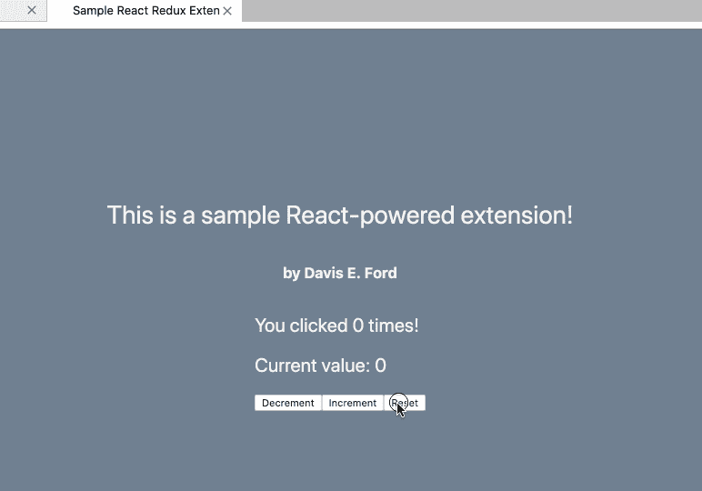

# 创建 React/Redux JupyterLab 扩展

> 原文：<https://medium.com/capital-one-tech/creating-a-react-redux-jupyterlab-extension-9a92708ec489?source=collection_archive---------3----------------------->

*Image credit: NASA/JPL-Caltech*

在这篇博文中，我将演示如何创建一个演示 JupyterLab 扩展，它利用 React 和 Redux 以及 TypeScript。

这就是我们的最终结果:

