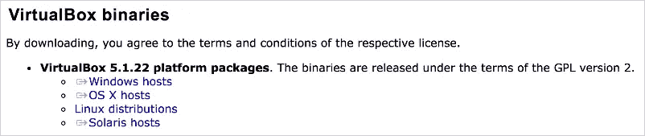
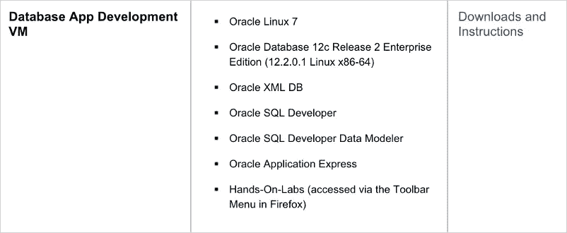
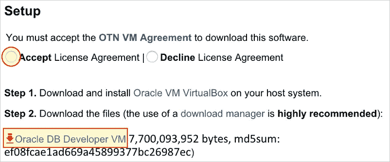
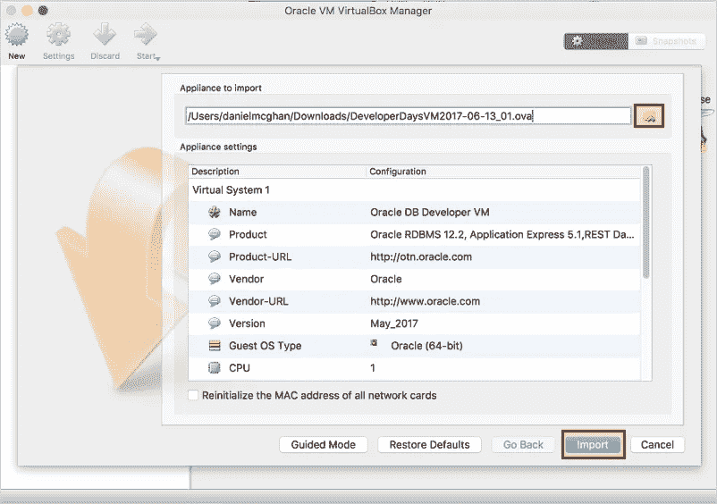
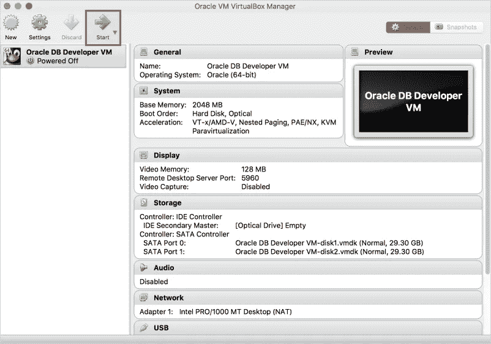
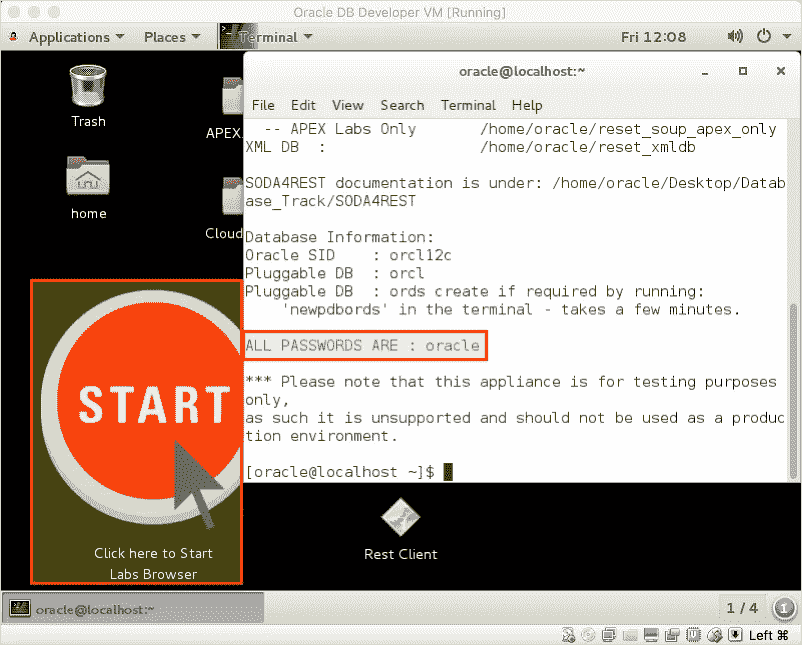

# 为学习 Node.js 和 Oracle 数据库创建沙盒

> 原文：<https://medium.com/oracledevs/creating-a-sandbox-for-learning-node-js-and-oracle-database-dd27706af6c4?source=collection_archive---------0----------------------->

随着 Oracle Database 12.2 和 Node.js 8 的推出，这是创建本地学习沙盒的绝佳时机。由于 Oracle 提供了一些预构建的虚拟机，您可以在不到 20 分钟的时间内(不包括下载时间)建立并运行这样一个环境，而无需花费一分钱！😄

在这篇文章中，我将带领你创建这样一个沙盒。下面是我们将要学习的内容的概述:

*   安装 VirtualBox
*   导入数据库应用程序开发虚拟机
*   安装 Node.js 和 Git
*   安装 Node.js 驱动程序并运行测试

# 安装 VirtualBox

你要做的第一件事是安装 [VirtualBox 5.1 或更高版本](https://www.virtualbox.org/)。什么是 VirtualBox？来自[在线文档](https://www.virtualbox.org/manual/ch01.html):

> VirtualBox 是一个跨平台的虚拟化应用程序。那是什么意思？首先，它可以安装在你现有的基于英特尔或 AMD 的电脑上，无论它们运行的是 Windows、Mac、Linux 还是 Solaris 操作系统。其次，它扩展了现有计算机的功能，使其可以同时运行多个操作系统(在多个虚拟机中)。

VirtualBox 是这类沙盒的绝佳解决方案，因为我们不需要在主机操作系统上安装任何在不使用时会消耗资源的软件。我不会详细介绍安装过程，因为它会因您的主机操作系统而异。只需导航到[下载页面](https://www.virtualbox.org/wiki/Downloads)并下载&为你的操作系统安装合适的二进制文件。



# 导入数据库应用程序开发虚拟机

Oracle 提供了许多预构建的开发虚拟机，非常适合学习 Oracle 技术，因为您不必通过复杂的安装就可以开始学习。转到[预构建的开发者虚拟机](http://www.oracle.com/technetwork/community/developer-vm/index.html)页面，向下滚动直到看到数据库应用开发虚拟机。



查看该虚拟机中的所有好东西！请注意，Oracle 数据库 12.2.0.1 包括许多用于使用 JSON 的增强功能。请参阅[数据库 JSON 开发人员指南](https://docs.oracle.com/database/122/ADJSN/toc.htm)了解详细信息，并在虚拟机启动并运行后尝试一下。

点击显示**下载和说明**的链接。在下一页上，接受许可协议，然后单击链接下载虚拟机。



如果您尚未使用您的 Oracle 帐户进行身份验证，在下载开始之前，您将被重定向到一个页面进行身份验证。如果您没有帐户，只需点击该页面上的创建帐户按钮来创建您的免费帐户。

下载完成后，您就可以将虚拟机导入 VirtualBox 了。打开 VirtualBox，点击**文件>导入设备**。使用设备导入向导选择您下载的**developerdaysvm 2017–06–13 _ 01**文件，点击**导入**。



一旦您接受许可协议，导入过程将开始。几分钟后，您应该会看到以下屏幕。



如果您点击**开始**按钮，将会打开一个新窗口，其中包含运行终端的虚拟机(您可以根据需要调整虚拟机窗口的大小)。



以下是让您开始使用虚拟机的一些技巧:

*   一切的密码是:**甲骨文**
*   双击桌面上的大启动图标，打开一个浏览器，其中包含各种 Oracle 技术的实验。
    要访问 APEX，请打开浏览器并转到[http://localhost:8080/APEX](http://localhost:8080/apex)。使用 **OBE** 登录工作区和用户名字段，使用 **oracle** 登录密码。
*   为了能够在主机和来宾操作系统之间复制/粘贴内容，请转到 VirtualBox 菜单栏并选择**设备>共享剪贴板>双向**。相信我，这个会派上用场的！

VM 启动并运行后，我们就可以安装 Node.js 和 Git 了。

# 安装 Node.js 和 Git

在本节中，我们将安装 Node.js 和 Git。下一步将使用 Git 为 Oracle 数据库安装 Node.js 驱动程序。

打开终端并切换到 root 用户:

```
su - root
# password is oracle
```

以 root 用户身份运行以下命令:

```
yum group install "Development Tools" -y
curl --silent --location [https://rpm.nodesource.com/setup_8.x](https://rpm.nodesource.com/setup_8.x) | bash -
yum install nodejs -y
yum install git -y
```

这就是全部内容，Node.js 和 Git 已经准备就绪。去找司机！

# 安装 Node.js 驱动程序并运行测试

驱动程序的示例脚本可以在 Github repo 中找到。开始运行示例最简单的方法是使用 Git 从 GitHub 克隆驱动程序 repo。从那里我们可以将示例复制到我们自己的目录中，更改 **dbconfig.js** 中的密码，安装驱动程序，并开始测试！

**关闭之前打开的终端，打开一个新的**(用户应该是 oracle)。然后运行以下命令:

```
cd ~
echo 'export LD_LIBRARY_PATH=$ORACLE_HOME/lib' >> .bashrc
source .bashrc
git clone [https://github.com/oracle/node-oracledb.git](https://github.com/oracle/node-oracledb.git)
mkdir -p projects/oracledb-examples
cp node-oracledb/examples/* projects/oracledb-examples
cd projects/oracledb-examples
sed -i -e 's/"welcome"/"oracle"/' dbconfig.js
sed -i -e 's/"localhost\/orclpdb"/"localhost\/orcl"/' dbconfig.js
npm install oracledb
node select1.js
```

运行后续示例只需要`node`后跟您想要运行的示例的名称:

```
cd ~/projects/oracledb-examples
node resultset1.js
```

享受你的新沙盒！