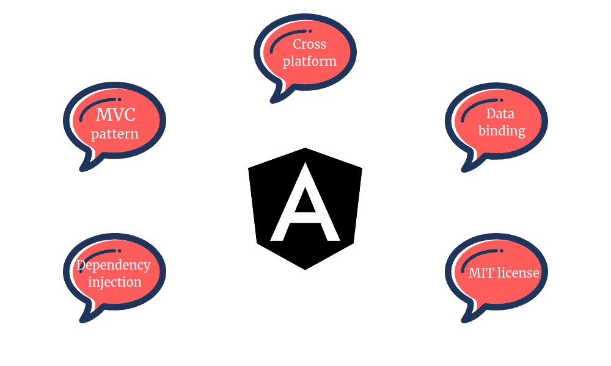
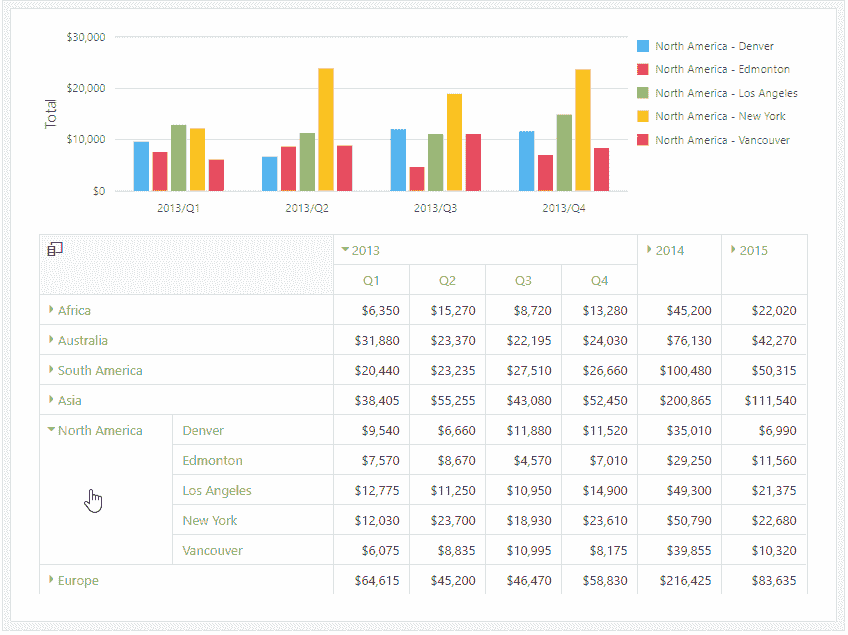
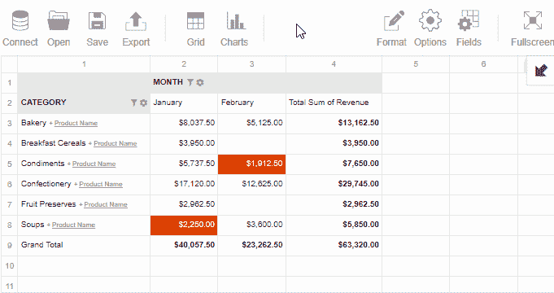

# 使用 Angular 创建高级可视报表

> 原文：<https://medium.com/quick-code/creating-advanced-visual-reports-with-angular-750a1858f194?source=collection_archive---------0----------------------->

对使用 Angular 开发 web 应用程序感兴趣吗？花 7 分钟时间了解:

*   什么是角和它的酷的特征
*   角度的 MVC 模式
*   角度应用程序中的 Web 报告
*   DevExtreme HTML5 JavaScript 透视网格
*   Flexmonster 数据透视表和图表

# **角度概述**

首先，让我们更深入地了解 Angular 工作的历史和原则。

**Angular** 被公认为软件开发人员创建响应式 web 应用程序的首选平台之一。根据最近的[年度开发者调查结果](https://insights.stackoverflow.com/survey/2020#technology-web-frameworks-professional-developers2)，全球 26.5%的专业开发者用 Angular 构建应用。

它由谷歌于 2009 年开发，最初被称为 AngularJS。2016 年，谷歌发布 Angular 2。此后每六个月更新一次。目前的版本是 Angular 7。

> 它的主要突破是从静态的基于 HTML 的文档转向动态内容的创建。

以前，要更新视图，您需要每次单独生成 HTML，从数据模型中检索数据，手动将事件处理程序添加到 UI 的触发部分，然后再次生成 HTML。这种类型的代码很难维护。 **Angular 为这个问题提供了一个便捷的解决方案。**

# **MVC 模式中的角度**

MVC 被认为是 web 开发的传统方法，因为它有助于使应用程序更具可伸缩性、可维护性、可重用性和可测试性。作为一种设计模式，MVC 是用 Angular 实现的。

它将应用程序的数据域、UI 和业务逻辑分成 3 个组件:模型、视图和控制器。此外，它提供了它们之间的低耦合。

*   **模型**代表数据源的表示
*   **视图**是模型的投影:它被渲染并发送给客户端
*   **控制器**负责处理客户端发出的请求，从模型中检索数据，并呈现必要的视图作为响应

## 这些原则在 Angular 中是如何体现的？

*   Angular 中的模型以工厂和服务的形式表示，您可以通过依赖注入将它们注入到组件中
*   **视图**是一个组件模板
*   **控制器**是一个组件类

Angular 中的组件是**可重用的**，这意味着它们可以跨一个应用程序的不同部分使用。同时，它们是解耦的，因此，开发变得更加高效，而不像使用 jQuery 库那样耗时。Angular 由 Google 维护和支持。所以，强烈推荐 2021 年[学棱角](https://blog.coursesity.com/best-angular-js-tutorials/)。

更新模型后,“角度”会自动将其修改直接反映在视图中。

## **那么，为什么有棱角？**

Angular benefits

*   基于组件的架构减少了开发和重构的耗时
*   双向数据绑定，用于模型和视图组件之间的数据同步
*   内置指令和创建自定义指令的能力
*   依赖注入
*   Angular 使用 MIT 许可证，因此，它的起源是透明的
*   丰富的生态系统:有许多可用的包和插件，开源社区和谷歌的支持是有保证的。后者保证你会得到定期更新。

还有更多优势可以发掘。你可以在[官方文档](https://angular.io/guide/architecture)中读到更多关于基于组件的架构的内容。

# **角度应用中的网络报告**

**想象这样一种情况**

您希望构建一个*数据驱动的角度应用*，并在最短的时间内为其提供分析。为此，您需要一个可嵌入的工具，或者将其交付给您的客户，或者实现您公司的战略目标。

整个整合过程应该会顺利进行。对于 web 报告工具来说，拥有免费或商业图表库(Highcharts、Google Charts、FusionCharts、Plotly 等)的连接器是很重要的，这样才不会发明轮子，并努力与它们集成太久。

让你的电子表格数据更有表现力的一个有效方法是结合面积/条形图、直方图等建立一个带有聚合数据的仪表板。

**要求**

无论您的数据模型有多复杂，您都应该能够:

*   连接到各种数据源，如 CSV、JSON、数据库和 OLAP 立方体
*   在客户端处理数据以确保安全性
*   **塑造数据**:聚合、排序、过滤、分组、向上钻取&向下钻取
*   **通过直观的用户界面实时对&的数据进行切片**
*   将表格数据显示为图表
*   保存报告以供进一步编辑和共享
*   导出为 Excel、PDF、CSV 格式，无需附加插件

因此，我将向您概述一些工具，这些工具能够满足上述要求，为您的案例提供扩展功能，并且能够处理大量业务数据。

## DevExtreme HTML5 JavaScript 透视网格

DevExtreme html 5 JavaScript Pivot Grid 是一个小部件，用于以交叉表格的形式呈现多维数据。

它是由 50 多个 UI 组件组成的 DevExtreme 组件套件的一部分。

其网络报告功能旨在汇总数据并基于数据构建分析报告。

我来介绍一下它的**主要特点:**

*   透视网格接受名为 PivotGridDataSource 的数据源。连接到内存阵列、HTML5 web 存储、远程 OLAP 服务器或您的自定义数据源有不同的实现方式
*   支持 12 种不同的**摘要**
*   **拖动&放下**功能
*   自定义排序
*   **分组**和**过滤**在 UI 或代码中
*   *可通过 context menu 小工具访问上下文菜单*
*   工具栏可以单独添加
*   导出到 Excel
*   响应式设计
*   兼容所有现代浏览器
*   [通过 SPA 框架进行本地化](https://js.devexpress.com/Documentation/17_1/Guide/SPA_Framework/Localization/)

**带角度的集成**

要将 Pivot Grid 小部件添加到 Angular 应用程序中，您需要 npm、 [Node.js](https://blog.coursesity.com/best-node-js-tutorials/) 和 Angular 5+。

关于整合有一个全面的[指令](https://github.com/DevExpress/devextreme-angular#add-to-existing-app)。此外，在这里您可以学习如何定制 DevExtreme 小部件，使用验证器或覆盖默认的角度变化检测。

**图表**

Pivot Grid 本机兼容 DevExtreme HTML5 图表库。它为您提供了一套 2D 和三维图表。您可以在[演示](https://js.devexpress.com/Demos/WidgetsGallery/Demo/Charts/Overview/jQuery/Light/)中探索这些图表。它们将有助于使你的报告更具互动性。

就我个人而言，我喜欢改变图表的主题。材料设计主题看起来特别棒。

**演示**

*   主[枢纽网格演示](https://js.devexpress.com/Demos/WidgetsGallery/Demo/PivotGrid/FieldPanel/Angular/Light/?r=m5)
*   [作为角度组件的枢轴网格](https://codesandbox.io/s/q80o6p330j/?r=m5)
*   [汇总显示模式](https://js.devexpress.com/Demos/WidgetsGallery/Demo/PivotGrid/SummaryDisplayModes/Angular/Light/?r=m5)

**这个工具最棒的地方**

该工具显示了良好的性能，提供了许多定制选项来增强小部件的外观和感觉，并且与 Angular 以及所有流行的框架兼容

如果您是需要一套组件来满足所有应用程序需求的开发人员，这是一个很好的选择。

## **Flexmonster 透视表&图表**

[Flexmonster](https://www.flexmonster.com/?r=m5) 是一个 JavaScript 组件，用于深度分析表格和多维业务数据。在它的帮助下，您可以构建交互式报告并增强您的可视化演示。

Flexmonster 附带了一组**内置特性**:

*   支持 **CSV** 、 **JSON** 、 **OLAP** (微软分析服务和 Pentaho 蒙德里安立方体)、**SQL**&**NoSQL**数据库来源。
*   可以使用特殊的服务器端实用程序(加速器和压缩器)来加速数据处理，从而建立到数据库和 OLAP 数据源的连接
*   **16 个聚合函数**包括统计函数
*   能够为每个度量定义自定义聚合函数(也称为计算值)和多个聚合
*   数据整形功能:**排序，** **分组，以及**过滤网格上的数据
*   **拖动&下降**功能
*   自定义排序
*   [用于报表定制的内置主题](https://www.flexmonster.com/demos/themes/?r=m5)
*   突出显示重要单元格的条件格式
*   数字格式:更改货币符号，小数点分隔符
*   导出到 **HTML** 、**图片**、 **CSV** 、 **Excel** 或 **PDF**
*   本地化: **7** 可用语言
*   热图可视化
*   兼容所有现代浏览器

**带角度的集成**

要将 Flexmonster 与 Angular 2+集成，可以运行 npm 命令将其嵌入到现有的应用程序中。[教程](https://www.flexmonster.com/doc/integration-with-angular/?r=m5)涵盖了创建 Angular 和 Flexmonster 项目所需的所有步骤。

**图表整合**

如果你需要一个引人注目的可视化效果**，** Pivot Table 提供了内嵌的数据透视表图表。通过单击工具栏按钮，可以很容易地在网格和图表模式之间切换。您还可以过滤数据，并在图表上钻取数据。

如果您想要扩展您的可视化功能，您可能想要创建一个包含汇总表格数据和第三方图表的仪表板。为了做到这一点，您可以使用关于与 Highcharts、FusionCharts、Google Charts 等集成的分步教程。

**演示**

*   主[透视表演示](https://www.flexmonster.com/demos/pivot-table-js/?r=m5)
*   [渲染了一百万行的演示](https://www.flexmonster.com/demos/one-million-rows/?r=m5)
*   [使用数据透视表连接到 MS Analysis Services](http://www.flexmonster.com/demos/connect-msas/?r=m5)

**这款工具最棒的地方**

这种数据透视表处理数据速度快，渲染行平滑，具有所有必要的功能，如与 Angular 和其他框架集成，各种聚合函数，内置导出到 Excel，PDF 等。

如果您不需要购买全套组件，并且希望从业务数据中获得洞察力，这是一个完美的选择。

# **结论**

在本文中，我介绍了 Angular 方法的一些基本概念，它的好处，并探索了在线 web 报告的可用工具。

**DexExtreme 数据透视表网格**和 **Flexmonster 数据透视表&图表**旨在提升您的数据分析能力。现在轮到你决定选择哪个组件了。第一个带有一整套组件，第二个是用于分析和图表的单一组件。它们都符合 Angular 组件架构的原则，并且可以改进您的数据驱动应用程序。

我希望你能试试这些工具。欢迎在评论中留下反馈！