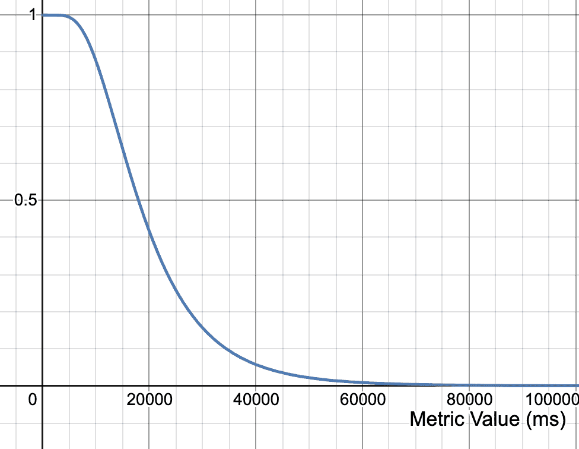
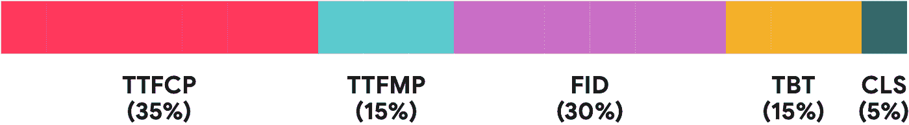
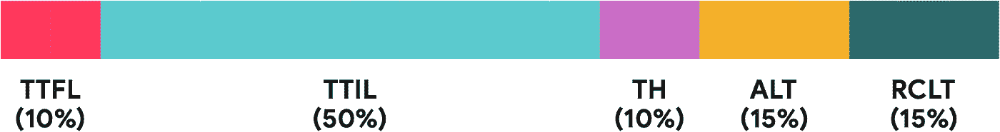
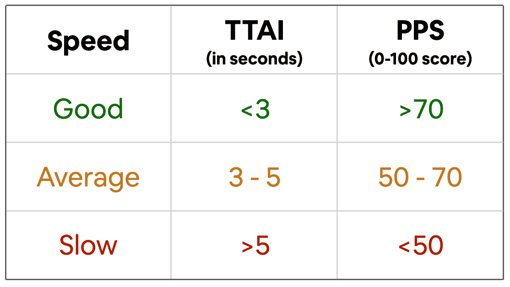
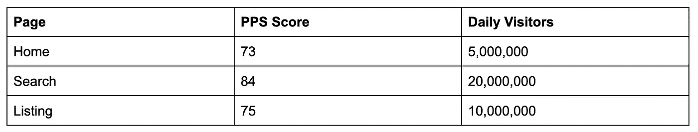

# 创建 Airbnb 的页面性能分数

> 原文：<https://medium.com/airbnb-engineering/creating-airbnbs-page-performance-score-5f664be0936?source=collection_archive---------0----------------------->

了解 Airbnb 如何建立页面性能分数，这是一个 0-100 分的分数，用于衡量任何平台上真实用户的多个性能指标。

安德鲁·舒尔曼

在 Airbnb，性能很重要，也是我们[致力于打造](/airbnb-engineering/commitment-to-craft-e36d5a8efe2a)的一部分。快速体验对业务有益，对我们“创造一个任何人都可以属于任何地方的世界”的使命至关重要。

在我们创造快速体验之前，我们需要就“快速”的衡量标准达成一致。Web、iOS 和 Android 各有不同的特定于平台的性能指标。对于产品工程师来说，理解这些指标中的哪一个应该优先考虑是具有挑战性的，对于管理层来说，比较平台和保持进度报告简洁是困难的。

我们开发了一个新的绩效衡量系统，称为页面绩效得分，使我们能够轻松跟踪不同平台上真实客户的多个绩效指标。这篇文章描述了这个系统，在接下来的几周里，我们将发布对 Web、iOS 和 Android 细节的深入探究。

# 早期绩效评估工作

当 Airbnb 首次开始衡量绩效时，我们使用了一个名为“Airbnb 互动时间”(TTAI)的单一指标，来衡量从页面开始到内容变得可见和互动的时间。这种方法有许多积极的结果。我们构建了性能跟踪架构，解决了延迟问题，并培养了重视性能的公司文化。

然而，TTAI 也有缺点。不同的平台有不同的基线和目标。页面比较很困难，因为“交互”的定义在相似的页面之间可能会改变。在某些情况下，TTAI 有所改善，但参与度指标却没有。最重要的是，TTAI 是一个单一的指标，一个单一的指标无法涵盖我们客户的全部性能期望。我们对“快”的定义不完整，限制了我们的整体性能。

> 单一指标无法涵盖我们客户的全部性能期望。

# 介绍页面性能得分

我们需要一个细微的性能视图，同时保持跟踪单个数字的简单性，因此我们创建了页面性能分数(PPS)。

*   **页面**:Airbnb 上的整个顾客旅程被分成不同的页面。
*   **性能**:一个页面包含多个性能指标。
*   **评分**:每天，在每个平台上，我们将给定页面的性能数据制定一个 0-100 分的分数。

PPS 允许我们将多个输入指标合并成一个易于比较的分数。PPS 是对我们以前的单一度量方法的阶跃函数改进。

# 衡量标准

我们衡量的指标因平台而异，但衡量多个指标并制定 0-100 分的一般方法是相同的。所有指标都是以用户为中心的，分为两大类:

1.  **初始加载指标**测量从“页面开始”到内容可见的时间。
2.  **Post Load Metrics** 测量初始加载后的页面响应性。

*The Airbnb homepage displays the loader and then meaningful content.*

## 初始负载指标

**第一次内容绘制的时间** (Web)和**第一次布局的时间**(本地)测量从“页面开始”到第一个内容可见的时间，这通常是一个加载器。

**首次有意义绘画的时间** (Web)和**初始加载的时间**(本地)测量从“页面开始”到有意义内容显示的时间。

左侧显示了初始负载指标。

## 加载后指标

[**首次输入延迟**](https://web.dev/fid/) (Web)测量用户交互与浏览器开始响应之间的延迟。用户可察觉到 50 毫秒或更长的延迟[。](https://developer.mozilla.org/en-US/docs/Web/Performance/How_long_is_too_long)

[**总阻塞时间**](https://web.dev/tbt/) (Web)和**线程挂起**(原生)导致 app 在布局、动画、滚动时滞后。

**附加加载时间**(原生)测量附加加载程序在一个页面中显示的平均时间，比如在分页期间。

**丰富内容加载时间**(原生)衡量图像和视频的平均加载时间。

[**累积布局偏移**](https://web.dev/cls/) (Web)通过元素偏移的大小和距离来衡量布局不稳定性。

# 公式

测量完指标后，我们使用 PPS 公式将信息提取为一个数字，这个公式是从 [Lighthouse 公式](https://web.dev/performance-scoring/)派生出来的。对于每个指标，我们根据内部和[行业数据](https://web.dev/defining-core-web-vitals-thresholds/)确定了好、中、差阈值。我们通过给好的范围分配高于 0.7 的分数，给差的范围分配低于 0.5 的分数，给中等的范围分配介于两者之间的分数，创建了一个评分曲线。

*A 10,000ms metric value would score ~0.9 in this example curve.*

每天，我们从数百万的真实用户页面负载中计算出一个给定页面的指标的平均值。我们将上限平均值与指标曲线对应起来，得到 0-1 分。我们通过将指标得分乘以指标权重，将指标得分合并为一个综合 PPS 得分。我们通过检查我们注重绩效的 A/B 测试来选择权重，并确保权重最大限度地符合 Airbnb 的内部参与度指标。

## Web 度量权重

## 本地公制重量

由此产生的 PPS 公式可以表示为…

*PPS =曲线(公制 _1) *重量 _1 +曲线(公制 _2) *重量 _2 …*

例如，在网上…

*PPS =曲线(TTFCP) * 35% +曲线(TTFMP) * 15% +曲线(FID) * 30% +曲线(TBT) * 15% +曲线(CLS) * 5%*

## PPS 进化

将公司从单一指标迁移到 PPS 在组织上极具挑战性。我们必须训练公司不要再把性能看做是一个基于秒的数字，这是一个需要跨职能协调的范式转变。为了便于过渡，我们将旧的 TTAI 系列与新的 PPS 系列对应起来。

一旦公司理解了 PPS，改进它就相对容易了。随着我们对绩效理解的提高，我们只需添加或替换指标，0-100 分保持不变。PPS 是为进化而设计的。例如，2019 年 Chrome 团队引入了[累积布局移位](https://web.dev/cls/)，这是 Web PPS 的完美候选。这是一个以用户为中心的指标，具有良好的浏览器覆盖率，可以通过直接和客户端路由的页面负载来衡量。我们测量了指标，验证了数据，然后将其整合到 PPS 的下一个版本中。轻松点。

# 加权平均分数

除了跟踪单个页面的 PPS 分数，我们还通过创建加权平均分数(WAS)来跟踪整个组织的整体绩效进度。考虑以下三个常见页面的 PPS 分数和流量示例:

*(73 * 500 万+84 * 2000 万+75 * 1000 万)/3500 万= ~80*

如果 Airbnb 只有这些页面，我们的 WAS 将会是 80 英镑左右。Airbnb 有数百个页面，因此 WAS 可以帮助我们对流量最大的页面进行优先排序和按比例加权。

# 结论

有了 PPS，我们的工程师和数据科学家现在有了大量以用户为中心的性能指标来了解和改进他们的产品。我们可以清楚的对比不同页面，不同组织，甚至不同平台的性能进度。PPS 允许团队设定简单的目标，并确定优先考虑哪些单个指标。PPS 可以发展:指标可以替换，权重可以改变，目标可以收紧，但 0-100 分保持不变。

改变我们对“快”的定义非常值得努力。该公司已经从将绩效视为单一指标发展到代表丰富、复杂的绩效现实的 0-100 分。我们已经提升了我们的绩效评估系统，希望您也能在您的组织中应用这些知识。

# 感谢

感谢这些年来帮助构建 PPS 的每一个人:[阿迪蒂亚·普贾尼](https://www.linkedin.com/in/adityapunjani/)、[阿尔珀·科克曼](https://www.linkedin.com/in/alperkokmen/)、[安东尼奥·尼诺拉](https://www.linkedin.com/in/hdezninirola/)、[本·威赫尔](https://www.linkedin.com/in/ben-weiher-123088122/)、[查尔斯·薛](https://www.linkedin.com/in/charlesx2013/)、[叶戈尔·帕克霍莫夫](https://www.linkedin.com/in/egor-pakhomov-35179a3a/)、[埃利奥特·萨克斯](https://www.linkedin.com/in/eli-hart-54a4b975/)、[加布·莱昂斯](https://www.linkedin.com/in/elliotsachs/)、[盖伊·里特格](https://www.linkedin.com/in/guy-rittger-%E2%93%A5-1355b4/) [林](https://www.linkedin.com/in/lupinglin/)、[马克·詹格里科](https://www.linkedin.com/in/markgiangreco/)、[马特·施雷纳](https://www.linkedin.com/in/mattschreinerphd/)、[尼克·米勒](https://www.linkedin.com/in/nickbryanmiller/)、[尼克·雷诺兹](https://www.linkedin.com/in/thenickreynolds/)、[诺亚·马丁](https://www.linkedin.com/in/noahsmartin/)、[小康辛](https://www.linkedin.com/in/xiaokangxin/)，以及一路上帮助过的所有人。

*有兴趣加入 Airbnb？看看这些角色:*

[*安卓软件工程师，客体验*](https://grnh.se/feab9b481us)[*高级 iOS 软件工程师，客体验*](https://grnh.se/cbf480fa1us)[*高级安卓软件工程师，客体验*](https://grnh.se/23eb3d8b1us)[*职员 iOS 软件工程师，客体验*](https://grnh.se/4092a3ba1us)[*职员安卓软件工程师，客体验*](https://grnh.se/a6f52fb91us)