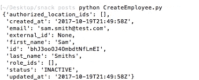

# 使用 Python 创建员工

> 原文：<https://medium.com/square-corner-blog/creating-an-employee-with-python-e810b4a2eec1?source=collection_archive---------0----------------------->

## 员工管理是最早的 API 之一；下面是如何用 Python 来使用它。

> 注意，我们已经行动了！如果您想继续了解 Square 的最新技术内容，请访问我们的新家[https://developer.squareup.com/blog](https://developer.squareup.com/blog)

在本帖中，我们将介绍创建一个新的员工记录的步骤，并将其附加到您的 Square 业务中。要是雇佣员工也这么简单就好了！

您可能会将这个员工创建脚本用作某个导入或同步脚本的一部分，但是对于这个示例，我们将创建一个创建员工的独立代码片段。

让我们来看看流程的每个部分:

```
import squareconnect
from squareconnect.apis.v1_employees_api import V1EmployeesApi
from squareconnect.models.v1_employee import V1Employee
```

首先我们`import`[方接](https://github.com/square/connect-python-sdk)包；如果您还没有安装它，您可以使用`pip install squareconnect`或者直接从 [github](https://github.com/square/connect-python-sdk) `pip install git+https://github.com/square/connect-python-sdk.git`安装它。这个包让您可以访问一些帮助器方法和模型，我们将在接下来的几行中导入这些方法和模型，使调用 API(以及相关的 HTTP 请求)变得更加容易。

```
squareconnect.configuration.access_token = 'sq0atp-XXX'
```

接下来，您需要指定用于访问 Square API 的访问令牌。这不仅告诉 Square 在哪个帐户上进行操作，还确保您有适当的权限。可以从 [Square 开发者门户](https://connect.squareup.com/apps)获得这个令牌，而且要一直保密。

```
api_instance = V1EmployeesApi()
employee = V1Employee()
employee.first_name = 'Sam'
employee.last_name = 'Smiths'
employee.email = '[sam.smith@test.com](mailto:sam.smith@test.com)'
```

现在我们的设置已经完成，我们可以创建一个 API 实例和一个新的雇员模型实例。然后，您可以为不同的属性赋值，以填充有关雇员的信息。在这里，我添加了雇员的名、姓和电子邮件。

```
api_response = api_instance.create_employee(employee)
print (api_response)
```

最后，我们可以调用 API 并打印出结果。如果一切顺利，您应该会看到这样的内容:



就是这样！如果你试用了这个，有任何问题，或者有任何意见，请在 [Twitter](https://twitter.com/squaredev) 上告诉我们，或者评论这个帖子！