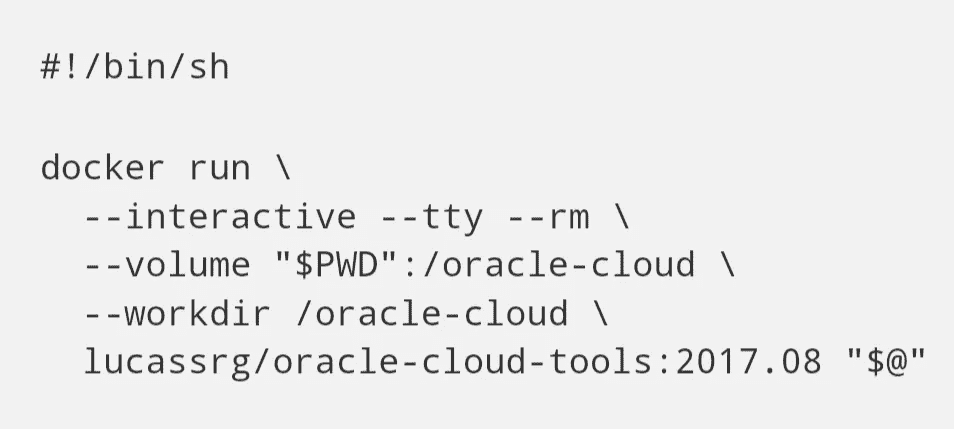

# 带 Docker 的集装箱化 CLIs 使开发更容易

> 原文：<https://medium.com/oracledevs/creating-an-oracle-cloud-infrastructure-cli-toolkit-docker-image-35be0ca71aa?source=collection_archive---------0----------------------->



安装命令行界面工具通常非常简单。您需要下载一些特定于您的平台的包，然后通过一些安装程序，配置一些文件，您应该准备好了。完成所有这些任务不应该超过 10 分钟——也许这并不总是正确的。您可能会遇到一些与您的特定环境相关的问题(缺少或不兼容的依赖项、内核版本、缺少权限等)，这些问题会使这个过程花费的时间比预期的长。

您是否想象过这样一种场景:您必须在所有 CI 服务器上安装来自不同软件的多个 CLI，所有这些 CLI 都运行在不同的平台上？

你可以在 [github](https://github.com/search?utf8=%E2%9C%93&q=command+line+interface+docker+&type=) 上找到几个为开发者和 IT 管理员构建的作为 Docker 映像的 CLI 示例。但是我可以给你一些在甲骨文的使用场景。例如，如果您想要将您的自定义映像模板部署到[Oracle Cloud infra structure Classic](https://cloud.oracle.com/compute)(OCIC—前 Oracle Compute Cloud)，您首先需要使用*存储 CLI* 将您的映像模板文件上传到 [OCI 对象存储 Classic](https://cloud.oracle.com/storage) ，然后您调用 *OCIC CLI* 来注册映像。如果您需要将您的应用程序部署到[应用程序容器云服务](https://cloud.oracle.com/acc)——您首先需要将应用程序包上传到存储容器，然后使用 ACCS CLI 启动您的应用程序。

有了 Docker，您不必在主机或虚拟机上安装所有的 CLI，而是可以利用 Docker 的可移植性，构建自己的 Docker 映像，可以在任何平台上使用。这将为您的开发运维流程带来灵活性，使您只需运行一个命令就能快速上手，但这也可用于以可移植的方式分发所有 Oracle 云工具集，包括在(尚未)提供本机支持或 CLI 工具的环境中运行，而不必担心复杂的设置任务和安装流程。

在本文中，我们将创建一个 Docker 容器，其中包含以下 Oracle 云服务的 CLI:

*   [甲骨文云基础设施](http://docs.oracle.com/en/cloud/iaas/index.html)
*   [甲骨文云基础设施计算经典](http://docs.oracle.com/en/cloud/iaas/compute-iaas-cloud/index.html)
*   [甲骨文云基础设施对象存储经典](http://docs.oracle.com/en/cloud/iaas/storage-cloud/index.html)

如果你想尝试这些服务，你可以在 https://cloud.oracle.com/tryit 的[上申请一个试用账户。](https://cloud.oracle.com/tryit)

# 软件要求

如果你还没有这样做，在你的本地机器上安装 [Docker](https://docs.docker.com/engine/installation/) 。

可以从 Oracle 技术网下载各个 CLI 工具。下载文件并保存在本地，因为您以后会需要它们。

*   下载 [OPC-CLI 实用程序](http://www.oracle.com/technetwork/topics/cloud/downloads/index.html#opccli)
*   下载用于对象存储经典版的[文件传输管理器 CLI](http://www.oracle.com/technetwork/topics/cloud/downloads/index.html#FTMCLI)

文件传输管理器 CLI 需要 Java 运行时环境

*   我们建议您使用[Docker 商店](https://store.docker.com/images/oracle-serverjre-8)[上的](https://store.docker.com) [Oracle Java 8 Docker 映像](https://store.docker.com/images/oracle-serverjre-8)作为基本映像。该图像由 Docker Inc .认证，对开发者和商业用途免费。要安装映像，您需要遵循以下步骤:

1.  注册一个 Docker 商店账户(以防你还没有注册)
2.  转到[https://store.docker.com/images/oracle-serverjre-8](https://store.docker.com/images/oracle-serverjre-8)访问 Oracle Java 8 Docker 映像
3.  点击继续结帐
4.  使用您的 Docker ID 登录
5.  填写表格
6.  接受协议条款
7.  点击获取内容按钮
8.  遵循 Docker 页面上的安装说明

# Docker 图像与容器

在我们开始之前，我想给大家介绍一些通用的 Docker 概念。Docker **映像**是一个轻量级的、独立的、可执行的包，包含运行一个软件所需的一切，包括代码、运行时、库、环境变量和配置文件。容器是图像的运行时实例——图像在实际执行时在内存中变成的样子。默认情况下，它完全独立于主机环境运行，仅在配置后访问主机文件和端口。

Docker **Containers** 在主机内核上本地运行应用程序。与仅通过虚拟机管理程序虚拟访问主机资源的虚拟机相比，它们具有更好的性能特征。容器可以获得本地访问，每个容器运行在一个独立的进程中，不会比任何其他可执行文件占用更多的内存。

Docker 可以通过从一个 **Dockerfile** 中读取指令来自动构建映像，Dockerfile 是一个包含构建给定映像所需的所有命令的文件。点击这里，你可以找到关于如何建立 Docker 形象的一些最佳实践的推荐指南[。](https://docs.docker.com/engine/userguide/eng-image/dockerfile_best-practices/)

# 构建 Oracle 云工具集 Docker 映像

构建映像的第一步是创建一个工作目录。

```
$ mkdir ~/oracle-cloud-tools
$ cd ~/oracle-cloud-tools
```

将所有需要下载的软件放在工作目录中。

```
$ ls -la
total 21592
drwxr-xr-x   4 lgomes  staff   136B Jan 22 14:57 ./
drwxr-xr-x  10 lgomes  staff   340B Jan 22 14:57 ../
-rw-r--r--   1 lgomes  staff   3.4M Jan 12 18:02 ftmcli-v2.3.3.zip
-rw-r--r--   1 lgomes  staff   7.1M Jan 12 07:44 opc-cli.17.2.2.zip
```

在本地计算机上安装`store/oracle/serverjre:8` Docker 镜像。如果您已经这样做了，请确保您有最新的版本:

```
$ docker pull store/oracle/serverjre:88: Pulling from store/oracle/serverjre
7bd9e1692b54: Pull complete
cd53021a057e: Pull complete
Digest: sha256:e95d11f91814d051d5807b96f4fd6be733f127c9c03530beb65e77155be8b59a
Status: Downloaded newer image for store/oracle/serverjre:8
```

下一步是创建您的`Dockerfile`。你可以注意到我把本地安装的`store/oracle/serverjre:8`作为基础映像。您可以在 G [itHub](https://github.com/oracle/docker-images/tree/master/OracleJava/java-8) 上找到该图像的 Dockerfile 定义。我还创建了一些映射到安装包的环境变量。我使用`ARG`指令为安装的库指定一个默认版本。当您通过将`--build-arg` 指定为 docker build 命令的参数来构建映像时，可以覆盖在`ARG`指令中设置的值。

最后但同样重要的是，为了能够访问 yum repo 中可用的最新通道，您应该在调用`RUN`指令中的任何其他命令之前，从服务器下载公共 yum 配置文件。这是必需的，因为基本 Docker 映像是在通道之前创建的，因此它们不存在于基本映像本身的 public-yum-ol7.repo 文件中。

```
RUN curl -o /etc/yum.repos.d/public-yum-ol7.repo [http://yum.oracle.com/public-yum-ol7.repo](http://yum.oracle.com/public-yum-ol7.repo) \
    && yum-config-manager --enable ol7_developer_EPEL \
    && yum-config-manager --enable ol7_developer \
```

如果您将在公司代理后面运行您的映像，您需要指定适当的代理环境变量——您可以删除与我的示例中的`http_proxy`和`https_proxy`相关的注释，如果您有任何问题，请参考本文的**故障排除**部分。您可以选择通过在`Maintainer`属性中输入**名称**和**电子邮件**地址来指定该图像的所有者。

```
FROM store/oracle/serverjre:8
MAINTAINER John Doe <your-email-address-here>ENV LC_ALL=en_US.utf8 \
    LANG=en_US.utf8
ARG OPC_CLI_VERSION=17.2.2
ARG CS_FTM_CLI_VERSION=2.3.3
ENV OPC_CLI_PKG=opc-cli.$OPC_CLI_VERSION.zip
ENV CS_FTM_CLI_PKG=ftmcli-v${CS_FTM_CLI_VERSION}.zipADD ${OPC_CLI_PKG} ${CS_FTM_CLI_PKG} /oracle-cloud-tools/WORKDIR /oracle-cloud-tools/RUN curl -o /etc/yum.repos.d/public-yum-ol7.repo [http://yum.oracle.com/public-yum-ol7.repo](http://yum.oracle.com/public-yum-ol7.repo) \
    && yum-config-manager --enable ol7_developer_EPEL \
    && yum-config-manager --enable ol7_developer \
    && yum -y install unzip python-oci-cli \
    && unzip /oracle-cloud-tools/${OPC_CLI_PKG} \
    && unzip -j ${CS_FTM_CLI_PKG} */*.jar \
    && yum -y install opc-cli-${OPC_CLI_VERSION}.x86_64.rpm \
    && rm -f opc-cli-${OPC_CLI_VERSION}.x86_64.rpm ${OPC_CLI_PKG} ${CS_FTM_CLI_PKG} \
    && rm -rf /var/cache/yum/*CMD ["/bin/bash"]
```

现在你可以[建立你的形象了。docker build 命令从 docker 文件和*上下文*构建 Docker 映像。构建的*上下文*是位于指定路径或 URL 中的一组文件，在命令:`docker build [OPTIONS] PATH`中](https://docs.docker.com/engine/reference/commandline/build/)

映像名称由斜杠分隔的名称组成，可以选择以注册表主机名作为前缀。通过在我们的命令行上指定`-t`标志，我们可以创建一个 [**标签**](https://docs.docker.com/engine/reference/commandline/build/#tag-an-image--t) 来附加到您的图像名称上。

在我们的例子中，我们指定了图像名`lucassrg/oracle-cloud-tools`和标记名`2018.01`，其中`lucassrg`是公共 Docker 注册中心(DockerHub)上的存储库名。路径被设置为当前的“”。工作目录。

您应该用自己的库名替换`lucassrg`。并且不要忘记在后面的步骤中引用您的存储库名称。

按照下面的建议运行`docker build`命令。由于需要下载和安装所有软件包，此过程需要一段时间才能完成。

```
docker build -t lucassrg/oracle-cloud-tools:2018.01 .
```

最后，您应该会得到一条`Successfully built`消息:

```
Successfully built 38cee208f94f
Successfully tagged lucassrg/oracle-cloud-tools:2018.01
```

# 将工具集作为 Docker 容器运行

一旦你完成了映像的构建，你就可以运行它了。我创建了一个 bash 脚本作为包装器。

oci.sh

```
#!/bin/shdocker run \
  --interactive --tty --rm \
  --volume "$PWD":/oracle-cloud \
  --workdir /oracle-cloud \
  lucassrg/oracle-cloud-tools:2018.01 "$@"
```

现在，您可以通过调用包装器来运行任何 Oracle Cloud CLI 命令，例如:

```
$ sh ./oci.sh oci --version
2.4.13$ sh ./oci.sh opc --version
opc version 17.2.2$ sh ./oci.sh java -jar /oracle-cloud-tools/ftmcli.jar -v
Version 2.3.3
```

作为包装器的替代方法，您可以创建包含所有必需参数的别名，以连接到一个特定的帐户/环境。

例如，在**Oracle Cloud infra structure**上，您可以在`workdir`文件夹上创建一个名为`oci_config`的[配置文件](https://docs.us-phoenix-1.oraclecloud.com/Content/API/Concepts/sdkconfig.htm)，然后设置指向它的`--config-file`参数(确保您还将配置文件中引用的 ssh 密钥复制到同一个工作目录中):

```
$ cat oci_config
[DEFAULT]
user=ocid1.user.oc1..aaaaaaaat5nvwcna5j6aqzjcaty5eqbb6qt2jvpkanghtgdaqedqw3rynjq
fingerprint=20:3b:97:13:55:1c:5b:0d:d3:37:d8:50:4e:c5:3a:34
key_file=/oracle-cloud/my-ssh-key-file.pem
tenancy=ocid1.tenancy.oc1..aaaaaaaaba3pv6wkcr4jqae5f15p2b2m2yt2j6rx32uzr4h25vqstifsfdsq
region=us-ashburn-1$ alias oci="docker run  --interactive --tty --rm  --volume "$PWD":/oracle-cloud  --workdir /oracle-cloud:ro,private lucassrg/oracle-cloud-tools:2018.01 oci --config-file /oracle-cloud/oci_config"
```

对于 **OCI 经典**，您创建一个配置文件(和密码文件)并将权限设置为`600`。我在`workdir`文件夹下创建了一个名为`opc_profiles`的文件夹来存放这些文件，然后在 alias 上，我通过`-e`参数将文件夹和文件作为环境变量引用。

```
$ ls -la opc_profiles
total 16
drwxr-xr-x  4 lgomes  staff   136B Aug 30 12:38 ./
drwxr-xr-x  8 lgomes  staff   272B Aug 30 11:46 ../
-rw-------  1 lgomes  staff   243B Aug 30 12:38 my-profile
-rw-------  1 lgomes  staff    17B Aug 30 12:38 my-profile-pwd$ alias opc="docker run  --interactive --tty --rm  --volume "$PWD":/oracle-cloud:ro,private  --workdir /oracle-cloud  -e "OPC_PROFILE_DIRECTORY=/oracle-cloud/opc_profiles" -e "OPC_PROFILE_FILE=my-profile" lucassrg/oracle-cloud-tools:2018.01 opc"
```

对于**存储经典**，您需要指定一些环境变量:

```
$ alias ftmcli="docker run  --interactive --tty --rm --volume "$PWD":/oracle-cloud  --workdir /oracle-cloud -e "FTM_AUTH_URL=[https://myidentitydomain.storage.oraclecloud.com](https://myidentitydomain.storage.oraclecloud.com)" -e "FTM_USER=Storage-myidentitydomain:myusername" -e "FTM_SERVICE=Storage" -e "FTM_IDOMAIN=myidentitydomain" lucassrg/oracle-cloud-tools:2018.01 java -jar /oracle-cloud-tools/ftmcli.jar"
```

然后，您只需要调用您指定的别名，就像您自己的计算机上安装了 CLI 一样:

```
$ oci --version
2.4.13$ opc --version
opc version 17.2.2$ ftmcli -v
Version 2.3.3
```

有关用法的其他详细信息，您应该查看特定的 CLI 文档。

```
$ oci --help
Usage: oci[OPTIONS] COMMAND [ARGS]...$ opc --help
USAGE:
   opc [global_options...] service_name [service_options...] resource_name command [arguments...] [opt
ions...] $ ftmcli --help
Usage: java -jar ftmcli.jar <command> [-A, --auth-url <auth url>]
                                      [-S, --service <service>]
                                      [-I, --identity-domain <identity domain>]
                                      [-U, --user <user>]
                                      [-d, --debug]
                                      [-i, --silent]
                                      [-v, --version]
                                      [-h, --help]
                                      [--properties-file <file path>]
                                      [--save-auth-key]
```

# 后续步骤

现在，您可以在不同平台上以可移植且可靠的方式轻松管理所有基础架构资源和应用程序。您可以根据需要设计包含任意多个 CLI 的图像。例如，您可以将 [Oracle PaaS 服务管理器 CLI](https://docs.oracle.com/en/cloud/paas/java-cloud/pscli/toc.htm) 添加到您的映像中，以管理 [PaaS 服务](https://cloud.oracle.com/en_US/paas)。或者，您可以拥有一个安装了多个云提供商 CLI 的映像，以支持您的所有云解决方案。你也可以通过自动构建过程在公共/私人注册中心如 [Docker Hub](https://hub.docker.com/) 上发布你的图像。

# 信用

感谢 Avi Miller 为 Oracle Linux docker file 的设计和优化提供了大力支持。

这是文章的更新版本，带有 Dockerfile 文件的优化版本。

最初发布时间:2017 年 8 月

最后更新:2018 年 1 月。