# 使用 Azure Certification 身份验证创建和配置虚拟网络网关(点对点)

> 原文：<https://medium.com/version-1/creating-and-configuring-virtual-network-gateway-point-to-site-using-azure-certification-7a5b61839e54?source=collection_archive---------0----------------------->

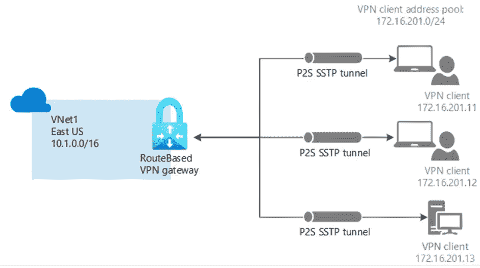

对于在云环境中运行的客户来说，确保与数据库资源的安全连接是一项重要要求和考虑事项。如今，客户希望从 Azure 内部/外部连接到他们的用于 PostgreSQL 的 [**Azure 数据库，并且基于安全性和合规性要求，组织可以选择 Azure 数据库为 PostgreSQL 提供的选项之一。在本节中，我们将概述如何使用点对点网关从内部安全连接到 PostgreSQL 的 Azure 数据库的详细步骤。**](https://docs.microsoft.com/en-us/azure/postgresql/)

一个 [**点对点(P2S)**](https://docs.microsoft.com/en-us/azure/vpn-gateway/point-to-site-about) VPN 网关连接让我们可以从一台单独的客户端计算机创建到虚拟网络的安全连接。P2S 连接是通过从客户端计算机启动来建立的。这个解决方案对于想要从远程位置连接到 Azure VNETs 的远程工作者非常有用，比如从家里或会议上。

点对点本机 Azure 证书身份验证连接使用以下项目，我们将在本练习中配置这些项目:

> *基于路由的 VPN 网关。
> 
> *公钥(。cer 文件),它被上传到 Azure。证书上传后，将被视为可信证书并用于身份验证。
> 
> *客户端证书由根证书生成。客户端证书安装在将连接到 VNet 的每台客户端计算机上。该证书用于客户端身份验证。
> 
> *VPN 客户端配置。VPN 客户端是使用 VPN 客户端配置文件配置的。这些文件包含客户端连接到虚拟网络所需的信息。这些文件配置操作系统固有的现有 VPN 客户端。每个连接的客户端都必须使用配置文件中的设置进行配置。

虚拟网络网关使用一个称为网关子网的特定子网。网关子网是我们在配置虚拟网络时指定的虚拟网络 IP 地址范围的一部分。它包含虚拟网络网关资源和服务使用的 IP 地址。

当我们创建网关子网时，我们指定子网包含的 IP 地址数量。所需的 IP 地址数量取决于我们想要创建的 VPN 网关配置。有些配置比其他配置需要更多的 IP 地址。Microsoft 建议我们创建一个使用/27 或/28 的网关子网。

1.  在**搜索资源、服务和文档(G+/)** 中输入**虚拟网关**。在市场搜索结果中找到**虚拟网关**，选择它打开**创建虚拟网关**页面。

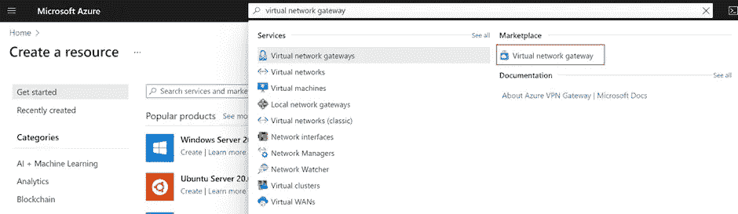

2.在**基础**选项卡上，填写**项目详情**和**实例详情**的值。

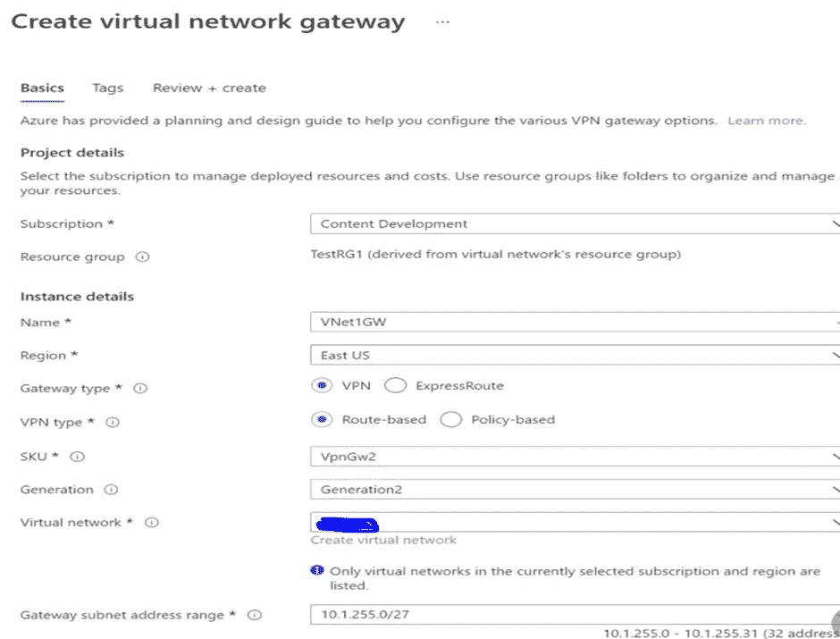

3.指定**公共 IP 地址**的值。这些设置指定与 VPN 网关关联的公共 IP 地址对象。创建 VPN 网关时，公共 IP 地址会动态分配给该对象。只有当网关被删除并重新创建时，公共 IP 地址才会改变。它不会随着我们 VPN 网关的大小调整、重置或其他内部维护/升级而改变。

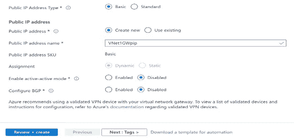

4.选择**审查+创建**运行验证。

5.一旦验证通过，选择**创建**部署 VPN 网关。

6.**使用 Powershell 生成和导出点对点证书。**

> a)生成一个**自签名的**根证书。

I)从运行 Windows 10 或 Windows Server 2016 的计算机上，使用提升的权限打开 Windows PowerShell 控制台。

ii)使用以下脚本创建自签名根证书。以下脚本创建名为“P2SRootCert”的自签名根证书，该证书自动安装在“Certificates-Current User \ Personal \ Certificates”中。您可以通过打开 *certmgr.msc* 或*管理用户证书*来查看证书。

*$ cert = New-self signed certificate-Type Custom-key spec 签名`*

*-Subject " CN = P2SRootCert "-KeyExportPolicy Exportable `*

*-hash algorithm sha 256-key length 2048 `*

*-CertStoreLocation " Cert:\ CurrentUser \ My "-key usage property Sign-key usage CertSign*

iii)让 PowerShell 控制台保持打开状态，并继续执行后续步骤以生成客户端证书。

> b)生成一个**客户端证书**。

I)如果在创建自签名根证书后没有关闭 PowerShell 控制台，请使用以下命令。我们生成的客户端证书会自动安装在您计算机上的“证书—当前用户\个人\证书”中。

new-self signed certificate-Type Custom-DNS name p2s childcert-key spec 签名

*-Subject " CN = P2SChildCert "-KeyExportPolicy Exportable `*

*-hash algorithm sha 256-key length 2048 `*

*-CertStoreLocation " Cert:\ CurrentUser \ My " `*

*签名人$ cert-text extension @(" 2 . 5 . 29 . 37 = { text } 1 . 3 . 6 . 1 . 5 . 5 . 7 . 3 . 2 ")*

> c)导出**根证书公钥**(。cer)

创建自签名根证书后，导出根证书公钥。cer 文件(不是私钥)。我们稍后将把这个文件上传到 Azure。以下步骤有助于导出。自签名根证书的 cer 文件:

I)要从证书中获取. cer 文件，打开**管理用户证书**。找到自签名根证书，通常在“证书—当前用户\个人\证书”中，然后右键单击。点击**所有任务**，然后点击**导出**。这将打开**证书导出向导**。如果我们在当前用户\个人\证书下找不到证书，我们可能不小心打开了“证书—本地计算机”，而不是“证书—当前用户”)。如果我们想使用 PowerShell 在当前用户范围内打开证书管理器，我们在控制台窗口中键入 *certmgr* 。

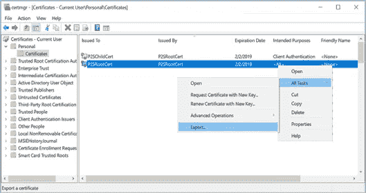

ii)在向导中，点击下一个的**。**

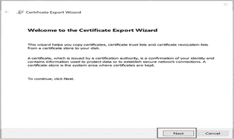

iii)选择**否，不导出私钥**，然后点击**下一步**。

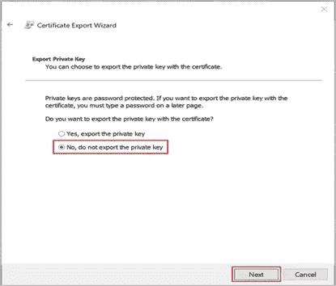

iv)在**导出文件格式**页面，选择 **Base-64 编码的 X.509(。CER)。**，然后点击**下一步**。

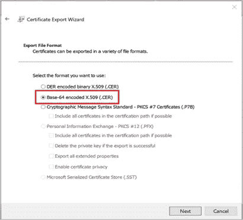

v)在**文件导出界面**，**浏览**到我们想要导出证书的位置。对于**文件名**，命名证书文件。然后，点击下一个的**。**

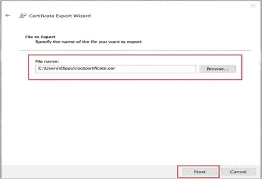

vi)点击**完成**导出证书。

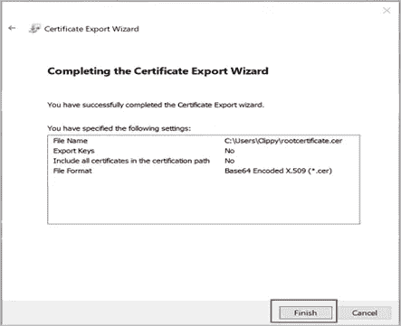

vii)您的证书已成功导出。

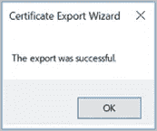

viii)导出的证书如下所示:

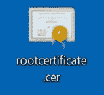

ix)如果我们使用记事本打开导出的证书，我们会看到类似以下示例的内容。蓝色部分包含上传到 Azure 的信息。如果我们用记事本打开我们的证书，它看起来不像这样，通常这意味着我们没有使用 Base-64 编码的 X.509 导出它。CER)格式。此外，如果我们想使用不同的文本编辑器，请理解一些编辑器可能会在背景中引入非预期的格式。这可能会在将文本从该证书上载到 Azure 时产生问题。

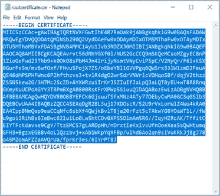

> **d)** 导出**客户端证书。**

当我们生成客户端证书时，它会自动安装在我们用来生成它的计算机上。如果我们想在另一台客户端计算机上安装客户端证书，我们需要导出我们生成的客户端证书。

I)要导出客户端证书，请打开**管理用户证书**。默认情况下，我们生成的客户端证书位于“证书—当前用户\个人\证书”中。右键单击我们要导出的客户端证书，点击**所有任务**，然后点击**导出**，打开**证书导出向导**。

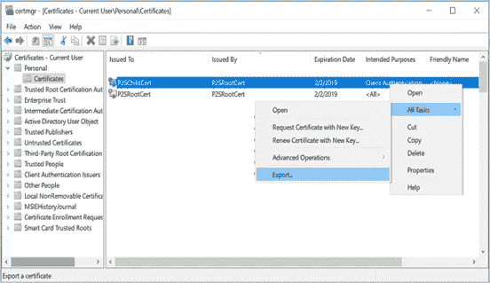

ii)在证书导出向导中，单击下一步的**继续。**

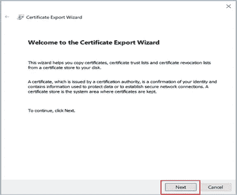

iii)选择**是，导出私钥**，然后点击**下一步**。

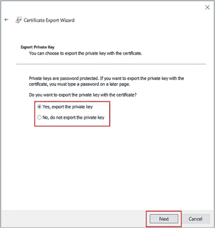

iv)在**导出文件格式**页面上，保留默认选择。确保**包括认证路径中的所有证书，如果可能的话**被选中。此设置还会导出成功进行客户端身份验证所需的根证书信息。没有它，客户端身份验证会失败，因为客户端没有受信任的根证书。然后，点击下一个的**。**

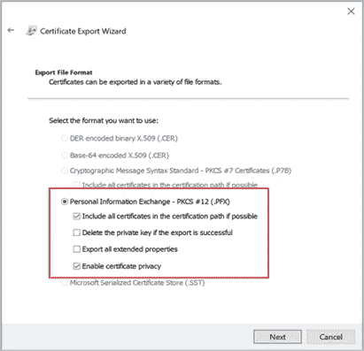

v)在**安全**页面，我们必须保护私钥。如果我们选择使用密码，请确保记录或记住我们为此证书设置的密码。然后，点击下一个的**。**

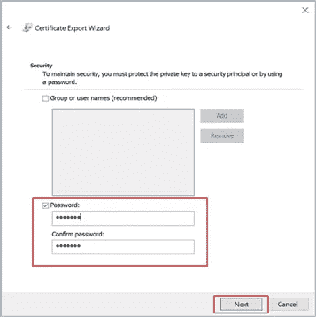

vi)在**文件上的**、**浏览**到我们要导出证书的位置。对于**文件名**，命名证书文件。然后，点击下一个的**。**

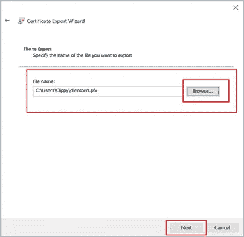

vii)点击**完成**导出证书。

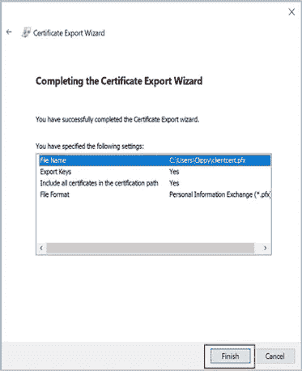

7.添加 **VPN 客户端地址池。**

客户端地址池是我们指定的一系列私有 IP 地址。通过点对点 VPN 连接的客户端会动态地从该范围接收一个 IP 地址。使用不与我们连接的本地位置或我们要连接的虚拟网络重叠的私有 IP 地址范围。如果我们配置了多个协议，而 SSTP 是其中一个协议，那么配置的地址池将在配置的协议之间平均分配。

I)创建虚拟网络网关后，导航至虚拟网络网关页面的**设置**部分。在**设置**中，选择**点对点配置**。选择**立即配置**打开配置页面。

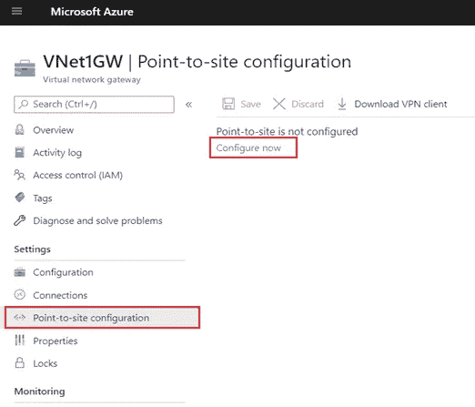

ii)在**点对点配置**页面的**地址池**框中，添加我们要使用的私有 IP 地址范围。VPN 客户端从我们指定的范围内动态接收 IP 地址。主动/被动配置最小子网掩码为 29 位，主动/主动配置最小子网掩码为 28 位。

iii)继续下一节，配置身份验证和隧道类型。

8.指定**隧道**类型和**认证**类型。

在本节中，我们指定隧道类型和身份验证类型。如果我们在点对点配置页面上没有看到隧道类型或验证类型，我们的网关使用的是基本 SKU。基本 SKU 不支持 IKEv2 或 RADIUS 身份验证。如果我们想使用这些设置，我们需要删除并使用不同的网关 SKU 重新创建网关。

> **a)隧道式。**

在**点对点配置**页面，选择**隧道类型**。选择隧道类型时，请注意以下事项:

Android 和 Linux 上的 strongSwan 客户端以及 iOS 和 macOS 上的本地 IKEv2 VPN 客户端将仅使用 IKEv2 隧道类型进行连接。

ii) Windows 客户端将首先尝试 IKEv2，如果无法连接，他们将返回 SSTP。

iii)我们可以使用 OpenVPN 客户端连接到 OpenVPN 隧道类型。

> **b)认证类型。**

对于**认证类型**，选择 **Azure 证书**。

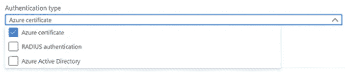

9.上传**根证书**公钥信息

在本节中，我们将公共根证书数据上传到 Azure。一旦上传了公共证书数据，Azure 就可以使用它来认证已经安装了从受信任的根证书生成的客户端证书的客户端。

I)在**根证书**部分导航至我们的**虚拟网络网关- >点对点配置**页面。仅当我们选择了 **Azure certificate** 作为身份验证类型时，此部分才可见。

ii)使用文本编辑器(如记事本)打开证书。复制证书数据时，请确保我们将文本复制为一个连续的行，没有回车或换行符。我们可能需要将文本编辑器中的视图修改为“显示符号/显示所有字符”,以查看回车和换行符。仅将以下部分作为一个连续行复制:

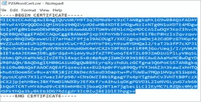

iii)在**根证书**部分，我们最多可以添加 20 个可信根证书。

iv)将证书数据粘贴到**公共证书数据**字段。

v) **证书名称**。

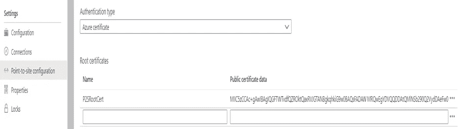

vi)选择页面顶部的**保存**保存所有配置设置。

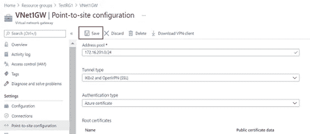

10.生成并安装用于证书认证的 **VPN 客户端配置文件**配置文件。

当我们使用点到点和证书身份验证连接到 Azure VNet 时，我们使用的是本地安装在我们所连接的操作系统上的 VPN 客户端。VPN 客户端的所有必要配置设置都包含在 VPN 客户端配置 zip 文件中。zip 文件中的设置有助于您轻松地为 Windows、Mac IKEv2 VPN 或 Linux 配置 VPN 客户端。

我们生成的 VPN 客户端配置文件特定于虚拟网络的 P2S VPN 网关配置。如果在我们生成文件后对点对点 VPN 配置有任何更改，例如对 VPN 协议类型或身份验证类型的更改，我们需要生成新的 VPN 客户端配置文件，并将新的配置应用到我们想要连接的所有 VPN 客户端。

> **a)使用 Azure Portal 生成文件。**

I)在 Azure 门户中，导航到我们要连接的虚拟网络的虚拟网络网关。

ii)在虚拟网关页面，选择**点对点配置**，打开点对点配置页面。

iii)在点对点配置页面的顶部，选择**下载 VPN 客户端**。它不下载 VPN 客户端软件，而是生成用于配置 VPN 客户端的配置包。生成客户端配置包需要几分钟时间。在此期间，在数据包生成之前，我们可能看不到任何指示。

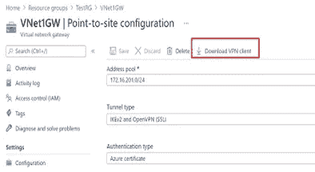

iv)生成配置包后，我们的浏览器会显示一个可用的客户端配置 zip 文件。它的名字和我们的网关一样。解压缩文件以查看文件夹。

> **b)安装配置文件。**

I)选择与 Windows 计算机架构相对应的 VPN 客户端配置文件。对于 64 位处理器体系结构，请选择“VpnClientSetupAmd64”安装程序包。对于 32 位处理器体系结构，请选择“VpnClientSetupX86”安装程序包。

ii)双击软件包进行安装。如果我们看到一个 SmartScreen 弹出窗口，单击**更多信息**，然后**继续运行**。

11.测试连接

I)要连接到我们的虚拟网络，在客户端计算机上，导航到 VPN 设置并找到我们创建的 VPN 连接。它和我们的虚拟网络同名。选择**连接**。可能会出现一条弹出消息，提示您使用证书。选择**继续**使用提升的权限。

ii)在**连接**状态页面，选择**连接**开始连接。如果我们看到一个**选择证书**屏幕，验证显示的客户端证书是我们想要用来连接的证书。如果不是，使用下拉箭头选择正确的证书，然后选择**确定**。

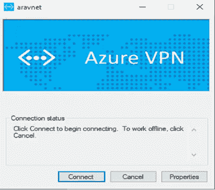

iii)您的连接已建立。

**这是一个四部分系列的第二部分，可以在下面查看:**

[第 1 部分—创建虚拟网络和 PostgreSQL](/version-1/vnet-integratedpostgresql-integration-with-power-bi-app-12950039e687)
[第 3 部分—安装远程连接 PostgreSQL DB 的 ODBC 驱动程序](/version-1/installing-odbc-driver-for-remote-connection-to-postgresql-db-9b8d496e50e4)
[第 4 部分—在 Power BI 中配置数据网关](/version-1/configuring-of-data-gateway-in-power-bi-f7f95882f19)

如果你对此感兴趣或有任何反馈，请在评论区告诉我。

**关于作者:** Raghavendra BN 是一名 DevOps 工程师，目前在 Version 1 的 Foundation 的团队工作。关注版本 1 和 Raghavendra BN，了解更多关于 Microsoft Azure 和 Azure DevOps 的博客。