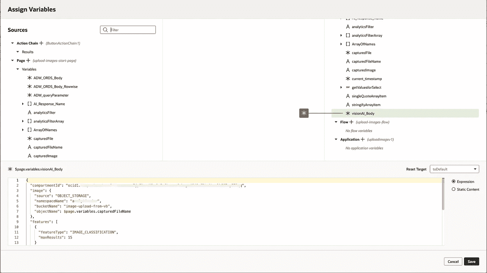

# 使用 Oracle Visual Builder、Analytics 和 OCI 视觉人工智能服务创建可组合的分析应用程序

> 原文：<https://medium.com/oracledevs/creating-composable-analytic-applications-with-oracle-visual-builder-analytics-and-oci-vision-ai-705236c1de07?source=collection_archive---------0----------------------->

# 介绍

在伦敦举行的 2022 年 Gartner Analytics 会议上，我开始了解 Oracle Vision AI 服务。这项服务的可能性激发了我的想象力，通过上传图像或从对象存储中引用图像，可以很容易地从 Oracle 云控制台(导航到 Vision AI 服务)进行尝试。

在同一个会议上，我被介绍了“可组合应用”的概念，其中“可组合”是 Gartner 使用的一个术语，指的是使用不同服务的构建块，以低代码创建定制的分析体验。至少，这是我对术语“可组合”的解释，这让我想知道 Oracle OCI 云服务的可能性。

我已经在[的博客](/oracledevs/visual-builder-component-for-embedding-oracle-analytics-part-1-6de32b327d08)中介绍了一个 web 组件，它可以轻松地将 Oracle Analytics 内容嵌入到低代码 Visual Builder 应用程序中，在这篇博客中，我将描述我如何使用“可组合”概念来构建一个应用程序，该应用程序可以拍摄图像，使用 Vision AI 服务执行分析，并为“标签”生成建议，以充当嵌入式分析的过滤器。我正在处理一个零售场景，允许根据图像中检测到的玩具类型过滤分析，并对这些玩具的数据进行比较。

这并不打算成为构建这个应用程序的一步一步的指南，而是概述了我所使用的服务的可能性。关于应用程序开发的一个很棒的事情是，有多种方法可以达到最终目标，希望你可以将这里提出的想法应用到你自己的开发方法中。

下面是在 Visual Builder 的设备模拟器上运行的结果应用程序的演示:

# 体系结构

该应用程序的组件架构和高级流程如下所示:


Architecture and Process Flow

# 构建应用程序

当选择创建新的应用程序时，Visual Builder 提供了许多模板和布局。我选择构建一个移动应用程序，以利用 VB 的渐进式 Web 应用程序(PWA)功能。

这是在 VB 中看到的应用程序页面结构:


Visual Builder App Page Structure

*快速提示:在 VB 中开发时，我经常临时使用文本字段等 UI 控件来帮助我调试应用程序，检查变量的值或 REST API 调用体(调试时也可以输出到 console.log()这些变量)。这是开发中期的样子，您可以监视 REST API 有效负载和 JSON 响应的创建:*


Temporarily Showing Variable Values Helps Debugging

# 捕捉图像

VB 支持低代码应用程序开发的一个重要方面是各种 UI 组件，它们可以被拖到应用程序页面上。我已经使用了几个“设备”组件，例如其他项目中的定位服务，特别是使用移动设备的定位服务将地理位置过滤器传递给 Oracle Analytics。在这个应用程序中，我使用 UI 控件通过设备摄像头拍摄照片。

一旦捕获了图像，就会触发一个事件来执行 VB 动作链。动作链是应用程序功能和流程控制的关键。在我的应用程序中，动作链将捕获图像的以下属性分配给以下变量:


```
capturedFile = $variables.files[0] capturedImage = URL.createObjectURL($variables.files[0]) capturedFileName = $page.variables.capturedFile.name
```

由于该应用程序旨在演示概念验证，因此我将一些步骤分离出来，并使用按钮来调用通常会自动执行的流程。我分离出来的一个步骤是将捕获的图像上传到对象存储。视觉人工智能服务可以使用在 [API 请求](https://docs.oracle.com/en-us/iaas/api/#/en/vision/20220125/AnalyzeImageResult/AnalyzeImage)有效载荷中发送的图像或者从对象存储中引用的图像。我已经选择将图像存储在对象存储中，以备以后使用。

我使用对象存储 API 来上传捕获的图像。当用户按下一个按钮，一个事件调用一个动作链，用一个 PUT 请求调用对象存储 API 时，就会调用这个过程。这是一个简单的动作链，注意输入参数的映射以及请求体到变量的映射。我注意到这种单独构建 REST 有效负载的方法非常有用，尤其是在 API 主体是从变量动态创建的情况下。


在这个行动链中，值得强调以下参数:

```
objectName = $page.variables.capturedFile.namebody = $page.variables.capturedFile
```

另请注意，内容类型参数映射到:

```
[[$page.variables.capturedFile.type]]
```

为了完成动作链，我将在文件上传后显示一个短暂的确认信息(即绿色弹出消息)。

# 休息端点

在介绍应用程序的其余部分之前，我想描述一下如何在 Visual Builder (VB)中定义 REST 端点。由于 VB 的目标是低代码的应用程序开发用例，所以可以使用创建[服务连接](https://docs.oracle.com/en/cloud/paas/integration-cloud/visual-developer/create-service-connection.html)的向导来定义端点。这也是定义这些端点的身份验证的地方。在 OCI 云服务的例子中，我使用的是“ [OCI API 签名 1.0](https://blogs.oracle.com/vbcs/post/using-oci-api-signature-authentication-from-visual-builder) ”，它是租户/用户/API 密钥的 OCIDs 和与 API 密钥相关联的私钥的组合。

对于到 Oracle REST 数据服务(ORDS)的连接，在这个[博客](https://oracle-base.com/articles/misc/oracle-rest-data-services-ords-authentication#oauth2)上有关于认证的详细信息。

# 调用视觉人工智能服务

应用程序流程的下一步是使用 REST 端点调用 Vision AI 服务来[分析图像](https://docs.oracle.com/en-us/iaas/api/#/en/vision/20220125/AnalyzeImageResult/AnalyzeImage)。如前所述，我发现将 REST 调用的主体定义为一个变量很有用，然后将结果变量传递给实际的 REST 调用。在本例中，我将对象名传递给 visionAI_Body 变量，然后在动作链的实际 API 调用中引用该变量。



我发现我需要对来自 Vision AI 服务的响应进行一些处理，以使其适用于 VB select (many) UI 组件。这主要涉及转换响应，其形式如下:

```
[{"name":"Blue","confidence":0.99102336},{"name":"Toy","confidence":0.9829609},{"name":"Wheel","confidence":0.94196075},{"name":"Car","confidence":0.9119572},{"name":"Vehicle","confidence":0.90317947},{"name":"Land vehicle","confidence":0.8977431},{"name":"Plastic","confidence":0.86447364},{"name":"Iron (Material)","confidence":0.7766388},{"name":"Human head","confidence":0.73616046},{"name":"Circle","confidence":0.6690402}]
```

到一系列标签名称行(没有引号),可以定义为服务数据提供者(SDP ),以便在 select (many)中使用。这个过程的第一步是从返回的 JSON 中提取标签“names”。这是通过使用“实用程序”JavaScript 函数提取“名称”并填充一个新数组来实现的。

```
loopFunction(arrayOfNames) {
let arrayLength = arrayOfNames.length
let detectedNames = []
for (var i = 0; i < arrayLength; i++) {
console.log(arrayOfNames[i]);
detectedNames.push(arrayOfNames[i].name);
}
return detectedNames;
}
```

我还使用了一个 JavaScript 函数来获取一个时间戳，该时间戳用于在更新表时用时间戳填充数据库表，同时更新图像文件名和检测到的标签名。我使用数据库序列和 on insert 触发器来为该表生成主键。我还将来自 Vision AI 的响应存储在表中，但是每个名称都有单独的一行。如果你正在开发一个用于生产的应用程序，你可能不需要这么做，但是当我用这个做概念验证的时候，我尝试了不同的方法。


Looping Over an Array to Send Row Level Data to ORDS

在单排的情况下，ORDS 体看起来像这样:

```
{
"time_stamp" : $page.variables.current_timestamp,
"file_name" : 'Single-row' + $page.variables.capturedFileName,
"detected_names" : JSON.stringify($page.variables.ArrayOfNames)
}
```

对于在单独的行中存储检测到的标签的 ORDS 调用，我在包含“ArrayOfNames”的数组上循环的操作链中使用了“For Each”节点。我还创建了一个实用函数，使用。replaceAll(` " `, ` `)从我检测到的名称中删除引号，因为它们需要以特定的形式供嵌入式分析过滤器 JSON 使用。

可以使用单独的 ORDS 调用来填充 select(多)的 VB 服务数据提供程序。

# 过滤嵌入式分析

我们现在有一个可选择的值列表，对应于 OCI 视觉人工智能服务为您在设备上捕获的任何图像检测到的标签。正如我在其他[博客](/oracledevs/visual-builder-component-for-embedding-oracle-analytics-part-1-6de32b327d08)中描述的，Oracle 发布了一个嵌入分析的 VB web 组件。在这种情况下，我希望根据存储在数组＄variables . analyticsfilterarray 中的 select (many)值来过滤分析


Data Properties for Select (Many) UI Component

[嵌入式分析](https://insight2action.medium.com/visual-builder-component-for-embedding-analytics-part-3-filters-44a3b4a2af89)的过滤器 JSON 如下。在 sColFormula 引用和用于存储所选值的数组名称的情况下，您的名称会有所不同。

```
[[ [ { "sColFormula": "XSA('[<](mailto:mike.durran@oracle.com)owner>'.'<data-set>').\"Columns\".\"PRODUCT_DESC\"",  "sColName": "PRODUCT_DESC",  "sOperator": "in",  "isNumericCol": false,  "isDateCol": false,  "bIsDoubleColumn": false,  "aCodeValues": [],  "aDisplayValues":  $variables.analyticsFilterArray }] ]]
```

# 结论

希望这篇博客能给你一些想法，在使用 Visual Builder 这样的低代码开发工具结合各种 Oracle 分析和人工智能服务时会有什么样的可能。

加入讨论[我们的公共懈怠](https://bit.ly/devrel_slack)！