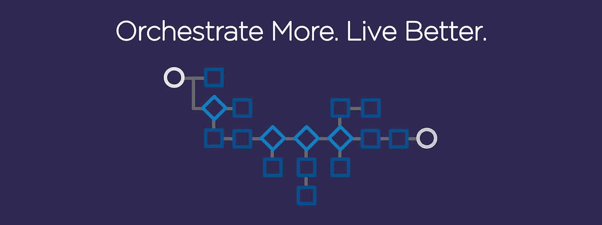

# 创建自定义 Concord 插件

> 原文：<https://medium.com/walmartglobaltech/creating-custom-concord-plugins-deca31142296?source=collection_archive---------5----------------------->

source: [concord.walmartlabs.com](https://concord.walmartlabs.com/)

> Concord 是一个工作流服务器。编排引擎使用用户创建的场景和插件将不同的系统连接在一起。关于该工具的更多细节可以在 [*这里找到*](https://concord.walmartlabs.com/overview/index.html) *。*

# **创建自定义协调任务**

任务或插件是可执行的 Java 代码，从 Concord 工作流中调用这些代码来执行操作。这些动作通常更…