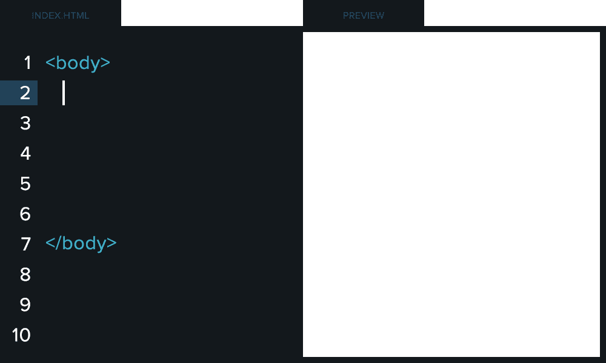
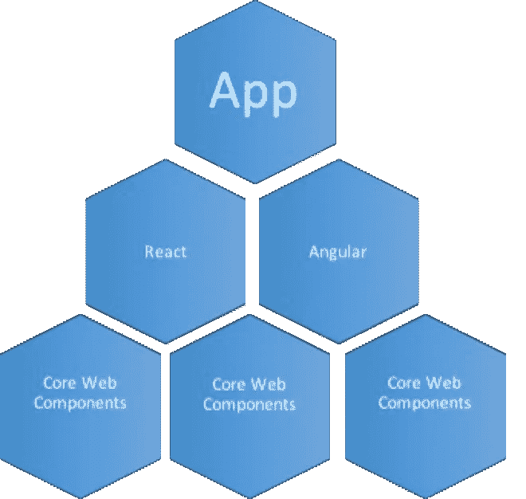

# 为企业创建自定义 HTML 元素

> 原文：<https://medium.com/capital-one-tech/creating-custom-html-elements-for-enterprise-5fd17bb6a355?source=collection_archive---------4----------------------->

## 教程



大多数大型技术驱动型公司不断努力在其数字资产中建立和实施统一的外观和感觉。在我 25 年的开发生涯中，我帮助实现这个目标的一个方法是创建通用的 web 组件，供所有业务部门使用。这有助于我们以多种方式节省时间和资源:

*   面向所有开发人员的通用术语和流程，减少了新员工的培训和知识传授量。
*   由于组件的重用，减少了编码，相应地缩短了上市时间。
*   更少的错误。

由于可用于开发的框架越来越多，实现通用 web 组件这一看似简单的任务变得越来越困难。

# 那么，为什么要采用这种方法呢？

如果不采用这种方法，企业中的每个团队都必须创建自己的基本 web 组件。即使是最简单的改变，这也会引起问题。例如，如果一个设计团队决定将一个简单的动作链接改为一个动作按钮，该怎么办？即使对于一个小团队来说，这也意味着四五个不同的团队必须为他们的应用程序修改代码。至少，这意味着四五个开发人员必须在这上面工作。在企业层面，这种情况会迅速增加。

通过使用公共组件，这个动作按钮将由一个开发人员来操作，该开发人员将在所有团队中共享他们的工作。在一个大型企业的所有数字资产中使用这种场景，可以节省大量的时间和资源。

对开发者来说幸运的是，我们可以使用新的 web 标准— [Web 组件。](https://www.webcomponents.org/)由四个规范组成——定制元素、HTML 导入、模板和影子 DOM——这些规范可用于创建普通的 JavaScript 定制元素，交付给 web 应用程序开发人员。

这是什么意思？这意味着您不再需要为每个用于开发的框架编写特定的元素。这允许团队专注于核心组件和围绕它们的单元测试。



对利用这些规范创建自己的普通 JavaScript 定制元素感兴趣吗？让我们看看如何使用这种技术创建一个简单的滑块。

# 自定义滑块操作指南

首先我们创建一个 JavaScript 对象，它的原型是 HTMLElement。这使我们能够访问 html 元素的所有属性和方法:

```
export class CaponeSlider extends HTMLElement {
  connectedCallback () {
    this.innerHTML = 'Capital One Slider';
  }
}
```

我们创造了一个叫做 CaponeSlider 的物体。这将是我们的应用程序自定义滑块。要使用这个元素，我们首先必须告诉浏览器我们有一个自定义元素要注册。

```
customElements.define('capone-slider', CaponeSlider);
```

现在您有了一个元素，它将在页面上显示文本“Capital One Slider”。我们将构建 innerHTML 来显示自定义滑块。我们还将在 HTML 中包含样式，使其符合我们的视觉标准。定制元素的一个大问题是它们的名称中必须有一个破折号。如您所见，我们将该元素注册为 capone-slider。在您的页面中，我们现在可以这样使用它:

```
<body>
 <capone-slider></capone-slider>
</body>
```

向该对象添加更多的 JavaScript，以向元素添加更多的功能。元素和父 DOM 之间的契约应该遵循绑定事件模型。这样，绑定到我们的对象的每个属性都会被监视是否有变化，并且当我们的对象中的状态发生变化时会触发事件。

在 JavaScript 中，DOM 属性和 HTML 属性是不同的。在底层，浏览器有助于保持元素的属性和特性同步(例如 id 属性)。在您的自定义元素上，您也必须这样做。

幸运的是，这并不难。在我们的滑块上，让我们添加一个标签属性。

```
export class CaponeSlider extends HTMLElement {
  get label (){
    return this.getAttribute('label');
  }
  set label(_label){
    if(_label){
      this.setAttribute('label', _label);
    } else {
      this.removeAttribute('label');
    }
  }
  connectedCallback () {
    this.innerHTML = `Capital One Slider with ${this.label}`;
  }
}
```

在这里，您可以看到我们已经向对象添加了属性标签，并将其分配给元素的属性。

# 结论

使用基本 JavaScript 创建定制元素的能力保持了 web 属性在品牌上的一致性，并允许团队灵活地为他们的项目选择最佳框架。这样，核心团队就不必为每个开发团队选择一个单一的框架。他们也不必为正在使用的每个特定框架复制元素。这使得大型企业更加灵活，并通过显著减少时间和资源来节省资金。

要了解更多关于 Capital One 的 API、开源、社区活动和开发人员文化的信息，请访问我们的一站式开发人员门户网站 DevExchange。[](https://developer.capitalone.com/)