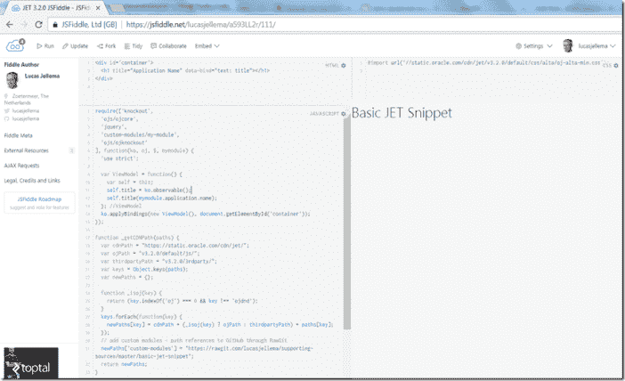

# 为 Oracle JET 片段创建 jsdild

> 原文：<https://medium.com/oracledevs/creating-jsfiddle-for-oracle-jet-snippets-f76c30932e1e?source=collection_archive---------1----------------------->

我在本文中的目标是:描述我(以及您)如何使用 JSFiddle 创建运行的、共享的 Oracle JET 代码示例。这对于 JET 论坛或 StackOverflow 上的问题很有用，也可以作为博客帖子或其他出版物的演示/插图。JSFiddle 是一个类似 IDE 的网站，允许我们创建由 CSS、HTML 和 JavaScript 资源组成的迷你应用程序，并在浏览器中运行这些客户端应用程序。我们可以编辑代码并重新运行。我们可以很容易地在文章中嵌入 JSFiddle 组件，并且我们可以简单地通过共享 URL 来共享 JSFiddle 条目。

为了创建 Oracle JET fiddles，我们需要一个负责所有搭建工作的模板——我们一直需要的基本依赖项(CSS 和 JavaScript)。理想情况下，通过使用模板，我们可以专注于特定于我们想要创建的样本的代码。

我最初使用的 JSFiddle 来自 John Brock……ehm，Peppertech:[https://jsfiddle.net/peppertech/a593LL2r/](https://jsfiddle.net/peppertech/a593LL2r/)

作为外部资源，提琴加载 require js:[https://cdnjs . cloud flare . com/Ajax/libs/require . js/2 . 3 . 2/require . min . js](https://cdnjs.cloudflare.com/ajax/libs/require.js/2.3.2/require.min.js)

所有其他必需的 JavaScript 模块都由 requireJS 加载—如 requirejs.config 中 paths 属性的配置中所指示的。这些模块包括 Oracle JET(核心、翻译、拖放)、jQuery、Hammer、Knockout 和 ES6 Promise。

我们希望在小提琴中演示的特定 JET 片段的定制 JavaScript 进入小提琴开始时传递给 require 的 main 函数——以及 main 函数所需的模块列表。该函数定义了视图模型，并通过挖空应用数据绑定，将视图模型链接到 HTML 元素。

如果我们在单独的 JavaScript 文件中有额外的自定义 JavaScript，我们可以将它们作为添加到小提琴中的外部依赖项来访问。注意，JSFiddle 将只访问来自内容交付网络的资源；我们可以利用一个技巧来添加我们自己的定制 JavaScript 资源:

*   将文件存储在 GitHub 上
*   为每个文件创建一个 CDN 风格的 URL，例如使用 RawGit(一个通过 [MaxCDN](http://www.maxcdn.com/) 提供 GitHub 项目文件的站点)
*   将 URL 作为外部资源添加到小提琴中

以这种方式添加的任何文件都是在执行 Fiddle 时由 JSFiddle 加载的。

在我的例子中，我想通过 require.js 加载一个定制模块。在这种情况下，我不必将包含模块定义的文件作为外部资源添加到 JSFiddle 中。我可以让 require.js 直接从 CDN URL 加载资源(注意:从原始 GitHub URL 加载文件不起作用:“拒绝执行来自'[https://raw . githubusercontent . com/lucasjellema/supporting-sources/master/basic-jet-snippet/my-module . js '](https://raw.githubusercontent.com/lucasjellema/supporting-sources/master/basic-jet-snippet/my-module.js%27)的脚本，因为其 MIME 类型(' text/plain ')不可执行，并且启用了严格的 MIME 类型检查。”。

我的自定义模块在 GitHub 上:

我将 URL 复制到剪贴板。然后在 https://rawgit.com/的[上粘贴我的](https://rawgit.com/)网址:

然后，我将 CDN 风格的 URL 复制到剪贴板。在 JSFiddle 中，我可以将这个 URL 路径添加到代码中——在 function _getCDNPath(paths)中。注意:我删除了文件的实际名称，所以路径本身指的是目录。在这个目录中，可能有多个模块。

最后，模块需要通过以下方式进入:

这里我指的是 custom-modules/my-module，它解析为添加到 newPaths 的 CDN Url 所引用的[GitHub]目录中的 my-module.js 文件中定义的模块。

完整的小提琴看起来像这样——几乎没有任何特定的东西，只是一点点绑定到视图模型的数据:

现在，这个小提琴成了我未来摆弄 Oracle JET 3.2 的起点。如下图所示。

# 从模板创建新提琴

要创建任何 Oracle JET fiddle，我现在可以(你也可以这样做)转到我的模板 fiddle(【https://jsfiddle.net/lucasjellema/h7n41tkp/】)并点击 Fork。

一个新的小提琴被创建为模板的克隆。我应该更新小提琴的元数据(以免自己被弄糊涂)，然后可以创建我想要的例子。这里我展示了一个非常基本的弹出示例:

最终的小提琴:[https://jsfiddle.net/lucasjellema/5abpdgt9/](https://jsfiddle.net/lucasjellema/5abpdgt9/)—创建为模板小提琴的克隆，扩展了几行代码以创建预期的效果。

这两把小提琴出现在我的公共 JSFiddle 仪表板上([https://jsfiddle.net/user/lucasjellema/fiddles/](https://jsfiddle.net/user/lucasjellema/fiddles/)):

小提琴可以嵌入文章和其他出版物中。打开顶部菜单中的嵌入选项，复制嵌入代码或链接:

然后在您想要嵌入小提琴的任何东西的源代码中使用该代码。

# 更精细的 js fiddle——嵌套的数据网格

另一个有趣的基于 Oracle JET 的 JSFiddle 的例子是这个嵌套的数据网格:[https://jsfiddle.net/lucasjellema/L335cfwd/](https://jsfiddle.net/lucasjellema/L335cfwd/)。注意:我还没有将本地图像引用替换为内容交付网络或其他公共位置 URL。

注意:有些小提琴只能在谷歌 Chrome 浏览器上运行(至少对我来说)——不能在 Firefox 上运行。

# 资源

吉姆·马里恩的博客文章[http://js Jim . blogspot . nl/2016/03/paddling-around-with-Oracle-jet . html](http://jsjim.blogspot.nl/2016/03/fiddling-around-with-oracle-jet.html)

https://rawgit.com/

GitHub 中的源:[https://github.com/lucasjellema/supporting-sources/](https://github.com/lucasjellema/supporting-sources/)

PepperTech 的起点小提琴:[https://jsfiddle.net/peppertech/a593LL2r/](https://jsfiddle.net/peppertech/a593LL2r/)

最终的结果是摆弄 JET 工具提示的例子:[https://jsfiddle.net/lucasjellema/5abpdgt9/](https://jsfiddle.net/lucasjellema/5abpdgt9/)

我的公共 JSFiddle 仪表盘([https://jsfiddle.net/user/lucasjellema/fiddles/](https://jsfiddle.net/user/lucasjellema/fiddles/)):

[JET](https://technology.amis.nl/tag/jet/)[JSFiddle](https://technology.amis.nl/tag/jsfiddle/)[Oracle JET](https://technology.amis.nl/tag/oracle-jet/)[run](https://technology.amis.nl/tag/run/)[sample](https://technology.amis.nl/tag/sample/)[share](https://technology.amis.nl/tag/share/)[snippet](https://technology.amis.nl/tag/snippet/)

*原载于 2017 年 8 月 29 日*[*technology . amis . nl*](https://technology.amis.nl/2017/08/29/creating-jsfiddle-for-oracle-jet-snippet-using-additional-modules/)*。*