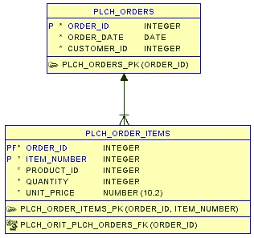

# 在单个事务中创建多个表

> 原文：<https://medium.com/oracledevs/creating-multiple-tables-in-a-single-transaction-f1d665d81f78?source=collection_archive---------1----------------------->

以下测验摘自[甲骨文开发人员培训](https://devgym.oracle.com/)。你能猜出哪些选择是正确的吗？

# 这个问题

您的老板要求您为该架构图中显示的表创建一个发布脚本:



您应该在 PLCH 应用程序所有者用户中创建这些表。

以下哪个选项将创建如上所示的表格？

对于这个问题，您可以假设您以 PLCH 应用程序所有者用户的身份连接到数据库。

# 选择

**选择 1**

```
create table plch_app_owner.plch_orders (
    order_id    integer not null ,
    order_date  date not null ,
    customer_id integer not null
) ;

alter table plch_app_owner.plch_orders add constraint 
  plch_orders_pk primary key ( order_id ) ;

create table plch_app_owner.plch_order_items (
    order_id    integer not null ,
    item_number integer not null ,
    product_id  integer not null ,
    quantity    integer not null ,
    unit_price  number (10,2) not null
) ;

alter table plch_app_owner.plch_order_items add constraint 
  plch_order_items_pk primary key ( order_id, item_number ) ;

alter table plch_app_owner.plch_order_items add constraint 
  plch_orit_plch_orders_fk foreign key ( order_id ) 
  references plch_orders ( order_id ) ;
```

**选择二**

```
create schema authorization plch_app_owner
  create table plch_orders (
    order_id    integer not null ,
    order_date  date not null ,
    customer_id integer not null,
    constraint plch_orders_pk primary key ( order_id ) 
) 
  create table plch_order_items (
    order_id    integer not null ,
    item_number integer not null ,
    product_id  integer not null ,
    quantity    integer not null ,
    unit_price  number (10,2) not null,
    constraint plch_order_items_pk 
      primary key ( order_id, item_number ) ,
    constraint plch_orit_plch_orders_fk 
      foreign key ( order_id ) 
      references plch_orders ( order_id ) 
) ;
```

**选择 3**

```
create schema 
  create table plch_app_owner.plch_orders (
    order_id    integer not null ,
    order_date  date not null ,
    customer_id integer not null,
    constraint plch_orders_pk primary key ( order_id ) 
) 
  create table plch_app_owner.plch_order_items (
    order_id    integer not null ,
    item_number integer not null ,
    product_id  integer not null ,
    quantity    integer not null ,
    unit_price  number (10,2) not null,
    constraint plch_order_items_pk 
      primary key ( order_id, item_number ) ,
    constraint plch_orit_plch_orders_fk 
      foreign key ( order_id ) 
      references plch_orders ( order_id ) 
) ;
```

**选择 4**

```
create schema authorization plch_app_owner
  create table plch_orders (
    order_id    integer not null ,
    order_date  date not null ,
    customer_id integer not null,
    constraint plch_orders_pk primary key ( order_id ) 
) ;

create schema authorization plch_app_owner
  create table plch_order_items (
    order_id    integer not null ,
    item_number integer not null ,
    product_id  integer not null ,
    quantity    integer not null ,
    unit_price  number (10,2) not null,
    constraint plch_order_items_pk 
      primary key ( order_id, item_number ) ,
    constraint plch_orit_plch_orders_fk 
      foreign key ( order_id ) 
      references plch_orders ( order_id ) 
) ;
```

**选择 5**

```
create schema authorization plch_app_owner
  create table plch_orders (
      order_id    integer not null ,
      order_date  date not null ,
      customer_id integer not null
) 
  alter table plch_orders add constraint 
    plch_orders_pk primary key ( order_id ) 
  create table plch_order_items (
      order_id    integer not null ,
      item_number integer not null ,
      product_id  integer not null ,
      quantity    integer not null ,
      unit_price  number (10,2) not null
) 
  alter table plch_order_items add constraint 
    plch_order_items_pk primary key ( order_id, item_number ) 
  alter table plch_order_items add constraint 
    plch_orit_plch_orders_fk foreign key ( order_id ) 
    references plch_orders ( order_id ) ;
```

Oracle 在每个 DDL 语句之前和之后都会发出一个隐式 commit。因此，您不能通过发出 rollback 命令来撤销 DDL。如果您在一个流程中有多个 DDL 命令(例如发布脚本),并且其中一个命令失败，那么您必须显式撤消已完成的步骤，以回滚整个流程。

使用“CREATE SCHEMA”命令，您可以将多个 DDL 步骤合并到一条语句中。因此，单个部件的故障会导致“创建模式”中的所有命令回滚。

CREATE SCHEMA 仅限于创建表、视图和发出授权。如果您希望更改表，“创建或替换”视图或创建其他对象(如索引)，这些必须作为单独的语句发出。如果要在“create schema”中对表创建约束，必须使用内联约束。

Oracle 将在 create schema 命令中自动解析外键相关性。这意味着表在命令中出现的顺序无关紧要。如果模式创建的最终结果是一致的，那么所有的表都将被创建。例如，选项 2 可以重写为:

```
create schema authorization plch_app_owner
  create table plch_order_items (
    order_id    integer not null ,
    item_number integer not null ,
    product_id  integer not null ,
    quantity    integer not null ,
    unit_price  number (10,2),
    constraint plch_order_items_pk 
      primary key ( order_id, item_number ) ,
    constraint plch_orit_plch_orders_fk 
      foreign key ( order_id ) 
      references plch_orders ( order_id ) 
) 
  create table plch_orders (
    order_id    integer not null ,
    order_date  date not null ,
    customer_id integer not null,
    constraint plch_orders_pk primary key ( order_id ) 
) ;
```

该命令创建表，尽管子表(PLCH _ 订单 _ 项目)首先列出。最后，您必须连接到 AUTHORIZATION 子句中列出的用户，CREATE SCHEMA 才能工作。这不会创建数据库用户—这必须已经存在。

不确定哪些选择是正确的？您可以在[甲骨文开发团队](https://devgym.oracle.com/)网站上找到答案。

你进展如何？

你喜欢这样的测验吗？

如果是这样的话，那就去参加 [Oracle Dev Gym](https://devgym.oracle.com/) 吧，参加关于 SQL、PL/SQL 和数据库设计的测验。每周都有新的测验供你测试技能和学习！

*原载于 2015 年 12 月 17 日*[*blogs.oracle.com*](https://blogs.oracle.com/sql/creating-multiple-tables-in-a-single-transaction)*。*