# 从 Mendix 应用程序创建 Outlook 会议

> 原文：<https://medium.com/mendix/creating-outlook-meetings-from-your-mendix-app-c6e3c441ec0?source=collection_archive---------2----------------------->

Creating Outlook Meetings from your Mendix app

# 2022 年组织自动化

会议邀请——每个现代工作者每天都在使用或发送的东西。但是您知道吗，您可以使用与 Microsoft 365 的集成来创建日历邀请？在这篇博客中，我将介绍如何从你的 Mendix 应用程序创建和发送日历邀请，并解释其工作原理。因此，请继续阅读，在新的一年里让你的会议邀请变得有条理和自动化。

# **在你的 Mendix 应用中创建会议的步骤:**

## **第一步:**

我们需要一个帐户来访问 Azure Active Directory。在 Microsoft 365 开发人员计划成员的帮助下，创建拥有完全管理权限的开发人员帐户。

点击[此处](https://developer.microsoft.com/en-us/microsoft-365/dev-program)设置新的 Microsoft 365 E5 订阅。

**注意:您的 Microsoft 365 帐户有效期仅为 90 天。**

## **第二步:**

创建帐户后，使用此[链接](https://www.office.com/?auth=2)检查您选择的 Microsoft 应用程序是否已创建。

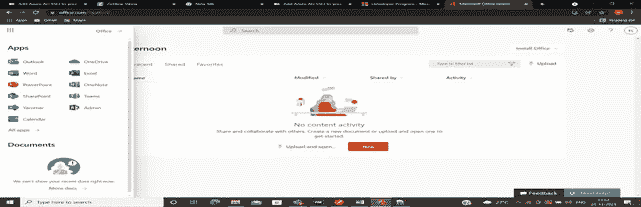

## **第三步:**

如果您想检查您的帐户是否有效，请使用此[链接](https://admin.microsoft.com/Adminportal/Home?source=applauncher#/users)来检查您的帐户状态。

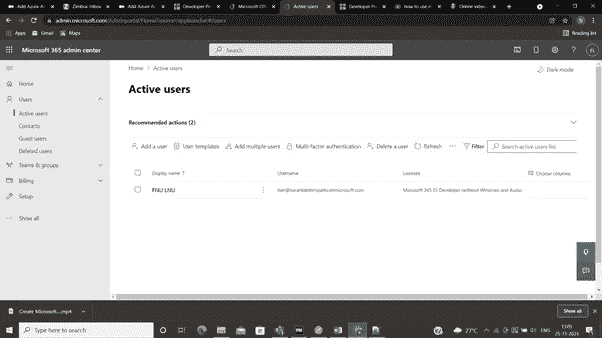

## **什么是 Azure？**

> **它是一个云计算平台和在线门户，用于访问和管理微软资源和服务**提供的资源和服务
> 
> **什么是客户端 ID？**
> 
> 这是你的 Azure 应用的标识符。当序列被设置为目录中的应用程序时，将分配该标识符
> 
> 什么是客户端密钥？
> 
> 这是你的 Azure 应用标识符之一。你的应用在与 AAD(Azure Active Directory)通信时将使用的密钥序列。它根据你的应用程序的月数到期。
> 
> **什么是租户 Id？**
> 
> 它是由 GUID(全局唯一标识符)标识的租户，例如:在 Azure AD 中注册的使用图形 API 访问租户数据的应用程序必须在请求访问令牌时传递**租户标识符**以及**应用程序标识符**和**应用程序机密**，这就是为什么它是唯一标识符。

**要在 Azure Active Directory 中创建应用，请继续执行以下步骤:**

## **第四步:**

使用开发者帐户登录[https://portal.azure.com/](https://portal.azure.com/)并打开 Azure 的 Active Directory 概述。

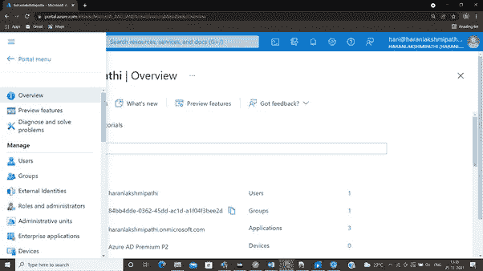

## **第五步:**

点击左侧导航栏中的**企业应用**。

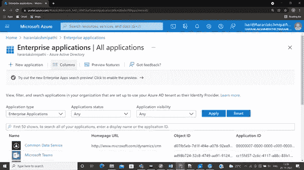

## **第六步:**

单击屏幕顶部的**新**应用程序按钮，并从那里列出的应用程序类型中选择非挑战性应用程序。

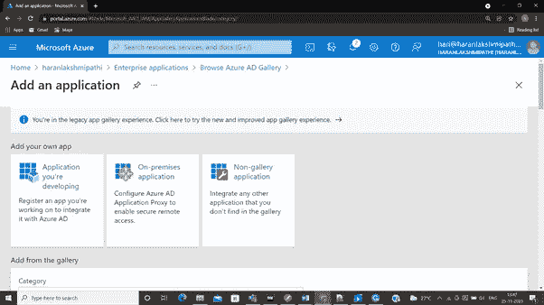

## **第七步:**

输入应用程序的名称，然后单击添加。

## **第八步**:

从**单点登录方式中选择 **SAML** 。**

你的 app 有 ClientID 和 Tenant Id 如果你想查，什么是 client ID 和 Tenant ID(请参考**上面 AAD 的解释)**

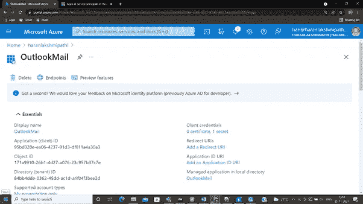

## 第九步:

点击**客户端凭证**生成**客户端机密。**

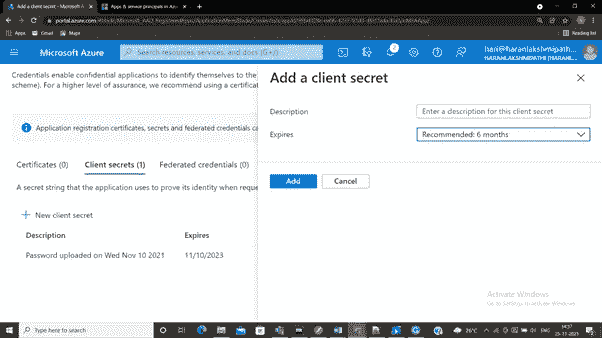

## **第十步**:

设置客户端秘密 ID 和**的**到期日期，点击**添加，您将获得**客户端秘密 ID** 和值**

> 注意:如果你要使用客户端秘密 ID，我们需要使用值

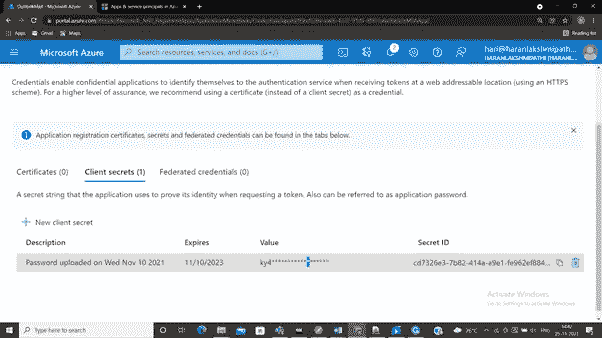

## **第十一步**:

**点击 API 权限**，进入**邮件、日历、团队**等 app

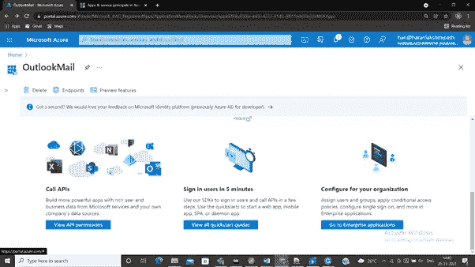

## **第十二步:**

**点击【添加权限】按钮**授予您在 **API 权限**中创建 app 的权限

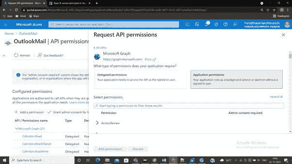

## **权限:**

权限类型:

*   **委托权限:**

授权权限由有**登录用户在场的应用程序使用。**

*   **申请权限:**

应用程序权限由**在登录用户不在场的情况下运行的应用程序使用。**

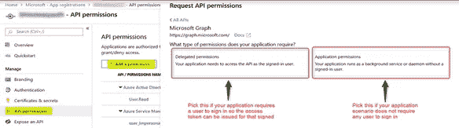

## **如何在 Mendix 中实现？**

为什么我们需要生成访问令牌？

我们使用第三方 URL 或服务来实现我们的应用程序，我们需要在这里使用客户端 ID 和租户 ID **来生成访问令牌。**

# **如何使用 Mendix 生成访问令牌？**

**HTTP 方法:**

邮政

**地点:**[**https://log in . Microsoft online . com/{ tenant _ ID }/oauth 2/v 2.0/token**](https://login.microsoftonline.com/%7btenant_ID%7d/oauth2/v2.0/token)**？**

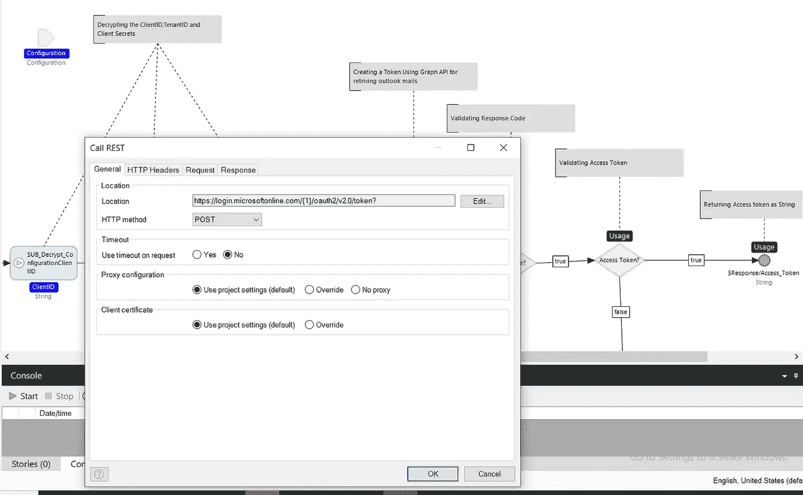

**标题:**

**内容-类型:** **应用/x-www-form-urlencoded**

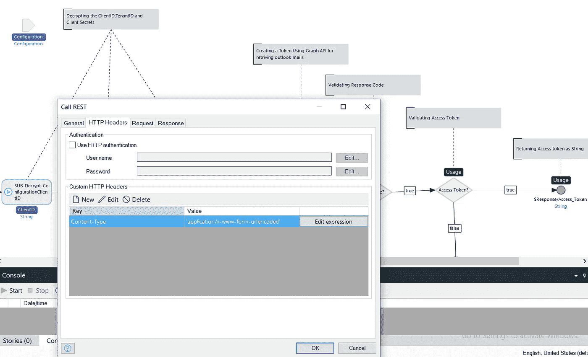

**申请模板:**

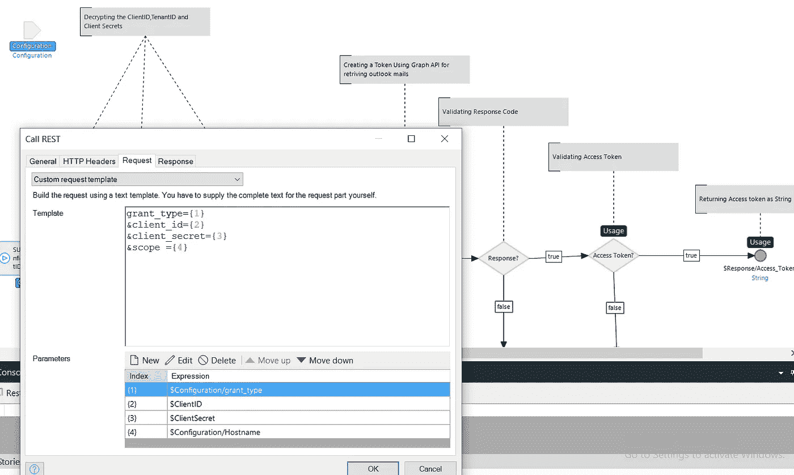

# **使用您的 Mendix 应用程序在微软创建会议**

**HTTP 方式:**

邮政

**位置:**

**https://graph.microsoft.com/v1.0/users/{EmailID}/events?首选**

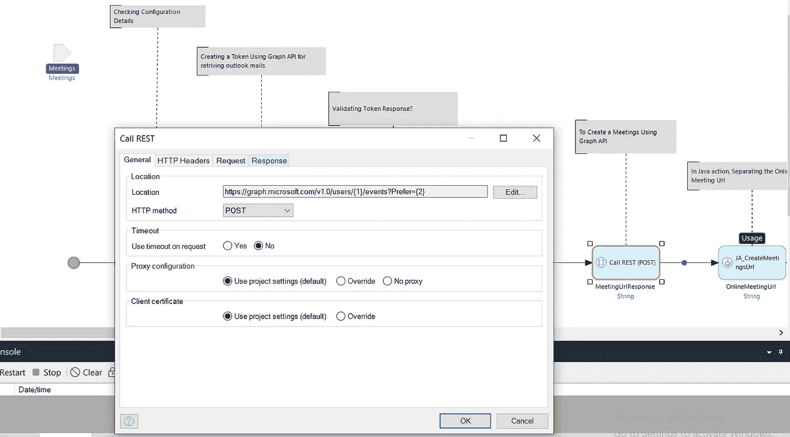

**表头:**

授权:“持有者”+#访问令牌#

内容类型:“application/json”

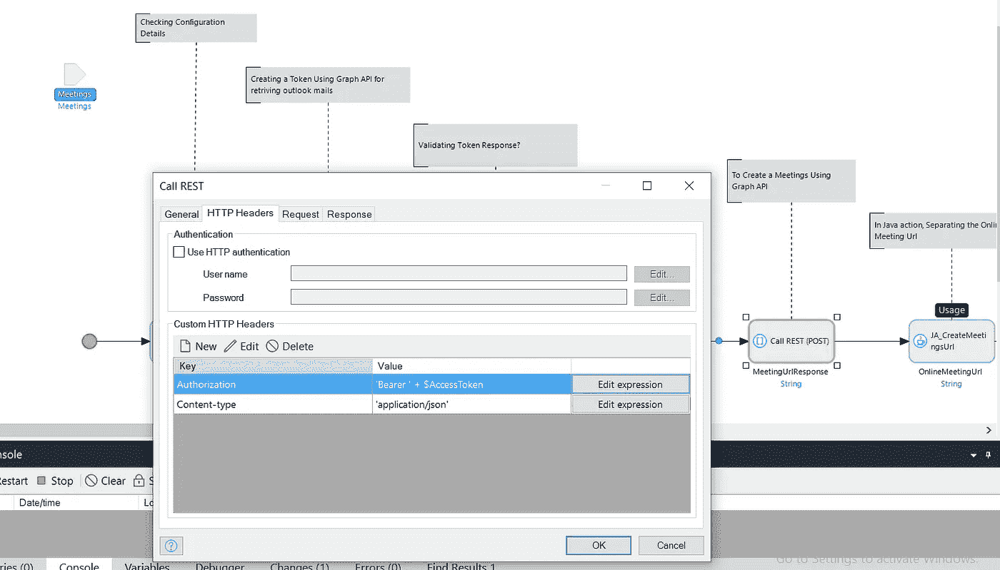

您已经将整个请求作为输入发送，使用导出映射来发送请求。

一旦您执行了微流程，您将能够在您的日历中看到邀请链接，在 Mendix 应用程序中，通过使用日历小部件。

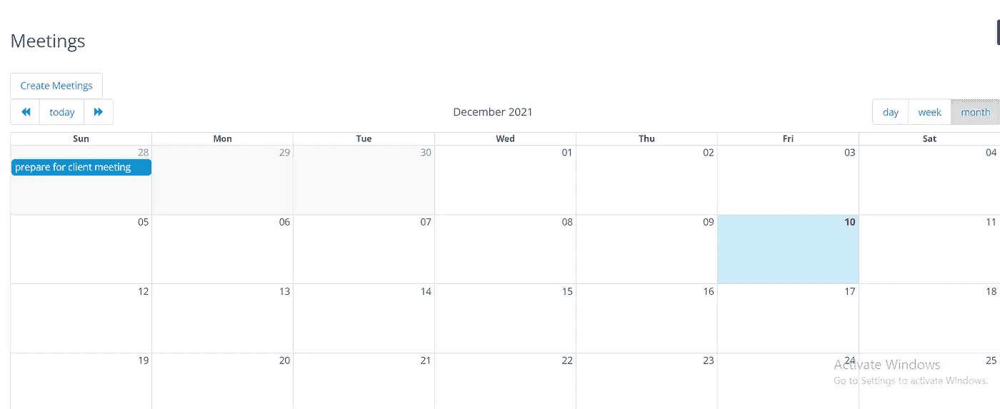

# **如何从 Outlook 接收电子邮件？**

**HTTP 方式:**

**GET**

**位置:**[**https://graph . Microsoft . com/v 1.0/user/{ EmailID }/mail folders/Inbox/Messages**](https://graph.microsoft.com/v1.0/users/%7bEmailID%7d/mailFolders/Inbox/Messages)

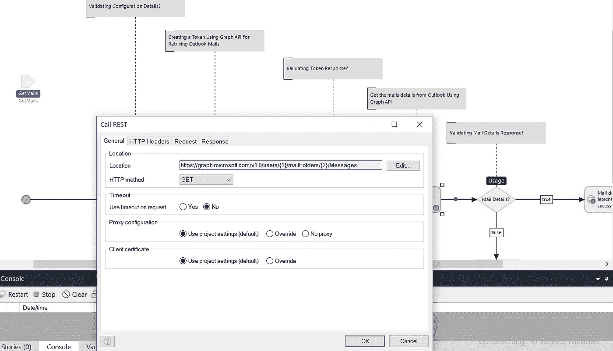

**表头:**

授权:承载#token#(我们在生成访问令牌的过程中获得了访问令牌)

内容类型:应用程序/json

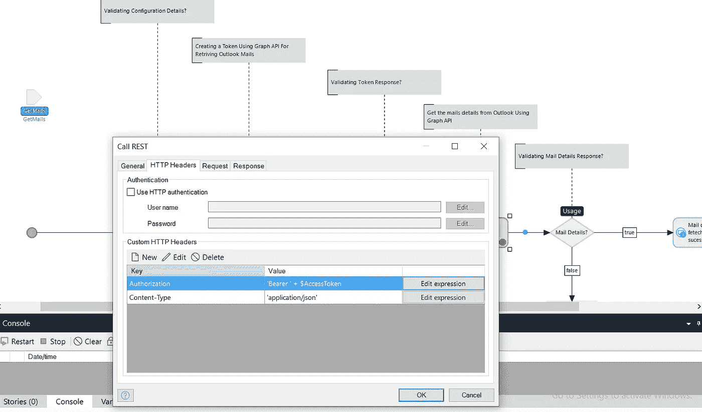

> **注意:如果您想检索任何特定的文件夹，请确保在您的休息调用**中配置了相同的文件夹名称
> 
> **例如:如果您需要从草稿中检索邮件，请在您的休息呼叫服务中提供草稿。**

我希望本教程能够介绍如何使用 Azure Active Directory 和 Mendix 创建会议。请记住在您的 Mendix 应用程序中显示会议，您可以使用可在市场上下载的日历小部件

([https://docs . mendix . com/app store/widgets/calendar # 2-basic-configuration](https://docs.mendix.com/appstore/widgets/calendar#2-basic-configuration))。

下一篇文章再见！如果您有任何问题，请发表您的评论:)

> 一定要去市场上看看 [OIDC 模块](https://marketplace.mendix.com/link/component/117529)——它可以让这种集成变得更加容易！

## 阅读更多

 [## Azure Active Directory 文档

### Azure Active Directory (Azure AD)是微软的多租户、基于云的目录和身份管理服务……

docs.microsoft.com](https://docs.microsoft.com/en-us/azure/active-directory/)  [## 日历-市场指南| Mendix 文档

### 日历小部件可用于显示和管理日历事件。添加和编辑日历事件拖放…

docs.mendix.com](https://docs.mendix.com/appstore/widgets/calendar)  [## Outlook 日历 API 概述- Microsoft Graph

### Outlook 日历是 Microsoft 365 中 Outlook 消息传递中枢的一部分，它还允许您管理电子邮件和联系人……

docs.microsoft.com](https://docs.microsoft.com/en-us/graph/outlook-calendar-concept-overview) 

*来自出版者-*

如果你喜欢这篇文章，你可以在我们的 [*中页*](https://medium.com/mendix) *找到更多喜欢的。对于精彩的视频和直播会话，您可以前往*[*MxLive*](https://www.mendix.com/live/)*或我们的社区*[*Youtube PAG*](https://www.youtube.com/c/MendixCommunity/community)*e .*

*希望入门的创客，可以注册一个* [*免费账号*](https://signup.mendix.com/link/signup/?source=direct) *，通过我们的* [*学苑*](https://academy.mendix.com/link/home) *即时获取学习。*

有兴趣更多地参与我们的社区吗？你可以加入我们的 [*Slack 社区频道*](https://join.slack.com/t/mendixcommunity/shared_invite/zt-hwhwkcxu-~59ywyjqHlUHXmrw5heqpQ) *或者想更多参与的人，看看加入我们的*[*Meet ups*](https://developers.mendix.com/meetups/#meetupsNearYou)*。*