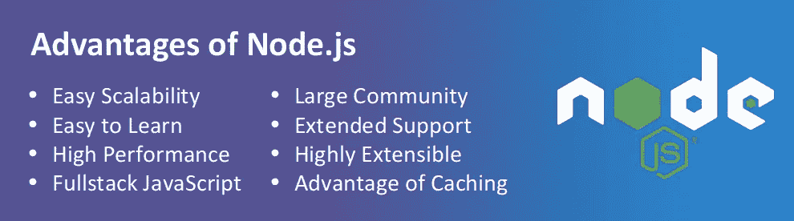
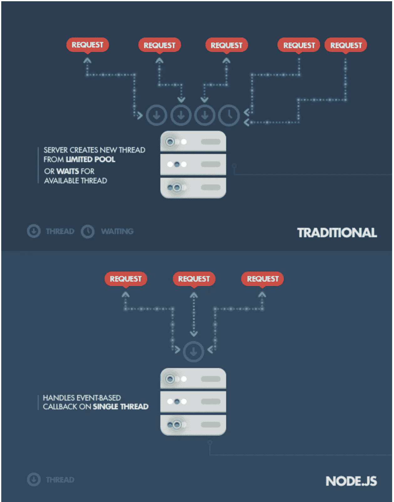
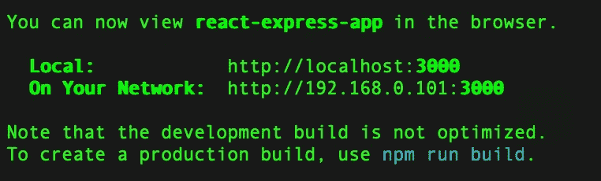
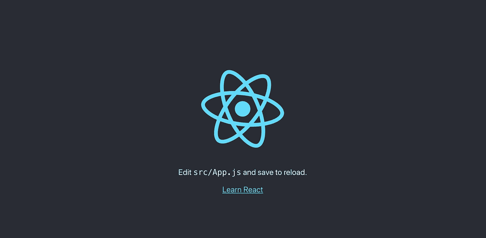
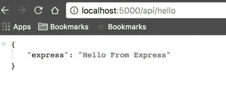
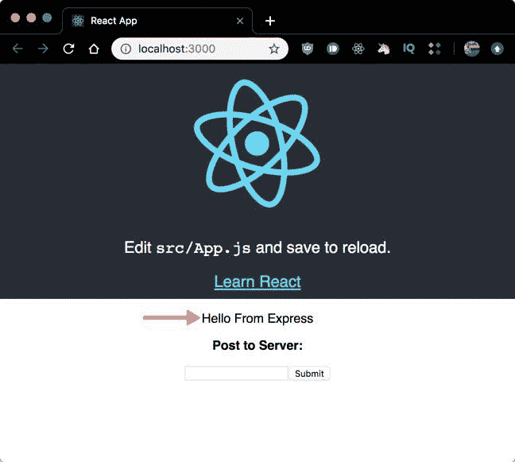
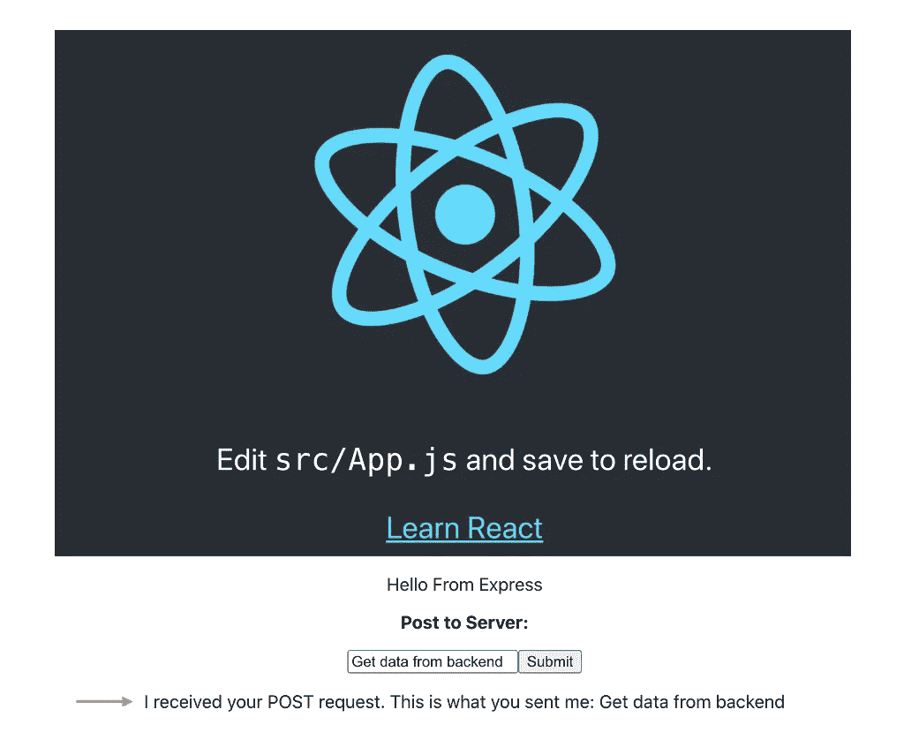

# 创建 React Redux Express 全栈应用程序第一部分

> 原文：<https://medium.com/walmartglobaltech/creating-react-redux-express-full-stack-application-part-i-82959d847802?source=collection_archive---------0----------------------->


[Image Source](https://daveceddia.com/images/8bNlffXEcC0.jpg)

# 介绍

在这篇文章中，我们将学习如何使用 React 作为前端和 Express 作为后端来创建一个全栈应用程序。我们将使用**代理**将 API 调用从 React 层转发到 Express 层。

给大家简单介绍一下，React Js 是目前最流行、应用最广泛的前端 Javascript 库之一(不是框架) **React JS。它是由脸书开发的，其基于组件的库可以让你为网络应用程序构建高质量的用户界面。**

Node.js 在实时 web 应用开发中大放异彩。它为开发人员提供了用 JavaScript 编写服务器端应用程序的奢侈。



Advantages of Node.js ([Image Source](https://www.mindinventory.com/blog/pros-and-cons-of-node-js-web-app-development/))

> Node.js 的主要思想是使用非阻塞、事件驱动的 I/O，在面对跨分布式设备运行的数据密集型实时应用时，保持轻量和高效。它在单线程上运行，允许它支持数万个并发连接(保存在[事件循环](https://developer.mozilla.org/en-US/docs/Web/JavaScript/Guide/EventLoop)中)。



Working of Node JS based application([Image source](https://www.yourteaminindia.com/blog/node-js-advantages-how-custom-nodejs-web-application-can-benefit/))

# 先决条件

1.  [HTML、](https://learn.shayhowe.com/html-css/)CSS、 [ES6 语法&功能](https://www.taniarascia.com/es6-syntax-and-feature-overview/)和 [JavaScript](https://javascript.info/) 编程的基础知识
2.  对 [DOM](https://www.javascripttutorial.net/javascript-dom/) 的基本了解
3.  [Node.js 和 npm 全球安装](https://www.taniarascia.com/how-to-install-and-use-node-js-and-npm-mac-and-windows/)

安装节点后，我们将按照以下步骤创建应用程序。

# 创建 React 前端应用程序

使用`create-react-app`创建一个项目

> `*npx create-react-app react-express-app*`

在 *react-express-app* 目录下创建一个`/client`目录，并将`create-react-app`创建的所有 react 样板代码移动到这个新的客户端目录下。

> 要启动新创建的 react 应用程序，请转到客户端文件夹并运行命令
> 
> `*npm start*`

您可以看到应用程序在 [http://localhost:3000/](http://localhost:3000/) 上运行



Application running on [http://localhost:3000/](http://localhost:3000/)

# 正在创建 Node.js Express 后端服务器

在根目录(`react-express-app`)下创建一个`package.json`文件，复制以下内容:

```
{
  "name": "react-express-app",
  "version": "1.0.0",
  "scripts": {
    "client": "npm start --prefix client",
    "server": "node server.js",
    "start": "concurrently \"npm run server\" \"npm run client\""
  },
  "dependencies": {
    "body-parser": "^1.19.0", 
    "cors" : "^2.8.5",
    "express": "^4.17.1"
  },
  "devDependencies": {
    "concurrently": "^5.3.0"
  }
}
```

注意，我使用`concurrently` 来同时运行 React 应用程序和服务器。

创建一个`server.js`文件，复制以下内容:

```
const express = require('express');
const bodyParser = require('body-parser');const app = express();
const port = process.env.PORT || 5000;app.use(bodyParser.json());app.get('/api/hello', (req, res) => {
  res.send({ express: 'Hello From Express' });
});app.post('/api/data', (req, res) => {
  console.log(req.body);
  res.send(
    `I received your POST request. This is what you sent me: ${req.body.post}`,
  );
});app.listen(port, () => console.log(`Listening on port ${port}`));
```

这是一个简单的 Express 服务器，将运行在端口 5000 上，有两个 API 路由:`GET` - `/api/hello`和`POST` - `/api/data`。

此时，您可以使用以下命令运行 Express 服务器(仍然在根目录(`react-express-app`):

```
1\. npm install
2\. node server.js
```

> **npm 安装**(安装 package.json 中给定的所有依赖项)和 **node server.js** 来启动 Node express 服务器。

现在导航到`[http://localhost:5000/api/hello](http://localhost:5000/api/hello)`，您将看到以下内容:



# 配置代理

代理使 react 客户端能够与 Express 后端对话。

现在导航到目录`client`下的 React app，并将下面一行添加到由`create-react-app`创建的`package.json`文件中。

```
"scripts": {
  "start": "react-scripts start",
  "build": "react-scripts build",
  "test": "react-scripts test",
  "eject": "react-scripts eject"
  },
**"proxy": "**[**http://localhost:5000/**](http://localhost:5000/)**"**
```

对于用`create-react-app`创建的项目，使用 Express 后端服务器的关键是使用代理。这告诉 Web-pack 开发服务器将我们的 API 请求代理到我们的 API 服务器，假设我们的 Express 服务器运行在`localhost:5000`上。

现在修改`./client/src/App.js`来调用我们的 Express API 后端。

```
import React, { Component } from 'react';import logo from './logo.svg';import './App.css';class App extends Component {
  state = {
    response: '',
    post: '',
    responseToPost: '',
  };

  componentDidMount() {
    this.callApi()
      .then(res => this.setState({ response: res.express }))
      .catch(err => console.log(err));
  }

  callApi = async () => {
    const response = await fetch('/api/hello');
    const body = await response.json();
    if (response.status !== 200) throw Error(body.message);

    return body;
  };

  handleSubmit = async e => {
    e.preventDefault();
    const response = await fetch('/api/data', {
      method: 'POST',
      headers: {
        'Content-Type': 'application/json',
      },
      body: JSON.stringify({ post: this.state.post }),
    });
    const body = await response.text();

    this.setState({ responseToPost: body });
  };

render() {
    return (
      <div className="App">
        <header className="App-header">
          
          <p>
            Edit <code>src/App.js</code> and save to reload.
          </p>
          <a
            className="App-link"
            href="https://reactjs.org"
            target="_blank"
            rel="noopener noreferrer"
          >
            Learn React
          </a>
        </header>
        <p>{this.state.response}</p>
        <form onSubmit={this.handleSubmit}>
          <p>
            <strong>Post to Server:</strong>
          </p>
          <input
            type="text"
            value={this.state.post}
            onChange={e => this.setState({ post: e.target.value })}
          />
          <button type="submit">Submit</button>
        </form>
       <p style={{color : 'blue'}}><b>{this.state.responseToPost}</b></p></div>
    );
  }
}export default App;
```

我们创建`callApi`方法来与我们的`GET` Express API 路由交互，然后我们在`componentDidMount`中调用这个方法，最后将状态设置为 API 响应，这将是来自 Express 的 *Hello。*

注意，我们没有使用完全限定的 URL `[http://localhost:5000/api/hello](http://localhost:5000/api/hello)`来调用我们的 API，尽管我们的 React 应用程序运行在不同的端口(3000)上。这是因为`**proxy**` 行我们早先添加到了`package.json`文件中。

我们有一个只有一个输入的表单。提交时调用`handleSubmit`，它又调用我们的`POST` Express API 路由，然后将响应保存到 state 并向用户显示一条消息:*我收到了您的 POST 请求。这是你发给我的:【来自输入的消息】*。

现在打开`./client/src/App.css`并修改`.App-header`类如下(粗体变化)

```
.App-header {
...
  min-height: 50%;
...
  padding-bottom: 10px;
}
```

# 运行应用程序

*如果服务器仍在运行，请在终端中按 Ctrl+C 停止运行。*

从项目根目录 **(react-express-app)** 运行以下命令:

```
npm start
```

这将启动 React 应用程序并同时运行服务器。

现在导航到`[http://localhost:3000](http://localhost:3000/)`，你将点击 React 应用程序，显示来自我们`GET`快速路线的信息。



Displaying data fetched from GET Route



Response received from POST route using request payload as text input by user

**从** [**GitHub 资源库**](https://github.com/Pushpraj153/react-express-app) 获取完整源代码

# 结论

在这篇文章中，我们学习了如何使用 React Js 作为前端，Express Js 作为后端，使用代理来创建一个全栈应用程序。

# 使用 Redux 将 React 前端连接到 Node Express 后端

> **Redux** 是一个管理和更新应用程序状态的模式和库，使用称为“动作”的事件。它**充当需要在整个应用程序**中使用的状态的集中存储，规则确保状态只能以可预测的方式更新。

将 Redux 与 react-Express 应用程序集成的步骤将在下一篇文章的[中详细解释。](/walmartglobaltech/creating-react-redux-express-full-stack-application-part-ii-931fba94ec9b)

感谢您的阅读。编码快乐！