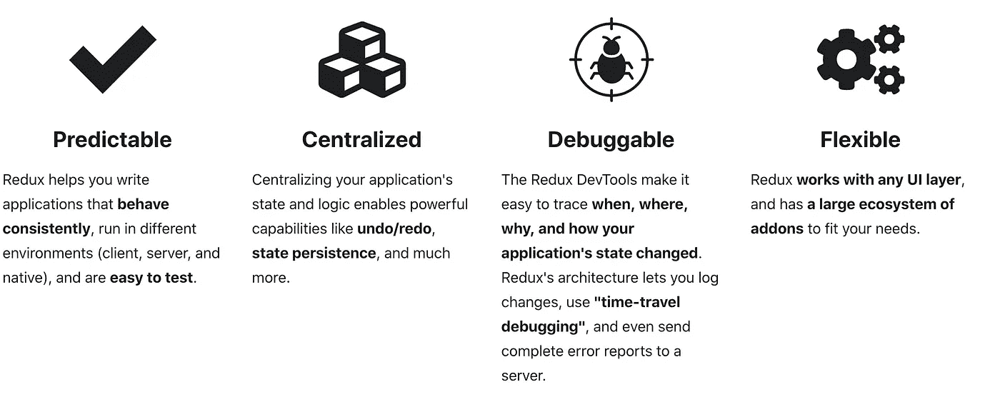
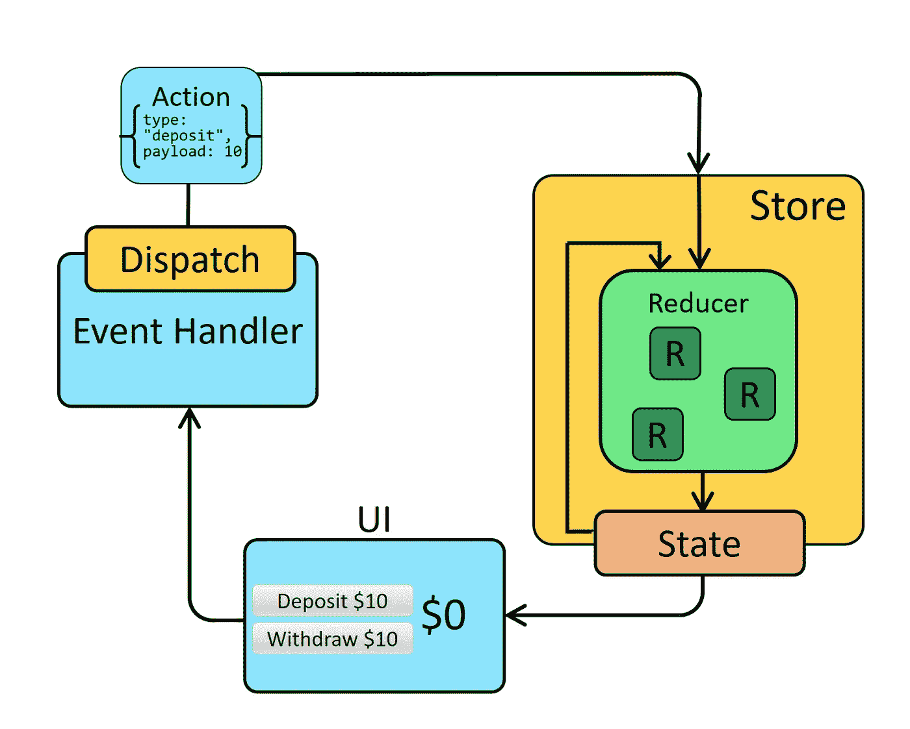
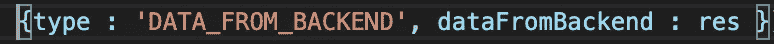
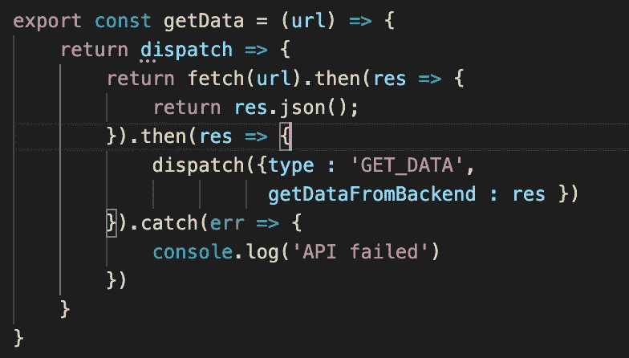
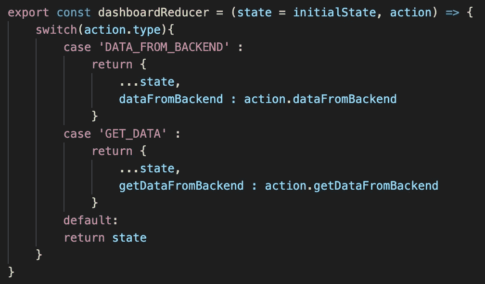
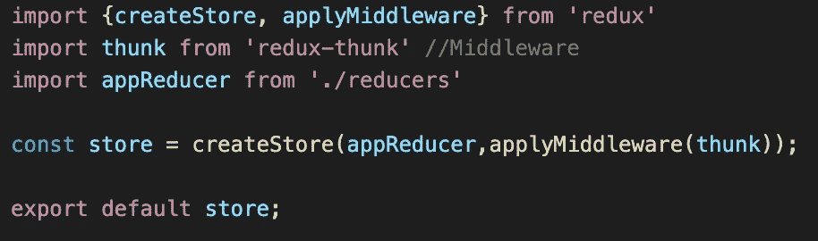
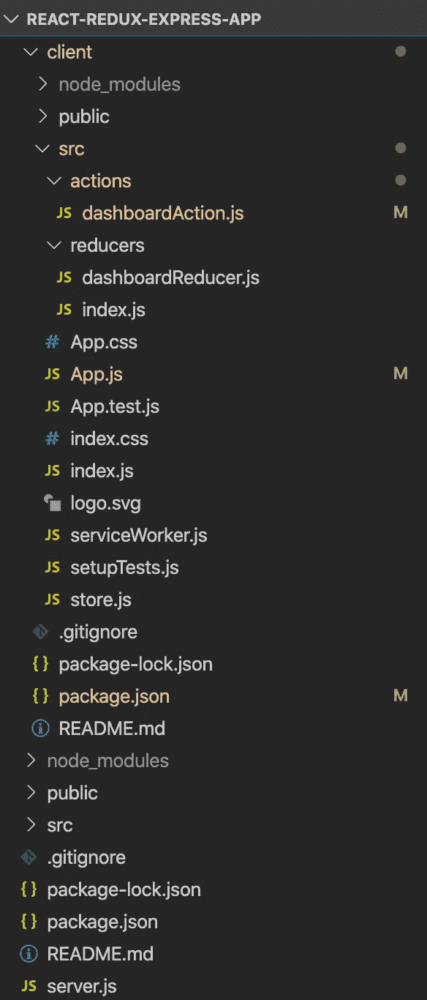
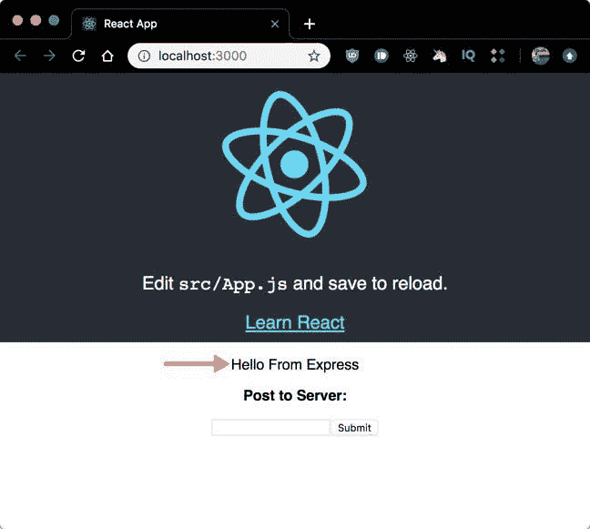

# 创建 React Redux Express 全栈应用程序第二部分

> 原文：<https://medium.com/walmartglobaltech/creating-react-redux-express-full-stack-application-part-ii-931fba94ec9b?source=collection_archive---------1----------------------->


[Image Source](https://daveceddia.com/images/8bNlffXEcC0.jpg)

# 介绍

我们已经在[之前的帖子](/walmartglobaltech/creating-react-redux-express-full-stack-application-part-i-82959d847802)中开发了带有 Express 后端服务器和 React 前端的应用程序。在这篇文章中，我们将增强 React JS 前端，以与 Redux 库集成，从而与后端无缝连接。



Features of Redux ([Image Source](https://redux.js.org/))

# 为什么要用 Redux？

> **Redux 帮助您管理“全局”状态——您的应用程序的许多部分都需要的状态。**

Redux 提供的模式和工具使得理解应用程序中的状态更新的时间、位置、原因和方式，以及当这些变化发生时应用程序逻辑的行为变得更加容易。Redux 指导您编写可预测和可测试的代码，这有助于您确信您的应用程序将按预期工作。

# 什么时候该用 Redux？

Redux 在以下情况下更有用:

*   您有大量的应用程序状态，应用程序中的许多地方都需要它们
*   应用程序状态会随着时间的推移而频繁更新
*   更新状态逻辑可能很复杂
*   该应用程序有一个中型或大型代码库，可能会有许多人在工作



React-Redux application data flow looks like this ([Image Source](https://redux.js.org/tutorials/essentials/part-1-overview-concepts))

开发 React Redux 应用程序的步骤了解过程中的常用术语

最终项目的文件夹结构将如下所示

## 行动

动作是一个普通的 JavaScript 对象，有一个`type`字段。您可以将动作视为描述应用程序中发生的事情的事件。

`type`字段应该是一个字符串，给这个动作一个描述性的名称，例如`DATA_FROM_BACKEND`。一个动作对象可以有其他字段，这些字段包含关于发生了什么的附加信息。按照惯例，我们将这些信息放在一个名为`dataFromBackend`的字段中。典型的操作对象可能如下所示:



## 动作创建者

动作创建器是一个创建并返回动作对象的函数。我们通常使用这些方法，这样我们就不必每次都手工编写动作对象。

## 派遣

Redux store 有一个方法叫做`dispatch`。更新状态的唯一方法是调用`dispatch()`并传入一个动作对象。存储将运行其 reducer 函数，并将新的状态值保存在其中。这将导致 UI 呈现新的状态值。



## 还原剂

reducer 是一个函数，它接收当前的`state`和一个`action`对象，决定如何在必要时更新状态，并返回新的状态:`(state, action) => newState`。您可以将 reducer 看作一个事件监听器，它根据接收到的动作(事件)类型来处理事件。

减速器必须*始终*遵循一些特定规则:

*   他们应该只根据`state`和`action`参数计算新的状态值
*   他们不允许修改已有的`state`。相反，他们必须通过复制现有的`state`并对复制的值进行更改，来进行*不可变更新*。



## 商店

当前的 Redux 应用程序状态存在于一个名为 store 的对象中。

存储是通过传入一个 reducer 创建的。



让我们应用上面学到的逻辑来开发基于 redux 的 React 应用程序:-

1.  创建与 Node express 后端并发运行的基于 React 的基本应用程序，如[前一篇博客](/walmartglobaltech/creating-react-redux-express-full-stack-application-part-i-82959d847802)中所述

2.将 client/package.json 的内容更新如下。添加了基于 Redux 的依赖项。

```
{
"name": "react-redux-app",
"version": "0.1.0",
"private": true,
"dependencies": {
"@testing-library/jest-dom": "^4.2.4",
"@testing-library/react": "^9.5.0",
"@testing-library/user-event": "^7.2.1",
"react": "^16.13.1",
"react-dom": "^16.13.1",
"react-redux": "^7.2.1",
"react-scripts": "3.4.3",
"redux": "^4.0.5",
"redux-thunk": "^2.3.0"
},
"scripts": {
"start": "react-scripts start",
"build": "react-scripts build",
"test": "react-scripts test",
"eject": "react-scripts eject"
},
"proxy": "http://localhost:5000/",
"eslintConfig": {
"extends": "react-app"
},
"browserslist": {
"production": [
">0.2%",
"not dead",
"not op_mini all"
],
"development": [
"last 1 chrome version",
"last 1 firefox version",
"last 1 safari version"
]}}
```

3.更新完 **package.json** 后，运行`*client*`目录下的`*npm install*`命令，安装所有需要的依赖项。

4.添加 store.js 文件( **client/src/store.js)** 为 React Redux 应用程序创建一个存储。

> redux**Thunk**中间件允许你编写返回函数而不是动作的动作创建器。thunk 可用于延迟动作的调度，或者仅在满足特定条件时才进行调度。内部函数接收存储方法`*dispatch*`和`*getState*`作为参数。

```
import {createStore, applyMiddleware} from 'redux'
import thunk from 'redux-thunk' //Middleware
import appReducer from './reducers'const store = **createStore**(appReducer,applyMiddleware(thunk));export default store;
```

5.创建存储后，创建名为 reducers(**client/src/reducers)**的文件夹来保存 reducer 文件。在这个 reducers 文件夹中添加 2 个文件:-

1.  dashboard reducer . js(**client/src/reducers/dashboard reducer . js**)

```
export const initialState = {
dataFromBackend : {},
getDataFromBackend : {}
}export const dashboardReducer = (state = initialState, action) => {switch(action.type){case '**DATA_FROM_BACKEND**' :
return {
...state,
dataFromBackend : action.dataFromBackend
}case '**GET_DATA**' :
return {
...state,
getDataFromBackend : action.getDataFromBackend
}default:
return state
}
}
```

2.index . js(**client/src/reducers/index . js**)—该文件用于组合多个导入的减速器(例如。/dashboardReducer)在存在多个 Reducer 文件的复杂应用程序的情况下。

```
import {combineReducers} from 'redux'
import {dashboardReducer} from './dashboardReducer'const config = {
dashboardReducer : dashboardReducer
}const appReducer  = **combineReducers**(config);
export default appReducer;
```

6.为应用添加 reducers 后， ***创建 actions 文件夹(*client/src/actions*)***保存 action creator 文件。在该文件夹下添加动作创建者 **dashboardAction.js** 文件(**client/src/actions/dashboard action . js**)。

```
**//Async action creator for POST API Route**export const sendData = (url,payload) => {
return dispatch => {
return fetch(url,{
method: '**POST**',
headers: {
'Content-Type': 'application/json',
},
body: JSON.stringify(payload),
}).then(res => {
return res.json();
}).then(res => {**dispatch({type : 'DATA_FROM_BACKEND', dataFromBackend : res })**}).catch(err => {
console.log('API failed')
})}}**//Async action creator for GET API Route**export const getData = (url) => {
return dispatch => {
return fetch(url).then(res => {
return res.json();
}).then(res => {**dispatch({type : 'GET_DATA', getDataFromBackend : res })**}).catch(err => {
console.log('API failed')
})}}
```

7.一旦我们准备好 store、reducer 和 async action creator，让我们通过更新 index . js**(client/src/index . js)**文件的代码将 store 嵌入到 React 应用程序中。

```
import React from 'react';
import ReactDOM from 'react-dom';
import './index.css';
import App from './App';
import * as serviceWorker from './serviceWorker';//React-Redux
import store from './store'
import {**Provider**} from '**react-redux**'ReactDOM.render(**<Provider store={store}>**
<React.StrictMode>
   **<App />**
</React.StrictMode>
**</Provider>**,
document.getElementById('root')
);// If you want your app to work offline and load faster, you can change
// unregister() to register() below. Note this comes with some pitfalls.
// Learn more about service workers: [https://bit.ly/CRA-PWA](https://bit.ly/CRA-PWA)
serviceWorker.unregister();
```

8.更新 App.js 文件( **client/src/App.js** )，以便使用连接库将 React 组件作为高阶组件与商店连接。

> `***connect()***`函数将一个 React 组件连接到一个 Redux 存储。`***mapStateToProps***`和`***mapDispatchToProps***`分别处理你的 Redux 商店的`*state*`和`*dispatch*`。`*state*`和`*dispatch*`将作为第一个参数提供给你的`*mapStateToProps*`或`*mapDispatchToProps*`函数。

```
import React, { Component } from 'react';
import logo from './logo.svg';
import './App.css';//Redux components
import {**sendData** , **getData**} from './actions/dashboardAction'
import {**connect** } from 'react-redux'
import {**bindActionCreators**} from 'redux'class App extends Component {
  constructor(props){
    super();
    this.state = {
      response: '',
      post: '',
      responseToPost: '',
    };
    this.handleSubmit = this.handleSubmit.bind(this);
    this.callApi = this.callApi.bind(this);
  }

  componentDidMount() {
    this.callApi();
  }

  callApi = () => {    
   ** this.props.getData('/api/hello');**
  };

  handleSubmit = () => {
    **this.props.sendData('/api/data',{ post: this.state.post });
**  };

render() {
    return (
      <div className="App">
        <header className="App-header">
          
          <p>
            Edit <code>src/App.js</code> and save to reload.
          </p>
          <a
            className="App-link"
            href="[https://reactjs.org](https://reactjs.org)"
            target="_blank"
            rel="noopener noreferrer"
          >
            Learn React
          </a>
        </header>
        <p>{this.props.getDataFromBackend.express}</p>
        <div>
          <p>
            <strong>Post to Server:</strong>
          </p>
          <input
            type="text"
            value={this.state.post}
            onChange={e => this.setState({ post: e.target.value })}
          />
          <button onClick={this.handleSubmit}>Submit</button>
        </div>
        <p style={{color : 'blue'}}><b>{this.props.dataFromBackend.data}</b></p>
      </div>
    );
  }
}//React Redux connecting codefunction **mapStateToProps**(state){
  return {
   dataFromBackend : state.dashboardReducer.dataFromBackend,
   getDataFromBackend : state.dashboardReducer.getDataFromBackend
  }
}const **mapDispatchToProps** = dispatch => bindActionCreators({
  sendData,
  getData
},dispatch);export default **connect**(mapStateToProps, mapDispatchToProps)(App);
```

React-Redux-Express 应用程序的最终文件夹结构将如下所示



# 运行应用程序

完成上述所需的代码更改后，在项目根文件夹(`react-redux-express-app`)中运行 ***npm start*** 命令

```
npm start
```

这将启动 React 应用程序并同时运行服务器。

现在导航到`[http://localhost:3000](http://localhost:3000/)`，您将点击 React Redux 应用程序，显示来自我们的`GET`快速路线的消息。



React Redux Application displaying data fetched from Node Express backend

**在** [**GitHub 资源库**](https://github.com/Pushpraj153/react-redux-express-app) 上获取完整源代码

# 结论

在这篇文章中，我们学习了如何将 Redux 与 react 应用程序集成，以保持远离 React 组件的全局状态。

前一篇文章:[创建 React Redux Express 全栈应用程序第一部分](/walmartglobaltech/creating-react-redux-express-full-stack-application-part-i-82959d847802)

感谢您的阅读。编码快乐！