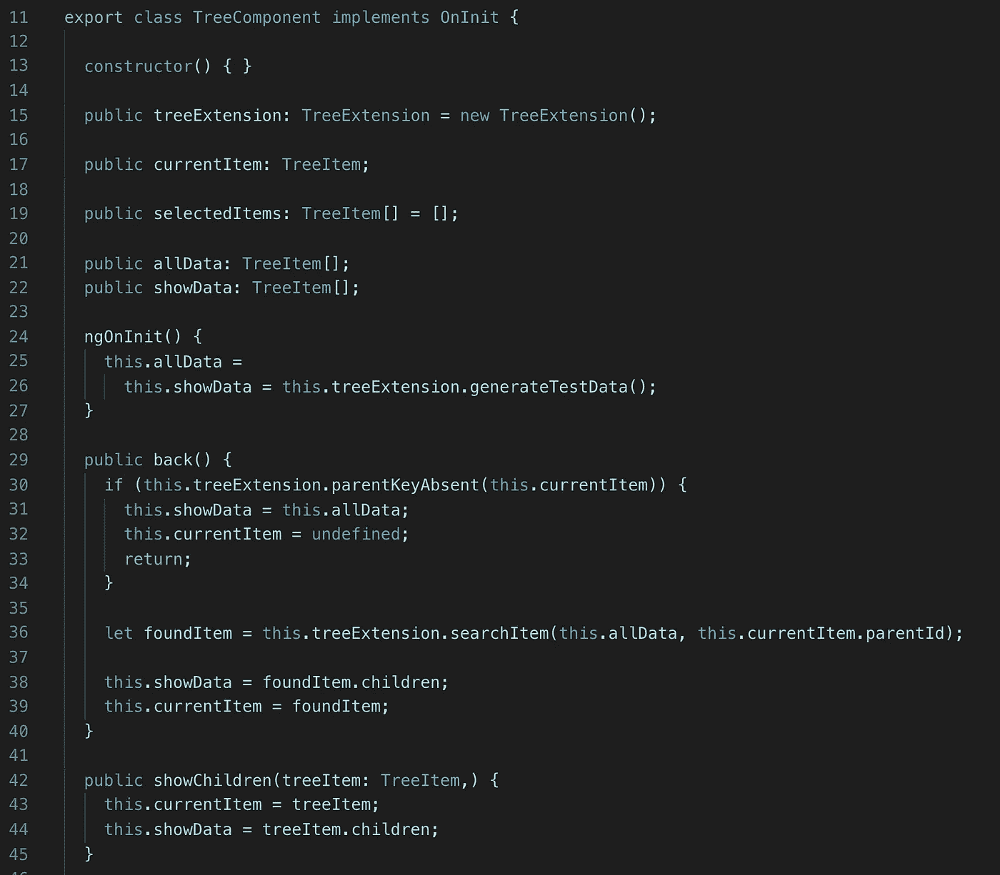

# 在 Angular 中创建树结构

> 原文：<https://medium.com/quick-code/creating-tree-structure-in-angular-999ad352d3c8?source=collection_archive---------0----------------------->

## 角度示例

## 树型结构到处都在使用。我们需要知道如何制造它。

树形视图是一个有点硬的结构，但有时我们需要在我们的项目中创建这种结构，特别是如果你需要显示一些东西的层次结构，我们必须知道如何做。

Tree structure

我们需要向用户显示所有数据。首先，我们需要做的是创建一个简单的 TreeItem。

Tree Item

此外，我们需要创建一个小类，这将有助于我们的工作与我们的树状结构一样，找到需要的 id 项目，生成测试数据等。

Tree Extension

在“searchItem”函数中我们使用了递归。这意味着，如果当前项目有内部项目，我们也必须检查它们，并深入下去。

现在我们准备创建一个组件。该组件将向我们显示当前树项目中的内部项目。

Tree component ts

Tree component html

Result

如你所见，我们可以返回上一层，或者深入查看内部物品(如果有)。

我们的最后一个任务是创建一个选择项目的函数。

Select item function

Selection result

用户喜欢层次结构，因为这种类型的结构很容易理解，但创建起来有点困难。

我希望这篇文章对你有所帮助，而且树形结构不再让你害怕。

如果你需要仔细看看项目[，这里有链接](https://github.com/8Tesla8/tree-view-angular)。

*原载于 2019 年 5 月 25 日*[*【http://tomorrowmeannever.wordpress.com*](https://tomorrowmeannever.wordpress.com/2019/05/25/creating-tree-structure-in-angular/)*。*