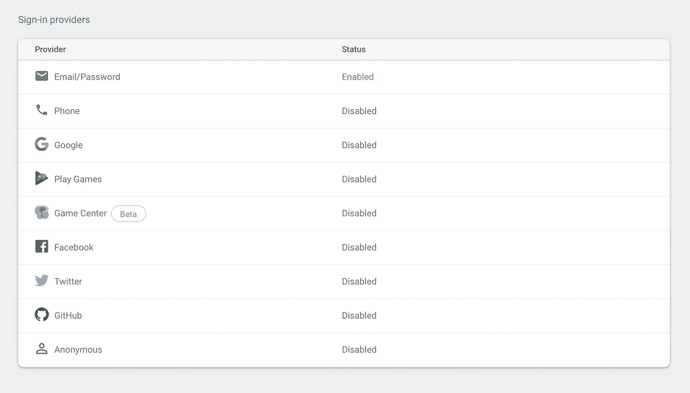

# 使用 Firebase 创建 WhatsApp 克隆

> 原文：<https://medium.com/quick-code/creating-whatsapp-clone-using-firebase-f7971f32b35?source=collection_archive---------0----------------------->


Image taken from [Unsplash](https://unsplash.com/photos/0AY15U_H-3U)

在本教程中，我们将利用 Firebase 来创建一个 WhatsApp 的克隆。

# 先决条件

我将不会通过实现这个应用程序的全部细节，主要只是逻辑和代码文件。本教程假设您已经掌握了在 iOS 上使用简单应用程序的知识，我们将在此基础上继续学习。但是不要担心，如果你想一行一行地学习，我会在下面列出完整的源代码供你参考。

在这个教程中，我使用了 XCode 10 和 Swift 4.2。

# 辅导的

让我们首先创建一个新项目，`FakeChat`在任何你喜欢的文件夹中。您可以选择包含或排除核心数据/单元/ UI 测试，因为我不会在这里讨论它们。

# 使用窗格创建新项目


Create a single view app `FakeChat`

接下来，我们将安装将在本教程中使用的各种 pod:

```
pod init
open Podfile -a Xcode
```


Add the required pods

```
pod install
```

现在我们已经安装了所需的依赖项，让我们创建一个新的 Firebase 项目。Swift 初学者将从[最佳 Swift 教程](https://blog.coursesity.com/best-swift-tutorials/)中受益匪浅。

# 设置 Firebase

越过[这里的](https://firebase.google.com)并按下右上角的`Go To Console`(确保您已登录)。

之后，用默认设置和位置点击`Add Project`。在生产应用程序中，您可能希望根据需要更改位置。


选择`Project Overview`并向项目添加一个新的 iOS 应用程序，确保使用您的 iOS Bunde ID，因为它必须是唯一的，我们的应用程序才能工作。将`com.bilguun.FakeChat`换成对你来说独一无二的东西，比如`com.yourorgname.FakeChat`


点击`Register app`并下载`GoogleService-Info.plist.`，我们将把它添加到我们项目的根目录中。


Make sure to add FakeChat as our target

现在我们唯一需要做的就是在我们的`AppDelegate.swift`文件`didFinishLaunchingWithOption`方法中添加以下内容。

```
FirebaseApp.configure()**let** database = Database.database().reference()database.setValue("Testing")
```

# 正在创建数据库

现在 Firebase 目前提供了两种支持云同步的数据库。这些是*云 Firestore* 和*实时数据库。*本质上，云 Firestore 是一个升级的实时数据库。

> **Cloud Firestore** 是 Firebase 面向移动应用开发的全新旗舰数据库。它用一个新的、更直观的数据模型改进了实时数据库的成功之处。Cloud Firestore 还具有比实时数据库更丰富、更快速的查询和更好的扩展性。

它更容易扩展，可以模拟复杂的模型，从长远来看总体上更好。然而，为了简单起见，我们将坚持使用实时数据库。

## 实时数据库

接下来，返回 Firebase 控制台并执行以下操作:


这将在测试模式下创建一个*实时数据库*,这意味着用户不需要被认证就可以读写这个数据库。我们最终会改变规则，但让我们继续这样做，这样我们就可以测试我们的应用程序。

继续在模拟器上运行我们的 iOS 应用程序。一旦启动，当你点击 Firebase 中的数据库时，你应该会看到如下内容:


Our set value method worked!

太好了！一旦我们的应用程序完成启动，我们就引用了实时数据库的根，并设置了一个新值`Testing`

我们现在将把 Firebase 数据库放在一边，当我们准备好发送消息时再回来使用它。现在让我们为用户实现视图控制器和注册/登录逻辑。

# 注册和登录


让我们转到`Authentication`，点击电子邮件/密码并启用它。我们在这里所做的是，我们给我们的用户使用电子邮件或密码注册的能力。在本教程中，我们不会检查电子邮件的有效性或用户的真实性。



Firebase 也有更多的选项，允许用户注册/登录，随意探索并将其整合到你的应用程序中。

## 创建视图控制器


This will be our initial storyboard

让我们着手创建我们最初的故事板。在这里，我们将只有 2 个屏幕嵌入在`Navigation Controller.`我们的欢迎屏幕有`email`和`password.`的输入字段，然后我们可以登录或注册。一旦我们完成其中任何一项，我们就可以展示我们的`Chats ViewController`

查看上面的屏幕记录，了解当前流程的要点。

## 处理注册和登录

把你的主`ViewController.swift`更新成这样。确保连接故事板中的`IBOutlets`和`IBActions`以防止崩溃。

现在让我们运行应用程序并注册一个新用户


输入你想要的电子邮件和密码。点击注册，短暂延迟后，应用程序会带您进入`ChatsViewController`。


Authentication page

在 Firebase 中，刷新身份验证页面，您应该会看到一个我们刚刚注册的新用户。我们有的是:

*   标识符—我们使用的电子邮件
*   提供者—显示身份验证类型的图标
*   创建—创建日期
*   登录日期—用户上次登录的日期
*   用户 UUID —分配给每个用户的唯一标识符
*   密码列未显示，因为它是敏感数据。它将被相应地散列和存储。

返回主页并尝试登录。一旦用户成功登录，我们再次显示`ChatsViewController`。

## ChatsViewController


Looks pretty decent!

这就是我们将在`ChatsViewController.`中实施的内容。基本想法如下:

1.  创建一个自定义模型，将举行`message,` `incoming,` `sender`
2.  创建自定义表格视图单元格，根据收到的模型定义消息对齐和背景颜色。如果发件人不是你，在邮件顶部显示发件人姓名
3.  在表格视图中显示单元格。

Chat Message Cell

Chats View Controller

这就是我们真正需要相应地显示消息的地方。现在让我们将`TableView`数据连接到 Firebase！我们将发送一条消息，并确保我们可以在另一个模拟器上恢复它。说到数据库， [MongoDB 教程](https://blog.coursesity.com/best-mongodb-courses/)可以让复杂的任务变得简单，让处理信息变得简单明了。

## 连接到 Firebase 数据库

我们将添加两个新方法来与 Firebase 数据库通信:

1.  点击`send`按钮时向 firebase 发送消息。
2.  给*添加一个监听器，观察数据库*的变化。

我不会用太多的话来烦你，所以这里是实际的实现

仔细阅读代码，尝试理解到底发生了什么。新方法是`sendButtonDidTap`和`getMessages.`，它们都是与我们的 Firebase 数据库正确通信所必需的。继续运行应用程序，注册 2 个用户(如果你还没有这样做的话),并在模拟器或你的手机上与他们登录。最终结果应该是这样的:

消息是*发送* *即时*，*收到* *即时*的。

# 总结想法

## 关于我们的应用

是的，我知道，虽然我们的 WhatsApp 克隆版可以工作，但它没有任何`friends.`的想法/概念，这意味着在现阶段，`ChatsViewController`就像一个巨大的团体，所有注册成员都可以在那里发送和接收消息。为了融入向朋友/群组/房间发送消息的想法，我们的 ***数据库*** 结构将需要被改变以促进这一点。也许在不久的将来，我会给你一个更新，告诉你如何使用 Firebase 来实现这个目标。如果有人想知道如何做到这一点，请随时告诉我。

如果您没有必要的技能或资源来获得自己的服务器，Firebase 可以成为一个非常强大的工具来开始实时信息交换。将来我会更新这个或者创建一个新的教程，介绍如何使用 Sockets / MongoDB 而不是 Firebase 来实现我们自己的服务。但是作为开始，Firebase 提供了一个 ***超级整洁的方式*** 允许实时信息共享。

最终的源代码可以在这里找到。

 [## Bilguun132/FakeChat

### iOS 教程实时聊天。在 GitHub 上创建一个帐户，为 Bilguun132/FakeChat 的开发做出贡献。

github.com](https://github.com/Bilguun132/FakeChat) 

如果有人觉得这些有用，请随意分享或者让我知道是否有错误/不好的实践/实现。

祝编码愉快！