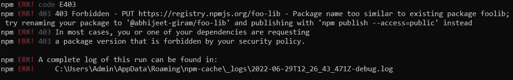
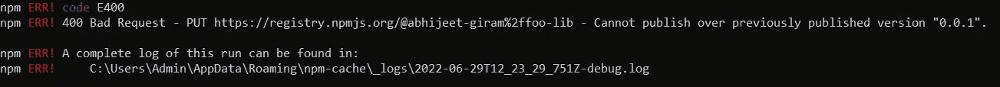
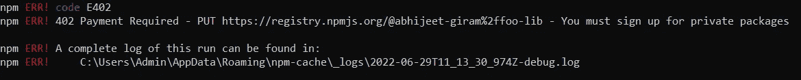
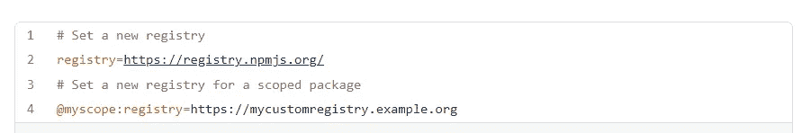
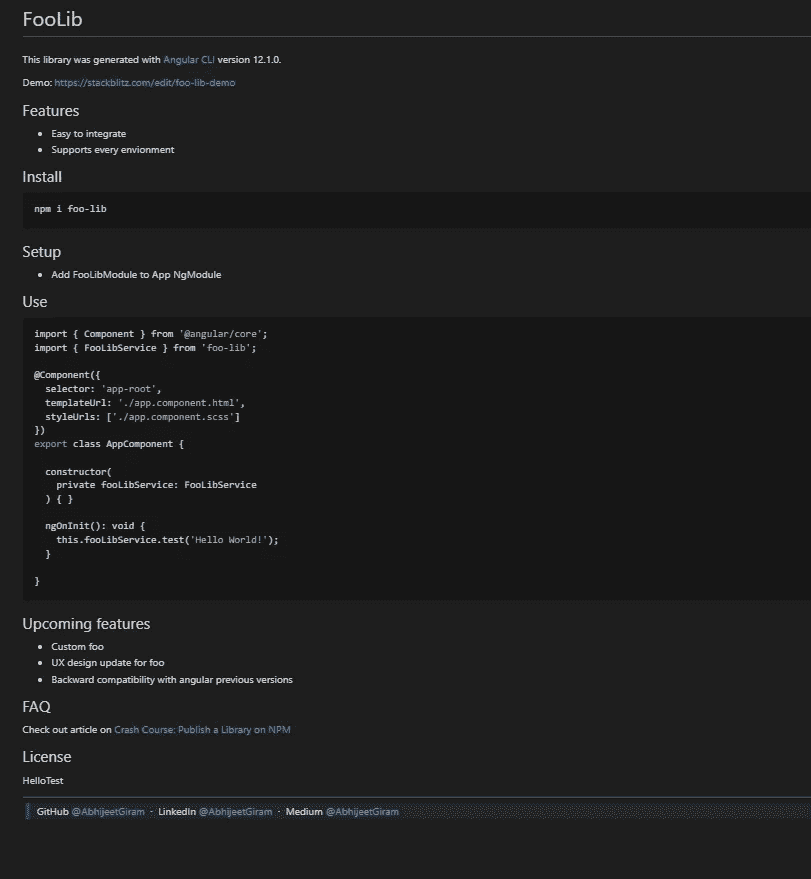
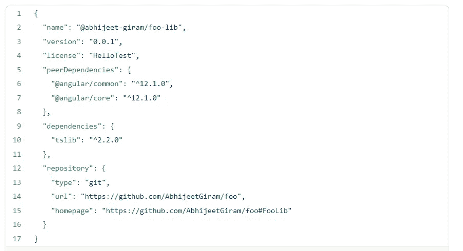
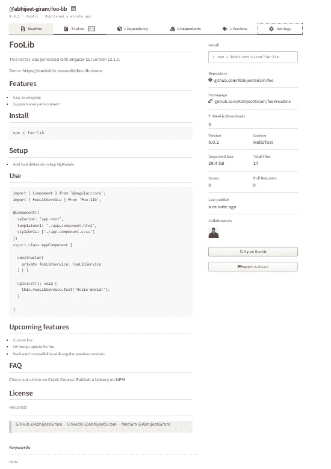

# 创建你的图书馆:NPM 系列(上)

> 原文：<https://medium.com/globant/creating-your-library-an-npm-series-part-i-b75bd6f8431d?source=collection_archive---------4----------------------->


Photo by [AbsolutVision](https://unsplash.com/@freegraphictoday?utm_source=medium&utm_medium=referral) on [Unsplash](https://unsplash.com?utm_source=medium&utm_medium=referral)

在这个系列中，我们将探索整个 NPM。首先，我们将了解如何在公共和私有配置中创建您的存储库，包括自述文件和许可。在第二篇文章[维护你的库:NPM 系列(第二部分)](/@abhijeetgiram/maintaining-your-own-library-an-npm-series-part-ii-57f320ce2176)中，我们将探索如何通过最小化漏洞和学习很酷的新命令来有效地管理你的包。

开始吧！

当我们忙着做*的时候，NPM 偶尔会安装*。今天，我们将退一步来探讨如何 *NPM 发布*一个库，并提供给大家安装。

# 1.在 NPM 上创建帐户并登录

*   在 [NPM](https://www.npmjs.com/) 上创建一个账户。成功创建帐户后，使用 *npm adduser* 命令登录到本地机器，该命令将要求输入用户名、密码、电子邮件和 OTP。

```
npm adduser
```

*   我们可以使用 *npm whoami* 命令检查登录的用户名。

```
npm whoami
```

# 2.创建一个库

*   首先，创建一个新的角度项目。

```
ng new foo
```

*   然后使用 CLI 更改目录并创建一个库。尝试为库选择一个唯一的名称，以避免发布时出现错误。



package name too similar to an existing package error

```
ng generate library foo-lib
```

*   这将在根级别创建一个目录作为项目，在项目下，它将创建一个目录作为 foo-lib。CLI 帮助我们更新所有相应的配置文件，如 angular.json、package.json 和 tsconfig.json

```
*#REMEMBER**major.minor.patch**npm uses tilde (~) to choose latest patch version and caret (^) to choose latest minor or patch version.*
```

# 3.构建并发布一个库

*   使用 CLI 构建 foo-lib。

```
ng build foo-lib
```

*   之后，更改目录并使用 *npm 包*创建一个 tgz 文件。检查 package.json 文件中的库版本。该库将有其单独的 package.json 文件。
*   在每次发布之前，我们需要增加库的 package.json 中的版本，它可以是主版本、次版本或补丁版本。



previously published version error

```
cd dist
cd foo-lib
npm pack
```

*   一旦我们有了 tgz 文件，就在 NPM 上发布库。

```
npm publish -- access public
```

*   正如我们刚刚看到的，在 npm 上发布您的库很简单。使用上面的命令是免费的，你的图书馆将是公共的。

```
*#REMEMBER*Publishing the library on NPM privately requires paying NPM for paid account.
```



payment required error to publish privately

# 私下出版一个图书馆

*   有 n 个私有存储库，我们可以在那里私下发布一个库，这样它就不会对公众开放，只供你的团队使用。
*   运行此命令以在组织级别或用户级别定义包的范围。否则，我们可以在 package.json 中更新范围。

```
npm init --scope=@my-foo
```

*   NPM、Nexus 和 JFrog 是我们可以私下发布库的存储库。在这里，我们将探索同样的 NPM。
*   创建库 foo-lib 并使用 CLI 构建 foo-lib。

```
ng build foo-lib
```

*   之后，更改目录并使用 *npm 包*创建一个 tgz 文件。检查 package.json 文件中的库版本。该库将有其单独的 package.json 文件。
*   在每次发布之前，我们需要增加库的 package.json 中的版本，它可以是主版本、次版本或补丁版本。

```
cd dist
cd foo-lib
npm pack
```

*   一旦我们有了 tgz 文件，私下出版 NPM 图书馆，这需要支付 NPM 的私人帐户。

```
npm publish
```

*   。npmrc 是一个 npm 配置文件，它帮助我们设置安装私有 npm 软件包所需的 npm 注册表和注册表凭据。



.npmrc

# 自述文件和许可

*   发布库时，建议提供关于库的信息，如如何安装、如何设置和使用以及代码片段。
*   请参考下面的自述文件示例。

```
# FooLibThis library was generated with [Angular CLI](https://github.com/angular/angular-cli) version 12.1.0.Demo: [https://stackblitz.com/edit/foo-lib-demo](https://stackblitz.com/edit/foo-lib-demo)## Features- Easy to integrate
- Supports every envionment## Install```
npm i foo-lib
```## Setup- Add FooLibModule to App NgModule## Use```bash
import { Component } from '@angular/core';
import { FooLibService } from 'foo-lib';@Component({
  selector: 'app-root',
  templateUrl: './app.component.html',
  styleUrls: ['./app.component.scss']
})
export class AppComponent { constructor(
    private fooLibService: FooLibService
  ) { } ngOnInit(): void {
    this.fooLibService.test('Hello World!');
  }}
```## Upcoming features- Custom foo
- UX design update for foo
- Backward compatibility with angular previous versions## FAQCheck out article on 
[Crash Course: Publish a Library on NPM](https://medium.com/@abhijeetgiram/ep-01-un-publish-npm-myths-8c8c3001fde9)## LicenseMIT---> GitHub [@AbhijeetGiram](https://github.com/AbhijeetGiram) &nbsp;&middot;&nbsp;
> LinkedIn [@AbhijeetGiram](https://in.linkedin.com/in/abhijeet-giram-80265095) &nbsp;&middot;&nbsp;
> Medium [@AbhijeetGiram](https://medium.com/@abhijeetgiram)
```

*   上述代码将出现在国家预防机制网站的下方。



[README.md](https://gist.github.com/AbhijeetGiram/5133fd1c25ce4ffca7a64ca3c681dbda)

*   我们可以在库的 package.json 中添加一个许可证和库的详细信息，如下所示，这将反映在 NPM 网站的主页库上。



package.json

*   npm 网站上的结果会是这样的。



[https://www.npmjs.com/package/@abhijeet-giram/foo-lib](https://www.npmjs.com/package/@abhijeet-giram/foo-lib)

[](https://www.npmjs.com/package/@abhijeet-giram/foo-lib) [## @abhijeet-giram/foo-lib

### 这个库是用 Angular CLI 版本 12.1.0 生成的。

www.npmjs.com](https://www.npmjs.com/package/@abhijeet-giram/foo-lib) 

*   我们已经探索了关于发布库的一切。在下一篇文章[维护你的图书馆:一个 NPM 系列(第二部分)](/@abhijeetgiram/maintaining-your-own-library-an-npm-series-part-ii-57f320ce2176)中，我们将对维护它进行一些说明。

# 摘要

我们已经探讨了 NPM 帐户的创建和登录。之后，我们创建了一个样本库。我们构建并发布了这个样本库。我们探索如何出版一个私人图书馆。我们谈到了图书馆的自述。

这里特别要提到[穆昆德](https://medium.com/u/733fa45e5564?source=post_page-----b75bd6f8431d--------------------------------)帮我写这篇文章。

编码快乐！！