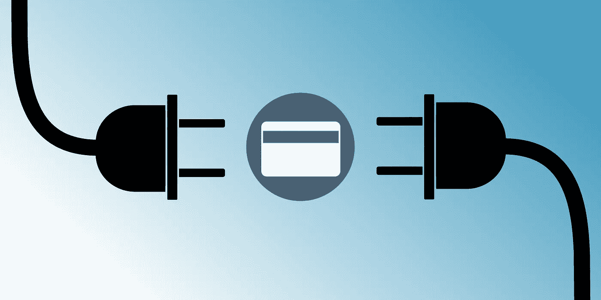

# 信用提供 WordPress 插件

> 原文：<https://medium.com/capital-one-tech/credit-offers-api-open-source-wordpress-plugin-761665ca7f2?source=collection_archive---------0----------------------->

## 开源的点击式配置解决方案

[Credit Offers](https://developer.capitalone.com/products/credit-offers/homepage/) API 允许我们的附属合作伙伴检索产品列表和详细信息，检查资格预审，并将客户数据预先填入信用卡应用程序。它为我们的分支机构及其客户提供了一系列不同的好处— *产品列表*确保 Capital One 信用卡产品在我们的分支机构网站上显示最新的准确信息，*资格预审*让客户更好地了解他们是否有可能获得批准，*预填*简化了随后的申请流程。

作为一个受欢迎的 Capital One API 产品，Credit Offers API 正在被附属合作伙伴使用，如 [Credit Sesame](https://developer.capitalone.com/case-studies/CreditOffersAPI-CreditSesame/) 、[CreditCards.com](https://developer.capitalone.com/case-studies/CreditOffersAPI-CreditCards/)、 [NerdWallet](https://www.nerdwallet.com/) 等。虽然大多数分支机构在比较购物能力中使用信用优惠，但在例行优化审计中发现，一些分支机构对通过 WordPress 等 CMS 平台利用我们的能力感兴趣。虽然最初的 Credit provides API 可以在 WordPress 上使用，但它并没有完全针对该平台进行优化。未优化的 API 会给我们的分支机构及其用户带来安全和性能问题。与我们的分支机构合作进行优化对每个参与者来说都是双赢的，也是 Capital One 专业服务团队的核心目标。

我们的团队在整合后做了大量工作来优化合作关系。这通常包括监控集成、探索附属技术栈，以及构建示例代码来帮助优化他们的 API 使用。在这种情况下，我们深入研究了代销商如何使用 WordPress，并设计了 [Credit Offers WordPress 插件](https://github.com/capitalone/Credit-Offers-Wordpress-Plugin)——我们的 Credit Offers API 的点击配置。

这个插件的工作方式和任何其他 WordPress 插件一样。通过上传和安装，代销商可以通过点击的方式连接到信用优惠 API。该插件处理与 API 的连接，并提供简单的 PHP 方法来本地访问 API 响应。它还将加密客户端凭据，并添加一个轻量级缓存层以加快渲染速度。该插件可以将集成的障碍从几周降低到几分钟。

您可能会注意到，该插件托管在 GitHub 上，拥有 Apache 许可证，版本 2.0。WordPress 的实现往往非常复杂，并且非常特定于特定的用例。因为一般的代销商会把这个插件作为他们集成的代码的“起点”,所以把它作为开源项目打包和分发是有意义的。我们希望这将允许未来的分支机构为他们特定的技术栈和集成需求优化插件。有些人可以开箱即用，有些人则不能。开源这个插件在如何使用和谁可以使用它方面提供了最大的灵活性。

我们将我们的加盟计划视为一种伙伴关系。我们希望在消费我们的数字产品时，给我们的附属合作伙伴最好的体验。通过我们的专业服务团队提供白手套服务是其中的一部分。这就是我们帮助构建更好的集成并就优化和解决方案架构提供咨询的原因。如果你是一个使用 WordPress 的新会员，我们希望这个插件能让你的集成更快、更容易、更安全，并且有现成的缓存和安全特性。这意味着消费信贷优惠 API 的上市时间会缩短。

**要了解更多关于** [**信用优惠 API**](https://developer.capitalone.com/products/credit-offers/homepage/) **的信息，请查看我们的网站。**

**要了解更多关于** [**信用优惠 WordPress 插件**](https://github.com/capitalone/Credit-Offers-Wordpress-Plugin) **的信息，请查看我们的 GitHub。**

*披露声明:这些观点仅代表作者个人观点。除非本帖中另有说明，否则 Capital One 不属于所提及的任何公司，也不被其认可。使用或展示的所有商标和其他知识产权都是其各自所有者的所有权。本文为 2018 资本一*。