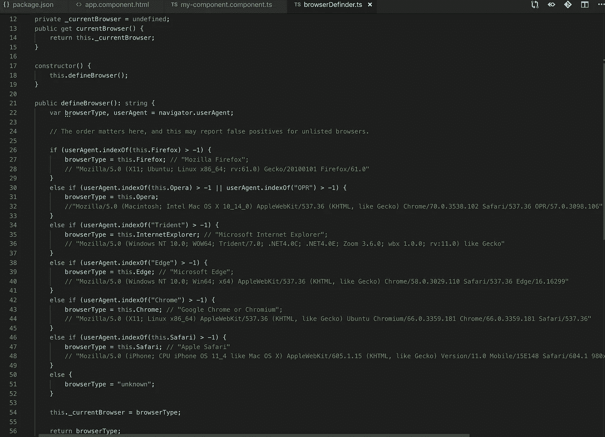
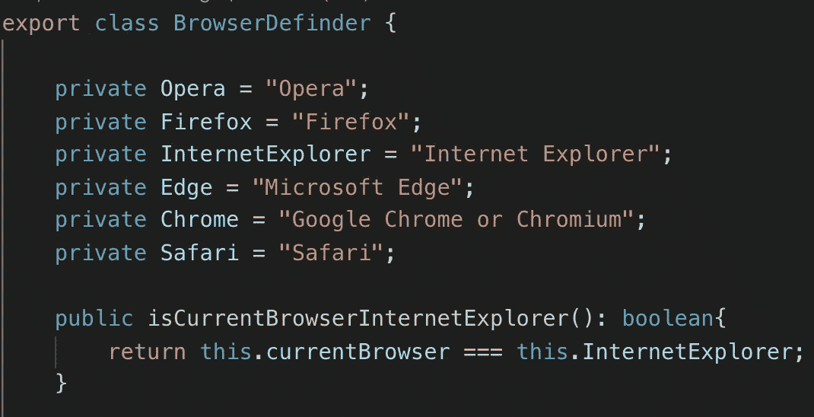
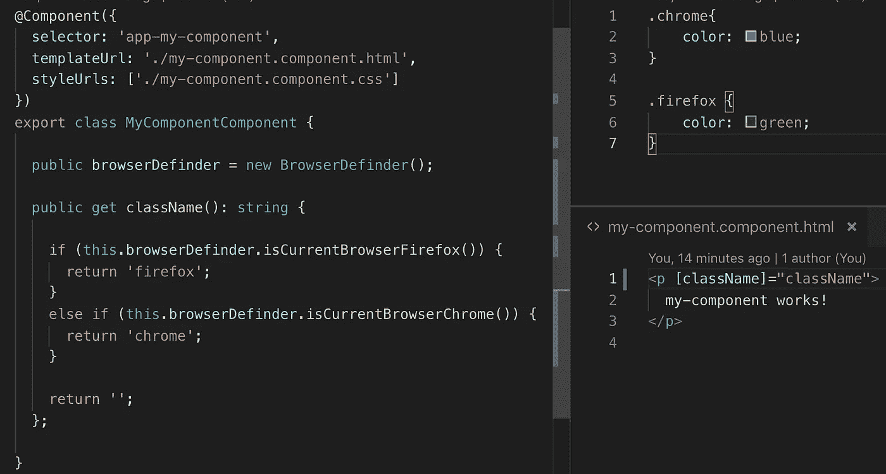
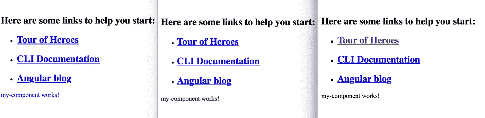
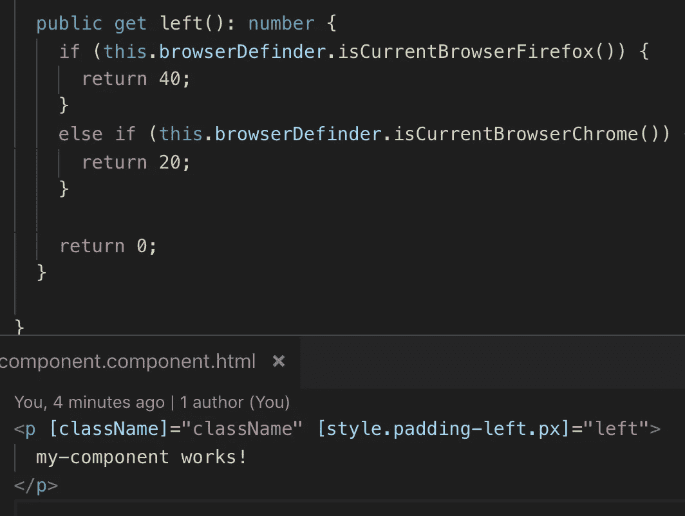
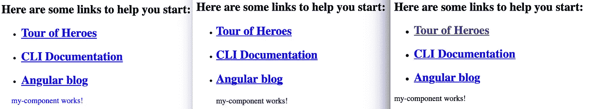

# 用 Angular 进行跨浏览器开发

> 原文：<https://medium.com/quick-code/cross-browser-development-with-angular-f572700b17f4?source=collection_archive---------6----------------------->

## 角度示例

## 支持所有浏览器

为不同浏览器创建 web 应用程序可能非常困难。有时 css 样式在不同的浏览器中并不像你想要的那样工作，你需要为一个浏览器添加一些特殊的样式或者属性，但是这些属性会影响到所有的浏览器。

我们的解决方案是使用带有动态 css 样式和属性的 Angular。

首先，我们需要在 Angular 中检测浏览器，为此我们创建了一个小类。

BrowserDefinder.ts

我不知道你的情况，但是我在网络探索方面有问题。所以让我们创建一个方法来回答一个主要问题——当前的浏览器是 IE 吗？为了更方便，让我们创建一个定义当前浏览器的不同方法。

Small function for browser definition

在 TS 文件中，我们创建了一个方法，该方法将为我们提供一个类名，我们需要根据当前的浏览器来使用该类名。在 css 文件中，我们创建了一些带有我们需要的属性的类。

Example get class name

Result

有时我们只需要改变一个特定的 css 属性。

Example get padding left

Result

Angular 在跨浏览器开发中很有帮助。

*原载于 2019 年 4 月 14 日【tomorrowmeannever.wordpress.com】**。***