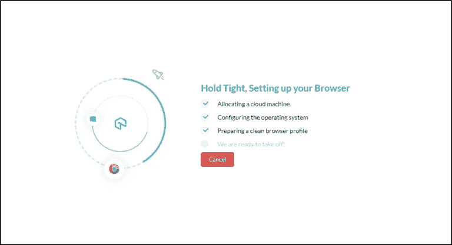

# 知道如何使用 LambdaTest 执行跨浏览器测试

> 原文：<https://medium.com/edureka/cross-browser-testing-9299b04ce277?source=collection_archive---------0----------------------->

Cross Browser Testing using Lambda Test — Edureka

世界上第一个浏览器于 1990 年推出，至今已有 30 年。即使是现在，也没有哪两家浏览器开发商能就支持哪种技术和不支持哪种技术达成一致。这就是不同浏览器的网站行为不同的原因。检查网站在不同浏览器和操作系统上的兼容性和性能是非常必要的。因此，这篇关于使用 Lambda test 进行跨浏览器测试的文章将帮助您深入理解这些概念。随着测试领域需求的增加，使用 Selenium 的自动化测试成为最受欢迎的技能之一。

以下是本文涵盖的主题:

*   什么是跨浏览器兼容性？
*   为什么需要跨浏览器测试？
*   如何进行跨浏览器测试？
*   Lambda 测试演示

跨浏览器兼容性是指网站或 web 应用程序跨不同浏览器和操作系统运行的能力。

这意味着，你的网络应用程序或网站应该在 chrome、微软、firefox、safari 甚至所有操作系统如 Windows、MAC 等上运行良好。但有时情况并非如此。这就是你需要理解跨浏览器测试概念的地方。了解了这一点，现在让我们看看为什么需要跨浏览器测试。

# 为什么需要跨浏览器测试？

一个简单的网站由 3 种主要技术组成，即 HTML5、CSS3 和 JavaScript。但是在后端还有其他 100 多种技术可以使用，比如 Python、Ruby 等。但是总体来说在前端和渲染中，只用到了这三种技术。

然而，每个浏览器使用完全不同的渲染引擎来计算这 3 种技术。例如，Chrome 使用 Blink，Firefox 使用 Gecko，IE 使用 edge HTML 和 Chakra，因此，相同的网站在所有这些不同的浏览器中会呈现完全不同的效果。这也正是你需要跨浏览器测试的原因。这意味着该网站在所有不同的浏览器版本和不同的操作系统中都应该运行良好。因此，为了确保它正常工作，需要进行跨浏览器测试。

现在让我们进一步了解如何执行跨浏览器测试？

# 如何进行跨浏览器测试？

在所有浏览器、浏览器版本和操作系统以及所有主要移动设备上进行实时交互测试。基本上是通过两种方式完成的:

1.  手动方法
2.  自动化方法

## 手动方法

在这种情况下，企业确定应用程序必须支持的浏览器。然后，测试人员使用不同的浏览器重新运行相同的测试用例，观察应用程序的行为并报告错误(如果有的话)。在这种类型的测试中，不可能覆盖许多浏览器，而且应用程序可能无法在主要的浏览器版本上进行测试。此外，手动执行跨浏览器检查既昂贵又耗时。

## 自动化方法

跨浏览器测试基本上是在不同的浏览器上多次运行同一组测试用例。这种类型的重复任务最适合自动化。因此，通过使用工具来执行这个测试更节省成本和时间。但这里又有一个挑战，即有许多浏览器，主要使用的是 Chrome、Firefox、Safari、Edge 和 IE。同样，每个浏览器至少有 10 个版本，如 Chrome72、Chrome70、Chrome68 等。类似地，有四种主要的操作系统，它们有自己的版本，如 Win98、XP、2000、Win7、Win8 和 Win10。总共有 2000 多种浏览器环境可供使用。

# LambdaTest 演示

基本上，收集浏览器和浏览器环境是测试人员面临的一个巨大挑战，因为手动操作变成了一项乏味的任务。为了解决手动收集浏览器环境的问题，Lambda test 应运而生。Lambda test 收集了所有的浏览器、浏览器版本和操作系统版本，并用它们创建了机器，并在一个基于云的平台下收集了所有这些机器。Lambda testing 是一个基于云的交叉测试平台，是跨浏览器测试的神奇工具之一。

因此，如果你想测试一个网站或一个网络应用程序的特定配置，你可以访问，lambda test 给你解决方案。您只需 [*登录 Lambda Test*](https://accounts.lambdatest.com/login) ，输入您希望测试的网站的 URL，然后开始会话，您可以在该会话中测试网站的浏览器兼容性问题。

现在，让我们来看一下演示，在这里你将理解这个 lambda 测试实际上是如何工作的。

这是一个基本的 lambda 测试平台，看看实时测试是什么样子的。实时测试是一种为您提供网站或 web 应用程序实时交互测试的功能。

在这里，您可以输入您希望测试的网站的 URL。接下来，您可以选择首选浏览器，例如 Google Chrome、其版本、操作系统和分辨率。之后，你可以点击开始按钮。一旦你点击开始按钮，它将开始分配云机器，并继续下一步，如下图所示。

完成浏览器设置后，它将浏览您在指定浏览器版本和操作系统平台中提供的相应 URL。在上面的例子中，我给出了 Edureka 网站的 URL，因此它将导航到 Edureka 博客页面。在这里，您可以在网站上执行与实时操作完全相同的操作。你可以看看下面的截图来检查输出。

同样，您可以使用 Lambda Test 进行跨浏览器测试，检查网站在其他浏览器中的兼容性。下面的快照描绘了 Mozilla Firefox 版本 58 和 Windows 7 操作系统中的 [Edureka 博客](https://www.edureka.co/blog)页面。

你也可以检查你的网站在移动操作系统中是否运行良好。让我们来看看 iPhone 4s 中捕捉到的快照。即使是在 iPhone 4s 上，当我测试这个网站时，它也运行得非常好。这意味着该网站兼容所有不同的浏览器版本和操作系统。

此外，相同的网站，即 Edureka 博客页面在三星 Galaxy S9 plus 中运行良好。下面的快照描述了同样的情况。

这就是你如何在 lambda 测试应用程序的帮助下检查网站在各种操作系统和浏览器上的兼容性。不仅如此，你还可以进行*截图测试*，其中你可以同时捕捉 25 个截图来检查网站在不同浏览器中的性能。下图说明了同样的情况。

在这里，您可以点击来自不同浏览器和操作系统的各种浏览器版本，以检查网站在所有这些浏览器中的响应。如果您发现任何错误，您可以将其标记为错误并记录一个问题。您可以参考下面的快照来查看记录的问题。

这就是您如何记录问题并在问题跟踪器中跟踪它。我希望你明白该怎么做。这就把我们带到了关于使用 Lambda Test 进行跨浏览器测试的文章的结尾。

如果你想查看更多关于人工智能、DevOps、道德黑客等市场最热门技术的文章，你可以参考 Edureka 的官方网站。

请留意本系列中的其他文章，它们将解释硒的各个方面。

> 1.[硒教程](/edureka/selenium-tutorial-77879a1d9af1)
> 
> 2.[Selenium web driver:TestNG For Test Case Management&报告生成](/edureka/selenium-webdriver-tutorial-e3e6219f21ad)
> 
> 3.[构建数据驱动、关键字驱动的&混合 Selenium 框架](/edureka/selenium-framework-data-keyword-hybrid-frameworks-ea8d4f4ce99f)
> 
> 4.[硒里的定位器](/edureka/locators-in-selenium-f6e6b282aed8)
> 
> 5. [XPath 教程](/edureka/xpath-in-selenium-cd659373e01a)
> 
> 6.[等待硒](/edureka/waits-in-selenium-5b57b56f5e5a)
> 
> 7.[为分布式硒测试设置硒网格](/edureka/selenium-grid-tutorial-ef342799c484)
> 
> 8.[硒使用 Python](/edureka/selenium-using-python-edc22a44f819)
> 
> 9.[使用 Selenium 进行跨浏览器测试](/edureka/cross-browser-testing-using-selenium-90b1911c6d60)
> 
> 10.[在 Selenium 中处理多个窗口](/edureka/handle-multiple-windows-in-selenium-727ba5f8f6a7)
> 
> 11.[Selenium 中的页面对象模型](/edureka/page-object-model-in-selenium-bc4d7c8c4203)
> 
> 12.[硒项目](/edureka/selenium-projects-b2df15d35fe2)
> 
> 13. [QTP vs 硒](/edureka/qtp-vs-selenium-338f3d3bbfa7)
> 
> 14.[硒 vs RPA](/edureka/selenium-vs-rpa-84159dbcd0f2)
> 
> 15. [Selenium WebDriver 架构](/edureka/selenium-webdriver-architecture-565e2db26dd5)
> 
> 16.[处理 Selenium 中的异常](/edureka/exceptions-in-selenium-369c38155e7d)
> 
> 17.[使用黄瓜&硒](/edureka/cucumber-selenium-tutorial-aefec05f4733)进行网站测试

*原载于 2019 年 4 月 10 日*[*https://www.edureka.co*](https://www.edureka.co/blog/cross-browser-testing/)*。*