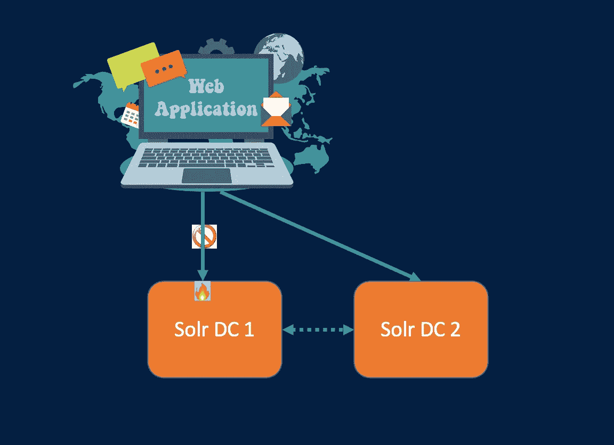
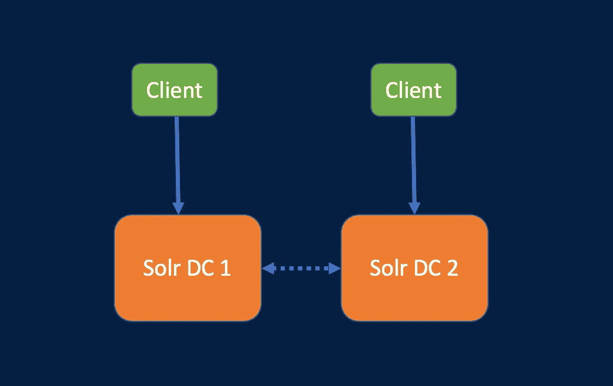
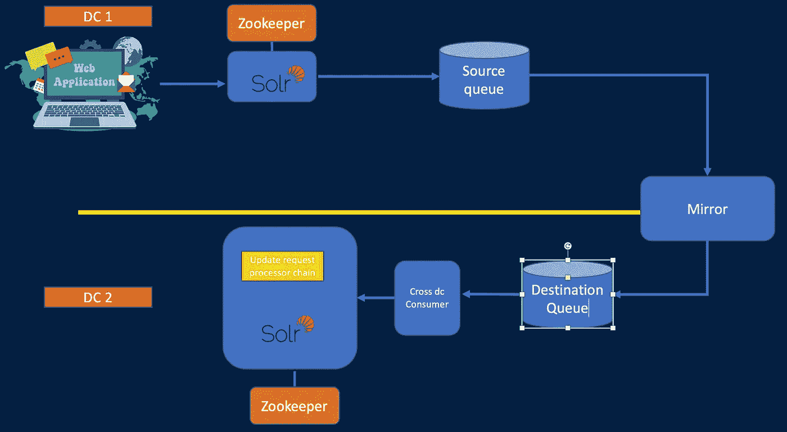
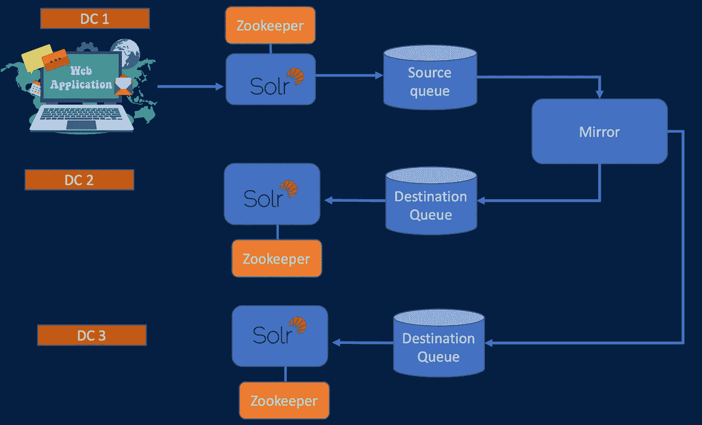

# Solr 中的跨数据中心复制

> 原文：<https://medium.com/walmartglobaltech/cross-dc-replication-in-solr-df8881ab1a9d?source=collection_archive---------1----------------------->

跨 DC(数据中心)复制是指在不同 DC 独立运行的一个或多个 Solr 集群中的数据保持同步的过程。这实质上意味着，如果一个 Solr 集群中出现更新，它会在其他 Solr 集群中传播或可用，以便 Solr 集群之间的搜索结果是一致的。

# Solr 中需要跨 DC 复制

以下是 Solr 中需要跨 DC 复制的一些原因:

**灾难恢复**:如果某个特定的数据中心因任何原因停机/不可用，最好有一个不同的数据中心可用并保持同步，这样应用程序就可以故障转移到新的数据中心，而不会出现长时间的停机。

**减少延迟**:在分布式服务中，您可能希望客户端应用程序通过减少搜索延迟来连接到地理位置更近的 Solr 集群。

# **Solr 中实现跨 DC 复制的方法**

1.  Solr 进行的跨 DC 复制:Solr 进行的跨 DC 复制有很多错误，而且由于它的设计方式而非常不稳定。这个特性已经被弃用，并将在 Solr 9.0 中被移除。Solr 的《CDCR 建筑》[参见](https://solr.apache.org/guide/8_6/cdcr-architecture.html)。有关问题详情[，请参考](https://yonik.com/solr-cross-data-center-replication/)
2.  **使用队列的跨 DC 复制**:

This diagram shows 1 way replication assuming 1 active DC

The above diagram shows N way replication assuming 1 active DC

这种方法有助于通过 N 路复制进行设置。一些重要的组件如下:

*   **更新请求处理器链**:源自客户端应用程序的所有更新请求都经过更新请求处理链，并且仅当文档是新记录或者文档的版本高于集群中的现有版本时，它才接受/插入文档。它还发送队列中的请求，然后根据配置将请求复制到 N 个数据中心。
*   **跨 DC 消费者应用程序**:该应用程序从目的地队列中读取数据，并提交给目的地 Solr 集群。它还处理失败时向目标队列的重新提交。
*   **处理删除**:在设置了 CDCR 的情况下，删除数据有点棘手，因为您不希望意外删除的数据被复制并从其他数据中心删除。因此，在此设置中,“按查询删除”请求被禁用,“按 id 删除”请求被转换为“更新”请求，该请求将相关联的文档标记为已删除，因此它不会出现在任何搜索结果中。设置单独的作业来清理这些标记为已删除的文档。
*   **不一致检测**:检测 DC 之间的数据不一致很重要，以确保 Solr 集群之间的搜索结果一致。在检查文档数量的同时，检查 Solr 集群之间文档 id 和版本的组合是否一致也很重要。为了修复检测到的不一致，可以有单独的作业来完成。关于不一致性检测和修复的更多细节将在单独的博客中介绍。
*   **失败条件**:如果负责将写入同步到另一个 DC 队列的源队列由于任何原因不可用，这不会影响发生在源 Solr DC 上的写入，因为只有异步事件侦听器会接收到失败，并且事件侦听器的失败请求也会被写入一个单独的队列。

**3。基于客户端的多写**:保持两个 Solr DC 同步的另一种方法是客户端应用程序对两个 DC 进行多写。在这里，客户端应用程序负责将数据写入两个 DC。客户端应用程序管理请求失败和重试。这种方法有许多挑战，其中一些是客户的重复工作，需要一种方法来检查一致性，并在发现不一致的情况下发出警报，在 1 DC 不可用时进行处理。此外，在提供托管服务时，客户/顾客总是希望由平台来处理数据复制。

# 摘要

使用队列设置跨 DC 复制有助于以可伸缩的方式在多个 Solr 集群之间设置 N 路复制。