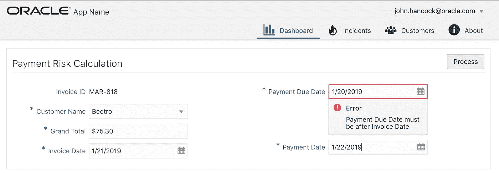
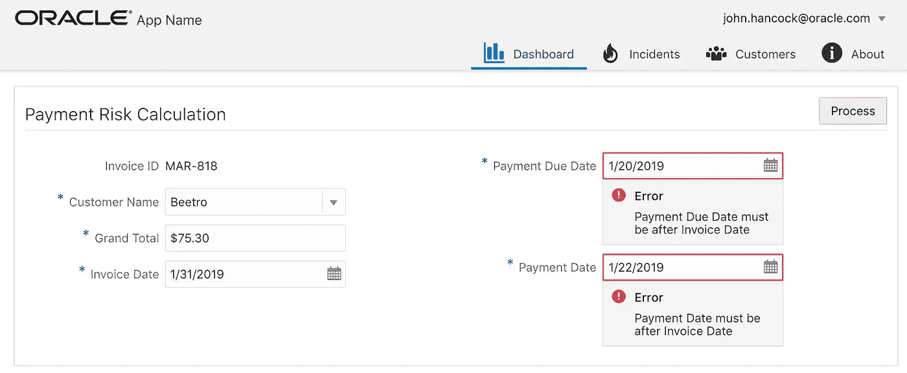
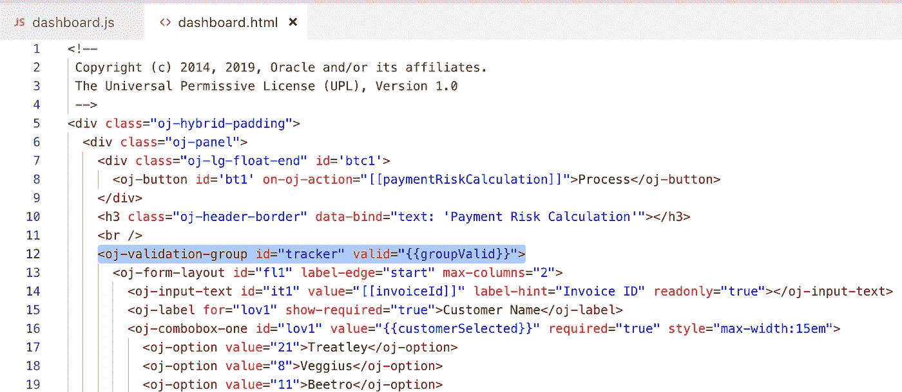
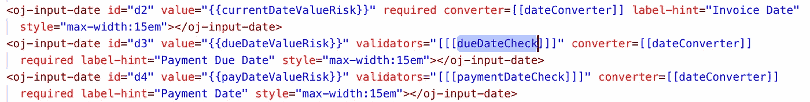
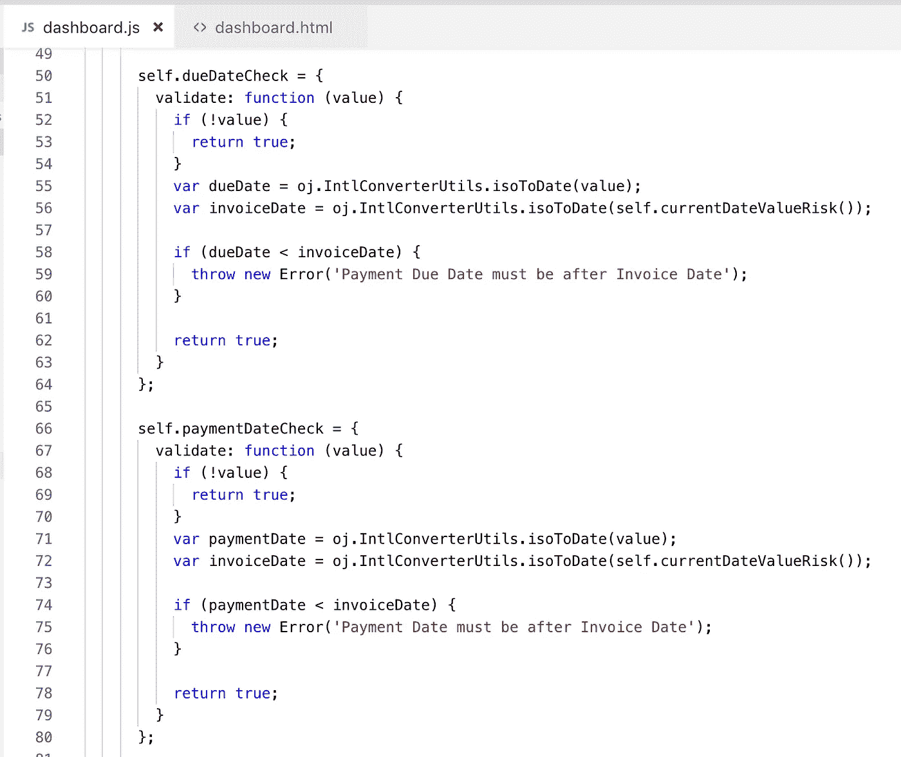
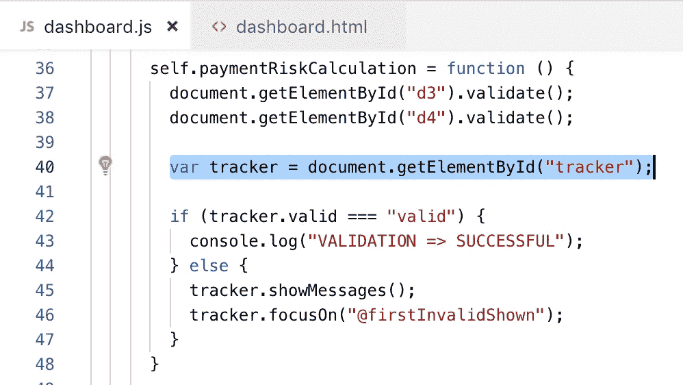

# Oracle JET 中的跨字段表单验证

> 原文：<https://medium.com/oracledevs/cross-field-form-validation-in-oracle-jet-1db04830df8?source=collection_archive---------0----------------------->

JET 一直在发展，在最新版本中，toolkit 为表单跨域验证提供了改进的支持。实现验证比以前容易多了。我将在这个例子中展示它。

数据输入表单示例。验证逻辑:

—付款到期日和付款日期之前的发票日期

—付款到期日在付款日期之前

两个字段验证失败的示例:

JET 提供了名为验证组的组件。该组件可以包装表单，以确定是否报告了任何验证错误。例如，当调用 JS 函数时，在处理函数代码之前，我们可以检查验证组是否包含错误:

可以为输入字段分配自定义验证器功能:

实施跨字段验证逻辑的验证函数代码示例—我们将字段值与其他字段进行比较。如果验证规则条件为假，则会引发验证错误:

检查验证组错误的功能代码示例。如果当前验证组中有错误，将显示错误，并聚焦第一个有错误的字段:

从我的 [GitHub](https://github.com/abaranovskis-redsamurai/validationgroupjet) repo 下载示例代码。

*原载于 2019 年 2 月 4 日*[*【andrejusb.blogspot.com*](https://andrejusb.blogspot.com/2019/02/cross-field-validation-in-oracle-jet.html)*。*