# Oracle 云和 Kubernetes 中的 Longhorn 跨区域文件复制

> 原文：<https://medium.com/oracledevs/cross-region-file-replication-with-longhorn-in-oracle-cloud-and-kubernetes-de5a5b82e4b7?source=collection_archive---------0----------------------->


在 OCI 的多个 Kubernetes 集群中部署无状态应用程序相对简单。创建您想要的集群数量，使用像 [OCI 流量控制](https://docs.oracle.com/en-us/iaas/Content/TrafficManagement/Concepts/overview.htm)这样的全局负载平衡器，添加[健康检查](https://docs.oracle.com/en-us/iaas/Content/HealthChecks/home.htm#home) *等瞧*！

如果您的应用程序是有状态的并且有持久性需求，该怎么办？如何确保您的数据保存在另一个区域？在本文中，我们将探索如何使用 Longhorn 在多个 OCI 地区复制和持久化您的数据。

## 长角牛简介

Longhorn 是 Kubernetes 的一个分布式块存储系统，并且(在撰写本文时)是一个酝酿中的 CNCF 项目。您可以在这里阅读有关 Longhorn [的更多信息](https://longhorn.io/docs/1.2.4/what-is-longhorn/)，但吸引我注意的是“*创建跨集群灾难恢复卷的能力，以便可以从第二个 Kubernetes 集群*的备份中快速恢复主 Kubernetes 集群中的数据。

这是我们将要探索的用例。

## OKE 设置

首先，创建两个 OKE 集群。您可以使用控制台或使用 terraform 的 [terraform-oci-oke 模块](https://github.com/oracle-terraform-modules/terraform-oci-oke)创建它们。我的集群是在悉尼和墨尔本创建的。您可以根据需要选择您的地区。

我使用 Terraform 模块创建了集群，并启用了悉尼的操作员。由于我正在使用多个集群，我将安装 [kubectx 和 kubens](https://github.com/ahmetb/kubectx/) 来简化我的 kubectl 命令。如果您正在使用这种方法，那么最好设置它们，这样您就可以方便地切换集群，而无需经常更改 kubeconfigs 或上下文。对操作员运行以下命令:

```
oci ce cluster create-kubeconfig --cluster-id <**clusterid**> \
--file $HOME/.kube/config --region ap-melbourne-1 --token-version 2.0.0 --kube-endpoint PUBLIC_ENDPOINTalias ktx='kubectx'
alias kns='kubens'# use the contexts from your config filektx sydney=context-cenpnxriqhq
ktx melbourne=context-cydn4hk3qgq
```

要找到上下文的值，可以在$HOME/中检查它们。kube/配置。

现在，要更改集群，只需执行以下操作:

```
[opc@lh-operator ~]$ ktx sydney
✔ Switched to context "sydney".
```

## Longhorn 先决条件

现在，让我们通过运行 Longhorn 环境检查脚本来验证我们的集群可以部署 Longhorn:

```
curl -sSfL [https://raw.githubusercontent.com/longhorn/longhorn/v1.2.4/scripts/environment_check.sh](https://raw.githubusercontent.com/longhorn/longhorn/v1.2.4/scripts/environment_check.sh) -o environment_check.shfor ctx in sydney melbourne; do
  ktx $ctx
  bash environment_check.sh
done✔ Switched to context "sydney".
daemonset.apps/longhorn-environment-check created
waiting for pods to become ready (0/0)
waiting for pods to become ready (0/3)
waiting for pods to become ready (1/3)
all pods ready (3/3)MountPropagation is enabled!cleaning up...
daemonset.apps "longhorn-environment-check" deleted
clean up complete
✔ Switched to context "melbourne".
daemonset.apps/longhorn-environment-check created
waiting for pods to become ready (0/0)
waiting for pods to become ready (0/3)
all pods ready (3/3)MountPropagation is enabled!cleaning up...
daemonset.apps "longhorn-environment-check" deleted
clean up complete
```

我们现在准备在集群中部署 Longhorn。

## 部署长角牛

让我们添加 helm repo 并更新:

```
helm repo add longhorn [https://charts.longhorn.io](https://charts.longhorn.io)
helm repo update
```

并在两个区域安装 Longhorn:

```
for ctx in sydney melbourne; do
  ktx $ctx
  helm install longhorn longhorn/longhorn --namespace longhorn-system --create-namespace
done
```

更改两个集群的默认命名空间:

```
for ctx in sydney melbourne; do
  ktx $ctx
  kns longhorn-system
done
```

验证两个群集中的 pod 都在运行:

```
for ctx in sydney melbourne; do
  k get pods
done
```

您应该看到所有的 pod 都处于运行状态。

## 使用 OCI 对象存储准备备份

在主区域中创建一个 bucket(注意，我将一个区域等同于一个集群)。我们姑且称之为**长角牛**。

目前，Longhorn 仅支持 S3 和 NFSv4 备份。因为 OCI 对象存储已经提供了一个 S3 兼容层，我们将使用它。

首先，[创建一个客户密钥](https://docs.oracle.com/en-us/iaas/Content/Identity/Tasks/managingcredentials.htm#create-secret-key)。请务必记下密钥，因为它不会再次显示。

我们还需要知道租户的对象存储名称空间。导航到您的租赁页面并查找该值。

在两个集群中，创建相同的机密:

```
for ctx in sydney melbourne; do
  ktx $ctx
  kubectl create secret generic ocisecret \
    --from-literal=AWS_ACCESS_KEY_ID=123456ab7890123c45c \
    --from-literal=AWS_SECRET_ACCESS_KEY=1abcDEF3fgdg9d798dfgdsgd9gHHHD= \
 --from-literal=AWS_ENDPOINTS=**<object-storage-namepace>**.compat.objectstorage.**<region>**.oraclecloud.com \
 --from-literal=VIRTUAL_HOSTED_STYLE=dHJ1ZQ== \
    -n longhorn-system
done
```

创建上述秘密，替换访问密钥、秘密访问密钥以及**对象存储名称空间**和**区域**的值。区域值应该是主群的区域。

## 为 Longhorn 配置备份目标

让我们在*两个区域*中访问 Longhorn UI，通过使用端口转发来配置备份目标:

```
ktx sydney
kubectl port-forward longhorn-ui-84f97cf569-z9t85 8000:8000
```

您现在应该能够在浏览器中访问 Longhorn UI，网址为 [http://localhost:8000/:](http://localhost:8000/:)

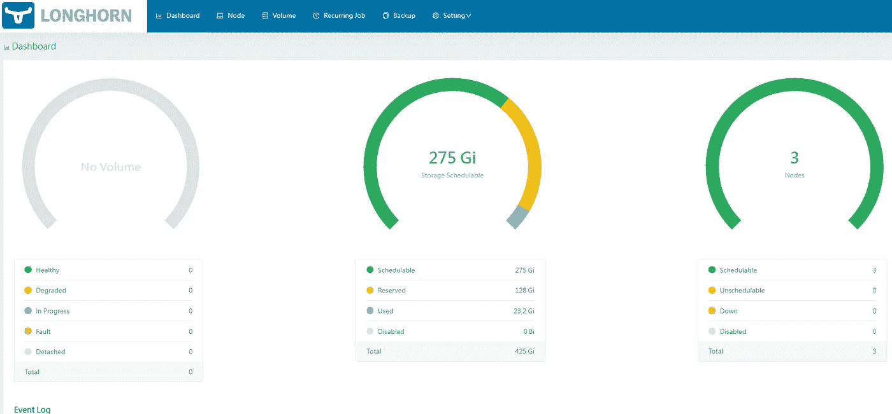

Longhorn UI

导航至**设置** > **常规**并寻找备份目标。输入备份目标和您之前创建的密码的名称:

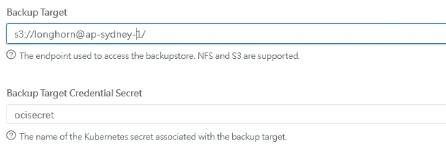

然后单击保存。在上面的备份目标中， **longhorn** 是存储桶名称，“ap-sydney-1”是您的 [OCI 地区标识符](https://docs.oracle.com/en-us/iaas/Content/General/Concepts/regions.htm)。

在辅助集群中重复上述操作。

现在让我们测试一下备份是否有效。通过运行以下命令，创建一个使用 [Longhorn 卷](https://longhorn.io/docs/1.2.4/volumes-and-nodes/create-volumes/)的 Pod:

```
kubectl create -f https://raw.githubusercontent.com/longhorn/longhorn/v1.2.4/examples/pod_with_pvc.yaml
```

在 Longhorn UI 中，您现在应该能够看到一个卷:

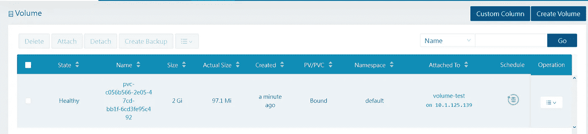

选择并创建备份:

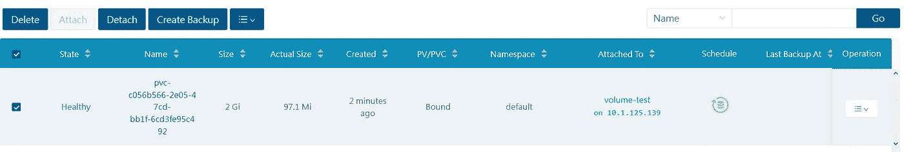

在 OCI 控制台中导航，您现在应该会看到一个 backupstore 子目录:

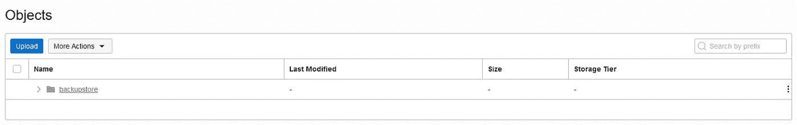

现在，访问辅助集群中的 Longhorn UI，并导航到备份页面:

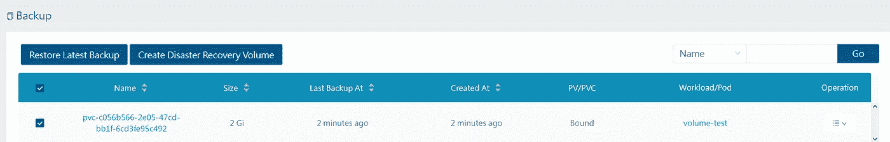

现在，您应该能够选择备份并创建灾难恢复卷了。

在卷页面上，您现在可以看到灾难恢复卷:

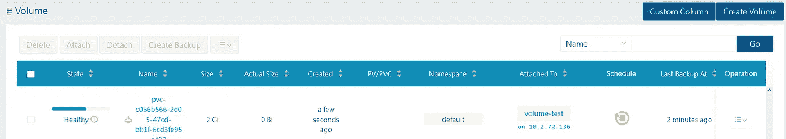

DR volume

激活它。

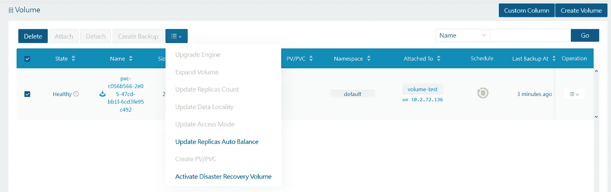

Activating the DR Volume

激活灾难恢复卷后，您可以使用它创建 PV/PVC:

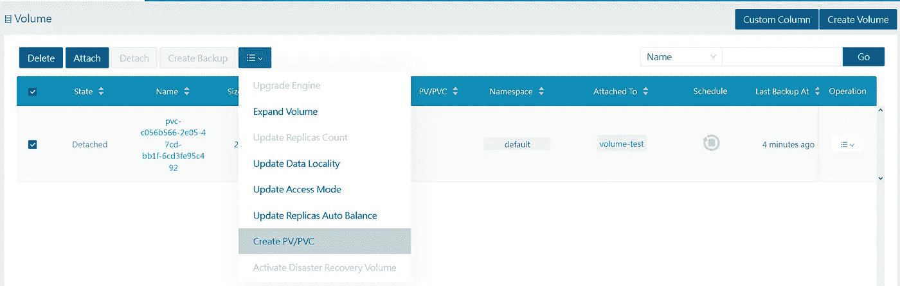

## 数据复制测试场景

我们现在将测试两个群集之间的数据复制。测试大致基于这个[演示](https://www.youtube.com/watch?v=zJY2uxLtwUk)。

我们将在主要区域部署一个 WordPress，创建一些内容，然后切换到次要区域。下面是我们将创建的架构:

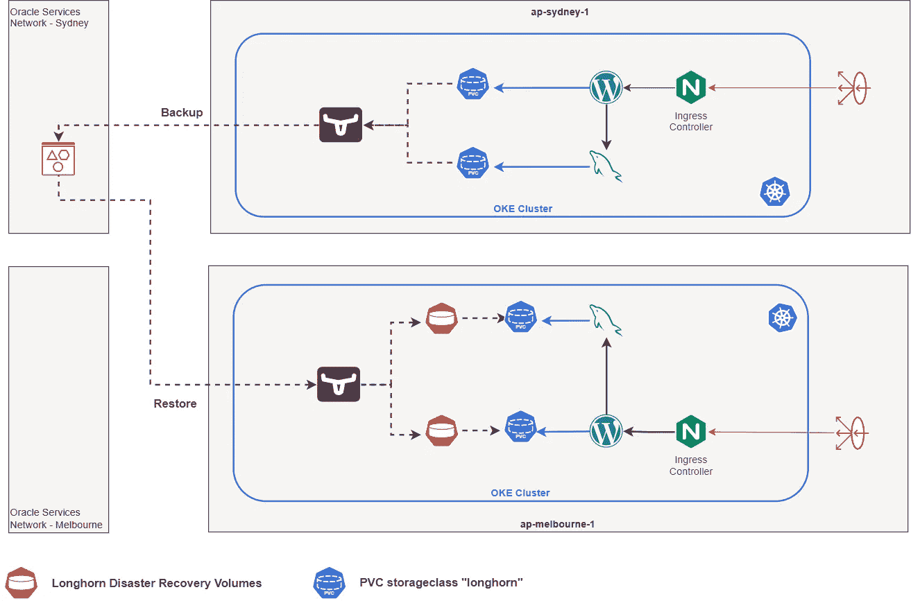

让我们首先添加 bitnami 舵图表:

```
helm repo add bitnami [https://charts.bitnami.com/bitnami](https://charts.bitnami.com/bitnami)
helm repo update
```

## 部署 WordPress

让我们生成舵图 yaml 文件:

```
helm show values bitnami/wordpress > wordpress.yaml
```

我们现在可以编辑它:

```
# parameters  #values  
wordpressUsername user
wordpressPassword "Secre7Pa55w0rd"persistence.storageClass "longhorn"mariadb.enabled true
mariadb.auth.rootPassword: "aVerySecureR007"
mariadb.auth.password: "bnwp123!@#"
mariadb.primary.persistence.storageClass: "longhorn"
```

然后，安装 WordPress

```
helm install wordpress bitnami/wordpress -f wordpress.yaml --namespace wordpress --create-namespace
```

验证是否已创建 2 个存储类 longhorn 的 PVC。一个是 WordPress 本身，另一个是数据库:

```
$ kubectl get pvc
NAME      STATUS VOLUME CAPACITY ACCESS MODES STORAGECLASS AGE
**data-mysql-0**   Bound    pvc-b2ffe5d4-728f-42d3-8e06-a4caffac260c   8Gi        RWO            longhorn       21m
**wordpress** Bound    pvc-2e3d017a-7663-4ed9-88ea-86dc5e6d8e08   10Gi       RWO            longhorn       69s
```

提取负载平衡器 ip:

```
export SERVICE_IP=$(kubectl get svc wordpress --output jsonpath=’{.status.loadBalancer.ingress[0].ip}’)echo wordpress_url=[http://$SERVICE_IP/](http://$SERVICE_IP/)
```

使用 WordPress URL 访问 WordPress。使用`wordpressUsername`、`wordpressPassword`登录，创建一个新帖子。下面是我创建的帖子。它包括一些文字和我上传的长角牛图片。

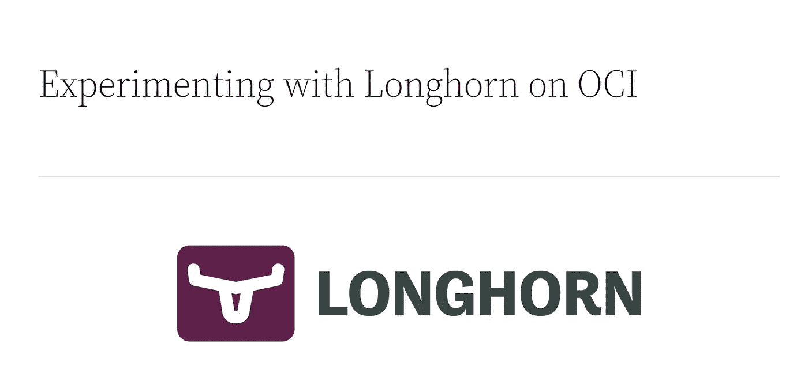

## 创建 Longhorn 备份

使用 Longhorn UI 为数据库和 WordPress 卷创建快照和备份。

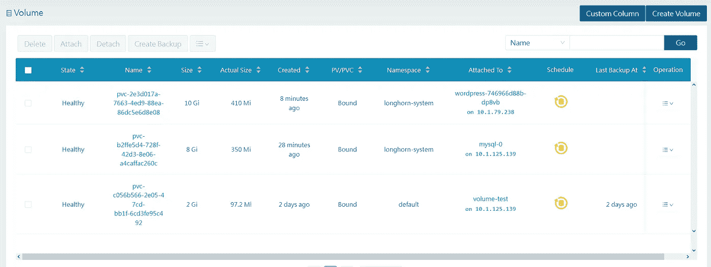

在备份页面上，您现在会看到另外两个备份:

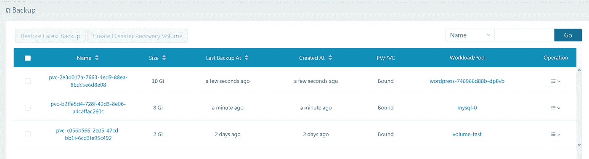

## 创建灾难恢复卷

现在，假设我们希望在悉尼进行一些维护，并希望将流量切换到墨尔本的群集。记得将上下文更改为 Melbourne，并创建一个“wordpress”名称空间:

```
ktx melbournekubectl create ns wordpress
```

首先，切换到墨尔本的 Longhorn UI。接下来，为数据库和 WordPress 创建一个灾难恢复卷。现在，您应该能够在“volume”页面中看到您创建的另外两个灾难恢复卷:

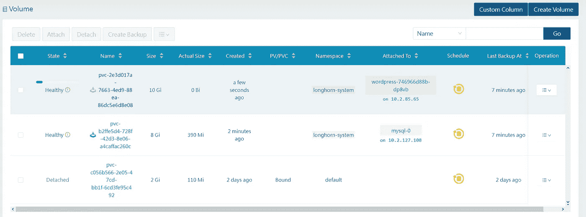

现在，让我们通过从“volume”菜单中选择并激活灾难恢复卷来激活它们:

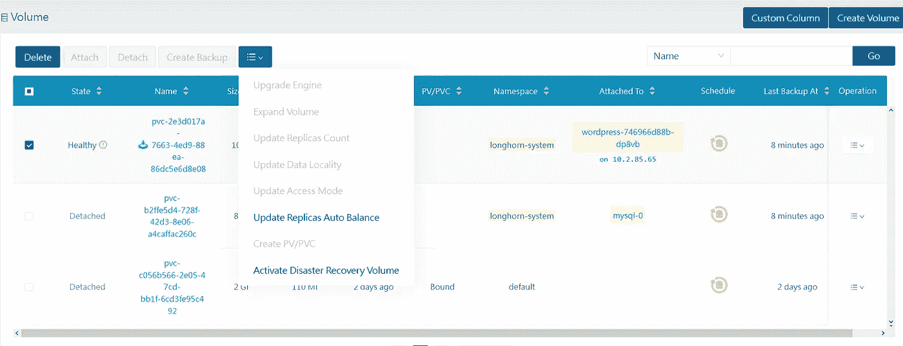

最后，我们为每一个创建一个 PVC。

## 在次要区域部署 WordPress

我们现在准备在墨尔本部署 WordPress。将 wordpress.yaml 复制到 wordpress-dr.yaml。您可以保持所有内容不变，除了:

```
persistence.existingClaim: "wordpress"
```

这将确保当您在二级区域(本例中也称为墨尔本)部署 WordPress 时，helm chart 将重用从 DR 卷创建的 PVC，而不是创建一个新的 PVC:

```
helm install wordpress bitnami/wordpress -f wordpress-dr.yaml
```

重复上述步骤，检索辅助区域的负载平衡器 IP 地址。登录 WordPress，你应该会看到你在悉尼发表的文章:

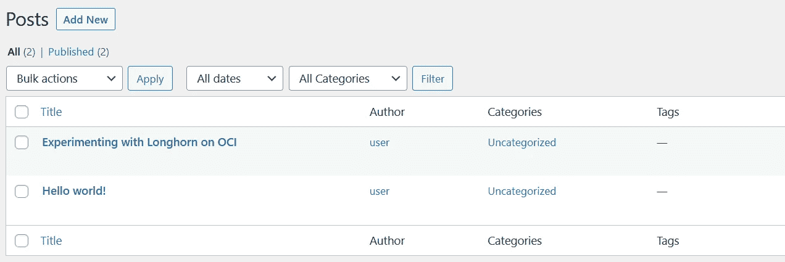

最后，如果你点击你创建的文章，你应该能够看到文本和图片:


## 结论

在这篇文章中，我想展示如何将 Longhorn 与 OCI 对象存储结合使用，将其部署在 OKE 上，并模拟执行有状态应用程序到另一个 OCI 地区的 OKE 集群的灾难恢复切换的过程。在以后的文章中，我们将更多地探索使用 Longhorn。

我希望这篇文章对你有用。

想谈谈吗？加入我们的[公共休闲频道](https://oracledevrel.slack.com/join/shared_invite/zt-uffjmwh3-ksmv2ii9YxSkc6IpbokL1g#/shared-invite/email)！