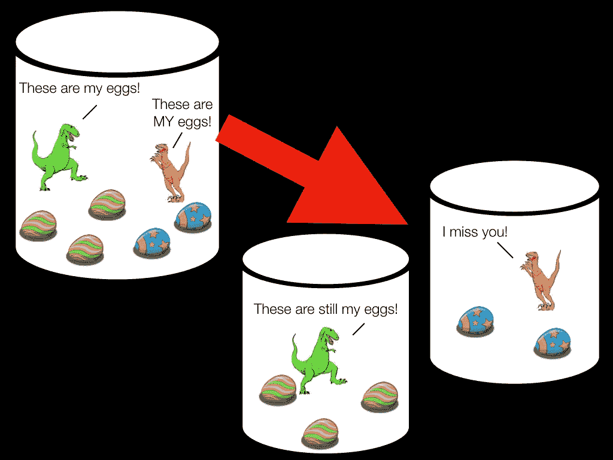
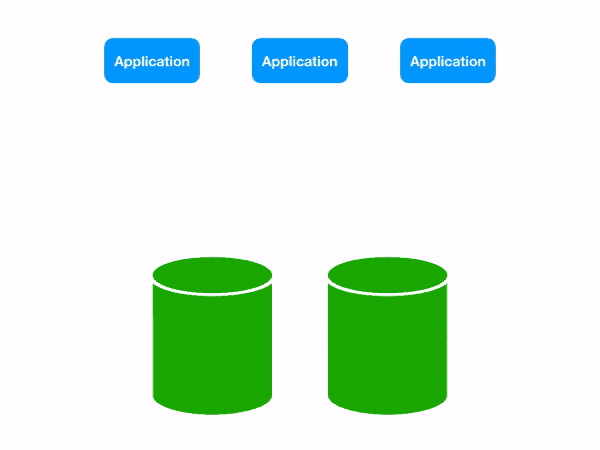
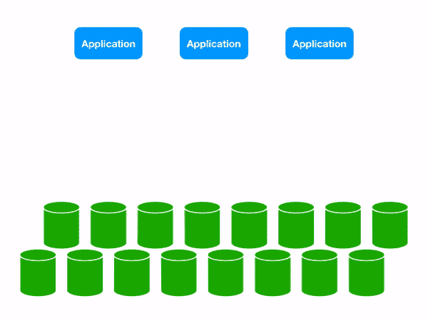
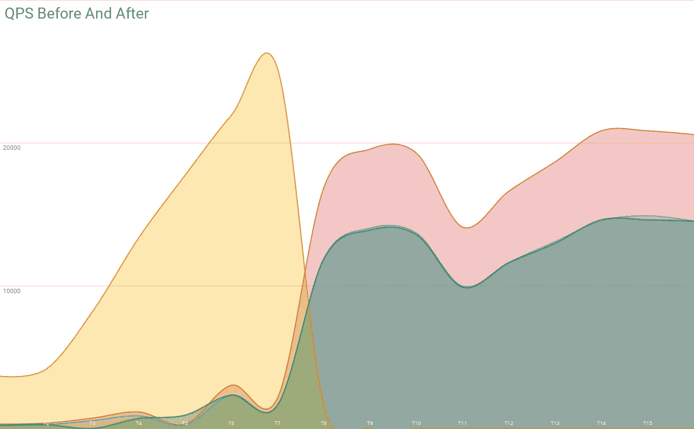
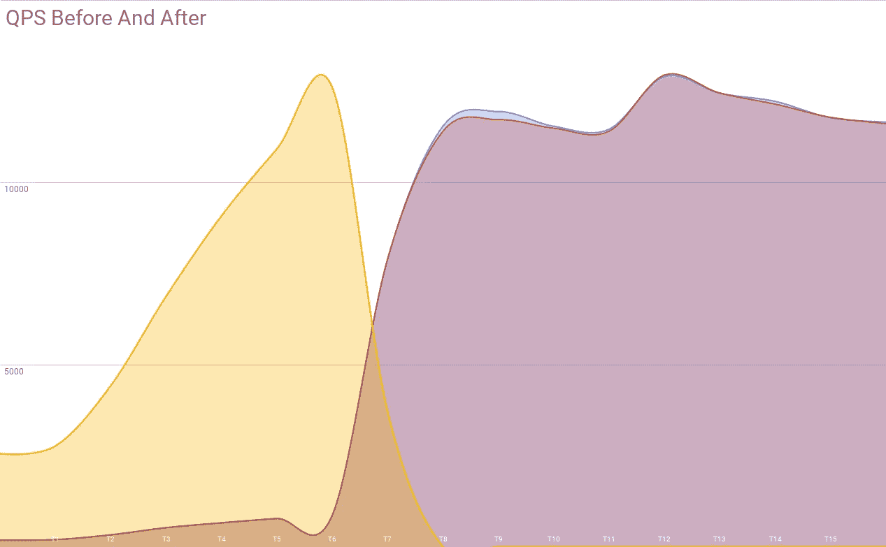
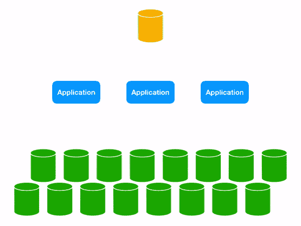

# 跨分片查询和查找表

> 原文：<https://medium.com/square-corner-blog/cross-shard-queries-lookup-tables-9d5d0ed847c1?source=collection_archive---------1----------------------->

*本帖是 Square 的* [*Vitess 系列*](/square-corner-blog/sharding-cash-10280fa3ef3b) *的一部分。查看往期帖子* [*此处*](/square-corner-blog/sharding-cash-10280fa3ef3b)*[*此处*](/square-corner-blog/remodeling-cash-app-payments-539e1f6c4276) *，以及* [*此处*](/square-corner-blog/abstracting-sharding-with-vitess-and-distributed-deadlocks-3128d7c8ffd1) *。**

**

> *注意，我们已经行动了！如果您想继续了解 Square 的最新技术内容，请访问我们的新家[https://developer.squareup.com/blog](https://developer.squareup.com/blog)*

*与 Vitess 一起分享 Cash 的数据库是一项为我们的未来做准备的大规模任务，但这仅仅是旅程的开始。我们流量的绝对增长率使得我们必须尽快将数据分割到多台机器上。从传统数据库迁移到分布式数据库需要一些仔细的考虑，因为当数据访问模式改变时，微妙的影响会变得明显。如果不考虑这些影响，实际上*会降低*的性能，因为你会添加更多的硬件。*

# *实体组模型*

*Cash 围绕实体组的概念组织 Vitess 中的数据。实体组只是一个表中的一行数据(实体组根)以及与该行相关联的所有行(实体组子代)。所有实体组的子实体都存储实体组根的 ID，因此您可以根据该 ID 分割数据，从而保证与该实体组相关的所有内容都位于同一个分片上。*

**

*Entity Groups in action.*

*Vitess 位于您的应用程序和几个 MySQL 实例之间，向应用层呈现看似普通的 MySQL 接口。当查询流量通过时，它可能会检查 WHERE 子句，寻找数据实际位于哪个片上的提示。因此，如果你已经按 ID 对你的恐龙数据库进行了分片，你要做的事情如下:*

```
*SELECT * FROM dinosaurs WHERE dino_id = 32*
```

*Vitess 可以查看那个`dino_id = 32`并确定它位于碎片 B 上，根据 Vitess 的内部拓扑图，碎片 B 位于 MySQL 数据库 002 上。因此，Vitess 会透明地将您查询发送到数据库，您可以继续您的工作。*

*假设您有另一个蛋表，其中每个蛋都属于特定的恐龙。因此，在实体组模型中，恐龙是实体组的根，而蛋是实体组的孩子。因此，每一排蛋都有一个代表它所属恐龙的`dino_id`。*

# *遗留代码有分散的查询，这是一个问题*

*Vitess 的美妙之处在于，它使大规模分布式数据库对于您的应用层来说看起来像一个普通的旧 MySQL 实例，但事实是您仍然在与一个大规模分布式数据库对话。如果你从第一天开始就有了分片的想法([就像 Misk】一样)，处理这些问题就很简单；然而，当您正在从传统的数据库拓扑转移时，您的一些假设将不得不改变。](https://github.com/square/misk)*

*在单个数据库系统中，您可以通过 ID 搜索特定的鸡蛋:*

```
*SELECT * FROM eggs WHERE egg_id = 24*
```

*这将很好地工作:您获取蛋行并继续您的业务。然而，恐龙数据库越来越受欢迎，你现在有太多的蛋，无法可靠地从一个数据库提供服务。你建立了 Vitess，做了一堆碎片，并继续运送功能。然而，问题是`WHERE egg_id = 24`没有给出任何关于你试图访问哪个碎片的线索。因此，维特丝别无选择，只能搜寻*你所有的碎片。在引擎盖下，中间件会将您的查询分散到它所知道的所有恐龙碎片，然后将输出收集到一个结果集中:一个经典的分散-收集模式。**

**

*Three scattering queries each perform an extra database round trip in a two shard topology.*

**

*Those same three queries become a lot more expensive at 16 shards.*

*当然，这是我们在进行数据库分片工作之前就知道的事情。但是，只有不包含实体组根 ID 的查询才会这样做。这样的查询是少数，所以将负载分成两个、四个甚至八个部分仍然是一个改进。在执行了使你的碎片翻倍的分割后，如果你的每个碎片都获得了前一个碎片的 70%的流量，这仍然是一个胜利。但是随着碎片数量的增加，这些分散查询变得越来越昂贵。一种思考方式是，当您的数据分片时，您的分散查询不会——如果一个数据库实例在分片前每秒从分散中接收 10，000 个查询，那么两个新的分片都将每秒从这些分散中接收 10，000 个查询。您的数据库花费时间处理所有这些分散的查询意味着它们处理其他查询的空间更少。*

**

*These are some actual query metrics from a split from 1 to 3 shards, with one shard containing one half of the data of the original one. The two smaller shards’ QPS are almost identical, however they aren’t even close to the 1/4 you would expect!*

**

*This is a later 50/50 split, which is even more unsatisfying! At this point we had enough shards that it was definitely Time To Do Something About This.*

*那么如何解决这个问题呢？*

# *把脉*

*第一步是识别这样做的查询。如果你担心分割你的庞大数据库，很可能你的代码库已经相当庞大和复杂；从代码库中手动清理分散查询是不可能的。*

*幸运的是，Vitess 在通过它的查询规划器过滤 SQL 时提供了决策统计。具有独特签名的查询被缓存和计数，并在一个非常方便的调试页面上提供。因此，很容易检查到`SELECT * FROM eggs WHERE egg_id = :val`被调用了 45，000 次并产生了一个`SelectScatter`，也就是说“我不得不到处寻找这个数据”。*

*我们编写了一些相当简单的工具来分析 Vitess 的查询计划统计页面，以识别最糟糕的违规者。结果相当令人清醒:25%的数据库流量是分散查询的结果。哎哟！*

*这是对大量硬件的愚蠢使用。我们如何让它变得更好？*

# *使代码具有 Vitess-Aware 特性*

*一种技术是简单地修改查询来提供分片键。例如，这个查询可以正确地定位到单个碎片:*

```
*SELECT * FROM eggs WHERE dino_id=32 AND egg_id=24*
```

*显然，这需要事先知道恐龙的 ID，但在实践中，像这样的行通常是由我们的 ORM (Hibernate)惰性加载的，所以 ID 在代码中没有使用。只需做一点工作，将额外的参数添加到生成的查询中就非常简单了。*

*Vitess 的查询规划器很聪明，但目前确实有一些盲点。有长期的计划来修补这些漏洞，但同时我们对应用程序做了一些修改。人们可能会期望这样的事情来适当地分割目标:*

```
*SELECT * FROM eggs WHERE (dino_id, egg_id) IN ((32, 24), (34, 12))*
```

*然而它实际上会散开！*

*修复它需要一个额外的咒语，它的存在只是为了给维特一个提示，告诉他去哪里找:*

```
*SELECT * FROM eggs WHERE dino_id IN (32, 34) AND (dino_id, egg_id) IN ((32, 24), (34, 12))*
```

*幸运的是，我们的大多数查询都是在查询生成器类中创建的，所以在中央位置添加这些附加信息相对简单。*

# *使用目录*

*还有一类问题是应用程序无法解决的。假设你只有一个蛋 id 列表，你想找到它们的主人恐龙。显然，如果你试图寻找恐龙，你不知道他们的 id！幸运的是，Vitess 有一个特性可以解决这个问题:查找 VIndexes。*

*VIndex 是 Vitess 的分布式索引概念。就像数据库索引使用查询中的信息来高效地查找您要查找的行一样，VIndex 使用相同的信息来查找正确的碎片。查找索引是一种特殊的索引，由数据库表支持，旨在解决这个问题。它的工作方式非常简单:eggs 表将在 Vitess 级别配置一个查找 VIndex，我们称之为`eggs_egg_id_lookup`。这将对应于一个有`egg_id`和`dino_id`列的表。现在，每当 eggs 表发生变化时，查找表都会更新，以具有适当的字段对。现在，当您执行查询时，Vitess 知道在 eggs 表的`egg_id`列上有一个 VIndex，并将查询它以找到与之相关的`dino_id`。*

**

*Using a Lookup VIndex lets us target the appropriate database shard.*

*使用这种技术时，需要考虑几个因素。查询查找是对数据库的额外往返，这会给整个查询增加一点延迟。然而，这肯定比击中每一个碎片要好！这种方法的一个副作用是需要在更新数据之前更新查找。查找条目和数据具有不同的分片键，因此它们需要在单独的事务中更新。如果查找在第二个事务中被更新并且失败了，那么将没有行充当从该字段到 shard ID 的映射。如果您随后按字段查询，Vitess 将检查查找，什么也没找到，也不返回任何结果。不太好。取而代之的是，在对数据进行任何更改之前更新查找，如果第二个事务失败，我们将在查找中留下不指向任何内容的行。这实际上并不是一个大问题，因为查找只是暗示碎片上有东西，而不是它实际上就在那里。在清理完查找(通常使用 rebuild⁴)之前，我们将浪费一个查询来查找不存在的数据，但这远比完全错误要好。*

*在像我们今天这样广泛地使用查找的道路上有一些有趣的颠簸。例如，构建新的查询表需要从现有数据中回填查询表。最终，从应用程序开发人员的角度来看，我们希望 Lookup VIndex 维护与数据库索引维护非常相似:不可见。*

*另一个有趣的问题是 VIndexes 不支持空字段。这和 NULL 在 MySQL 中是一个特殊的值有很大关系；NULL 永远不等于任何值，所以查找中的许多比较逻辑都被忽略了。但是，实际上，当您在非共享数据库中工作时，空字段是很常见的。对这些领域的搜索变得同样普遍。为了处理这样的现有查询，我们在查找索引中添加了对这种字段的支持。这里的变化是将一个空字段映射到一个片上，这样 Vitess 就可以了。这带来了一个副作用，如果没有任何其他提示，搜索字段为空的行可能不会给你什么有用的东西，但我个人觉得这更像是一个功能:替代方法是总是分散这样的查询，因为你几乎可以保证每个碎片至少有一个这样的行。*

# *明智地使用我们的资源*

*在现有的应用程序中，从一个数据库世界转移到一个碎片化的世界是一件大事，但是为了最大限度地利用它，我们需要确保我们最大限度地利用我们的资源。通过使用这些技术系统地攻击我们的分散查询，我们已经开始收获我们的数据集的所有小片段的好处，实际上就像我们需要它们的独立小片段一样。*

*这篇文章是 Square 的 [Vitess 系列](/square-corner-blog/sharding-cash-10280fa3ef3b)的一部分。*

**这本身就是为什么在将查询传递给数据库进行下一轮查询规划之前，执行查询规划的 CPU 成本不是毁灭性的。**

**Vitess 采用在常用数据库组件前加“V”的命名模式。顺其自然吧。**

**具有不同分片键的两个数据很可能位于不同的物理数据库服务器上，因此没有办法确保两个数据的写入都成功完成，而不会产生两阶段提交的成本。**

**⁴当我们推出一个新的查找时，需要从源表中进行回填，从查找中清除垃圾行的最简单方法是重新开始。这曾经是应用程序运行的一项任务，但是我们最近为 Vitess 添加了一个特性，让它回填自己的查找。现在的问题是它的* ***太*** *容易查找。通常最好是写一些稍微优雅一点的东西，在没有额外开销的情况下完成工作。这不是最糟糕的问题。**