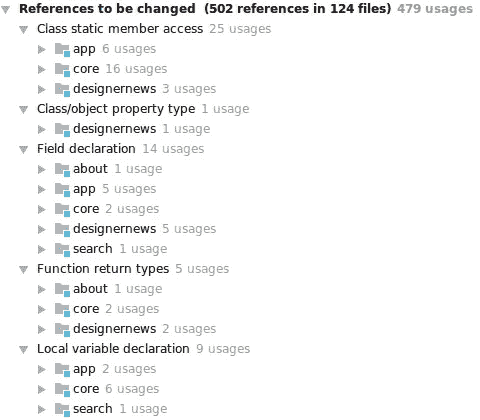

# 交叉缝合格子和 AndroidX

> 原文：<https://medium.com/androiddevelopers/cross-stitching-plaid-and-androidx-7603a192348e?source=collection_archive---------3----------------------->


Illustration by [Virginia Poltrack](https://twitter.com/vpoltrack)

## AndroidX 迁移指南

Plaid 是一个有趣的 Android 应用程序，它展示了材料设计和丰富的交互式 UI。最近，该应用程序通过应用现代 Android 应用程序开发技术进行了更新。要阅读更多关于该应用程序和重新设计愿景的信息，请查看 [Restitching 格子图案](/@crafty/restitching-plaid-9ca5588d3b0a)。

[](/@crafty/restitching-plaid-9ca5588d3b0a) [## 重缝格子

### 将格子更新为现代应用标准

medium.com](/@crafty/restitching-plaid-9ca5588d3b0a) 

像大多数 Android 应用程序一样，Plaid 依赖于 Android 支持库，该库为运行旧版本操作系统的手机提供了新的 Android 功能的向后兼容性。2018 年 9 月，支持库的最后一个版本(28.0.0)发布。支持库附带的库已迁移到 AndroidX(设计库除外，它已迁移到 Android 的材料组件),这些库的所有新开发都在 AndroidX 中进行。因此，获得 bug 修复、新特性和其他库更新的唯一方法是将 Plaid 迁移到 AndroidX。

# AndroidX 是什么？

在 Google I/O 2018 上，Android 团队[宣布了 AndroidX](https://android-developers.googleblog.com/2018/05/hello-world-androidx.html) 。它是 Android 团队用来在 [Jetpack](https://developer.android.com/jetpack/) 中开发、测试、打包、版本化和发布库的[开源](https://android.googlesource.com/platform/frameworks/support/+/androidx-master-dev)项目。像支持库一样，每个 [AndroidX](https://developer.android.com/jetpack/androidx/) 库都独立于 Android 操作系统，并提供跨 Android 版本的向后兼容性。这是对支持库的重大改进和完全替代。

请继续阅读，了解我们如何为迁移过程准备代码并执行迁移本身。

# 准备迁移

我强烈建议在受版本控制的分支上执行迁移。通过这种方式，您可以逐步解决在分离出每个变更进行分析时可能出现的任何迁移问题。您可以在这个 [Pull 请求](https://github.com/nickbutcher/plaid/pull/524)中看到我们的转换进度，并通过下面的提交链接进行跟进。此外，Android Studio 提供了在开始迁移之前备份项目的选项。

与任何大规模代码重构一样，在迁移到 AndroidX 以避免合并冲突时，最好尽量减少主开发分支的合并。虽然这对于其他应用程序可能不可行，但我们的团队能够暂时暂停对主分支的提交，以帮助迁移。一次性迁移整个应用程序也很重要，因为部分迁移——同时使用 AndroidX 和支持库——会导致失败。

最后，在 developer.android.com[的](https://developer.android.com/)上阅读关于[迁移到 AndroidX](https://developer.android.com/jetpack/androidx/migrate) 的提示。现在让我们开始吧！

# 确定依赖关系

在开始之前，关于代码准备的最重要的建议是:

> 确保您使用的依赖项与 AndroidX 兼容

依赖于旧版本支持库的库可能与 AndroidX 不兼容，导致您的应用程序在 AndroidX 迁移后可能无法编译。找出应用程序的任何依赖项是否不兼容的一种方法是访问每个依赖项的项目站点。更直接的方法是开始迁移并检查可能出现的错误。

对于格子，我们使用的是一个旧版本(4.7.1)的 [Glide](https://bumptech.github.io/glide/) 图像加载库，它与 AndroidX 不兼容。这导致了迁移后的代码生成问题，导致应用程序无法构建(这是 Glide 项目中记录的一个类似的[问题](https://github.com/bumptech/glide/issues/3126))。我们升级到版本 4.8.0 ( [commit](https://github.com/nickbutcher/plaid/pull/524/commits/6b23efa838d4e9f60a3e78ae324c0c4a43ec8de0) )，在开始迁移之前增加了对 AndroidX 注释的支持。

因此，如果可能的话，请更新到您的依赖项的最新版本。这对支持库来说尤其是一个好主意，因为升级到 28.0.0(最终版本)会使迁移更加顺利。

# 用 Android Studio 重构

对于迁移过程，我们使用了 Android Studio 3.2.1 内置的重构。AndroidX 迁移工具位于重构菜单>迁移到 AndroidX 下。这将迁移您的整个项目，包括所有的模块。



The refactor preview window after running the AndroidX refactor tool

如果您不使用 Android Studio 或者更喜欢使用其他工具进行迁移，请参考关于[工件](https://developer.android.com/jetpack/androidx/migrate#artifact_mappings)和[类](https://developer.android.com/jetpack/androidx/migrate#class_mappings)映射的页面。这些也以 CSV 格式提供。

Android Studio 中的 AndroidX 迁移工具是迁移到 AndroidX 的一个很好的资源。该工具正在不断改进，因此，如果您遇到问题或希望看到某个功能，请[在谷歌问题跟踪系统上提交一张罚单](https://issuetracker.google.com/issues/new?component=460323)。

# 迁移应用程序

> ***更改最低金额代码，以便再次运行应用程序。***

运行 AndroidX 迁移工具后，大量代码发生了变化，但项目并没有构建起来。在这一点上，我们只需要[做最少的工作](https://github.com/nickbutcher/plaid/compare/dd2ebf7f2de74809981e7c904c9ee22d16db5262...d2cefa384448f4d3fb92dec0ade25d9bd87efb63)就可以让应用程序再次运行。

这种方法有助于将流程分成易于管理的步骤。我们将修复导入顺序、提取依赖变量和减少完整类路径使用等任务留给了以后的清理过程。

首先出现的错误之一是重复的类——在本例中是`PathSegment`:

```
Execution failed for task ':app:transformDexArchiveWithExternalLibsDexMergerForDebug'.> com.android.builder.dexing.DexArchiveMergerException: Error while merging dex archives:Learn how to resolve the issue at [https://developer.android.com/studio/build/dependencies#duplicate_classes.](https://developer.android.com/studio/build/dependencies#duplicate_classes.)Program type already present: androidx.core.graphics.PathSegment
```

这是迁移工具中的一个错误，它生成了一个不正确的依赖项(`androidx.core:core-ktx:0.3`)。我们手动更新([提交](https://github.com/nickbutcher/plaid/pull/524/commits/8e60a351625b934a650b571dd67f4d206f96ac91))为正确的(`androidx.core:core-ktx:1.0.0`)。这个 [bug](https://issuetracker.google.com/issues/111260482) 已经被修复，可以在 Android Studio 3.3 Canary 9 以及更高版本中获得。我们希望指出这一点，因为您在迁移过程中可能会遇到类似的问题。

接下来，`Palette` API 发生了变化，现在可以为 null。为了暂时避开这一点([提交](https://github.com/nickbutcher/plaid/pull/524/commits/75b8ffd621693ac52a0ce243599cfcfd25242d5f)，我们添加了`!!`([非空断言操作符](https://kotlinlang.org/docs/reference/null-safety.html#the--operator))。

然后我们遇到了一个错误，其中`plusAssign`丢失了。此重载在 1.0.0 中被删除。`plusAssign`用法被暂时注释掉([提交](https://github.com/nickbutcher/plaid/pull/524/commits/d2cefa384448f4d3fb92dec0ade25d9bd87efb63))。在本文的后面，我们将探索`Palette`和`plusAssign`的永久解决方案。

该应用程序现在运行！接下来，是时候清理代码了。

# 清理代码

应用正在运行，但是我们的持续集成报告了提交错误:

```
Execution failed for task ':designernews:checkDebugAndroidTestClasspath'.> Conflict with dependency 'androidx.arch.core:core-runtime' in project ':designernews'. Resolved versions for runtime classpath (2.0.0) and compile classpath (2.0.1-alpha01) differ. This can lead to runtime crashes. To resolve this issue follow advice at [https://developer.android.com/studio/build/gradle-tips#configure-project-wide-properties.](https://developer.android.com/studio/build/gradle-tips#configure-project-wide-properties.)Alternatively, you can try to fix the problem by adding this snippet to /.../plaid/designernews/build.gradle: dependencies {
    implementation("androidx.arch.core:core-runtime:2.0.1-alpha01")
  }
```

我们遵循了测试日志中的建议，并添加了缺失的依赖块([提交](https://github.com/nickbutcher/plaid/pull/524/commits/aba91a9cd5a7a92dc5b9863a6b8c9f980597726b))。

我们还借此机会更新了我们的 Gradle、Gradle wrapper 和 Kotlin 版本( [commit](https://github.com/nickbutcher/plaid/pull/524/commits/b38f2cf74520693699fbcedcb0119778396ba0ec) )。Android Studio 提示我们安装 28.0.3 版本的构建工具，我们遵从了。我们遇到了 Gradle 3.3.0-alpha13 的问题，通过降级回 3.3.0-alpha08 解决了这个问题。

迁移工具的一个缺点是，如果您在依赖版本中使用变量，它会为您内联它们。我们从 build.gradle 文件中重新提取了版本([提交](https://github.com/nickbutcher/plaid/pull/524/commits/0c5a3d62a83ecf400de376f4b4e6e7c3a6bf3c2a))。

我们上面提到过，在运行 AndroidX 迁移工具后，我们为`plusAssign`和`Palette`提供了临时解决方案。现在，我们重新添加了`plusAssign`函数和相关的测试( [commit](https://github.com/nickbutcher/plaid/pull/524/commits/0a5a5a3d50ece0f671201e1183b971fb4a3e158a) )，方法是从 AndroidX 库的以前版本移植它，并取消上面代码的注释。此外，我们将`Palette`参数更新为可空的([提交](https://github.com/nickbutcher/plaid/pull/524/commits/7aad3005ea8ab222443f1a2ea34252e25328d677))，这样就不需要使用`!!`。

此外，自动转换可能会将一些类更改为使用它们的完整类路径。做一些小的手工修改是个好主意。作为清理的一部分，我们删除了完整的类路径，并根据需要重新添加了相关的导入。

最后，添加了一些小的测试修改，以解决测试([提交](https://github.com/nickbutcher/plaid/pull/524/commits/9715e2f8fdabc21b6d73e2f11f31982e90292461))和房间测试([提交](https://github.com/nickbutcher/plaid/pull/524/commits/a997200ec98b8466c427d5ac16eae94bae816da9))期间的依赖冲突。在这一点上，我们的项目被完全转换，我们所有的测试都通过了。

# 结束线程

尽管遇到了一些障碍，AndroidX 的移植还是很顺利。这些问题主要涉及不正确转换的依赖项或类，以及新库中的 API 更改。幸运的是，这些都相对容易解决。格子现在又可以穿了！