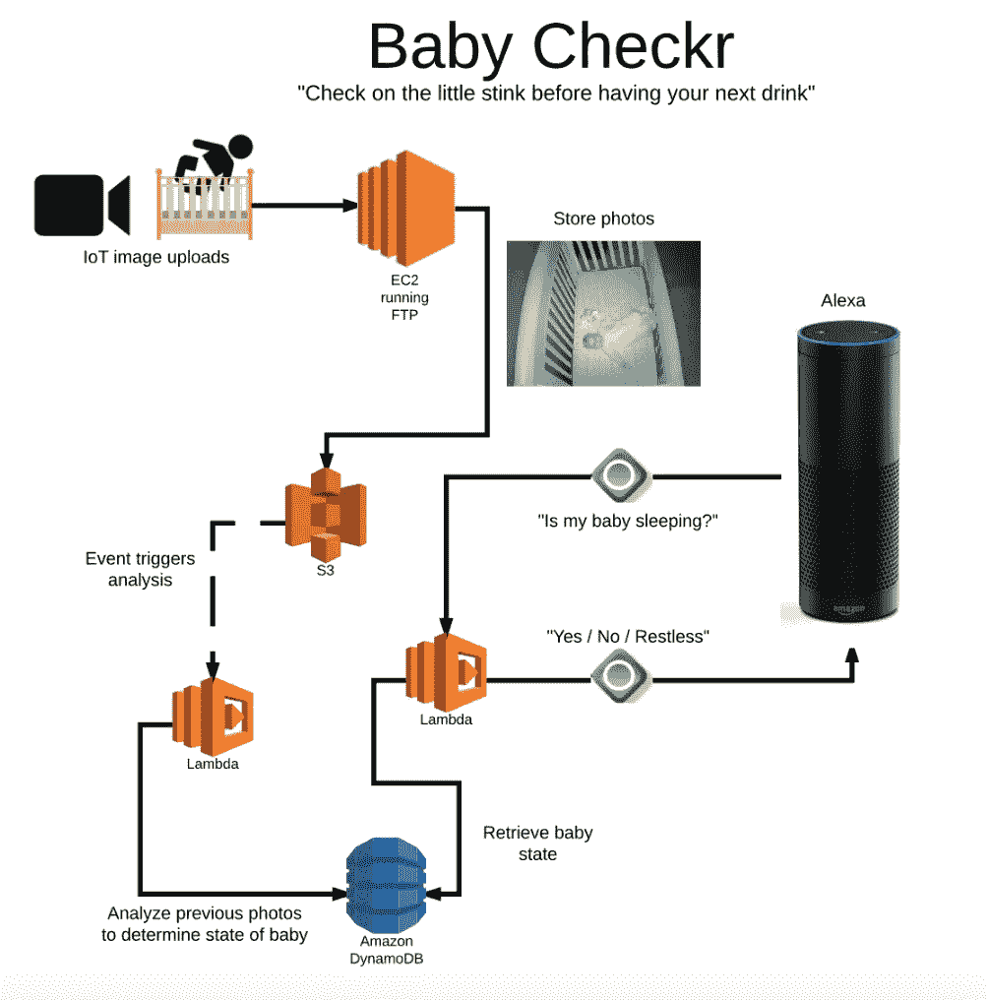

# 在 AWS re:Invent 上加冕新亚马逊 Alexa 冠军

> 原文：<https://medium.com/capital-one-tech/crowning-the-new-amazon-alexa-champ-at-aws-re-invent-85a55479fabf?source=collection_archive---------1----------------------->

今年在 AWS re:Invent 上，Capital One 和亚马逊联手赞助了 Alexa 技能挑战赛。专注于促进语音技术的发展，Alexa 技能挑战赛要求参与者使用 Alexa 技能套件构建令人信服的创新语音体验。一些参与者建立了新的技能，一些人将流行的 API 与 Alexa 联系起来，一些人创建了交互式 Alexa 游戏，一些人将语音控制添加到物联网项目中。

作为一名 Alexa 冠军和 Capital One 的工程师，我很荣幸能够为这次活动提供我的专业知识。参赛作品令人惊叹，展示了这个不断发展的语音平台的多功能性

# 第一名——婴儿检查者

第一名不仅结合了 Alexa 语音平台的功能，还结合了图像分析。完整的文章在 [Hackster.io](https://www.hackster.io/baby-checkr/baby-checkr-2f9924) 上，但这里有一个很好的技巧演示。

Technology View including Voice Interaction for Baby Checkr

虽然你可能认为创建一个新的 Alexa 技能很难，但这个条目是使用 Alexa 平台和无服务器架构在短短几天内创建的。一个 Alexa 的技能来确定你的宝宝是否在睡觉，Baby Checkr 利用 Foscam 安全摄像头，Lamba，DynamoDB，EC2 和 S3 来*“在你喝下一杯之前检查一下小臭味”。*

# 决赛选手

在竞赛的 233 名参与者中，十个项目被选为 Baby Checkr 的“亚军”。许多参赛作品使用了第三方 API，并且大量使用了一些 AWS 服务，包括 Lambda、S3 和 DynamoDB。从快速浏览每项技能提供的功能可以看出，竞争非常激烈。

一位云计算专家创造了一只[声控混沌猴子](https://www.hackster.io/a-cloud-guru/alexa-chaos-monkey-280d79)能够测试 AWS 环境的恢复能力，根据命令关闭实例。技术操作的粉丝会感谢 Alexa 在[传呼机任务](https://www.hackster.io/turbulent-pandas/alexa-pagerduty-e32cef)上的帮助，允许不用手就可以更新门票。用 WordPress？如果是这样，使用 [Alexa 插件](https://www.hackster.io/tom-harrigan280/alexawp-20a282)使任何 WordPress 站点都能够创建 Alexa 技能，允许用户通过语音消费站点内容。

并非所有的项目都以办公室为重点。用餐时间技能不仅可以帮助用户找到最近的餐馆，还可以让他们使用 API 知道餐馆的等待时间。需要电影票吗？ [GetTickets](https://www.hackster.io/rleyh/gettickets-c54778) 技能不仅可以找到喜欢的电影，它还可以发送带有购票链接的短信。如果你只想呆在家里喝杯啤酒，有[啤酒侦察](https://www.hackster.io/i-think-i-ll-have-another/beer-scout-powered-by-untappd-46bda3)，这是一种利用来自 Untappd 的 API 来查找和评论啤酒的技能，甚至可以将它们添加到你的愿望清单中。

[火星漫游技能](https://www.hackster.io/kevin-hakanson/mars-rover-mission-a-slow-paced-adventure-game-971ae2)是一款冒险游戏，让你只用声音就能控制火星探索漫游器精神。需要锻炼助手吗？那么[塔巴塔锻炼](https://www.hackster.io/tabata-workout/tabata-workout-075a2f)就是适合你的技能。通过 Alexa 进行高强度的 20 秒间歇训练，并记录你的重复次数以追踪进度。父母可以获得一些额外的帮助，通过允许 Alexa 跟踪婴儿的健康状况，让新父母的生活更容易。只需说*“宝宝吃了 20 盎司”*或者“*我的宝宝需要一片新尿布”*就可以上手了。

快速软件开发的一个流行演示是[赶上我](https://www.hackster.io/chris-coombs/catch-me-up-your-no-pics-instagram-fix-989f28)。对于那些关注今年大会产品发布的人来说，发布的新服务之一是 [Amazon Rekognition](https://aws.amazon.com/rekognition) 。Rekognition 允许开发人员将图像分析添加到他们的应用程序中。Catch Me Up skill 已经有了这项新服务的原型并投入使用——就在周二推出的 48 小时后！

# 谢谢你

我很荣幸能参加 Alexa 技能挑战赛的评审。这是一次很棒的经历，更不用说是今年 AWS re:Invent 大会的一个很好的补充。我希望能很快看到这些技能的发表，并感谢所有参与这次挑战的人。

要了解更多关于 Capital One 的 API、开源、社区活动和开发人员文化的信息，请访问我们的一站式开发人员门户网站 DevExchange。