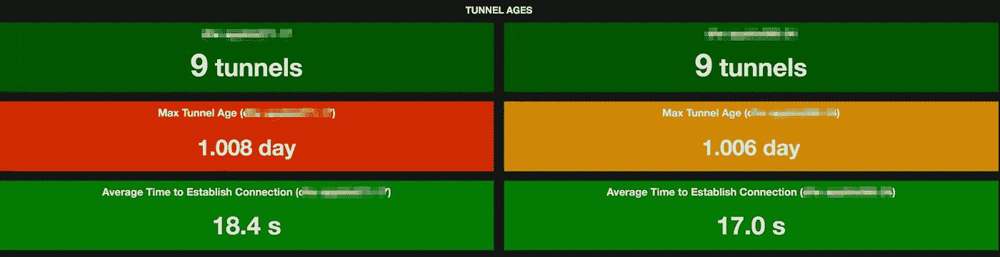
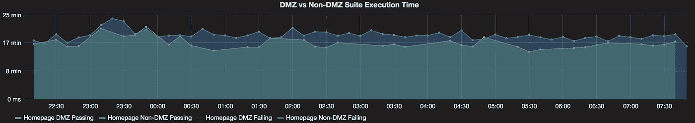

# 乌鸦巢，酱连接管理器

> 原文：<https://medium.com/walmartglobaltech/crows-nest-the-sauce-connect-manager-c8489554748b?source=collection_archive---------3----------------------->

photo credit: [AJEL](https://pixabay.com/en/mast-crow-s-nest-sailing-ship-655257/)

# 越过云

我们喜欢让我们的测试自动化远程运行(例如在云中)。在某些情况下，本地环境对于庞大的测试自动化环境矩阵来说是不够的。想象一下，您的分析团队要求测试涵盖所有这些内容

*   最新的两个 Chrome 版本
*   最新的两个**火狐**版本
*   最新**游猎**
*   最新**网络浏览器**
*   最新**微软 Edge**
*   **Windows 10**
*   **Windows 8**
*   **马科斯塞拉**

考虑到维护成本，你真的想自己一个人做这些吗？

自动化测试环境云提供商，比如 [Saucelabs](https://saucelabs.com/company) ，让你可以访问所有这些环境。通过将我们的测试指向他们的即插即用环境，我们可以抛开这些顾虑，享受咖啡，等待结果。

# 渗透

受到防火墙的保护，内部网络不应该被公司外部看到。但是这是否意味着运行在云上的测试看不到运行在内部网络中的服务器呢？不，一点也不。自动化测试环境云提供商已经想到了。例如，Saucelabs 提供了一个名为 [**Sauce Connect**](https://wiki.saucelabs.com/display/DOCS/Sauce+Connect+Proxy) 的代理来允许测试穿透防火墙。

拥有对我们内部网络进行远程测试访问的方法是最重要的。这意味着您可以将云视为您的本地。我们在 Walmartlabs 中的所有 Github pull 请求验证任务都基于 Sauce Connect。当一个开发人员将他的变更公关到 git repo 中时，Jenkins 会

1.  获取 PR，构建本地 env 并做一些初步检查
2.  在 Jenkins 节点上打开 Sauce Connect
3.  通过 Saucelabs 云触发测试
4.  关闭酱连接

我们所有的 PR 验证都是模拟和独立的，这意味着测试中的服务器/系统将在内部网络中的 Jenkins 节点上运行，并且在测试期间不会从 Jenkins 节点发出外部请求。如果没有像 Sauce Connect 这样的代理技术，我们将无法在云上运行它们。

# 安全渗透

代理非常有用，但另一方面，让第三方完全访问我们的内部网络安全吗？你已经知道答案了。我们必须限制外部接触可控的东西。

## 非军事区

通过与我们的信息安全和网络工程部门合作，我们创建了一个 DMZ(非军事区)网络。所有从 Saucelabs 到我们内部网络的请求都必须通过这个 DMZ 网络。更严格地说，我们只允许 DMZ 网络通过给定范围的端口访问内部 Jenkins 节点。

整个设置意味着我们必须在 DMZ 网络中设置 Sauce Connect。

## 酱连接池

我们没有在 Jenkins 测试运行时启动新的 Sauce Connect，而是创建了一个 Sauce Connect 池，当测试开始时，许多 Sauce Connect 都准备好了。

这个游泳池既是好消息也是坏消息。好消息是，Sauce Connect 原生支持池模式(称为[高可用模式](https://wiki.saucelabs.com/display/DOCS/High+Availability+Sauce+Connect+Proxy+Setup))。坏消息是，在其高可用性模式中存在一些已知问题，例如

1.  运行的时间越长，Sauce Connect 的性能就越低。
2.  没有办法让一个死了的连接自己复活。当它死了，它就死了。

它的维护也需要繁琐的手动操作(我们不喜欢任何手动操作)。我们希望自动监控这个池**，以防池中的一个或多个 Sauce 连接失效，并且由于性能下降，它还应该定期重启池中的所有 Sauce 连接。**

## **乌鸦巢**

**为了解决所有这些问题，我们创造了[乌鸦巢](https://github.com/TestArmada/crows-nest)。Crows-Nest 监控所有的 Sauce 连接池(是的，出于性能原因，我们实际上运行两个池)。乌鸦巢做以下事情**

1.  **检查每个 Sauce 连接的可用性**
2.  **推出新的酱连接，以取代死亡的**
3.  **定期向 statsd 报告 Sauce 连接的运行状况和状态**

**设计和实现的细节可以在它的[自述文件](https://github.com/TestArmada/crows-nest/blob/master/README.md#design)中找到。为了您的方便，乌鸦巢甚至是码头。**

**建立一个乌鸦巢很容易。它既可以作为独立的进程运行，也可以作为带有 [pm2](https://github.com/Unitech/pm2) 的守护进程运行。**

**由于 Crows-Nest 将它的状态发送到 [statsd](https://github.com/etsy/statsd) ，我们可以可视化我们的稳定性，并更好地了解我们的 Sauce 连接是如何运行的，可视化报告有助于我们更好地了解我们的 Sauce 连接如何服务于测试。**

****

**Sauce Connect status from grafana**

**当您的网络或 Saucelabs 出现故障时，Sauce Connect 可能无法重新启动。如果需要，乌鸦巢最多允许 10 次重试。**

**所以我们典型的乌鸦巢场景是**

1.  **一个鸟巢管理和多个酱连接过程**
2.  **乌鸦巢将在太平洋时间凌晨 3 点重新启动所有酱连接**
3.  **Crows-Nest 将向 statsd 和 Grafana 报告 Sauce 连接状态(开始时间、停止时间、重试次数、当前状态)**
4.  **乌鸦巢将保持监测酱连接状态，并重新启动时，它死了**

**我们在 WalmartLabs 内部的 DMZ 网络中运行 Crows-Nest 作为监管程序。通过 Crows-nest，我们已经成功地将 Jenkins 上的所有测试迁移到 DMZ 网络中，并受到安全监控。**

****乌鸦巢带来的惊喜:测试性能提升****

**在我们比较使用单个 Sauce 连接和使用一个 Crows-Nest 监控的 Sauce 连接池的测试性能时，我们发现使用 Sauce 连接池有一个非常有趣的副作用:**测试运行速度大约快 10%到 15%**。**

****

**DMZ vs Non-DMZ test execution**

## **下一步是什么**

**乌鸦巢也可以作为酱连接管理器。我们对乌鸦巢的下一个目标是将其集成到[麦哲伦](https://github.com/TestArmada/magellan)中作为酱连接管理器，这样我们的用户就可以像我们的詹金斯一样在类似的设置中调试他们的测试。**

# **拥抱云**

**在云上运行内部自动化测试的能力让我们的生活变得更加轻松。更好的实用程序/工具有助于使测试运行更加容易和一致。如果你在你的酱油实验室设置中看到类似的问题，我建议你试试乌鸦巢。**