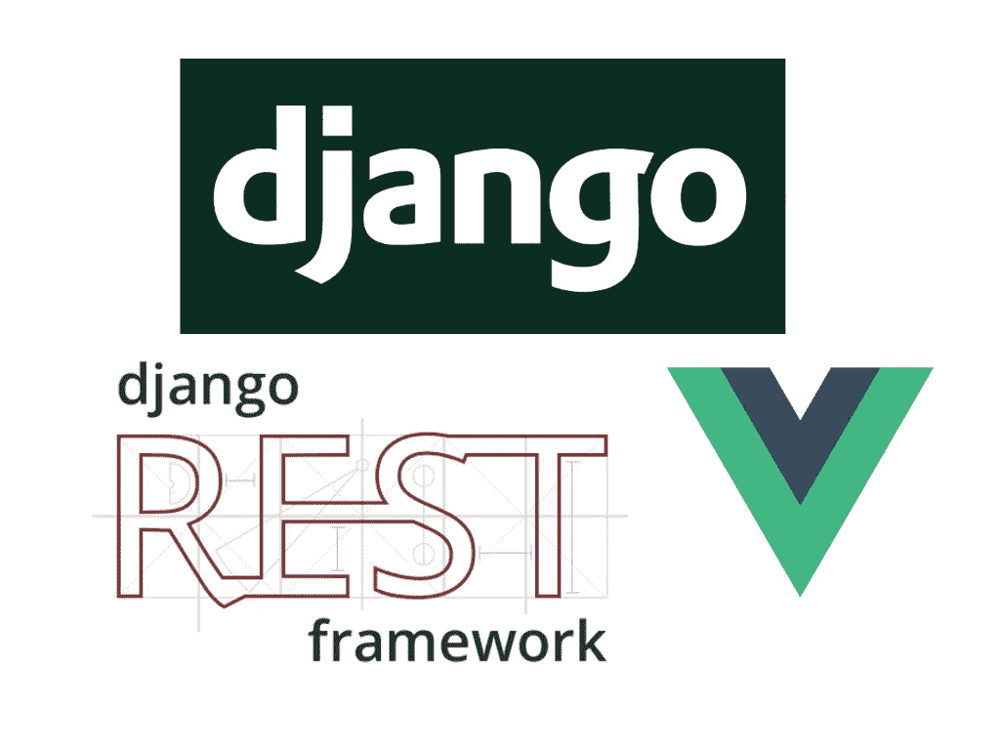
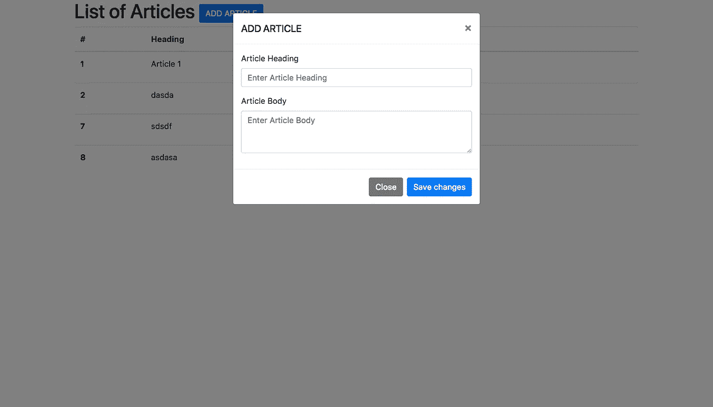
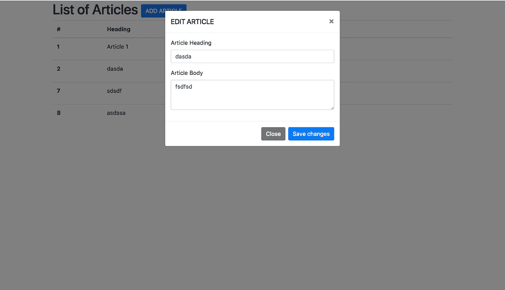

# 使用 Vue.js 和 Django 的 CRUD 应用程序

> 原文：<https://medium.com/quick-code/crud-app-using-vue-js-and-django-516edf4e4217?source=collection_archive---------1----------------------->



DJANGO VUE JS

在本教程中，你将学习如何使用 Vue.js 2.x 和 Django 2.0.2 制作一个简单的 CRUD 应用程序。Vue.js 是用于构建用户界面的渐进式框架，而 Django 是鼓励快速开发的高级 python 开发框架。

按照以下步骤使用 Vue.js 和 Django 制作一个 CRUD 应用程序

*   安装 Django
*   制作 Django 项目和应用程序
*   创建模型和迁移
*   安装 Django-rest-framework
*   创建序列化程序、视图集和路由器
*   用 Django 配置 Vue.js

# 安装 Django

确保你的 pc 上安装了 python 3，pip，virtualenv(Django 2.0 版本已经去掉了对 python 2.x 版本的支持)。如果您已经在系统上安装了 django，那么您可以跳过这些步骤，直到创建项目。

创建一个项目文件夹，并从文件夹内的终端运行命令

```
virtualenv venv -p $(which python3)
```

> Virtualenv 为 python 包提供了虚拟环境，因此它不会损害你的全局包版本

然后激活这个虚拟。

```
source venv/bin/activate
```

如果它被激活，您将看到(venv)写在命令的开头。现在安装 Django

```
pip install Django
```

# 制作 Django 项目和应用程序

现在我们已经在我们的 virtualenv 中安装了 django 的最新版本，现在在同一个文件夹中创建一个项目

```
django-admin startproject myproject
```

将创建一个 myproject 文件夹，其中包含一个 manage.py 文件和一个包含 settings.py 的 myproject 文件夹，settings . py 包含项目的所有设置。在 django，一切都被分解成小应用程序，所以我们会创建一个应用程序。进入包含 manage.py 的 myproject 文件夹，运行以下命令

```
python manage.py startapp article
```

这将创建一个文件夹文章，其中包含文件 models . py admin . py tests . py views . py admin . py apps . py 和 migrations 文件夹。

模型包含数据库模型，管理包含 django 生成的管理界面的配置，测试用于为您的应用程序编写测试，视图包含与模板和模型交互的控制器功能，迁移文件夹包含由我们的模型生成的数据库迁移。在进一步移动之前，在安装的应用程序部分的 myproject 目录/my project/my project/settings . py 旁边的设置文件中提及应用程序名称，以便我们的项目可以访问该应用程序。

```
INSTALLED_APPS = [
 ‘django.contrib.admin’,
 ‘django.contrib.auth’,
 ‘django.contrib.contenttypes’,
 ‘django.contrib.sessions’,
 ‘django.contrib.messages’,
 ‘django.contrib.staticfiles’,
 ‘**article**’
]
```

# 创建模型和迁移

模型是数据库模型，或者你可以说是数据库字段。Django orm 是高度定制的，它可以从模型中创建数据库结构和数据库迁移。

在文章应用程序内的 models.py 中创建文章模型

```
# Create your models here.
class Article(models.Model):
    article_id = models.AutoField(primary_key=True)
    article_heading = models.CharField(max_length=250)
    article_body = models.TextField()
```

> 以获得 django 模型的更多信息。参考此链接[https://docs.djangoproject.com/en/2.0/topics/db/models/](https://docs.djangoproject.com/en/2.0/topics/db/models/)

现在为模型进行迁移。转到包含 manage.py 的基本 myproject 文件夹并运行

```
python manage.py makemigrations
```

您将获得以下输出，说明您的迁移是在 migrations 文件夹中创建的

```
Migrations for ‘article’:
 article/migrations/0001_initial.py
 — Create model Article
```

现在迁移这个文件，为它创建一个数据库结构。

```
python manage.py migrate
```

运行之后，你会看到很多迁移正在进行，有一些用户系统(默认由 django 提供)你可以在你的应用程序中使用。在列表中你也会发现上面的迁移。

# **安装 Django-rest 框架**

现在我们将安装 django rest 框架。Django rest framework 是一个构建在 Django 之上的库，用于制作 rest api。你可以使用 django 的自定义函数来创建 api，但是你会错过一些安全异常或者一些状态或者基础问题。Django rest 框架已经考虑了这些问题。所以使用前不用担心。对于 django 新手来说，[最佳 django 教程](https://blog.coursesity.com/best-django-tutorials/)列表是了解 Django 的好方法。

> 在 http://www.django-rest-framework.org/[获得更多关于 django-rest-framework 的信息](http://www.django-rest-framework.org/)

安装 django rest 框架

```
pip install djangorestframework
```

更新 rest 框架的 settings.py 文件

```
INSTALLED_APPS = [
 ‘django.contrib.admin’,
 ‘django.contrib.auth’,
 ‘django.contrib.contenttypes’,
 ‘django.contrib.sessions’,
 ‘django.contrib.messages’,
 ‘django.contrib.staticfiles’,
 ‘article’,
 **‘rest_framework’** ]
```

终于耶！！创建 api 的工作已经完成了 70%,现在开始创建视图集和路由器。

# 创建序列化程序、视图集和路由器

在文章内部创建一个文件**serializer . py**它包含了 api 的序列化器。序列化器允许将查询集和模型实例等复杂数据转换为原生 Python 数据类型，然后可以轻松地呈现为`JSON`、`XML`或其他内容类型。我们来做序列化器吧。

```
from rest_framework import serializers
from .models import Articleclass ArticleSerializer(serializers.ModelSerializer):
    class Meta:
        model = Article
        fields = '__all__'
```

首先，我们从 rest 框架库中导入 serializers 类，然后导入我们必须构造其数据的模型。为我们的序列化程序定义一个类，将基类作为 rest 框架序列化程序。在元描述中提到模型及其字段

> 在这里获得更多关于串行器的信息:[http://www.django-rest-framework.org/api-guide/serializers/](http://www.django-rest-framework.org/api-guide/serializers/)

现在让我们创建视图集。在同一个文件夹中创建一个 **viewsets.py** 。

Django REST 框架允许您将一组相关视图的逻辑组合到一个类中，称为`ViewSet`。在其他框架中，你可能还会发现概念上类似的实现，比如“资源”或“控制器”。

```
from rest_framework import viewsets
from .models import Article
from .serializers import ArticleSerializerclass ArticleViewSet(viewsets.ModelViewSet):
    queryset = Article.objects.all()
    serializer_class = ArticleSerializer
```

首先，我们导入 viewsets 类，然后导入我们的模型和序列化程序(我们在上一步中创建的)。现在定义视图集类 ArticleViewSet i，我们定义了查询时得到的数据的 **queryset** ，然后定义了序列化该数据的 **serializer_class** 。

> 在这里获得更多关于视图集的信息:[http://www.django-rest-framework.org/api-guide/viewsets/](http://www.django-rest-framework.org/api-guide/viewsets/)

现在，在 django 中创建路由器比创建 rest api 晚了一步。一些 Web 框架(如 Rails)提供了自动确定应用程序的 URL 应该如何映射到处理传入请求的逻辑的功能。路由器会自动创建这样的请求。此外，为各种应用程序的所有路由器创建一个公共文件，以轻松处理 api。

在 myproject 文件夹中创建一个文件 **routers.py** ，其中有 **settings.py** 和 **urls.py** 文件。

```
from rest_framework import routers
from article.viewsets import ArticleViewSetrouter = routers.DefaultRouter()router.register(r’article’, ArticleViewSet)
```

首先，当我们从 rest_framework 导入路由器，然后导入我们的视图集，然后我们定义函数 router，我们稍后在这里为各种 URL 输入我们的视图集，现在 api 有点像链接到 ArticleViewSet 的 **/article** 。

> 在这里获得更多关于视图集的信息:[http://www.django-rest-framework.org/api-guide/routers/](http://www.django-rest-framework.org/api-guide/routers/)

现在，我们将这个路由器文件导入到 urls.py 中，它包含了我们应用程序的所有 url 路由。

```
from django.contrib import admin
from django.urls import path, **include**
**from .routers import router**urlpatterns = [
 path(‘admin/’, admin.site.urls),
 **path(‘api/’, include(router.urls))** ]
```

我们已经导入了路由器文件，以包含路由器文件中构建的所有 URL。我们添加了 api/关键字只是为了分隔 api urls，现在它们将从 **/api/article 中调用。**

现在，您已经完成了 api 部分

您获得了以下 api

**获取** : /api/article/

这将给出所有文章

**帖子**:/API/文章

这将有助于增加新的文章

**删除**:/API/article/{ article _ id }/

这将有助于删除文章

**获取**:/API/article/{ article _ id }/

这将返回特定的文章

**放**:/API/article/{ article _ id }/

这将有助于更新特定文章的所有字段

**补丁**:/API/article/{ article _ id }/

这将有助于在文章内部进行修补

# **用 Django 配置 vue . js**

现在让我们在模板中集成这些 api。在文章文件夹中创建一个文件夹**模板**在模板文件夹中创建一个文件**index.html**

```
<!DOCTYPE html>
<html lang=”en”>
 <head>
 <meta charset=”utf-8">
 <title>Vue-js | Django | Crud App</title>
 <meta name=”viewport” content=”width=device-width, initial-scale=1.0">
 <meta name=”description” content=”A simple crud app made with the vue js and django”><meta name=”keywords” content=”vuejs, django, crudapp, restapi”>
 <! — bootstap →
 <link rel=”stylesheet” href=”[https://maxcdn.bootstrapcdn.com/bootstrap/4.0.0/css/bootstrap.min.css](https://maxcdn.bootstrapcdn.com/bootstrap/4.0.0/css/bootstrap.min.css)" integrity=”sha384-Gn5384xqQ1aoWXA+058RXPxPg6fy4IWvTNh0E263XmFcJlSAwiGgFAW/dAiS6JXm” crossorigin=”anonymous”>
 <! — boostrap css →</head><body><! — bootrtap js files →
 <script src=”[https://code.jquery.com/jquery-3.2.1.slim.min.js](https://code.jquery.com/jquery-3.2.1.slim.min.js)" integrity=”sha384-KJ3o2DKtIkvYIK3UENzmM7KCkRr/rE9/Qpg6aAZGJwFDMVNA/GpGFF93hXpG5KkN” crossorigin=”anonymous”></script>
 <script src=”[https://cdnjs.cloudflare.com/ajax/libs/popper.js/1.12.9/umd/popper.min.js](https://cdnjs.cloudflare.com/ajax/libs/popper.js/1.12.9/umd/popper.min.js)" integrity=”sha384-ApNbgh9B+Y1QKtv3Rn7W3mgPxhU9K/ScQsAP7hUibX39j7fakFPskvXusvfa0b4Q” crossorigin=”anonymous”></script>
 <script src=”[https://maxcdn.bootstrapcdn.com/bootstrap/4.0.0/js/bootstrap.min.js](https://maxcdn.bootstrapcdn.com/bootstrap/4.0.0/js/bootstrap.min.js)" integrity=”sha384-JZR6Spejh4U02d8jOt6vLEHfe/JQGiRRSQQxSfFWpi1MquVdAyjUar5+76PVCmYl” crossorigin=”anonymous”></script>

 <! — vue.js files →
 <script src=”[https://cdn.jsdelivr.net/npm/vue@2.5.13/dist/vue.js](https://cdn.jsdelivr.net/npm/vue@2.5.13/dist/vue.js)"></script>
 <script src=”[https://cdn.jsdelivr.net/npm/vue-resource@1.3.5](https://cdn.jsdelivr.net/npm/vue-resource@1.3.5)"></script></body>
</html>
```

在这个文件中，你会看到我添加了用于设计的引导 css 和 js cdn 链接。然后我添加了 vue.js 链接。vue.js 是主要的 **vue js** 库，然后还有用于调用 rest api 的 **vue-resource** 库。

还要更新 urls.py 文件

```
from django.contrib import admin
from django.urls import path, include
from .routers import router
**from django.views.generic import TemplateView**urlpatterns = [
    path('admin/', admin.site.urls),
    path('api/', include(router.urls)),
    **path('article', TemplateView.as_view(template_name='index.html')),**
]
```

下面我们将在脚本标签中创建一个 vue js 实例

```
<script type=”text/javascript”>
 new Vue({
   el: ‘#starting’,
   delimiters: [‘${‘,’}’],
   data: {
   articles: [],
   loading: false,
   currentArticle: {},
   message: null,
   newArticle: { ‘article_heading’: null, ‘article_body’: null },
 },
 mounted: function() {},
 methods: {}
 });
 </script>
```

现在理解了这个 vue 实例，el 是 divison 的 id 或类(div 在 vue js 实例将要运行的主体中，分隔符是我们在 vue js 变量周围应用的标签，以在 html 文件中显示数据，数据包含 vue js 库中的所有数据，mounted 是在 vue js 实例挂载之前运行的函数，在此之前有包含将在 vue 实例中运行的所有函数的方法。

首先，我们要添加以下方法

*   getArticles →给出所有文章
*   getArticle →给出特定冠词的词
*   addArticle →这将添加一篇新文章
*   更新文章→这将更新文章
*   删除文章→删除文章

```
mounted: function() {
 this.getArticles();
},
methods: {
 **getArticles**: function() {
  this.loading = true;
  this.$http.get(‘/api/article/’)
      .then((response) => {
        this.articles = response.data;
        this.loading = false;
      })
      .catch((err) => {
       this.loading = false;
       console.log(err);
      })
 },
 **getArticle**: function(id) {
  this.loading = true;
  this.$http.get(`/api/article/${id}/`)
      .then((response) => {
        this.currentArticle = response.data;
        this.loading = false;
      })
      .catch((err) => {
        this.loading = false;
        console.log(err);
      })
 },
 **addArticle**: function() {
  this.loading = true;
  this.$http.post(‘/api/article/’,this.newArticle)
      .then((response) => {
        this.loading = false;
        this.getArticles();
      })
      .catch((err) => {
        this.loading = false;
        console.log(err);
      })
 },
 **updateArticle**: function() {
  this.loading = true;
  this.$http.put(`/api/article/${this.currentArticle.article_id}/`,     this.currentArticle)
      .then((response) => {
        this.loading = false;
        this.currentArticle = response.data;
        this.getArticles();
      })
      .catch((err) => {
        this.loading = false;
        console.log(err);
      })
 },
 **deleteArticle**: function(id) {
  this.loading = true;
  this.$http.delete(`/api/article/${id}/` )
      .then((response) => {
        this.loading = false;
        this.getArticles();
      })
      .catch((err) => {
        this.loading = false;
        console.log(err);
      })
 }
```

在 mounted 函数中，我们运行了 getArticles 方法，以便在页面加载时获取所有文章。然后在 getArticles 中，我们有 loading 变量，这有助于显示 api 加载时的页面加载。然后我们有 vue 资源代码来调用 api 并处理它的响应。中的每个函数都是一样的

```
this.$http.**request_type**(**‘api_url’,**payload)
    .then((response) => {
      // code if the api worked successfully
    })
    .catch((err) => {
      // code if the api show some error
    })
```

现在尝试在 html 文件中实现这些功能。

```
<body>
    **<div id="starting">**
      <div class="container">
        <div class="row">
          <h1>List of Articles
          <button class="btn btn-success">ADD ARTICLE</button>
          </h1>
          <table class="table">
            <thead>
              <tr>
                <th scope="col">#</th>
                <th scope="col">Heading</th>
                <th scope="col">Action</th>
              </tr>
            </thead>
            <tbody>
              <tr v-for="article in articles">
                <th scope="row">${article.article_id}</th>
                <td>${article.article_heading}</td>
                <td>
                  <button class="btn btn-info" v-on:click="getArticle(article.article_id)">Edit</button>
                  <button class="btn btn-danger" v-on:click="deleteArticle(article.article_id)">Delete</button>
                </td>
              </tr>
            </tbody>
          </table>
        </div>
      </div>
      <div class="loading" v-if="loading===true">Loading&#8230;</div>
    </div>
```

这是我们的 html 主体的基本结构，在这里我们使用 v-for 标签显示文章，该标签将循环遍历文章数组。然后我们显示了 vue.js 数据。您会注意到 vue.js 数据包含在这些标签 **${}** 中，这些标签是在 vue 实例中设置的分隔符。如果您看到粗体 div，情况也是如此。您将看到我们在 vue 实例中提到的 id="starting"。现在工作更多的细节。

首先添加文章弹出。在 index.html 文件中进行以下更改

```
<button  type="button" class="btn btn-primary" **data-toggle="modal" data-target="#addArticleModal"**>ADD ARTICLE</button>
```

现在，我们将在 table 标签下添加 addArticle 模态

```
<!-- Add Article Modal -->
          <div class="modal fade" id="addArticleModal" tabindex="-1" role="dialog" aria-labelledby="exampleModalLongTitle" aria-hidden="true">
            <div class="modal-dialog" role="document">
              <div class="modal-content">
                <div class="modal-header">
                  <h5 class="modal-title" id="exampleModalLongTitle">ADD ARTICLE</h5>
                  <button type="button" class="close" data-dismiss="modal" aria-label="Close">
                    <span aria-hidden="true">&times;</span>
                  </button>
                </div>
                <form **v-on:submit.prevent="addArticle()"**>
                <div class="modal-body">
                    <div class="form-group">
                      <label for="article_heading">Article Heading</label>
                      <input
                        type="text"
                        class="form-control"
                        id="article_heading"
                        placeholder="Enter Article Heading"
 **v-model="newArticle.article_heading"**                        required="required" >
                    </div>
                    <div class="form-group">
                      <label for="article_body">Article Body</label>
                      <textarea
                        class="form-control"
                        id="article_body"
                        placeholder="Enter Article Body"
 **v-model="newArticle.article_body"**                        required="required"
                        rows="3"></textarea>
                    </div>
                </div>
                <div class="modal-footer">
                  <button type="button" class="btn btn-secondary" data-dismiss="modal">Close</button>
                  <button type="submit" class="btn btn-primary">Save changes</button>
                </div>
                </form>
              </div>
            </div>
           **<div class="loading" v-if="loading===true">Loading&#8230;</div>   **       
          </div>
          <!-- End of article modal -->
```

在这个模式下，你会看到 v-on:submit.prevent 函数来提交表单。表单的每个输入由 v-model 属性保存，该属性与 vue js 实例中的数据进行映射。此外，还有 v-if 子句，它将运行正在加载的 api。当 api 请求正在加载时，将在屏幕上显示加载程序。有些 css 类就是为此而写的。请在下面查看 github repo。



Add Article Window

**现在编辑部分和视图**

当你点击编辑时，你会看到同样的表单，其中有你可以编辑的当前点击文章信息。

```
<button class="btn btn-info" **v-on:click="getArticle(article.article_id)"**>Edit</button>
```

我们已经为视图中的每篇文章定义并提到了这个函数。我们将很少更新 vue.js 函数来查看编辑模式。

```
getArticle: function(id) {
          this.loading = true;
          this.$http.get(`/api/article/${id}/`)
              .then((response) => {
                this.currentArticle = response.data;
                **$("#editArticleModal").modal('show');**
                this.loading = false;
              })
              .catch((err) => {
                this.loading = false;
                console.log(err);
              })
        },
```

现在我们要在添加模态代码下面添加编辑模态代码

```
<!-- Edit Article Modal -->
          <div class="modal fade" id="**editArticleModal**" tabindex="-1" role="dialog" aria-labelledby="exampleModalLongTitle" aria-hidden="true">
            <div class="modal-dialog" role="document">
              <div class="modal-content">
                <div class="modal-header">
                  <h5 class="modal-title" id="exampleModalLongTitle">EDIT ARTICLE</h5>
                  <button type="button" class="close" data-dismiss="modal" aria-label="Close">
                    <span aria-hidden="true">&times;</span>
                  </button>
                </div>
                <form **v-on:submit.prevent="updateArticle()"**>
                <div class="modal-body">
                    <div class="form-group">
                      <label for="article_heading">Article Heading</label>
                      <input
                        type="text"
                        class="form-control"
                        id="article_heading"
                        placeholder="Enter Article Heading"
 **v-model="currentArticle.article_heading"**                        required="required" >
                    </div>
                    <div class="form-group">
                      <label for="article_body">Article Body</label>
                      <textarea
                        class="form-control"
                        id="article_body"
                        placeholder="Enter Article Body"
 **v-model="currentArticle.article_body"**                        required="required"
                        rows="3"></textarea>
                    </div>
                </div>
                <div class="modal-footer">
                  <button type="button" class="btn btn-secondary m-progress" data-dismiss="modal">Close</button>
                  <button type="submit" class="btn btn-primary">Save changes</button>
                </div>
                </form>
              </div>
            </div>
            <div class="loading" v-if="loading===true">Loading&#8230;</div>
          </div>
          <!-- End of edit article modal -->
```

它几乎是相似的，只是变量发生了变化。



EDIT ARTICLE

## **现在删除部分**

如果您愿意观察，我们已经完成了删除部分

```
<button class=”btn btn-danger” **v-on:click=”deleteArticle(article.article_id)”**>Delete</button>
```

Yayyy！！您已经完成了教程。现在可以用 django 和 [learn vue js](https://blog.coursesity.com/best-vuejs-tutorials/) 制作 crud app 了。就做一件事。打

```
python manage.py runserver
```

然后浏览

```
[http://127.0.0.1:8000/article](http://127.0.0.1:8000/article)
```

你会看到你的 crud 应用程序工作，添加文章，编辑文章，删除文章。

请参考[**https://github.com/ShubhamBansal1997/crud-app-vuejs-django**](https://github.com/ShubhamBansal1997/crud-app-vuejs-django)查看代码，此处此 webapp 处于活动状态[**https://vue-django-crud-heroku.herokuapp.com**](https://vue-django-crud-heroku.herokuapp.com)。如果你发现任何错误，请在评论中提出。也请这些相关的文章

[](/@shubhambansal_89125/token-based-authentication-for-django-rest-framework-44586a9a56fb) [## Django Rest 框架基于令牌的认证

### Django 是一个流行的基于 python 的 web 开发框架，有一个很大的社区，被许多顶级的

medium.com](/@shubhambansal_89125/token-based-authentication-for-django-rest-framework-44586a9a56fb) [](/@shubhambansal_89125/searchfilter-using-django-and-vue-js-215af82e12cd) [## 使用 Django 和 Vue.js 搜索过滤器

### 这篇文章是我上一篇文章的延续，在那篇文章中我解释了如何使用 vue.js 2.x 和 Django 制作 CRUD api

medium.com](/@shubhambansal_89125/searchfilter-using-django-and-vue-js-215af82e12cd) 

想要更多的帮助，并想雇用我。在 shubhambansal17@hotmail.com 给我写封邮件

❤制造

**小费不胜感激！💰 😉**

**我的比特币地址**:BC 1 qysxlz 0 p 9 nlcyndeysqltdhelwpdhurglgxz 96 x

**我的以太坊地址**:0 x42c 98 e 296 b 27228d 9 ee 84 e 519 bec 8 ee 09 CAD 30