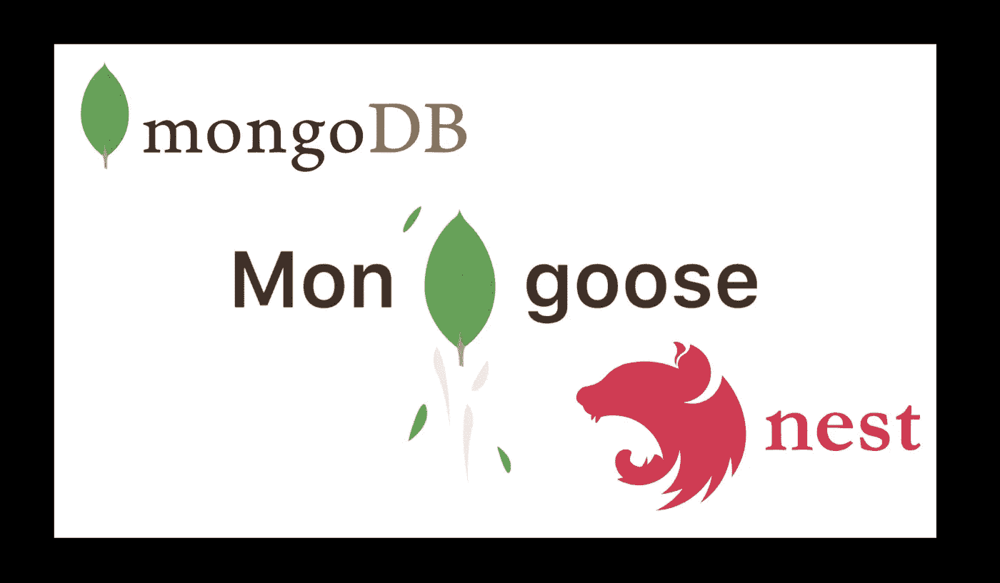
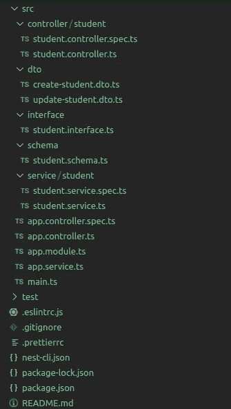
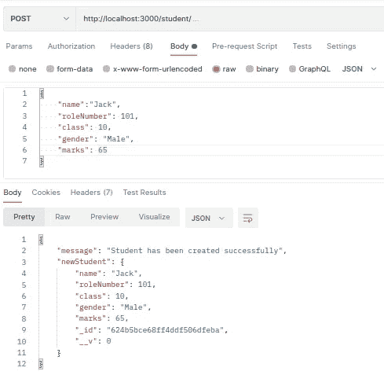
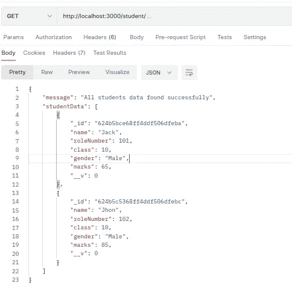
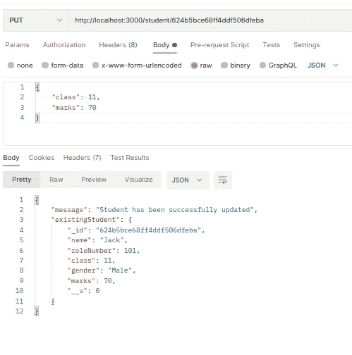
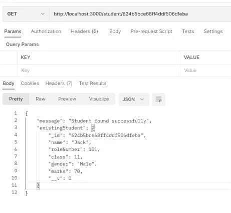
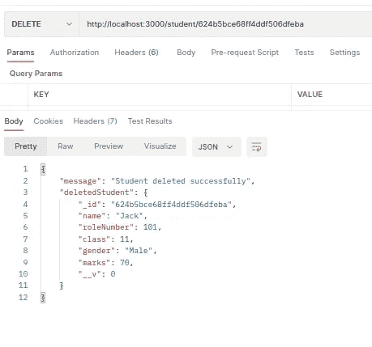

# 使用 Mongoose 的 NestJS 和 MongoDB 的 CRUD 应用程序

> 原文：<https://medium.com/globant/crud-application-using-nestjs-and-mongodb-99a0756adb76?source=collection_archive---------0----------------------->



# ***简介*** *:*

NestJS 和 MongoDB 是实现可伸缩后端的绝佳组合。在这篇博客中，我们将学习如何使用 Mongoose 作为 ORM，用 NestJS 和 MongoDB 创建 CRUD 应用程序。

实现这个 CRUD 应用程序的先决条件是，

*   我们需要 MongoDB 数据库，要么应该安装在本地，要么也可以使用云 MongoDB 数据库。在这个例子中，我在本地机器上运行了一个 MongoDB 服务器。如果需要，你可以从这个[链接](https://www.mongodb.com/try/download/community)下载 MongoDB 社区版。
*   应该已经安装了 NestJS CLI，如果没有，请使用以下命令安装。

```
npm i @nestjs/cli
```

安装完成后，我们使用下面的命令验证它是否已安装，它应该会返回已安装的 NestJS CLI。

```
nest --version
```

# **安装:**

首先，创建一个新的 NestJS 项目，并通过执行以下命令安装 MongoDB 依赖项。

```
nest new nestjs-mongodb-crud
npm install --save @nestjs/mongoose mongoose
```

# **NestJS MongoDB 配置:**

一旦项目创建完成，我们将在***app . module . ts***文件的导入中添加 MongoDB 连接。这里 ***forRoot()*** 方法从 Mongoose 包中接受与***mongose . connect()***相同的配置对象。

```
@Module({
  imports: [
    MongooseModule.forRoot('mongodb://localhost:27017',{dbName: 'studentdb'}),
  ],
})
export class AppModule {}
```

如果用户名和密码存在，那么我们还需要在连接 URL 中提及。

```
@Module({
  imports: [MongooseModule.forRoot('mongodb://<username>:<password>@localhost:27017',{dbName: 'studentdb'}),
  ],
})
export class AppModule {}
```

# **创建猫鼬模式:**

添加数据库连接后，下一步是创建一个 mongoose 模型。新建一个文件夹 ***schema*** 并在其中新建一个 schema 文件***student . schema . ts***。然后将所需的学生属性添加到文件中。添加属性后，文件将如下所示。

```
import { Prop, Schema, SchemaFactory } from "@nestjs/mongoose"@Schema()
export class Student {
   @Prop()
   name: string; @Prop()
   roleNumber: number; @Prop()
   class: number; @Prop()
   gender: string; @Prop()
   marks: number;
}export const StudentSchema = SchemaFactory.createForClass(Student);
```

在上面的代码中，我们使用了两个 NestJS 装饰器:

1> **模式**:这个装饰器将类固定为模式定义。在这里，无论我们给这个类取什么名字，它都将作为集合的名字出现。这将把我们的学生类映射到 MongoDB 学生集合

2> **Prop** :基本上，这个装饰器定义了文档中的一个属性。例如，在上面的模式中，我们共有 5 个属性，如 ***名称*** ， ***角色编号*** ， ***类*** ， ***性别*** 和 ***标志*** 。使用 Typescript 的元数据和类反射，可以自动推断这些属性的类型。

模式创建完成后，我们需要将其添加到模块级配置中。换句话说，我们必须在应用程序的上下文中指定这个模式的存在。我们需要在导入数组中添加一个条目。我们使用 ***forFeature()*** 的方法来注册当前范围内的模型。修改后的 ***app.module.ts*** 如下图。

```
import { Module } from '[@nestjs/common](http://twitter.com/nestjs/common)';
import { MongooseModule } from '[@nestjs/mongoose](http://twitter.com/nestjs/mongoose)';
import { AppController } from './app.controller';
import { AppService } from './app.service';
import { StudentSchema } from './schema/student.schema';[@Module](http://twitter.com/Module)({
  imports: [MongooseModule.forRoot('mongodb://localhost:27017/studentdb'),
  MongooseModule.forFeature([{ name: 'Student', schema: StudentSchema }])],
  controllers: [AppController],
  providers: [AppService],
})
export class AppModule {}
```

# **创建一个接口:**

一旦 mongoose 模型创建完成，我们就可以为 student 模式创建一个接口，它定义了我们的数据对象结构的外观。现在新建一个文件夹 ***interface*** 并在其中创建***student . interface . ts***文件。这里接口将从 mongoose 文档类继承属性。所有属性都是只读的，所以不能修改。

```
import { Document } from 'mongoose';export interface IStudent extends Document{
    readonly name: string;
    readonly roleNumber: number;
    readonly class: number;
    readonly gender: string;
    readonly marks: number;
}
```

# **创建 DTO 文件:**

在继续创建 DTO 文件之前，需要安装一些依赖项。实现 d to 级验证需要类验证器和类转换器。安装下列软件包。

```
npm install class-validator --save
npm install class-transformer --save
```

所以现在我们将继续创建 DTO 文件，这些文件对定义对象模型很有用。DTO 文件也可以用来定义 swagger 属性。现在新建一个文件夹 ***dto*** 和***create-student . dto . ts***文件在里面。添加所有属性以及所需的验证。将属性添加到***create-student . dto . ts***文件后，将如下所示。

```
import { IsNotEmpty, IsNumber, IsString, MaxLength } from "class-validator";export class CreateStudentDto {
    @IsString()
    @MaxLength(30)
    @IsNotEmpty()
    readonly name: string; @IsNumber()
    @IsNotEmpty()
    readonly roleNumber: number;

    @IsNumber()
    @IsNotEmpty()
    readonly class: number; @IsString()
    @MaxLength(30)
    @IsNotEmpty()
    readonly gender: string; @IsNumber()
    @IsNotEmpty()
    readonly marks: number;
}
```

在创建 DTO 文件来更新学生之前，请确保以下包存在，它将允许我们使用现有的 DTO 类属性

```
npm i [@nestjs/mapped-types](http://twitter.com/nestjs/mapped-types) --save
```

现在我们可以在 ***dto*** 文件夹中创建***update-student . dto . ts***文件。在这个文件中***UpdateStudentDto***将使用 ***PartialType*** 扩展***createsudentdto***类，使 createsudentdto 的属性可选，可以根据需要在 UpdateStudentDto 类中使用。

```
import { PartialType } from '@nestjs/mapped-types';
import { CreateStudentDto } from './create-student.dto';export class UpdateStudentDto extends PartialType(CreateStudentDto) {}
```

为了使***create-student . dto . ts***文件中提到的验证生效，我们还需要在 ***main.ts*** 文件中注册验证管道。修改后，主文件将如下所示。

```
import { ValidationPipe } from '@nestjs/common';
import { NestFactory } from '@nestjs/core';
import { AppModule } from './app.module';async function bootstrap() {
   const app = await NestFactory.create(AppModule);
   app.useGlobalPipes(new ValidationPipe());
   await app.listen(3000);
}bootstrap();
```

# **创建服务:**

现在下一步是创建一个服务类。这个服务类充当请求处理程序和数据库之间的桥梁。
新建一个文件夹 ***服务*** 和使用以下命令在其中创建***student . service . ts***文件。

```
nest generate service student
```

服务文件生成完成后，我们将实现从底层的 ***学生*** 集合中创建、读取、更新和删除学生文档的方法。我们将使用 ***学生模型*** 可用的标准方法来实现 CRUD 操作。实现这些方法后，学生服务文件将如下所示。

```
import { Injectable, NotFoundException } from '@nestjs/common';
import { InjectModel } from '@nestjs/mongoose';
import { CreateStudentDto } from 'src/dto/create-student.dto';
import { IStudent } from 'src/interface/student.interface';
import { Model } from "mongoose";
import { UpdateStudentDto } from 'src/dto/update-student.dto';@Injectable()
export class StudentService {constructor(@InjectModel('Student') private studentModel:Model<IStudent>) { }async createStudent(createStudentDto: CreateStudentDto): Promise<IStudent> {
   const newStudent = await new this.studentModel(createStudentDto);
   return newStudent.save();
}async updateStudent(studentId: string, updateStudentDto: UpdateStudentDto): Promise<IStudent> {
    const existingStudent = await        this.studentModel.findByIdAndUpdate(studentId, updateStudentDto, { new: true }); if (!existingStudent) {
     throw new NotFoundException(`Student #${studentId} not found`);
   }
   return existingStudent;
}async getAllStudents(): Promise<IStudent[]> {
    const studentData = await this.studentModel.find(); if (!studentData || studentData.length == 0) {
        throw new NotFoundException('Students data not found!');
    }
    return studentData;
}async getStudent(studentId: string): Promise<IStudent> {
   const existingStudent = await     this.studentModel.findById(studentId).exec(); if (!existingStudent) {
    throw new NotFoundException(`Student #${studentId} not found`);
   }
   return existingStudent;
}async deleteStudent(studentId: string): Promise<IStudent> {
    const deletedStudent = await this.studentModel.findByIdAndDelete(studentId); if (!deletedStudent) {
     throw new NotFoundException(`Student #${studentId} not found`);
   }
   return deletedStudent;
}
}
```

学生服务类是用***@ injectable()****decorator 呈现的。这意味着我们可以使用依赖注入的原则将服务类注入到其他类中。
在构造函数中 ***studenModel*** 被注入到服务中，***@ inject model***decorator 用于注入操作。只有在 app 模块配置中注册了模式之后，才可能进行这种注入。
我们还需要通过将学生服务添加到应用程序模块，使其在上下文中可用。基本上，我们将其添加到 ***提供者*** 数组中。*

# ***创建控制器:***

*现在，最后一步是实现控制器，以创建适当的请求处理程序来执行 CRUD 操作。通过执行下面的命令，创建一个新的文件夹 ***控制器*** 并在其中创建一个 ***学生.控制器. ts*** 文件。*

```
*nest generate controller student*
```

*一旦生成了控制器文件，在构造函数中我们将在运行时注入 StudentService 类，NestJS 将向控制器提供 StudentService 类的实例，以访问服务文件中实现的方法。*

*我们实现了标准的 ***POST、PUT、DELETE*** 和 ***GET*** 请求处理程序，并使用 StudentService 实例调用适当的方法在其中执行各种操作。*

*实现这些方法后，控制器文件将如下所示。*

```
*import { Body, Controller, Delete, Get, HttpStatus, Param, Post, Put, Res } from '@nestjs/common';
import { CreateStudentDto } from 'src/dto/create-student.dto';
import { UpdateStudentDto } from 'src/dto/update-student.dto';
import { StudentService } from 'src/service/student/student.service';@Controller('student')
export class StudentController {
   constructor(private readonly studentService: StudentService) { }@Post()
   async createStudent(@Res() response, @Body() createStudentDto: CreateStudentDto) {
  try {
    const newStudent = await this.studentService.createStudent(createStudentDto); return response.status(HttpStatus.CREATED).json({
    message: 'Student has been created successfully',
    newStudent,});
 } catch (err) {
    return response.status(HttpStatus.BAD_REQUEST).json({
    statusCode: 400,
    message: 'Error: Student not created!',
    error: 'Bad Request'
 });
 }
}@Put('/:id')
async updateStudent(@Res() response,@Param('id') studentId: string,
@Body() updateStudentDto: UpdateStudentDto) {
  try {
   const existingStudent = await this.studentService.updateStudent(studentId, updateStudentDto); return response.status(HttpStatus.OK).json({
  message: 'Student has been successfully updated',
  existingStudent,}); } catch (err) {
   return response.status(err.status).json(err.response);
 }
}@Get()
async getStudents(@Res() response) {
try {
  const studentData = await this.studentService.getAllStudents();
  return response.status(HttpStatus.OK).json({
  message: 'All students data found successfully',studentData,});
 } catch (err) {
  return response.status(err.status).json(err.response);
 }
}@Get('/:id')
async getStudent(@Res() response, @Param('id') studentId: string) {
 try {
    const existingStudent = await
this.studentService.getStudent(studentId); return response.status(HttpStatus.OK).json({
    message: 'Student found successfully',existingStudent,});
 } catch (err) {
   return response.status(err.status).json(err.response);
 }
}@Delete('/:id')
async deleteStudent(@Res() response, @Param('id') studentId: string)
{
  try {
    const deletedStudent = await this.studentService.deleteStudent(studentId); return response.status(HttpStatus.OK).json({
    message: 'Student deleted successfully',
    deletedStudent,});
  }catch (err) {
    return response.status(err.status).json(err.response);
  }
 }
}*
```

*最后，我们需要将***student controller***添加到 app 模块中，使其在上下文中可用。基本上，我们将其添加到 ***控制器*** 数组中。*

*最终的***app . module . ts***文件将如下所示:*

```
*import { Module } from '@nestjs/common';
import { MongooseModule } from '@nestjs/mongoose';
import { AppController } from './app.controller';
import { AppService } from './app.service';
import { StudentController } from './controller/student/student.controller';
import { StudentSchema } from './schema/student.schema';
import { StudentService } from './service/student/student.service';@Module({
  imports:[MongooseModule.forRoot('mongodb://localhost:27017/studentdb'),
MongooseModule.forFeature([{ name: 'Student', schema: StudentSchema }])], controllers: [AppController,StudentController],
  providers: [AppService,StudentService],
})
export class AppModule {}*
```

*毕竟，文件被创建，最终的代码结构将如下。*

**

*Project Structure*

*现在我们通过使用命令 ***npm run start*** 启动 NestJS 应用程序，我们将能够访问位于[***http://localhost:3000***](http://localhost:3000)的 CRUD 端点。*

# *REST API 客户端执行结果:*

*现在，一旦我们的项目开始运行，我们就可以在 REST API 客户端的帮助下验证端点的工作情况。对于所有 ***得到*** *，* ***放*** *，****POST****和***删除*** 端点我们得到如下成功响应。**

**1 >创建用户:**

****

**Create a user**

```
**curl --location --request POST '[http://localhost:3000/student/'](http://localhost:3000/student/') \
--header 'Content-Type: application/json' \
--data-raw '{
    "name":"Jack",
    "roleNumber": 101,
    "class": 10,
    "gender": "Male",
    "marks": 65
}'**
```

**2 >获取所有用户:**

****

**Get all users**

```
**curl --location --request GET '[http://localhost:3000/student/'](http://localhost:3000/student/')**
```

**3 >按 id 更新用户:**

****

**Update a user by id**

```
**curl --location --request GET '[http://localhost:3000/student/624b5bce68ff4ddf506dfeba'](http://localhost:3000/student/624b5bce68ff4ddf506dfeba')**
```

**4 >通过 id 获取用户:**

****

**Get a user by id**

```
**curl --location --request PUT '[http://localhost:3000/student/624b5bce68ff4ddf506dfeba'](http://localhost:3000/student/624b5bce68ff4ddf506dfeba') \
--header 'Content-Type: application/json' \
--data-raw '{
    "class": 11,
    "marks": 70
}'**
```

**5 >按 id 删除用户:**

****

**Delete a user by id**

```
**curl --location --request DELETE '[http://localhost:3000/student/624b5bce68ff4ddf506dfeba'](http://localhost:3000/student/624b5bce68ff4ddf506dfeba')**
```

# ****结论:****

**通过遵循上面记录的过程，我们已经使用 NestJS 和 MongoDB 成功地创建了 CRUD 应用程序。我们使用 mongoose 作为 ORM 来连接应用程序和数据库。我们还使用 REST API 客户机检查了创建的端点的工作情况，并验证了成功的响应。你可以在这个[链接](https://github.com/niranjangawali1993/nestjs-mongodb-crud.git)上查看实现的代码。**

**如果你对此有任何意见或疑问，请在下面的评论区提出。**