# 使用 Mendix 的 JavaScript 和客户端 API 进行 CRUD 操作

> 原文：<https://medium.com/mendix/crud-operation-using-javascript-and-client-api-c753cbcaf929?source=collection_archive---------2----------------------->

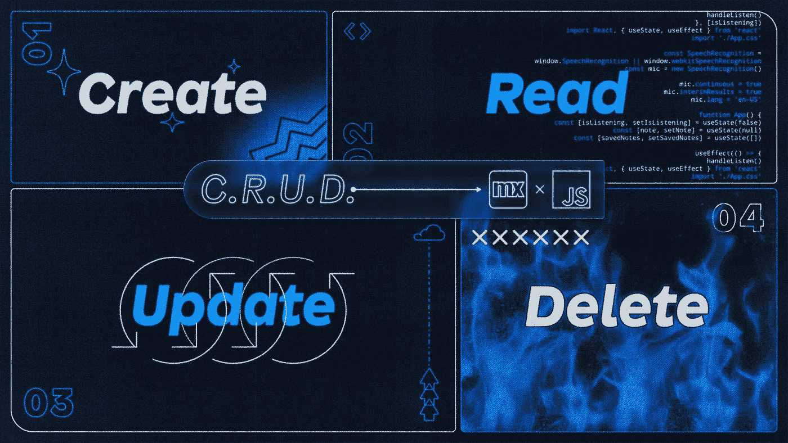

CRUD operations using Mendix’s JavaScript and Client API

# **在我们进入内容之前——我知道你在想什么；为什么要使用 JavaScript 和客户端 API 来执行 CRUD 操作？**

> **CRUD——创建、读取、更新和删除**。

**无论你是开发者社区的一员，还是生活中的一员，我们都必须记住不断学习。尝试新事物，犯错误，从中吸取教训，发现学习是一件快乐的事情。所以，为什么不试着一起寻找尝试新事物的乐趣呢？**

因此，请坐好，放松，享受博客吧。

# CRUD 操作

*   通常，CRUD 操作可以在 Mendix 中的页面级以及微流和纳流中实现。
*   在这里，我使用客户端 API 代码来构建一个新的小部件，我们面对一个无法修改的块。
*   但是这里我们使用 JavaScript 动作来实现这个 CRUD 操作。

JavaScript 在许多场景中都很有用，但在 Mendix 中，创建小部件和添加自定义 JavaScript 动作最有帮助。

# **JavaScript 动作**

借助 JavaScript 动作，您可以用 nanoflows 本身无法实现的方式扩展应用程序的功能。要使用 JavaScript 动作，您需要使用 JavaScript 动作调用从 nanoflow 调用它。每个 JavaScript 动作都在 Mendix Studio Pro 中定义，并对应于一个文件{JavaScript 动作名称}

# **客户端 API**

**客户端 API 是一个强大的 API，用于在 JavaScript 操作中与 Mendix 运行时进行交互**(不建议在小部件中使用)。这里，我们简单地使用客户端 API 创建一个对象。

## 让我们单步执行代码来实现这一点。

创建一个对象很容易，但是进入一个新的编辑页面被认为是一个对象。接下来使用 JavaScript 和客户端 API，我们将创建一个新的实体。

1.  **在领域模型中创建一个实体**；您可以随意命名它，并为它生成一个概述页面。

2.在应用浏览器中右键单击模块，**创建一个 JavaScript 动作**，并适当地命名它。

3.打开动作并**创建一个类型参数**，其名称基于你的实体。

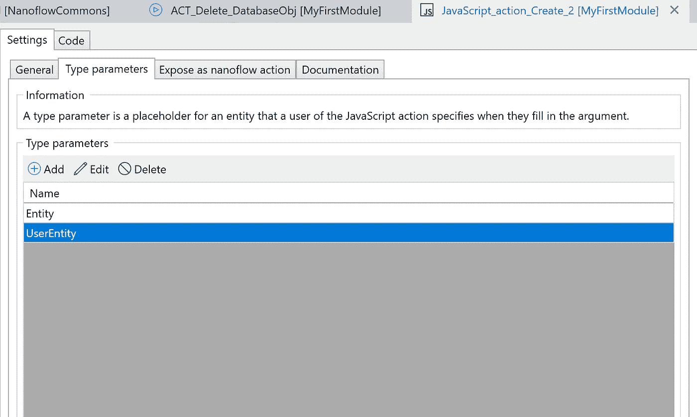

Type parameter tab.

在常规选项卡中添加与图像中相同的参数

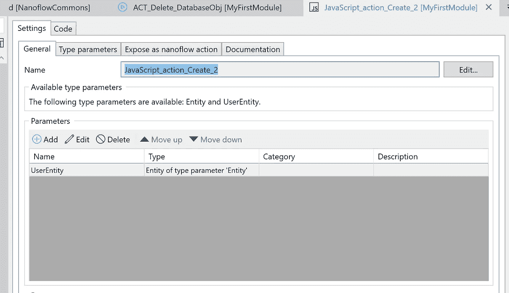

General tab for reference.

4.在常规选项卡中，您创建的参数应该是一个实体，返回类型应该是一个对象，如下图所示。

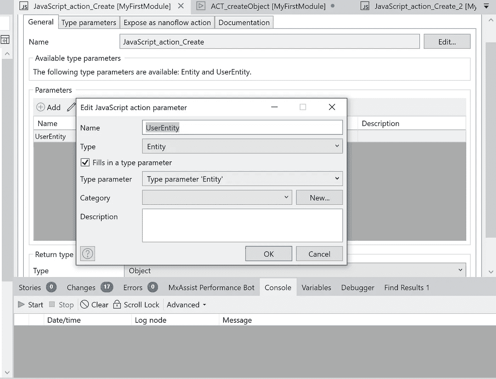

5.转到概览页面选择按钮并**编辑点击动作**以调用纳流。**创建一个具有良好命名约定的纳米流**。

> 调用 JavaScript 操作仅在纳流中有效。

6.再次转到 JavaScript 操作，将有一个名为“代码”的选项卡，单击“代码”选项卡。这将是我们添加代码来创建对象的地方。

> 重要的是要记住**你应该把你的代码写在开始和最终用户代码块之间，**否则你的修改会在编译时被覆盖。

7.进入客户端 API 的 [**文档，向下滚动点击数据。**](https://apidocs.rnd.mendix.com/9/client/index.html)

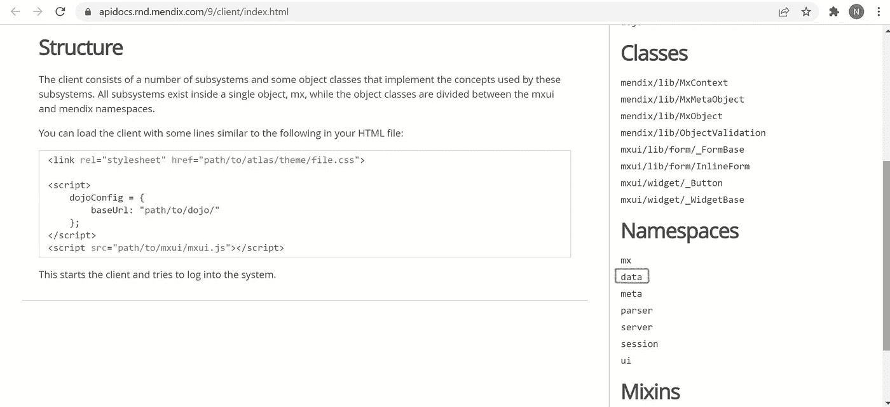

*   从那里您可以看到客户端 API 代码，浏览文档并向下滚动到中间，直到您找到 **mx.create** 。我们可以按原样使用这段代码，您只需要根据您的实体和属性名称修改它。

```
mx.data.create({entity: “MyFirstModule.Cat”,callback: function(obj) {console.log(“Object created on server”);},error: function(e) {console.error(“Could not commit object:”, e);}});
```

您可以简单地**复制 JavaScript 动作中的代码并保存动作**。

8.现在，转到您为概览页面上的按钮创建的 nanoflow。**放置一个活动，并为该活动调用 JavaScript 操作**。然后使用 create a object 和 show page activity，因为您将在新的编辑页面中创建一个对象。最终,“创建对象”纳米流将是这样的。

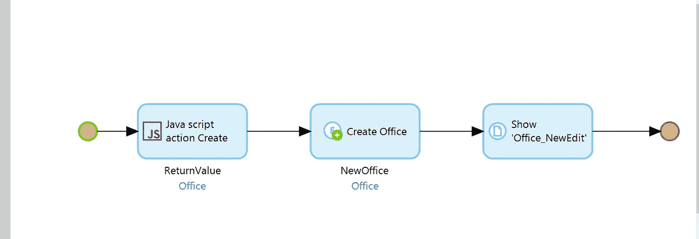

9.现在运行应用程序，看看代码是否工作。请注意，当您转到新的编辑页面时，它是不可编辑的，并且似乎您无法创建对象。

10.我们需要回到 JavaScript 动作，在这里您只能看到客户端 API 创建对象代码。在此之下，您可以**将 Mendix 客户端 API 包装在一个承诺中**。您需要编写代码来使这个新的编辑页面可编辑。那就是所谓的 promise API。

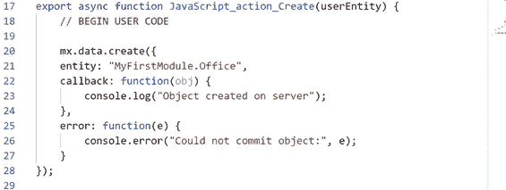

Client API Create Object Code

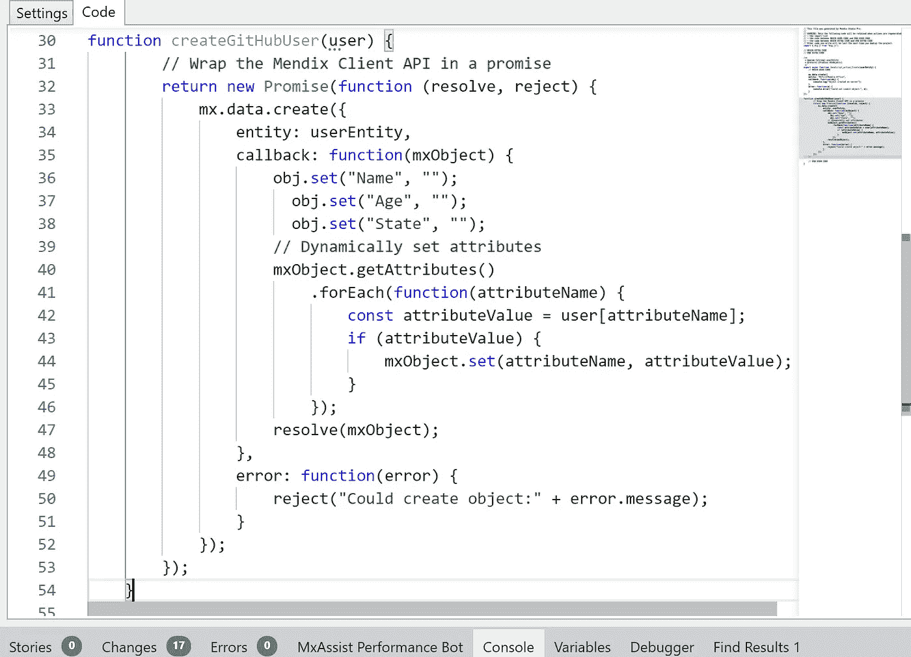

Promise API code to Resolve and reject the object

*   我们之所以使用这段代码，是因为您可以动态地设置属性，而不是静态地在新的编辑页面中创建一个对象。

[**这里**](https://docs.mendix.com/howto/extensibility/write-javascript-github#:~:text=Next%20up%20is%20the%20fun,and%20call%20your%20new%20function) 我从 Mendix 文档中附加了 promise API 代码示例来创建一个对象。复制代码并将其粘贴到客户端 API 代码下面。

> 链接到 [Promise API 代码示例](https://docs.mendix.com/howto/extensibility/write-javascript-github#:~:text=Next%20up%20is%20the%20fun,and%20call%20your%20new%20function)

11.你可以**保存对项目的更改，然后再次运行应用**。如果所有操作都正确，现在您可以编辑页面上的对象了。

## 恭喜你！您已经使用 JavaScript 和 Mendix 客户端 API 成功创建了一个对象。

为了对对象执行更新和删除，我们需要重复类似于创建对象的过程。

再次，到 Mendix 文档中的客户端 API 代码搜索更新，并删除。复制代码并将其粘贴到 JavaScript 操作中。

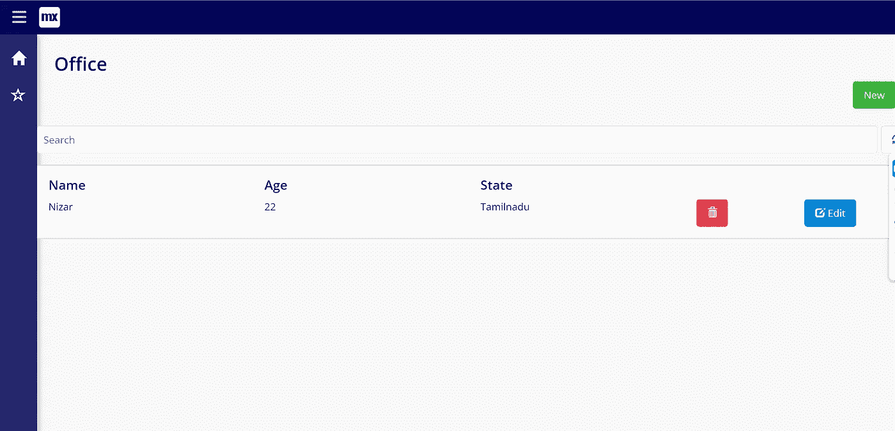

# 使用客户端 API(用于更新对象的代码)更新对象

```
// BEGIN USER CODEmx.data.update({entity: “MyFirstModule.Office”,callback: function(obj) {console.log(“Object created on server”);},error: function(e) {console.error(“Could not commit object:”, e);}});// END-USER CODE}
```

图像下方是编辑对象 nanoflow，供您参考。

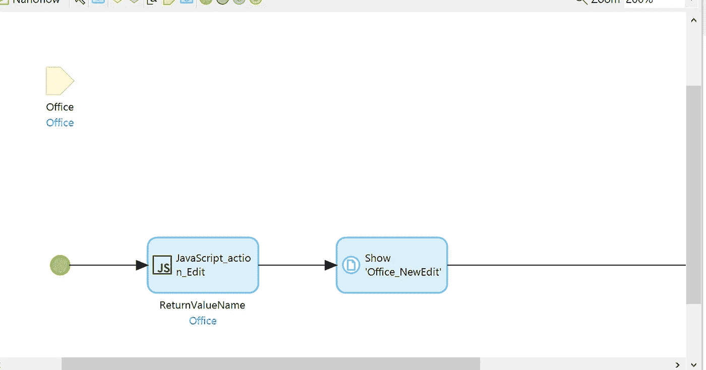

Edit Object nanoflow using Client API

# 使用客户端 API 删除对象(用于删除对象的代码)

```
mx.data.remove({entity: “MyFirstModule.Office”,callback: function() {console.log(“Objects removed”);},error: function(e) {console.log(“Could not remove objects:”, e);}});return new Promise((resolve, reject) => {if ( ! objectToDelete ) {resolve(false); // nothing to deletereturn;}mx.data.remove({guid: objectToDelete.getGuid(),callback: function() {console.trace(“Object removed”);resolve(true);},error: function(e) {reject(e);}});});
```

*   删除引用对象纳流。

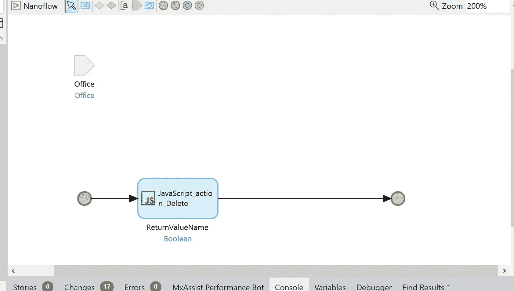

## **结论**

现在，您可以使用这些方法创建、更新和删除对象。虽然在 Mendix 应用程序中与这样的数据进行交互似乎不太常见，但您现在可以根据自己的需要实现和尝试不同的 JavaScript 操作，并通过 JavaScript 直接与模型中的数据进行交互，这是您工具包中的一项有用技能。

我希望你觉得这很有趣并且有用，请随时在评论中提问。

我们将在下一篇文章中再见——再见！！！

## 阅读更多

 [## 客户端 API

### 1 简介通过构建在我们的 web 客户端 API 之上，丰富您的应用程序的用户界面。使用标准…

docs.mendix.com](https://docs.mendix.com/apidocs-mxsdk/apidocs/client-api/)  [## 构建 JavaScript 动作:第 2 部分(高级)

### 这个高级的 how-to 将教你做一个可以搜索 GitHub 用户的 JavaScript 动作。

docs.mendix.com](https://docs.mendix.com/howto/extensibility/write-javascript-github/)  [## 实现 JavaScript 操作的最佳实践

### 这组最佳实践将帮助您充分利用 JavaScript 操作。

docs.mendix.com](https://docs.mendix.com/howto/extensibility/best-practices-javascript-actions/) 

*来自发布者-*

*如果你喜欢这篇文章，你可以在我们的* [*中页*](https://medium.com/mendix) *找到更多喜欢的。对于精彩的视频和直播会话，您可以前往*[*MxLive*](https://www.mendix.com/live/)*或我们的社区*[*Youtube PAG*](https://www.youtube.com/c/MendixCommunity/community)*e .*

*希望入门的创客，可以注册一个* [*免费账号*](https://signup.mendix.com/link/signup/?source=direct) *，通过我们的* [*学苑*](https://academy.mendix.com/link/home) *获得即时学习权限。*

有兴趣加入我们的社区吗？加入我们的 [*Slack 社区频道*](https://join.slack.com/t/mendixcommunity/shared_invite/zt-hwhwkcxu-~59ywyjqHlUHXmrw5heqpQ) *。*