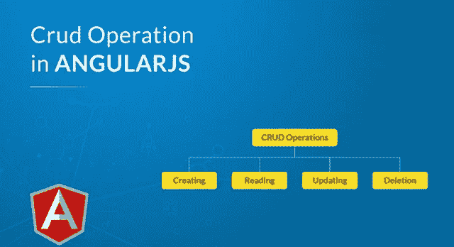

# 如何在 Angular.js 中进行 CRUD 操作？

> 原文：<https://medium.com/edureka/crud-operations-in-angularjs-d266cc951b2?source=collection_archive---------1----------------------->

CRUD Operation in AngularJS

嘿，如果你想学习 AngularJS 中的 CRUD 操作，那么这是一个适合你的地方。本文将带你浏览 AngularJS 中的 CRUD 操作，并解释如何使用它们。

本文将涵盖以下主题:

*   AngularJS 是什么？
*   棱角的特征