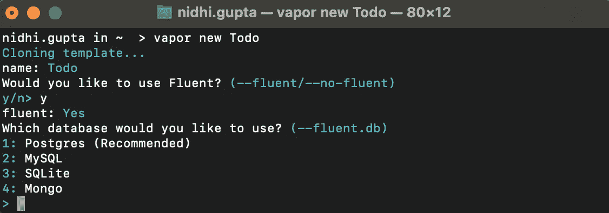
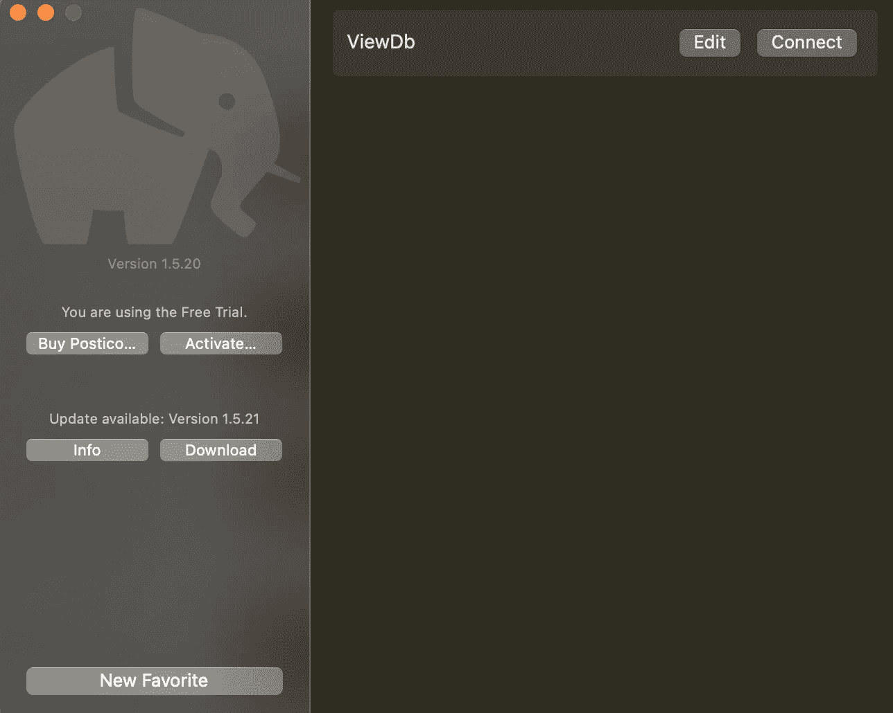

# 使用 Vapor 和 Postgres 的 CRUD 操作

> 原文：<https://medium.com/globant/crud-operations-using-vapor-postgres-304c63de9f0f?source=collection_archive---------1----------------------->

本文是关于 RESTful APIs & Vapor 的 CRUD 数据库操作。
CRUD 操作——创建、检索、更新、删除——形成四个基本功能。

## 让我们首先列出所需的安装:

As [Vapor](https://docs.vapor.codes/) 工具箱通过自制软件分发。如果您还没有自制软件，请访问 [brew.sh](https://brew.sh/) 获取安装说明。使用此[连杆](https://docs.vapor.codes/install/macos/)进行蒸汽安装。

## 一种数据库系统

*   PostgreSQL 是一个强大的开源对象关系数据库系统。
*   在终端中，键入`**brew install postgresql**`检查安装，键入`**psql**` &轻触 enter。

psql

## Postgres.app

Postgres.app 是一个打包成标准 Mac 应用程序的全功能 PostgreSQL 安装程序&具有漂亮的用户界面和方便的菜单栏项目。对于 Postgres.app 安装，使用此[链接](https://postgresapp.com/)。

## 波斯蒂科

Postico 是一个适用于 Mac 的现代 PostgreSQL 客户端。它让 PostgreSQL 变得平易近人。Postico 是一个直观的应用程序，用于查看数据，过滤行，对它们进行排序&重新排列列。

## 邮递员

[Postman](https://www.postman.com/downloads/) 是一个构建和使用 API 的 API 平台。

并且 **Xcode** 是肯定需要的。

让我们通过运行命令`**vapor new Todo**`来执行 CRUD 操作，创建一个名为`**Todo**`的项目。

*   一些问题将在终端上提示，我们可以根据我们的项目要求回答。

*   输入“Y”以使 [Fluent](https://docs.vapor.codes/fluent/overview/) 进入我们的项目，一个用于 Swift 的 ORM 框架。它利用 Swift 的强类型系统为您的数据库提供易于使用的界面。使用 Fluent，[模型](https://docs.vapor.codes/fluent/model/)表示存储在数据库表中的数据，可以用来创建、读取、更新和删除操作，而不是编写原始查询。

*   为 Postgres 数据库输入“1”。PostgreSQL 是一个开源的、符合标准的 SQL 数据库。

*   为 Leaf 输入“Y ”,它类似于模型并与网页通信。
    [Leaf](https://docs.vapor.codes/leaf/getting-started/) 是一种功能强大的模板语言，具有受 Swift 启发的语法。您可以使用它为前端网站生成动态 HTML 页面，或者从 API 生成丰富的电子邮件。

我们的`**Todo**`项目已经创建。打开项目。

*   在 **configure.swift** 中，我们可以在第 11 行看到 Postgres 数据库。我们提供了主机名“localhost”，端口“DATABASE_PORT”，用户名是您的机器用户名&密码是空字符串&我们提供了需要创建的数据库名称“todo”。

configure

*   在模型文件夹下的 **Todo.swift** 中是我们数据库的一个模型。我们有一个名为' *todos* 的模式，数据库中的列是'*id*'&'*title*'键

Todo

## 使用 Postgres.app 创建 todo 数据库

打开 Postgres 应用程序，按照以下步骤创建一个数据库。

*   双击以用户名命名的数据库&终端将打开，然后运行命令:psql
*   它将显示 psql 安装的版本。
*   运行“创建数据库<database name="">”命令创建一个数据库，如下所述。</database>

创建我们在 configure.swift 文件中提到的 todo 数据库。

在这里，我们可以看到“todo”数据库已创建。

构建并运行项目，在 Xcode 控制台上，我们可以看到 URL“[http://127 . 0 . 0 . 1:8080](http://127.0.0.1:8080/todos)”，我们将进一步使用它。

当我们点击“todo”数据库来查看该表时，它将打开一个终端进行原始查询。但是我们可以使用 Postico 来实现这个目的。

## 波斯蒂科

让我们用 Postico 看看数据库:

*   打开邮件。

*   点击“编辑”以填充我们在 configure.swift 中提供的详细信息。

*   点击“连接”,将显示如下表格:

*   点击“todos”(todos 是我们作为模式提供的表名)，将打开 id 和 title 为列的表，如下所示:

因为我们的数据库设置已经完成。现在，我们可以从对数据库执行 CRUD 操作开始。

## 使用邮递员的 CRUD 操作

在 TodoController.swift 文件中，我们有从 Postman 发送的 REST APIs 的代码&它将与数据库交互。

TodoController 必须按照`RouteCollection`协议向路由器注册，并实现下面第 5 行中的`func boot(router: Router) throws`方法。

TodoController

在 TodoController 中第 5 行的`boot`函数中，我们要提供 HTTP 方法(get、post 等)，路径组件&要操作的函数。

routes

让我们看看 routes.swift 文件，在 routes 中的第 10 行，我们已经向路由器注册了 TodoController。

1.  **创建**

**在 TodoController 的第 21 行创建**函数负责将一个条目保存到数据库 todo 中。

由于我们的服务器是在 URL“[http://127 . 0 . 0 . 1:8080](http://127.0.0.1:8080/todos)”上启动的，所以我们可以将模式名“todos”附加到 URL 中。

如果我们在“hello”后面附加一个 URL“[http://127 . 0 . 0 . 1:8080](http://127.0.0.1:8080/todos)”,&在浏览器上输入这个，那么我们可以看到输出为“Hello World！”。
正如我们在 routes.swift 文件中看到的，在第 6 行“Hello”&在第 7 行，返回的结果是“Hello World！”

在 Postman 中，将网址粘贴为[http://127 . 0 . 0 . 1:8080/todos](http://127.0.0.1:8080/todos)。发送以“标题”为关键字&的 JSON，其值为“准备汉堡”&，响应显示保存的详细信息“id”&“标题”。

现在，刷新 Postico 中的表 todos 来查看创建的操作记录。

2.**改为**

为了从数据库中读取数据，我们在 TodoController 的第 17 行使用了 **index** 函数。

3.**更新**

为了将数据库中标题为“准备汉堡”的 id 更新为“准备三明治”,我们在 TodoController 的第 33 行有一个 **update** 函数。

让我们在更新后查看数据库:

4.**删除**

为了删除给定 id 的记录，我们在 TodoController 的第 26 行使用了 **delete** 函数。

删除后让我们查看数据库，记录被删除。

这些是我们到目前为止学到的简单的 CRUD 操作。