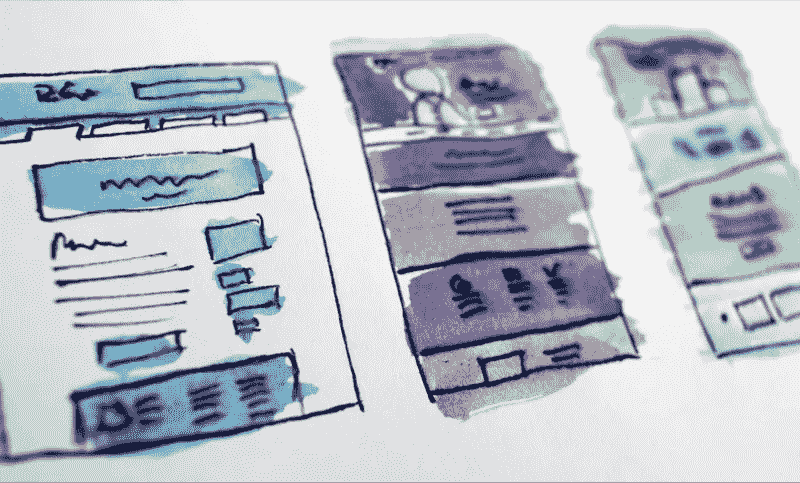

# CSS 网格教程:作为一名 web 开发人员应该知道的 13 个技巧和诀窍

> 原文：<https://medium.com/quick-code/css-grid-cheatsheet-13-tips-and-tricks-which-you-should-know-as-a-web-developer-b4e58f5614c3?source=collection_archive---------0----------------------->

当我们构建前端时，我们总是需要创建一个页面结构，并且经常需要创建任何网格。我们可以用几种方法来定位元素。例如，[在上一篇文章中，我向您展示了我们如何通过 flexbox](https://www.blog.duomly.com/flexbox-cheatsheet/) 做到这一点。

所以，今天，我想向你展示我想使用的另一个工具，名为 CSS 网格…