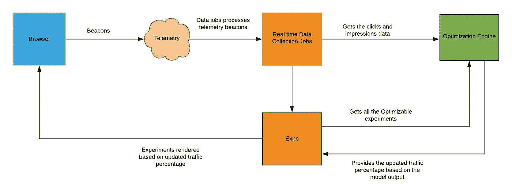

# 通过 Thompson 采样优化 CTR

> 原文：<https://medium.com/walmartglobaltech/ctr-optimization-via-thompson-sampling-83df19fa577f?source=collection_archive---------0----------------------->

Photo credit: [khfalk](https://pixabay.com/photos/slot-machine-one-armed-bandit-play-425713/)

沃尔玛实验室是一家数据驱动的公司。许多业务和产品决策都基于从数据分析中获得的洞察力。我在 Expo 工作，这是沃尔玛的 A/B 测试平台。作为该平台的一部分，我们开发了一个功能来优化基于 Walmart.com 点击率的实验。CTR(点击率)是导致点击的印象的百分比。CTR 优化的目标是将流量动态分配给具有较高 CTR 的变体，同时将较少的流量分配给具有较低 CTR 的变体。该功能是基于多臂土匪(MAB)内容测试范式开发的。

# 多股武装匪徒

以此类推，“多臂强盗”是一台有多条手臂的机器，每条手臂都有不同的预期回报值。玩家需要计算出哪只手支付的金额最高。为了识别具有最高预期回报的一个，拉出不同的分支的阶段被称为“**探索**”。到目前为止最有利可图的阶段被称为“**开发**”。

“多臂强盗”问题的目标是构造一个策略，以最大化特定标准为目标，在探索和开发之间取得平衡。多臂土匪有勘探和开发两个阶段，根据武器的持续性能以适应性方式交替进行。这种模式非常适合网站优化，我们希望根据特定的标准，如点击率，动态地将流量转移到获胜的变化。

探索或利用的决定取决于所使用的 bandit 算法，在我们的例子中，所使用的 bandit 算法是 Thompson 采样。

*MAB 相对于 A/B 测试的一些优势:*

对于短期活动/应用，等待 A/B 测试结果的成本使 MAB 成为更好的选择，因此通过尽早利用可以获得巨大收益。

MAB 还可以用于自动化测试过程，避免分析师为执行重复的 A-B 测试而进行的重复干预。

当被测项目在一段时间内发生显著变化，导致 A/B 测试结果无效时，MAB 可用于捕捉动态变化。在这种情况下，MAB 通过不断探索提供了一个最优策略。

# 算法的目标

bandit 算法的目标是将流量动态分配给表现良好的变体，而将较少的流量分配给表现不佳的变体。首先，它应该显示随机选择的用户的所有变体，并测量哪些变体被更频繁地点击。随着时间的推移，它将使用这些观察来推断哪个变化具有更高的 CTR。然后，一旦对 CTR 的估计变得更加精确，它将逐渐将流量移向获胜的变化。

# 优化工作流程

我们为优化实验设置提供了一个用户界面。作为优化实验设置的一部分，我们提供的 3 个关键配置如下:
1 .优化等待期(这是为了让优化指标“预热”:获得合理的点击数，因此我们不会基于太少的数据重新分配流量。默认值为 24 小时。)
2。优化间隔(这是设置优化频率的配置。例如，对于主页，我们通常可以每 1 小时优化一次，而对于浏览量较低的类别页面，优化引擎可以每几个小时优化一次。默认值为 1 小时。)
3。每个变化的最小流量(这是为了防止优化引擎做出“过于仓促”的流量调整以支持一个变化，并允许探索其他变化。默认值为 10%。)

对于实验的所有变化，初始流量分配是相等的百分比。一旦实验开始，游客的分配将根据分配的百分比发生变化。实时 spark 结构化流作业用于收集每个变体的每分钟点击/展示次数，并存储在时间序列数据库中。点击/印象每小时被提供给 bandit 模型以产生新的流量百分比。任何流量调整本身都是在达到优化等待周期后以优化间隔的频率进行的。

# 使用 Thompson 采样进行探索/利用

在多武装强盗场景中，Thompson 采样的基本思想是，算法从关于预期报酬的先验信念开始。在试验过程中，从每只手臂的前侧抽取一个随机样本。所选择的臂是具有提供最佳臂的最高样本的臂。反馈后，先验信念被更新为后验信念。由于我们使用共轭先验，先验和后验具有相同的形式，我们可以继续采样过程，将后验视为新的先验。该算法确保在间歇地探索表现不佳的 arm 的同时，更多地利用具有较大期望回报的 arm。

*以下部分描述了我们采用的探索/利用方法，以及我们如何使用 Thompson 采样对优化实验进行动态流量调整。*

我们记录积极和消极的观察结果。这里积极的观察是点击。负面观察是(印象-点击)。
贝塔分布用作先验。我们使用共轭先验，这意味着后验分布与先验分布是同一个族。
原始先验被选为β(20，980)。基于历史上看到的 2%的 CTR，我们使用 1000 个印象中的 20 个正面观察和 980 个负面观察作为先验。在 1000 个印象之前，我们不想做任何移动。随着数据量的增长，先验的影响可以忽略不计。

每次算法收到反馈时，我们都会更新正面和负面的观察结果。每当我们需要访问后验分布时，我们就计算贝塔分布的参数。我们将使用这些参数从 beta 分布中随机抽取一个样本。

我们还应用了一个衰减因子。7 天前的所有数据权重为 1，前一周权重为𝛌，前一周权重为𝛌，依此类推。目前，𝛌设定为 0.8。

大约 200，000 个样本来自贝塔二项分布的后验分布，我们通过计算给定变异被选择的次数比例来构建经验分布。流量分割基于每个变体的获胜百分比。例如:如果变体 1 的 30%时间获胜，而变体 2 的 70%时间获胜。变体 1 的流量分配为 30%，变体 2 的流量分配为 70%。在稳定状态下，我们期望获胜的变体拥有 100%的流量。

下面是一个样例代码，说明如何使用 Thompson Sampling 根据观察到的点击和印象进行动态流量调整。

# 结论

我们已经进行了几次试运行，并观察到 CTR 有良好的提升。我们还观察到，对于 MAB 来说，通过缩短勘探阶段，尽早进行开采可以获得巨大收益的短期活动是一个很好的选择。

下一步，我们希望增强系统，以支持其他指标的优化，如购物车添加率、转换率、收入，最大限度地降低跳出率。我们还希望增强基于内容的治疗类型以外的功能。如果一个页面中有多个组件需要不断优化，我们希望使用 MAB 方法作为框架来自动化优化过程。