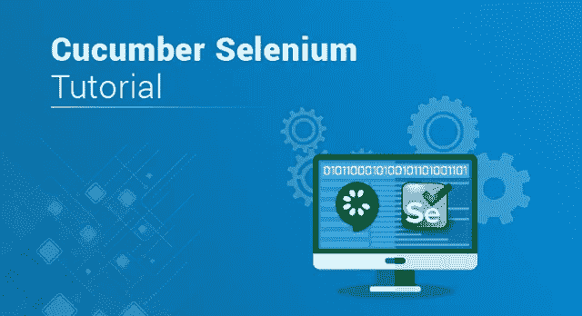
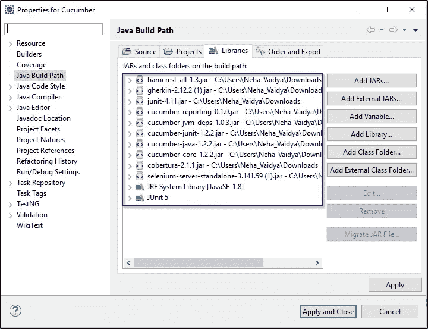
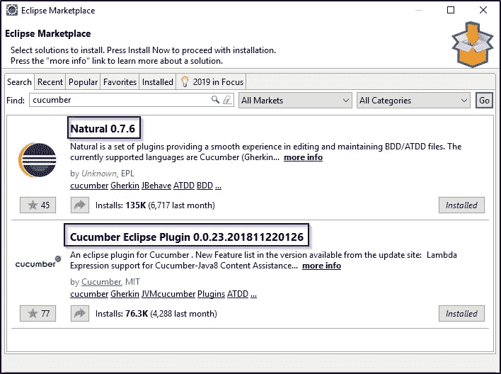
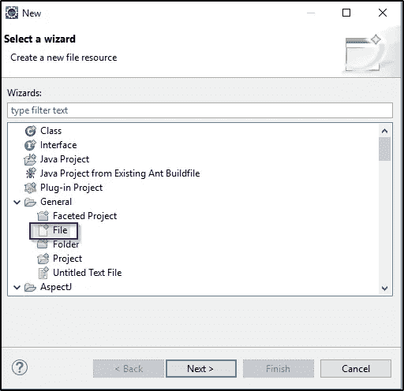
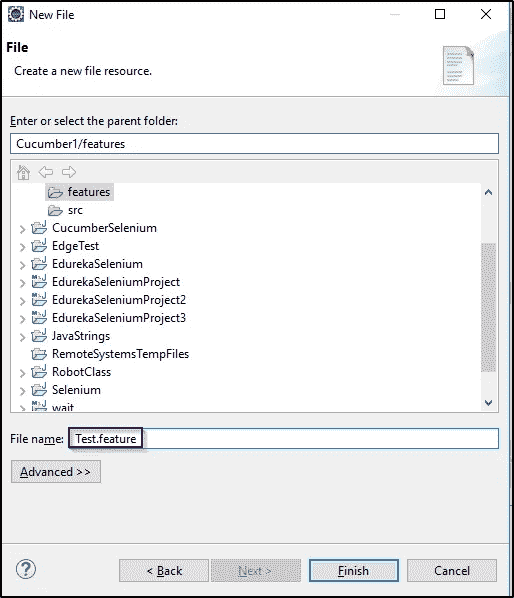
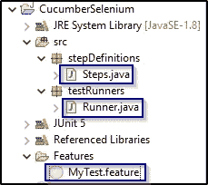
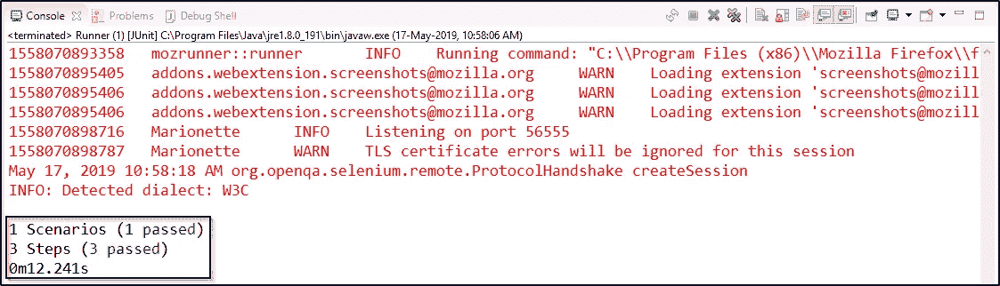

# 黄瓜硒教程——知道如何进行网站测试

> 原文：<https://medium.com/edureka/cucumber-selenium-tutorial-aefec05f4733?source=collection_archive---------0----------------------->



毫无疑问，Selenium 是自动化测试领域中最棒的工具之一，但是由于代码的复杂性，对于一个非技术人员来说，理解它的工作原理似乎有点困难。为了减轻这一任务，Cucumber 发挥了作用，它使复杂的代码变得简单易懂。但是，它到底是怎么做到的呢？我将通过这篇文章告诉你这一切。

以下是本文的主题:

*   黄瓜简介

1.为什么是黄瓜？

2.行为驱动发展

*   硒简介
*   为什么要用含硒的黄瓜？
*   创建黄瓜应用程序的步骤

# 黄瓜简介


Cucumber 是一种支持 ***行为驱动开发(BDD)的测试方法/工具。*** 它提供了一种编写任何人都能理解的测试的方法，不管他们的技术知识水平如何。

它使用 ***小黄瓜*** 语言用简单的英文文本解释了应用程序的行为。我希望你对黄瓜有所了解。现在，让我们进一步了解一些事实，这些事实描述了在测试框架中对 Cucumber 的需求。

# 为什么是黄瓜？

黄瓜是最受欢迎的工具之一，原因如下:

1.  黄瓜是开源的，因此可以免费使用。
2.  在使用 Cucumber 时，你可以用多种语言编写你的**测试脚本**，比如 Java、Ruby、.NET，Python 等。
3.  它还集成了 Selenium、Ruby on Rails、Watir 和其他基于 web 的测试工具。
4.  黄瓜是使用最广泛的工具之一。

这些是使 Cucumber 有助于测试网站的一些独特特性。既然您已经知道了什么是 Cucumber 以及为什么需要它，那么让我们来理解 Cucumber 的一个独特的特性，这个特性使得一个非技术人员很容易理解测试用例。

# 行为驱动开发

简单来说，BDD 或*行为驱动开发*是一种技术，在这种技术中，你的规范或测试用例用简单的英语像句子一样写出来。使用这种方法，非技术团队成员发现很容易理解流程，并在软件开发过程中进行更多的协作。

让我们借助一个简单的例子来理解这一点。考虑一个场景，您想要测试 Twitter 网站。测试场景之一是验证登录凭证。使用 BDD，您可以用这种格式编写这个测试场景:

```
Feature: Test Twitter smoke scenario

Scenario: Test login with valid credentials
Given Open the firefox and start application
When I enter valid username and valid password
Then user should be able to login successfully
```

在上面的例子中，我刚刚用简单的英语写了一些语句来定义场景。在本文的后面部分，我将对这个场景及其实现提供更多的见解。现在，让我们在黄瓜硒教程文章中更进一步，学习硒的基础知识。

# **硒简介**


Selenium 是在 web 浏览器上实现自动化测试的首选工具。它只对测试 web 应用程序有用。任何桌面(软件)应用程序或移动应用程序都不能使用 Selenium 进行测试。对编写功能测试用例很有帮助。它还提供了测试用例数量为' **n'** 的可靠性能，显然它是 web 应用程序最合适的自动化工具。

现在你知道什么是硒，让我们在这篇文章中更进一步，了解为什么使用含硒黄瓜？

# 为什么要用含硒的黄瓜？

许多组织使用 Selenium 进行[功能和回归测试。当谈到 web 应用程序自动化时，Selenium 和 Cucumber 是一个很好的组合，因为 Cucumber 允许您用类似英语的语言快速编写测试，Selenium 允许您在各种浏览器组合上运行。](https://www.edureka.co/blog/regression-testing?utm_source=medium&utm_medium=content-link&utm_campaign=cucumber-selenium-tutorial)


当使用 Selenium 和 Cucumber 进行自动化测试时，测试是在特性文件中编写的，这些特性文件可以被敏捷环境中的各种涉众(比如业务分析师)所理解。Cucumber 还具有支持多种脚本和编程语言的能力，JUnit 用于执行这些脚本并生成输出。

理解了这一点，现在让我们看看创建 Cucumber 应用程序和运行测试用例的各个步骤。

# 创建黄瓜应用程序的步骤

创建 Cucumber 应用程序的各个步骤如下:

1.  下载 Cucumber 和 Selenium 的 Jar 文件并配置构建路径。
2.  从 Eclipse Marketplace 添加黄瓜插件。
3.  创建特征文件并添加场景。
4.  实施场景的步骤。
5.  编写 runner 类并执行代码。

现在，让我们详细了解这些步骤。

**第一步:下载黄瓜和硒罐文件**

*Cucumber* 实际上并不与浏览器交互，而*在被测网站上执行*动作。与网站*交互的*是 Selenium WebDriver 执行的*是*的动作。因此，*你需要*下载*黄瓜*以及 Selenium Webdriver *jar 文件*。下面是 Cucumber 的 jar 文件列表。

*   黄瓜芯
*   黄瓜-html
*   cobertura 代码覆盖率
*   黄瓜爪哇咖啡
*   黄瓜杜松子酒
*   黄瓜 JVM deps
*   黄瓜报告
*   哈姆克雷斯特核心
*   腌食用小黄瓜
*   朱尼特

一旦从 [Maven 资源库](https://mvnrepository.com/)下载了这些 jar 文件，就可以配置项目的构建路径并添加所有的*。jar* 文件和库，如下图所示。



**第二步:下一步是在 Eclipse 上安装黄瓜。为此，你需要去*Help->Eclipse market place->Search cumber*并在你的 Eclipse 上安装*cumber 和 Naturals* 。下面的快照描述了同样的情况。**



**步骤 3:一旦配置了 Cucumber，下一步就是创建一个特性文件。首先，您必须创建一个新的源文件夹，然后添加一个特性文件，如下所示。**



接下来，您需要指定特征文件的名称，如下所示。



一旦创建了特征文件，就可以编写如下面代码所示的场景。

# 测试场景一:

```
Feature: Reset functionality on login page of Application

Scenario: Verification of Reset button
Given Open the Firefox and launch the application
When Enter the Username and Password
Then Reset the credential
```

**步骤 4:之后，你需要借助步骤定义实现场景。在下面的代码中，我实现了我在特征文件中编写的场景的方法。**

```
package stepDefinitions;

import cucumber.api.java.en.Given;
import cucumber.api.java.en.Then;
import cucumber.api.java.en.When;

public class Steps {
[@Given](http://twitter.com/Given)("^Open the Firefox and launch the application$")
public void open_the_Firefox_and_launch_the_application() throws Throwable
{
System.out.println("This Step open the Firefox and launch the application.");
}

[@When](http://twitter.com/When)("^Enter the Username and Password$")
public void enter_the_Username_and_Password() throws Throwable
{
System.out.println("This step enter the Username and Password on the login page.");
}

[@Then](http://twitter.com/Then)("^Reset the credential$")
public void Reset_the_credential() throws Throwable
{
System.out.println("This step click on the Reset button.");
}
}
```

**步骤 5:现在，最后一步是创建' *runner class'* 并执行程序。基本上，您的项目结构应该看起来像下面的快照所描绘的那样。**



在上面的快照中，' *Runner.java'* 是一个可执行文件。现在让我们编写这个文件，并了解它是如何工作的。

```
package Runner;
import org.junit.runner.RunWith; 
import cucumber.api.CucumberOptions; 
import cucumber.api.junit.Cucumber;

[@RunWith](http://twitter.com/RunWith)(Cucumber.class) 
[@CucumberOptions](http://twitter.com/CucumberOptions)(features="features",glue={"stepD"}) 
public class Runner 
{
}
```

在上面的代码中，我使用了“@CucumberOptions”并指定了特征文件和运行器文件的包名。以便它实现这些方法并运行代码。当您运行程序时，它将显示步骤定义中的方法。您的**输出**应该如下所示:

```
This Step open the Firefox and launch the application.
This step enter the Username and Password on the login page.
This step click on the Reset button.

1 Scenarios (32m1 passed)
3 Steps (32m3 passed)
0m0.185s
```

所以，这就是你需要如何写所有的文件，并执行程序。

# 测试场景二:

现在，让我们来理解另一个场景，我把硒和黄瓜结合在一起。考虑一个场景，您想要测试 Twitter 网站。其中一个测试场景将验证登录凭证。使用 BDD，您可以用这种格式编写这个测试场景:

```
Feature: Test Twitter smoke scenario

Scenario: Test login with valid credentials
Given Open the firefox and start application
When I enter valid username and valid password
Then user should be able to login successfully
```

接下来，让我们编写步骤定义类来实现所有场景。

```
package stepD;
import java.util.concurrent.TimeUnit;
import org.openqa.selenium.By;
import org.openqa.selenium.WebDriver;
import org.openqa.selenium.firefox.FirefoxDriver;
import cucumber.api.java.en.Given;
import cucumber.api.java.en.Then;
import cucumber.api.java.en.When;

public class SmokeTest {
WebDriver driver;
[@Given](http://twitter.com/Given)("^Open the firefox and start application$")
public void open_the_firefox_and_start_application() throws Throwable {
System.setProperty("webdriver.gecko.driver", "C:geckodriver-v0.23.0-win64geckodriver.exe");
driver = new FirefoxDriver();
driver.manage().timeouts().implicitlyWait(10, TimeUnit.SECONDS);
driver.get("[https://twitter.com/login](https://twitter.com/login)");
}

[@When](http://twitter.com/When)("^I enter valid username and valid password$")
public void I_enter_valid_username_and_valid_password() throws Throwable {
driver.findElement(By.xpath("//input[[@placeholder](http://twitter.com/placeholder)='Phone, email or username']")).sendKeys("your_username");
driver.findElement(By.xpath("//div[[@class](http://twitter.com/class)='clearfix field']//input[[@placeholder](http://twitter.com/placeholder)='Password']")).sendKeys("your_password");
}
[@Then](http://twitter.com/Then)("^user should be able to login successfully$")
public void user_should_be_able_to_login_successfully() throws Throwable {
driver.findElement(By.xpath("//button[[@class](http://twitter.com/class)='submit EdgeButton EdgeButton--primary EdgeButtom--medium']")).click();
}
}
```

在上面的程序中，我使用 GeckoDriver 启动了 firefox 浏览器，并使用 driver.get()导航 Twitter 登录页面。此外，它将使用 XPath locator 找到用户名和密码文本框，并输入有效的凭证。最后，它将成功登录并运行测试用例。您必须将 runner 作为 JUnit 测试来执行，以了解测试是通过还是失败。

下面的快照显示了程序的输出。



这就是你需要如何编写所有的文件和执行程序。以上就是黄瓜硒教程。我希望你理解了这些概念，并有助于增加你知识的价值。如果你想查看更多关于人工智能、DevOps、道德黑客等市场最热门技术的文章，你可以参考 Edureka 的官方网站。

请留意本系列中的其他文章，它们将解释硒的各个方面。

> 1.[硒教程](/edureka/selenium-tutorial-77879a1d9af1)
> 
> 2.[Selenium web driver:TestNG For Test Case Management&报告生成](/edureka/selenium-webdriver-tutorial-e3e6219f21ad)
> 
> 3.[构建数据驱动、关键字驱动的&混合 Selenium 框架](/edureka/selenium-framework-data-keyword-hybrid-frameworks-ea8d4f4ce99f)
> 
> 4.[硒中的定位器](/edureka/locators-in-selenium-f6e6b282aed8)
> 
> 5. [XPath 教程](/edureka/xpath-in-selenium-cd659373e01a)
> 
> 6.[等待硒](/edureka/waits-in-selenium-5b57b56f5e5a)
> 
> 7.[为分布式硒测试设置硒网格](/edureka/selenium-grid-tutorial-ef342799c484)
> 
> 8.[硒使用 Python](/edureka/selenium-using-python-edc22a44f819)
> 
> 9.[使用 LambdaTest 进行跨浏览器测试](/edureka/cross-browser-testing-9299b04ce277)
> 
> 10.[使用 Selenium 进行跨浏览器测试](/edureka/cross-browser-testing-using-selenium-90b1911c6d60)
> 
> 11.[在 Selenium 中处理多个窗口](/edureka/handle-multiple-windows-in-selenium-727ba5f8f6a7)
> 
> 12.[硒中的页面对象模型](/edureka/page-object-model-in-selenium-bc4d7c8c4203)
> 
> 13.[硒项目](/edureka/selenium-projects-b2df15d35fe2)
> 
> 14. [QTP vs 硒](/edureka/qtp-vs-selenium-338f3d3bbfa7)
> 
> 15.[硒 vs RPA](/edureka/selenium-vs-rpa-84159dbcd0f2)
> 
> 16. [Selenium WebDriver 架构](/edureka/selenium-webdriver-architecture-565e2db26dd5)
> 
> 17.[在 Selenium 中处理异常](/edureka/exceptions-in-selenium-369c38155e7d)

*原载于 2019 年 5 月 20 日*[*【https://www.edureka.co】*](https://www.edureka.co/blog/cucumber-selenium-tutorial/)*。*