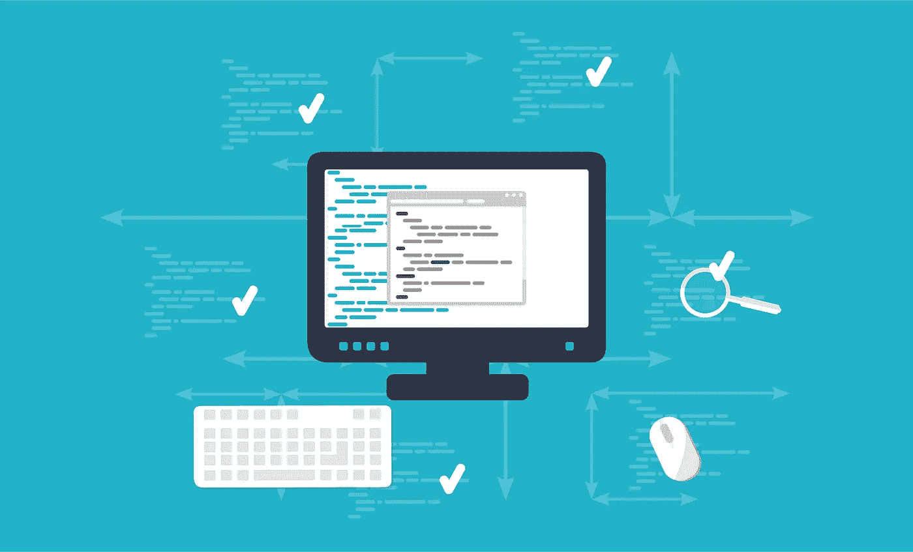

# 微服务的文化元素:服务所有权

> 原文：<https://medium.com/capital-one-tech/cultural-elements-of-microservices-service-ownership-7ff3acea7d92?source=collection_archive---------0----------------------->

正如现在经典的 [Lewis 和 Fowler](http://martinfowler.com/articles/microservices.html#ProductsNotProjects) 列表中所引用的，微服务架构的核心原则之一是*产品而非项目*的原则。简而言之，这个原则规定“一个团队应该在微服务的整个生命周期中拥有它。”这促进了许多重要的实践，例如让开发团队对产品中的软件负责，以及开发人员与服务的关系不会在第一个版本发布时结束。

这些都是重要的、经过战斗考验的实践，我是这个原则的坚定支持者。然而，所有权原则对团队文化的影响有时会被误解。具体来说，强调“拥有服务”可能会被误解为存在一个负责每项服务的专门团队，阻止“拥有”团队之外的任何人修改服务的源代码。

事实上，对服务所有权的以控制为中心的理解与一个健康的微服务组织应该追求的背道而驰。 ***我们来解释一下原因。***

采用微服务架构的组织通常会积累大量的微服务。通常，在采用之初，团队从一些粗粒度的服务开始。随着时间的推移，他们最终会拆分服务，随着采用的成熟，最终会实现高水平的服务粒度。这是一个自然且受欢迎的进展，因为较小的服务更容易维护和部署。

一旦实现了高服务粒度，应用程序的许多业务功能可能需要协调多个专门构建的微服务，以完成单个单位的客户工作。想象一下，另一个团队的开发人员依赖“你的”微服务，而你正在度假——或者你已经换了一份工作(这在科技行业从来不会发生，对吧？).由于你的不在，他们可能无法完成工作——可能会持续很长时间。

为了减少这种协调延迟的风险，团队应该构建*小的、集中的和简单的*服务，足以让组织中任何有资格的开发人员快速理解和修改它们，而不需要对代码的这一部分有任何经验。服务的代码应该对整个组织开放，而不仅仅是“拥有”团队！

事实上，我发现，为了成功构建微服务架构，当生态系统像开源社区(想想 GitHub)一样运行并由许多存储库组成时，可以实现理想的组织文化，每个存储库都由来自不同团队的开发人员积极贡献。

如果您的组织在服务代码所有权上设置了严格的责任线，或者如果服务代码库庞大、复杂且难以“深入研究”，那么维护成熟微服务架构所需的开放和协作的内部组织文化(通常称为“内部外包”)将是一项挑战。相反，团队应该欢迎对生态系统中任何微服务代码的贡献和更改，并使服务实现易于理解。

一个很好的经验法则是，如果合格的开发人员在 1-2 天内(最多)不能理解您的服务的设计和代码，那么它可能太复杂或太大。这样的服务应该被简化或拆分，以鼓励健壮的、高功能的微服务架构文化。

*披露声明:这些观点是作者的观点。除非本帖中另有说明，否则 Capital One 不属于所提及的任何公司，也不被其认可。使用或展示的所有商标和其他知识产权都是其各自所有者的所有权。本文为 2018 首都一。*