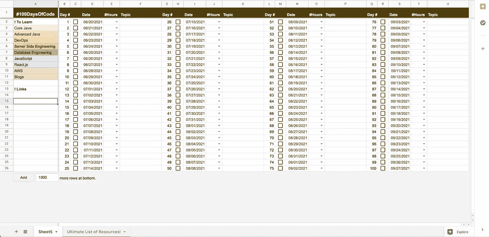

# 资源精选列表—100 天代码

> 原文：<https://medium.com/quick-code/curated-list-of-resources-100daysofcode-e833c4047a36?source=collection_archive---------2----------------------->

> "除了不再尝试，没有失败."—克里斯·布拉德福德

from [pexels.com](https://www.pexels.com)

代码 100 天挑战在过去几年里获得了很多关注。它所指的是“能够在 100 天内每天至少编程一小时”。开始进入软件行业可能看起来令人生畏，但是有很多课程、教程和指南可以带你入门并建立你的立足点。这并不意味着这对经验丰富的 It 专业人员无效。任何希望提升现有技能或获得更多实践经验的人都可以这样做。

很容易在脑海中炒作这个过程。然而，作为一个在 10 天内停止并重新开始挑战的人，我可以告诉你这很困难，但不是不可能。对于第一次来说，你可以选择挑战 30 天或 50 天，然后慢慢增加到 100 天。当我说尽管遇到挫折，但振作起来，继续努力，这似乎是陈词滥调，但从长远来看，这将有助于你实现完成这一挑战的目标。在这里找到常见问题。

100 天的路线图对每个人来说都是不同的。以下是我开始挑战时遵循的一些步骤

*   弄清楚你想做什么—可以是前端/后端/全栈开发、AWS 或 DevOps。挑你喜欢的。
*   制定出你的时间表，如果不是每天，至少是每周。我对所有事情都有一种轻微的强迫症，所以我在开始挑战之前创建了一个谷歌表单，上面有一个时间表和资源列表。

*   使用番茄工作法来记录你每天的学习时间。这里有几个你可以尝试的选项:

[https://pomofocus.io](https://pomofocus.io/)

[https://www.marinaratimer.com](https://www.marinaratimer.com/)

[https://pomodor.app/timer](https://pomodor.app/timer)

*   每天提交代码到 GitHub 或者你喜欢的存储库托管服务，或者在 Twitter/Medium/Dev.To/ YouTube 上开始一个迷你博客系列。
*   给你自己找一个学习伙伴，在这个挑战期间负责。

# **资源**

要想知道该走哪条路，这些网站可能会有所帮助:

*   [职业道路](https://careerkarma.com/careers/)
*   [开发者路线图](https://roadmap.sh/)

# 免费课程和参考资料:

*   [freeCodeCamp](https://www.freecodecamp.org/)
*   [大学](https://coursesity.com)
*   [JavaScript30](https://javascript30.com/)
*   由 DailyUI 设计的 100 天
*   [100 天代码](https://www.geeksforgeeks.org/100-days-of-code-a-complete-guide-for-beginners-and-experienced/)破解极客们的采访
*   黑客排名[30 日代码](https://www.hackerrank.com/domains/tutorials/30-days-of-code)
*   [世界量子大学的应用数据科学](https://wqu-apply.thedataincubator.com/)
*   [奥丁项目](https://www.theodinproject.com/paths)
*   [单飞学习](https://www.sololearn.com/onboarding/0)
*   [数据科学备忘单](https://github.com/FavioVazquez/ds-cheatsheets)
*   [代码大战](https://www.codewars.com/)
*   [编码名称](https://www.codingame.com/start)
*   [项目欧拉](https://projecteuler.net/)
*   [fCC 应对挑战](https://www.freecodecamp.org/learn/front-end-libraries/react/)
*   [javascript.info](https://javascript.info/)
*   [JavaScript 教程](https://www.javascripttutorial.net/)
*   [前端导师](https://www.frontendmentor.io/)
*   [开发挑战](https://devchallenges.io/) —前端
*   [W3Schools](https://www.w3schools.com/)
*   [微软虚拟学院](https://docs.microsoft.com/en-us/learn/)
*   [AWS 培训](https://www.aws.training/)
*   [GCP 训练](https://cloud.google.com/training)
*   [编码幻想](https://codingfantasy.com)
*   [代码库—备忘单](https://codehouse.vercel.app)
*   [Linux 基金会](https://training.linuxfoundation.org/resources/?_sft_content_type=free-course)
*   [edX](https://www.edx.org)
*   [思科网络学院](https://www.cisco.com/c/m/en_sg/partners/cisco-networking-academy/index.html)
*   [Linux 教程](https://www.udemy.com/course/linux-tutorials/?LSNPUBID=JVFxdTr9V80&ranEAID=JVFxdTr9V80&ranMID=39197&ranSiteID=JVFxdTr9V80-VnFUWbVcVLi_lc3okae7kg) — Udemy 课程
*   [维姆历险记](https://vim-adventures.com)
*   [Linux 生存](https://linuxsurvival.com/linux-tutorial-introduction/)
*   [Linux 之旅](https://linuxjourney.com)
*   [TecMint](https://www.tecmint.com/free-online-linux-learning-guide-for-beginners)—Linux 初学者指南
*   [Linux 命令](http://linuxcommand.org)
*   瑞恩的教程
*   Linux 命令行— [LYM](https://lym.readthedocs.io/en/latest/)
*   [Linux 手册页](https://man7.org/linux/man-pages/)
*   LearnLinuxTV

# 付费课程:

*   [网络开发者训练营](https://www.udemy.com/course/the-web-developer-bootcamp/)
*   [完整的 Java 开发人员课程](https://www.udemy.com/course/java-the-complete-java-developer-course/)
*   [现代 Javascript Bootcamp](https://www.udemy.com/course/javascript-beginners-complete-tutorial/)
*   [数据科学无限](https://www.data-science-infinity.com/)
*   [现代 Python 训练营](https://www.udemy.com/course/the-modern-python3-bootcamp/)
*   [Git 和 GitHub Bootcamp](https://www.udemy.com/course/git-and-github-bootcamp/)
*   [代码学院](https://www.codecademy.com/)
*   [树屋](https://teamtreehouse.com/)
*   [复数视线](https://www.pluralsight.com/)
*   [Linux 学院/云专家](https://acloudguru.com/?utm_source=legacyla&utm_medium=redirect&utm_campaign=one_platform)
*   [云学院](https://cloudacademy.com)
*   尼尔·戴维斯[数字云培训](https://digitalcloud.training)
*   乔恩·邦索的道场教程
*   夏羽·马瑞克的 AWS 教程
*   [DataVader](http://www.datavader.io) —数据科学 1:1 导师
*   [数据营](https://www.datacamp.com/pricing)

# GitHub 仓库:

*   [免费编程书籍](https://github.com/EbookFoundation/free-programming-books)
*   [编码面试大学](https://github.com/jwasham/coding-interview-university)
*   [100 天代码样本日志](https://github.com/lauragift21/100-days-of-code)
*   [免费开发](https://github.com/ripienaar/free-for-dev)
*   [ML 备忘单](https://github.com/slalit360/Data-Science-ML-Cheat-Sheet-Books-Oreilly-)
*   [DevOps 备忘单](https://github.com/shangadi/devopsCheatSheets)
*   [JavaScript 备忘单](https://github.com/airbnb/javascript)
*   [基于项目的学习](https://github.com/tuvtran/project-based-learning)
*   [Linux 软件](https://github.com/luong-komorebi/Awesome-Linux-Software)
*   [50 天 50 个项目](https://github.com/bradtraversy/50projects50days) —前端
*   [30 天的巨蟒](https://github.com/Asabeneh/30-Days-Of-Python)
*   [Python 备忘单](https://github.com/trekhleb/learn-python)
*   [wtfPython](https://github.com/satwikkansal/wtfpython)
*   [Python 迷你项目](https://github.com/Python-World/python-mini-projects)
*   [Python 参考资料](https://github.com/rasbt/python_reference)
*   [数据科学家路线图](https://github.com/MrMimic/data-scientist-roadmap)
*   [数据科学资源](https://github.com/jonathan-bower/DataScienceResources)
*   [数据科学博客](https://github.com/rushter/data-science-blogs)
*   [设计模式](https://github.com/DovAmir/awesome-design-patterns)
*   [全栈 Web 开发笔记](https://github.com/8483/notes)
*   [JavaScript 中的算法](https://github.com/TheAlgorithms/Javascript)
*   [网页开发-2021 课程清单](https://github.com/andrews1022/web-development-2021-course-list)

# YouTube 频道/播放列表

*   [网络忍者](https://www.youtube.com/channel/UCW5YeuERMmlnqo4oq8vwUpg)编码教程
*   [合十礼 JavaScript](https://www.youtube.com/playlist?list=PLlasXeu85E9cQ32gLCvAvr9vNaUccPVNP)
*   关于计算机科学的一站式教程
*   [编码园](https://www.youtube.com/channel/UCLNgu_OupwoeESgtab33CCw)
*   [开发编辑](https://www.youtube.com/channel/UClb90NQQcskPUGDIXsQEz5Q)
*   [用 Mosh 编程](https://www.youtube.com/user/programmingwithmosh)
*   [编码序列](https://www.youtube.com/channel/UCvjgXvBlbQiydffZU7m1_aw)
*   [趣味趣味功能](https://www.youtube.com/channel/UCO1cgjhGzsSYb1rsB4bFe4Q)
*   [send ex](https://www.youtube.com/channel/UCfzlCWGWYyIQ0aLC5w48gBQ)
*   [滑稽媒体](https://t.co/2IoQYh3Nzn?amp=1)
*   [Linux，DevOps，Jenkins & Git](https://www.youtube.com/channel/UCz4-k1b3KjW_JxQGOcmOR-g/playlists) 教程
*   [完整的 Linux 教程](https://www.youtube.com/watch?v=wBp0Rb-ZJak&t=6578s)

我希望这些课程和教程能帮助你度过这 100 天。继续编码！祝你旅途一切顺利！

附注:当我发现好的材料时，我会更新这个列表，特别是关于云(AWS，GCP，Azure)，DevOps，数据科学和分析的材料。如果你想聊天或有任何建议，请在我的 LinkedIn 上给我发消息。:)