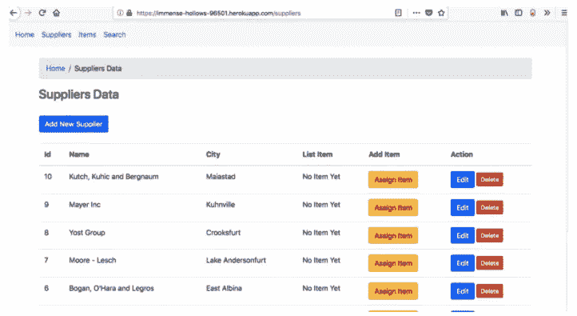
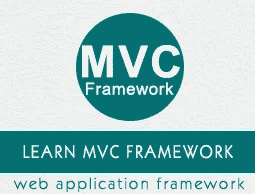
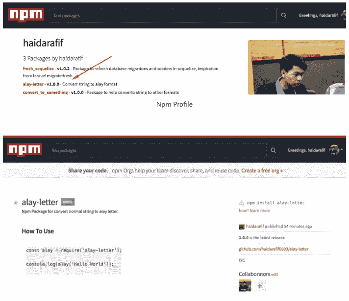
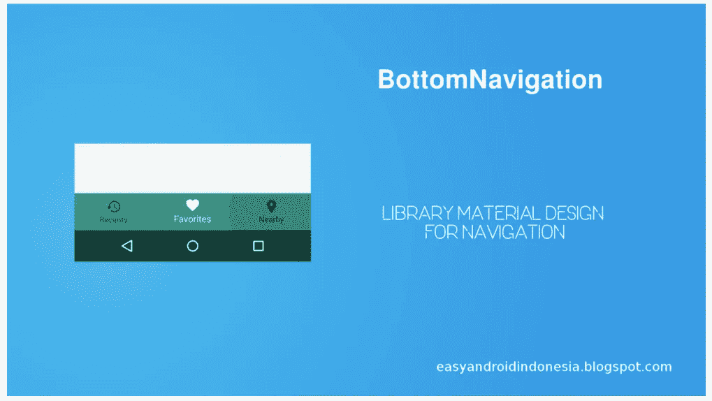
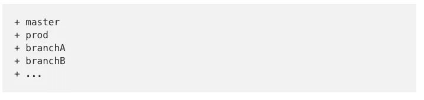

# Curiosity is not Enough. Act Now and Learn.

> 原文：<https://medium.easyread.co/curiosity-is-not-enough-act-now-and-learn-f7b6bdb7006e?source=collection_archive---------1----------------------->

Hello *Easyreaders*

Berikut top artikel [Easyread](https://medium.com/easyread) pada bulan Maret ini.

## Software Development

[**Today I Learned Series: Twelve-Factor App**](https://medium.com/easyread/today-i-learned-series-twelve-factor-app-af28b0d3fd45) by [Iman Tumorang](https://medium.com/u/ef42567fbbae?source=post_page-----f7b6bdb7006e--------------------------------)

Beberapa hari yang lalu, saya mengikuti sebuah *event* , yaitu **GDP Venture Tech Day.** Pada *event* tersebut, saya mengikuti salah satu topik yang merupakan bidang yang saya geluti yaitu tentang **Cloud Native Application with Spring Framework** .

[***Read more…***](https://medium.com/easyread/today-i-learned-series-twelve-factor-app-af28b0d3fd45)

[**Cara Deploy Express dan Postrgres ke Heroku**](https://medium.com/easyread/cara-deploy-express-dan-postrgres-ke-heroku-4b08e6bc1d64) by [Haidar Afif Maulana](https://medium.com/u/631846fabf4?source=post_page-----f7b6bdb7006e--------------------------------)

Setelah aplikasi kita selesai dibuat. Maka ini saat nya untuk menunjukkan apa yang kita buat kepada dunia. Maka saatnya deploy!

[***Read more…***](https://medium.com/easyread/cara-deploy-express-dan-postrgres-ke-heroku-4b08e6bc1d64)

[**Membangun Mini MVC Framework**](https://medium.com/easyread/membangun-mini-mvc-framework-a05f1132a26f) by [Biobii](https://medium.com/u/37ae403df215?source=post_page-----f7b6bdb7006e--------------------------------)

Tulisan ini merupakan *journey* pribadi selama mempelajari bahasa pemrograman PHP dalam setahun ke belakang. Beberapa bulan belajar framework, saya tertarik membuat pola atau MVC *pattern* sederhana untuk mengevaluasi pemahaman saya setelah belajar fundamental PHP.

[***Read more…***](https://medium.com/easyread/membangun-mini-mvc-framework-a05f1132a26f)

## JavaScript

[**Menggunakan JWT untuk proteksi REST API di Express JS**](https://medium.com/easyread/gunakan-jwt-untuk-proteksi-rest-api-di-express-js-816df2c09ffc) by [Haidar Afif Maulana](https://medium.com/u/631846fabf4?source=post_page-----f7b6bdb7006e--------------------------------)

Satu hal yang sangat perlu di perhatikan ketika membuat **REST API** adalah *security-* nya. Jangan sampai user yang tidak memiliki otentikasi dan otorisasi dapat menggunakan **REST API** yang kita sediakan. Makadari itu kita memerlukan ***JWT*** , yaitu ***Json Web Token*** .

[***Read more…***](https://medium.com/easyread/gunakan-jwt-untuk-proteksi-rest-api-di-express-js-816df2c09ffc)

[**Cara Buat Package Node js Sendiri**](https://medium.com/easyread/cara-buat-package-node-js-sendiri-6c8b91f5c2cf) by [Haidar Afif Maulana](https://medium.com/u/631846fabf4?source=post_page-----f7b6bdb7006e--------------------------------)

Pernahkan kamu penasaran bagaimana mereka, para *developer* , bisa membuat *package-package* yang dapat membantu hidup kita sebagai *developer* ? Kalau penasaran, yuk kita buat *package* buatan tangan kita sendiri

[***Read more…***](https://medium.com/easyread/cara-buat-package-node-js-sendiri-6c8b91f5c2cf)

## Android

[**Tutorial Android : Contoh Penggunaan BottomNavigation Sebagai Navigasi View**](https://medium.com/easyread/contoh-penggunaan-bottomnavigation-sebagai-navigasi-view-f05d3608c1fd) by [Dimas Maulana](https://medium.com/u/148ea15187d5?source=post_page-----f7b6bdb7006e--------------------------------)

Dalam sebuah aplikasi skala menengah atau besar, tentu fitur navigasi merupakan hal yang sangat penting. Navigasi biasanya digunakan untuk mengarahkan atau memindahkan user dari halaman satu ke halaman yang lain.

[***Read more…***](https://medium.com/easyread/contoh-penggunaan-bottomnavigation-sebagai-navigasi-view-f05d3608c1fd)

## Programming

[**应用。来自 Git**](https://medium.com/easyread/applying-patch-file-from-git-eca61fc18db6) 的补丁文件由 [Ridho perdana](https://medium.com/u/60eac7b6e676?source=post_page-----f7b6bdb7006e--------------------------------)

在我的工作场所，我们正在使用这种 git 分支和流程一起工作

[***阅读更多……***](https://medium.com/easyread/applying-patch-file-from-git-eca61fc18db6)

## 游戏开发

[**Unity 协程 Vs 线程**](https://medium.com/easyread/unity-coroutine-vs-thread-fa5a6dc168a7)**by[Leo Pripos mar bun](https://medium.com/u/ea9a874c360d?source=post_page-----f7b6bdb7006e--------------------------------)**

**在我的几个月前，我与一位名叫泰曼-泰曼*的游戏开发商讨论了如何优化应用程序游戏以提高每秒帧数* ( *FPS* ) 。在这种情况下，我的助手帮助我完成了 T30、T31、T32 和 T33 的任务。**

**[***阅读更多……***](https://medium.com/easyread/unity-coroutine-vs-thread-fa5a6dc168a7)**

## **今天我学到了**

**[**今天我了解到的系列:十二因素 App**](https://medium.com/easyread/today-i-learned-series-twelve-factor-app-af28b0d3fd45) by [伊曼·肿瘤昂](https://medium.com/u/ef42567fbbae?source=post_page-----f7b6bdb7006e--------------------------------)**

**[**今天我了解到:eminati Sianturi**](https://medium.com/easyread/today-i-learned-best-practices-in-android-1103a6dae8d6)**[的](https://medium.com/u/c621a1e3a342?source=post_page-----f7b6bdb7006e--------------------------------)****Android 最佳实践****

****[**今天我了解到:将心理学应用到 UI/UX 设计中**](https://medium.com/easyread/today-i-learned-implementing-psychology-to-ui-ux-design-910ee4fe91b) 作者[eminati sian turi](https://medium.com/u/c621a1e3a342?source=post_page-----f7b6bdb7006e--------------------------------)****

****[***Read more about “Today I Learned Series”***](https://medium.com/easyread/today-i-learned/home)****

****Rasa penasaran yang baik tidak hanya sebatas memiliki keingintahuan saja. Tetapi rasa penasaran yang baik ditentukan dari seberapa jauh kamu memulai langkah pertama dan langkah-langkah selanjutnya untuk menjawab keingintahuan kamu. Lakukan dari sekarang dan belajarlah hal baru dari langkahmu.****

****Bagikan ceritamu, dan biarkan dunia tahu apa yang kamu ciptakan. Ayo submit cerita kamu ke [Easyread](https://medium.com/easyread) sekarang juga, Easyread is calling for [submission](https://medium.com/easyread/about-easyread-74b20960e180) . 😄****