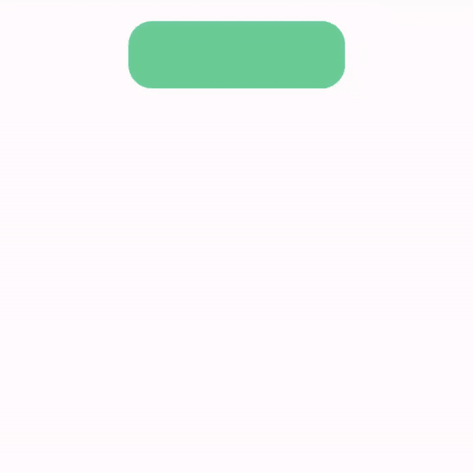
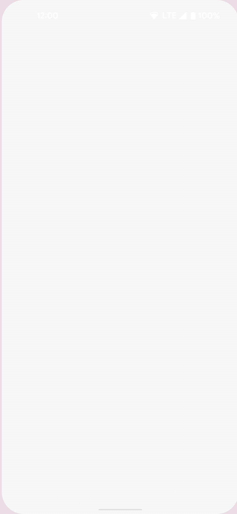
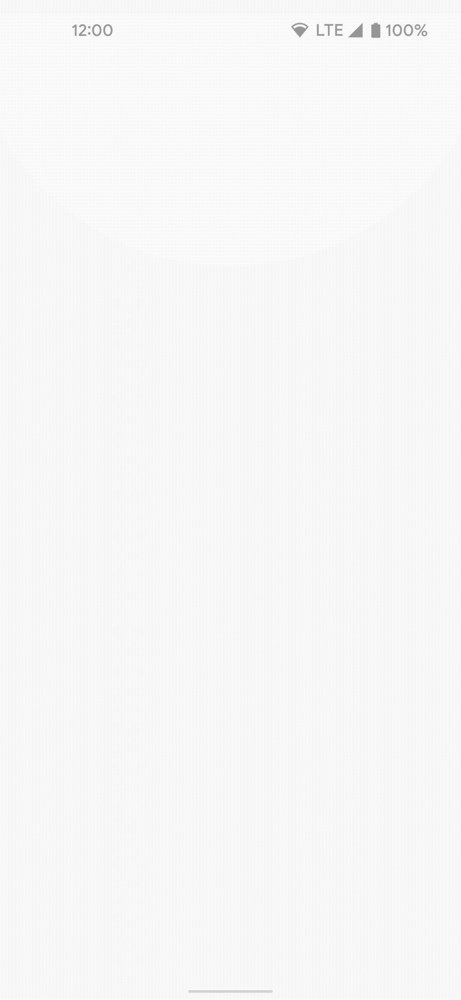
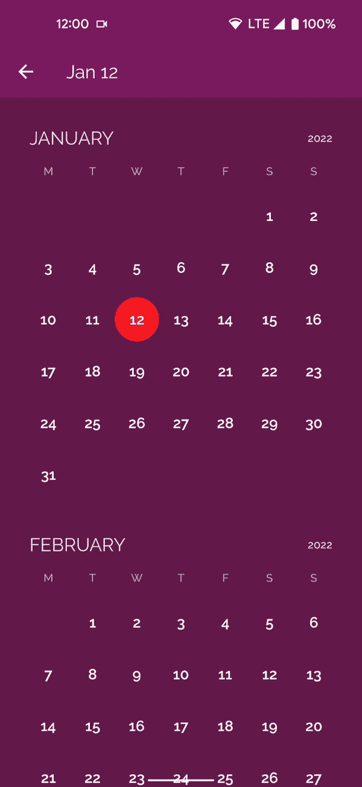

# Jetpack 中的自定义画布动画合成✨

> 原文：<https://medium.com/androiddevelopers/custom-canvas-animations-in-jetpack-compose-e7767e349339?source=collection_archive---------0----------------------->

## *使用 Animatable 实现自定义画布动画*

想象一下你所见过的最流畅的应用程序体验…一切都以丝般平滑的过渡和对你的交互的明智反应进行着…你流口水了吗？🤤你不再需要梦想，因为用 Compose 添加动画会让这个梦想成为现实。不相信我？请继续阅读。

Compose 有一系列的[动画 API](https://developer.android.com/jetpack/compose/animation)，涵盖了许多不同的用例。最简单的动画 API 就是`[AnimatedVisibility](https://developer.android.com/reference/kotlin/androidx/compose/animation/package-summary#AnimatedVisibility(kotlin.Boolean,androidx.compose.ui.Modifier,androidx.compose.animation.EnterTransition,androidx.compose.animation.ExitTransition,kotlin.String,kotlin.Function1))`。我们可以通过将它包装在一个`AnimatedVisibility`可组合对象中，并提供一个切换可见性的布尔值，来使用它来激活任何可组合对象的可见性:

AnimatedVisibility in action

这是在您的撰写应用程序中获得流畅用户交互的快速方法。但是，如果我们想做一些更复杂的事情，比如动画我们的自定义绘图的旋转或颜色呢？

Custom drawing animating rotation and color change over time

[动画文档](https://developer.android.com/jetpack/compose/animation)涵盖了不同的 API，使你能够实现这些种类的动画，我们将深入其中一个选项:[可动画化](https://developer.android.com/jetpack/compose/animation#animatable)。

但是在我们开始讨论如何使用 Compose 实现这一点之前，让我们提醒自己如何在标准视图系统中实现自定义动画:

# 重温标准视图方法😶‍🌫️

如果没有 Compose，您需要使用类似于`ValueAnimator`或`ObjectAnimator`的东西来激活您的自定义视图的属性。我在之前的一次演讲中提到过这个例子。

下面是一个示例，展示了如何为绘制圆角矩形的自定义视图的两个属性制作动画，即旋转`angle`和`color` Int。我们使用`ValueAnimator.ofPropertyValuesHolder`同时激活多个属性，在视图上调用`invalidate()`。这会触发重绘，因此动画会随着属性的更新而运行。

# 使用合成制作自定义绘图动画🎨

为了在 Compose 中实现这个动画，我们创建了两个记忆的`Animatable`状态——一个用于角度，一个用于颜色。角度将从 0–360 度变化，颜色将从`Color.Green`变化到`Color.Blue`，然后我们将使用这两个值在画布上绘制元素。

所有的动画逻辑和绘图逻辑都是可组合的。利用 Composables 中使用的相同的类和函数——比如协程和 Compose 的`State`类来存储动画进度。

你会注意到颜色动画看起来有点不同:我们定义了一个`[TwoWayConverter](https://developer.android.com/reference/kotlin/androidx/compose/animation/core/TwoWayConverter)`来将颜色转换成一个`AnimationVector`。`Color.VectorConverter`在`Color`和 4 部分`AnimationVector`之间转换，存储颜色的红、绿、蓝和阿尔法分量。在前面的视图示例中，我们需要添加`ArgbEvaluator`来实现相同的效果。

为了在将可组合组件添加到组合中时立即开始动画，我们使用了`[LaunchedEffect](https://developer.android.com/jetpack/compose/side-effects#launchedeffect)`类。只有当提供的密钥改变时，才会再次运行。然后我们在之前定义的`Animatable`上使用`animateTo`函数，这是一个 **suspend** 函数，需要从协程上下文中调用。

为了在**并行**中运行动画，我们调用 launch 两次，在一个新的协程中调用每个`animateTo`。如果我们想按顺序运行动画**，我们可以改变上面的`LaunchedEffect`块来使用相同的协程:**

**在同一个协程中运行动画将暂停线程，直到`angle.animateTo()`完成运行，然后`color.animateTo()`将运行。关于使用协同程序制作动画的更多细节——请看这个[视频](https://youtu.be/Z_T1bVjhMLk?t=552)。**

**最后剩下的就是用这两个属性画点东西了！画布✏️`onDraw`函数使用动画值— `angle.value`和`color.value`来旋转和设置圆角矩形的颜色。当这些值改变时，自动组合**重新绘制**。我们不需要叫`invalidate`。**

****

**就是这样！使用`Animatable`，我们可以像以前使用`ValueAnimator`一样实现自定义动画。与`ValueAnimator`方法相比，我们使用 Compose 版本实现了可读性更好的版本和更少的代码行。**

**如果更少的代码还不能说服你…使用`[keyframes](https://developer.android.com/reference/kotlin/androidx/compose/animation/core/KeyframesSpec)`可能是真正的抽卡。Compose 中的关键帧使您能够以特定的时间间隔更改动画的关键部分(帧)。**

**例如，如果我们想在动画的某些点设置特定的动画颜色，我们可以执行以下操作:**

**上面的例子创建了一个`keyframes` `AnimationSpec`对象，并为其提供了不同的颜色，这些颜色应该以特定的时间间隔和特定的缓动曲线来动画化。**

****

**值得注意的是`Animatable`是由 Compose 提供的低级动画 API，许多更高级的便利 API 都是基于`Animatable`之上的。例如，`animateColorAsState()`使用`TwoWayConverter`将上面的颜色转换逻辑包装起来。`animateFloatAsState()`也可用于制作角度动画。`animate*AsState`API 允许你根据状态变化独立制作动画，而`Animatable`提供了更多的灵活性和对动画的控制:允许协调动画、由手势触发的不确定动画等。**

**更真实的例子，请看 [Crane 示例](https://github.com/android/compose-samples/tree/main/Crane)中的自定义日期选择药丸动画。**

****

**有关 Compose 中不同种类动画的更多信息，请查看 Github 上的[动画文档](https://developer.android.com/jetpack/compose/animation)、[动画代码实验室](https://developer.android.com/codelabs/jetpack-compose-animation#0)或[运动合成示例](https://github.com/android/animation-samples/tree/main/MotionCompose)以获取更多示例。**

**在 Twitter [@riggaroo](https://twitter.com/riggaroo) 上与我分享你值得流口水的动画。**

**再见了。👋**