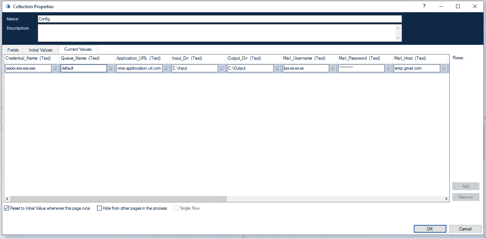
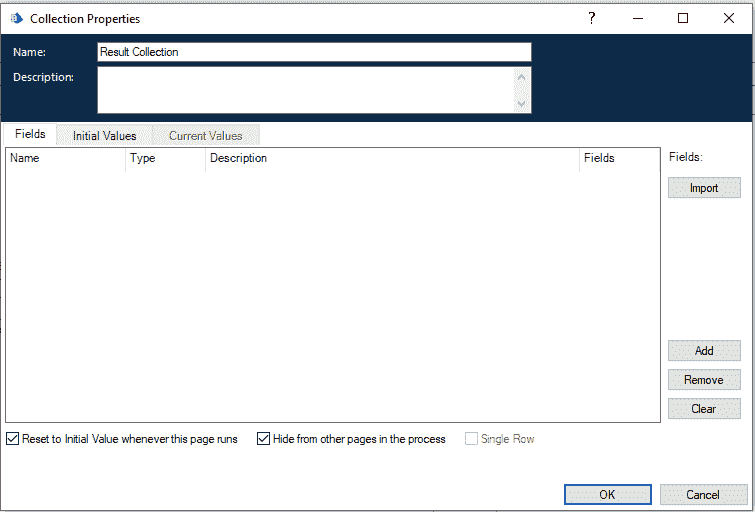
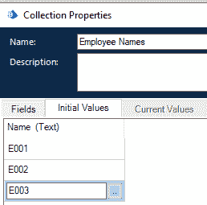
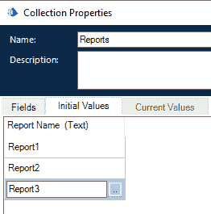
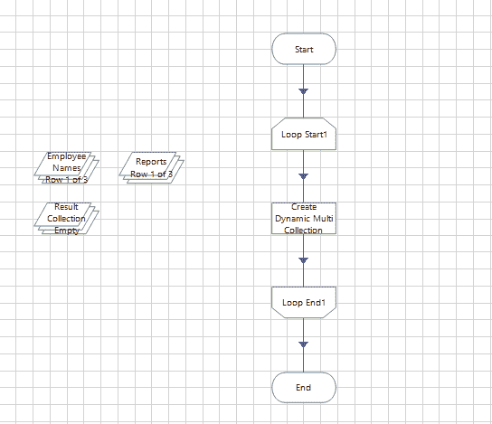
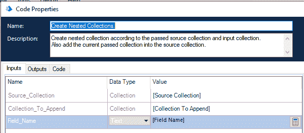
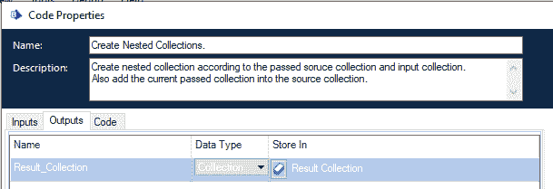
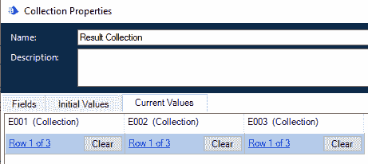
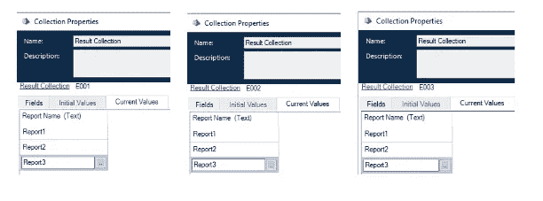

# 蓝色棱镜中的自定义代码操作

> 原文：<https://medium.com/globant/custom-code-actions-in-blue-prism-25a0004cfab5?source=collection_archive---------0----------------------->


Custom Code Activities in Blue Prism

作为一名软件行业的开发人员，我知道我们都曾在许多不同的框架、工具和库中工作过。

这篇博客将教你如何使用 Code stage 在 Blue Prism 中编写定制代码。为了理解这一点，我们正在用 Blue Prism 编写用于
集合操作的定制动作，并附有实际例子。

**蓝色棱镜中的收藏:**

在 Blue Prism 中有一种特定的数据类型，专门用于您的
需求。数据存储在一个表中。要访问来自
集合的数据，您需要遍历每一行，并通过使用列名来获取信息
。

有几种方法可以使用 Blue Prism 访问 Excel 文件中的信息:通过“集合”VBO、“实用集合操作”VBO，或者通过使用内置函数来处理集合。移除列、移除行过滤器集合、排序集合等。

让我们从编写我们自己的用于集合操作的定制实用程序动作开始。要编写自定义操作，我们将使用 Object Studio 中的代码阶段。

编码阶段具有以下属性。

```
+---------------+--------------------------------------------------+
| Property name | Description                                      |                   
+---------------+--------------------------------------------------+
| Name          | The name you want to give to the code stage.     |
| Description   | Text to describe the purpose of the code stage.  |                     
| Input         | List of Data Items as an input to a code stage.  |                    
| Output        | List of Data Items returns to parent stage       |
| Code          | Code written in VB script or C#                  |                    
+---------------+--------------------------------------------------+
```

**举例**:

蓝棱镜系列是行和列的组合，就像一个表格。因此，您需要迭代集合中的每一行，即使我们希望从集合中得到一个特定的列值。

**创建配置对象:**

在实施 RPA
流程时，我们经常将与目标流程
实施相关的配置或设置保存在 Excel 表中。在我们的流程运行之前，我们应该在
内存中创建一个配置对象，并使它可以被我们流程的所有子页访问。

我们可以通过在 Blue Prism 中使用 Microsoft Excel VBO 来做到这一点。下表显示了保存在 excel 表中的一些配置信息。

**名称**:excel 表中的列名，代表
配置名称

**值**:excel 表中的列名，代表配置的
实际值。

```
+-----------------+-----------------------------------+
|      Name       |               Value               |
+-----------------+-----------------------------------+
| Credential_Name | xxxxx-xxx-xxx-xxx                 |
| Queue_Name      | default                           |
| Application_URL | [https://some.appliocation.url.com](https://some.appliocation.url.com) |
| Input_Dir       | C:\Input                          |
| Out_Dir         | C:\Output                         |
| Mail_Username   | xxx-xx-xx-xx                      |
| Mail_Password   | *********                         |
| Mail_Host       | smtp.gmail.com                    |
+-----------------+-----------------------------------+
```

在其他语言中，我们将配置对象保存如下:

```
const Settings = {
 Credential_Name:*’xxxxx-xxx-xxx-xxx’* ,
 Queue_Name: *‘default’,*
 Application_URL: *‘https://some.appliocation.url.com',*
 Input_Dir: *‘C:\\Input\\’,*
 Output_Dir: *‘C:\\Output\\’,*
 Mail_Username: *‘xxx-xx-xx-xx’,*
 Mail_Password: *‘***********’,*
 Mail_Host: *‘smtp.gmail.com’,* }
```

但是，当我们在许多编程语言中访问配置对象时，比如

```
Settings.max_retries
```

我们无法访问蓝棱镜中集合的属性。我们可以通过使用 for 循环从集合中访问特定列的值。

这将影响流程的性能。为了简化将两列列表解析为一行的
任务，我们有一个定制的
函数。

我用 Visual Basic 写了这个函数。可以好好用 C#。要创建此功能，您可以在现有对象或 MS VBO 中创建新的程序/页面。

从 object studio 的左侧 stage 面板中拖动代码 stage，并为其提供以下详细信息。

*   **输入:**读取配置 excel 表后生成的集合。
*   **输出:**要保存新生成的单行集合的集合名称。
*   **代码:**代码来工作这个魔法。

下面是应该放在代码阶段的代码选项卡中的代码。

```
New_Collection = New DataTable
Dim New_Row As System.Data.DataRow

For Each r As System.Data.DataRow In Collection.Rows
 New_Collection.Columns.Add(r("Name"), GetType(String))
Next

New_Row = New_Collection.NewRow()
For Each dr As System.Data.DataRow In Collection.Rows
 New_Row(dr("Name")) = dr("Value")
Next

New_Collection.Rows.Add(New_Row)
```

这将产生新的集合，如下图所示:



这个配置对象对流程中的所有页面都是可见的，所以您
可以访问任何属性，比如队列名称。

```
[Config.Queue_Name]
```

这将为您提供保存在配置文件中的队列名称。同样，您可以从配置对象中访问其他属性。

**动态创建嵌套集合:**

让我们用一个用例来理解这个。

考虑这样一个场景，您有一个特定字段名的集合，它可能在集合中可用，也可能不可用。如果它是可用的，那么我们必须根据该列名/字段名添加一个集合，如果它不可用，那么我们在集合中创建该列，并根据该字段分配目标集合。

例如，我们有两个系列。

*   一个是雇员姓名收集
*   我们需要添加到每个员工的报告姓名

通过使用这两个集合，我们必须准备一个单行集合，在每个雇员的名字下有一个报表名集合。

在其他编程语言中(考虑到现在的 JavaScript ),我们可以如下实现:

```
let reports = [*'Report1', 'Report2', 'Report3'];*
let employees = [*'E001', 'E002', 'E003'];*
let userCompletedReports = {};
for (var employee in employees) {
  if (!userCompletedReports.hasOwnProperty(employees[employee])) {
      // does not exist hence creating collection for E003
      var emp = employees[employee];
      userCompletedReports[emp] = [];
      userCompletedReports[emp] =  {"ReportNames" : []}
  }

  for (var report in reports) {
    userCompletedReports[emp].ReportNames.push(reports[report]);
  } 
}
// Print the result
document.write(JSON.stringify(userCompletedReports, null, *'\t'));*
```

这将生成如下输出:

```
{
    "E001": {
        "ReportNames": ["Report1", "Report2", "Report3"]
    },
    "E002": {
        "ReportNames": ["Report1", "Report2", "Report3"]
    },
    "E003": {
        "ReportNames": ["Report1", "Report2", "Report3"]
    }
}
```

蓝棱镜系列的工作方式有所不同。在定义集合时，我们需要提供列信息和要存储的值的类型。

这需要自定义代码操作。此结果集合还没有任何记录。



员工集合:



需要添加到每个员工下的常用报表名称集合:



流程:

创建具有嵌套报表名称集合的单行雇员集合的过程



要创建此功能，您可以在现有对象或 VBO 中创建新的操作/页面。然后从 object studio 的左侧舞台面板中拖动代码舞台，并提供以下详细信息。此代码阶段具有以下属性:

```
+----------------------+----------------------+--------------------+
|       **Input** |        **Output** | **Code** |   
+----------------------+----------------------+--------------------+
| Source Collection    | Result collection    | Code to work this  |  
| Collection to Append | will hold the single | magic              |
| Field Name to append | row nested           |                    |
| collection           | collection           |                    |
+----------------------+----------------------+--------------------+
```

需要放入编码阶段的代码:



代码:

```
**Dim** RequestorCollection As DataTable
**Dim** objColumn As DataColumn
**Dim** newColumn As DataColumn

**Dim** RowsCount As Integer 
'Check If the current requestor name column does not exist'
RequestorCollection = **new** DataTable

**If** **Not** Source_Collection.Columns.Contains(Field_Name) **Then**

 'Create a column name with the input requestor name'
 objColumn = **New** DataColumn
 objColumn.DataType = GetType(DataTable)
 objColumn.ColumnName = Field_Name.Trim
 Source_Collection.Columns.Add(objColumn)

 **For** **Each** c As System.Data.DataColumn **In** Collection_To_Append.Columns
  newColumn = **New** DataColumn 
  newColumn.DataType = c.DataType
  newColumn.ColumnName = c.ColumnName
  RequestorCollection.Columns.Add(newColumn) 
 **Next**
**Else**

 **For** **Each** r As System.Data.DataRow **In** Source_Collection.Rows
  **For** **Each** c As System.Data.DataColumn **In** Source_Collection.Columns
   **if** (Field_Name = c.ColumnName)
    RequestorCollection = r(Field_Name)
   **End** **If**
  **Next**
 **Next**

**End** **If**

**For** **Each** R As DataRow **in** Collection_to_Append.Rows
 RequestorCollection.ImportRow(R)
**Next**

RowsCount = Source_Collection.Rows.Count

**if** RowsCount > 0 
 'Adding all the collection at 0 index'
 Source_Collection.Rows(0)(Field_Name) = RequestorCollection
**Else** 
 **Dim** New_Row as DataRow

 New_Row = Source_Collection.NewRow()
 New_Row(Field_Name) = RequestorCollection
 Source_Collection.Rows.Add(New_Row)
**End** **if** 
Result_Collection = Source_Collection
```

结果集合:



因此，通过使用这个简单的代码活动，我们可以创建一个有用的集合实用函数，这对每个 Blue Prism 项目都有帮助。