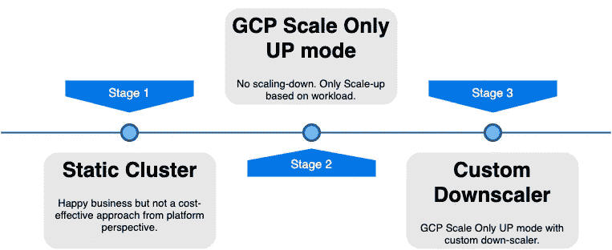
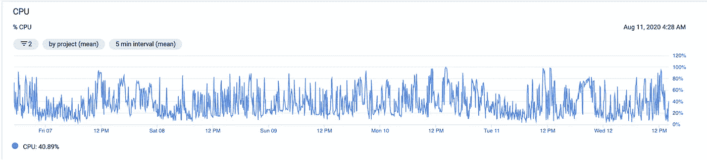
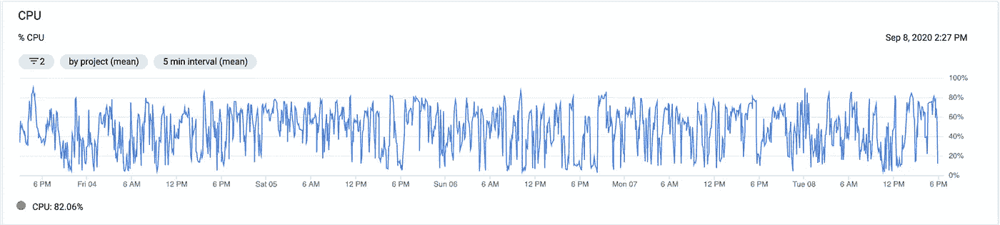

# Google Cloud 上 Trino 集群的自定义缩减器

> 原文：<https://medium.com/walmartglobaltech/custom-downscaler-for-trino-cluster-on-google-cloud-243f64112b86?source=collection_archive---------0----------------------->

Source: [Trino](https://github.com/trinodb/trino.io/blob/master/assets/trino-og.png), [Google Cloud](https://cloud.google.com/press/)

# 概观

我们在 2018 年用 Trino 开始了我们的旅程，当时只有少数用户，主要目标是只提供特别查询。与 Hive 相比，我们能够获得 60 倍的性能提升。这也是 Trino 在沃尔玛被越来越多的人采用的原因。不同的团队为了不同的用例转而使用 Trino，他们都很高兴。

到今天为止，在几个 BI 工具上开发的数千个仪表盘都由 Trino 提供支持，并且**超过 2K 的活跃用户每月运行超过一百万个查询，在这个平台上每天处理数 Pb 的数据**。

我们的 Trino 集群位于 GCP 上，过去运行在 Autoscale 模式下，该模式根据集群负载的增加或减少，自动从托管实例组中添加或删除虚拟机(VM)实例。当对资源的需求较低时，它还帮助我们降低了成本。使用 GCP 的自动缩放器唯一令人担忧的缺点是，在自动缩放器终止的主机上运行的任务会失败。

尽管我们的大多数 SQL 查询都在 5-10 秒内完成，但也有一些长时间运行的查询会运行超过 45 分钟。由于 GCP 虚拟机被 GCP 自动缩放器终止，这些长时间运行的查询受到了很大的影响。因此经常会出现查询失败。

我们希望为我们的平台用户提供更加可靠和愉快的体验，

*   **集群缩减期间零查询失败**
*   **对查询性能影响最小**

同时，我们希望**确保 Trino 集群得到充分利用。**

# Trino 星团的自动缩放问题

Trino 集群向上扩展没有任何问题，但是**当集群向下扩展时运行查询失败肯定会有问题**。

即使 Trino worker 在缩减期间 [**正常关闭**](https://trino.io/docs/current/admin/graceful-shutdown.html) **，如果查询在关闭前启动并且运行时间超过 90 秒的宽限期，查询也可能失败。长期运行的查询也不例外。**

比方说，一个用户提交一个 SQL 查询，它运行了 45 分钟，但失败了，原因仅仅是集群规模缩小了！留给用户的唯一选择是重试运行查询，并再等待 45 分钟，希望这次查询能够成功运行。

这给整个用户体验增加了一个坏味道，并且在任何组织中肯定会产生很多噪音。

简而言之，下面是我们想要解决的两个主要问题:

*   GCP 自动缩放器随机终止工作节点导致频繁查询失败
*   当一个查询运行超过 45 分钟而失败时，会浪费集群资源，因为其中一个节点被 GCP 自动缩放器取走

为了避免所有这些问题，我们决定自己管理集群缩减，让 GCP 只负责扩展集群。

# 定制下分频器的诞生

Different strategies that we adopted to resolve the cluster down-scale issue

当我们第一次看到这个问题时，我们决定从自动扩展集群切换到静态集群。我们曾经根据集群负载在一天中的特定时间调整集群界限两次。但是，这只是一个临时的方法，显然不是非常有效和具有成本效益的方法。我们的用户很高兴，因为他们不再看到 **PAGE_TRANSPORT_ERROR** 、 **REMOTE_HOST_GONE** 和 **TOO_MANY_REQUESTS_FAILED** 错误。集群处于更加可靠的状态。

下一步，我们切换到在**仅自动纵向扩展**模式下运行集群，在这种模式下，GCP 只负责纵向扩展集群。我们过去每天都会强制调整集群的大小，以确保在非高峰时段不会浪费集群资源。

即便如此，这也不是最佳解决方案，因为我们的集群曾经在集群上出现突然负载时快速扩展，但仅在非高峰时段缩减一次，这意味着**集群曾经以上限运行至少 10-12 小时，即使负载已经减少**。

这是我们决定写一个自定义的向下缩放器的时候。我们允许 GCP 仅根据 CPU 利用率纵向扩展实例。缩小规模由我们负责。我们通过适度缩减 Trino 工人的规模解决了这个问题。

# 自定义下分频器如何工作？

自定义向下缩放器查看各种指标，如整体 CPU 利用率、内存利用率、运行查询计数和排队查询计数，以决定是否可以触发向下缩放操作。

一旦定制的向下缩放器发现缩小集群的机会，它就向 Trino 工作器发送关闭信号。

Trino 工人然后进入一个特殊的状态

1.  停止服务新的请求，
2.  继续处理为其安排的当前查询任务，
3.  完成该工作后关闭。

定制下定标器持续轮询 Trino 工作线程上正在运行的任务。一旦计数下降到零，自定义向下缩放器将虚拟机标记为终止。

# 这不是故事的结尾

除了 24/7 运行的定制下分频器，我们还采用了**预定下分频器**的方法。在非高峰时段，我们的 Trino 集群负载会显著下降。

比方说，在高峰业务时段，集群满负荷运行，负载下降，向下缩放器将花费几个小时将集群向下缩放到更小/合适的大小。不是仅仅依靠定制的向下调整器来缩减集群，而是运行一个预定的向下调整器，通过调整 GCP 实例组的大小来强制调整 Trino 集群的大小。

我们确保在执行 resize 操作时，集群上没有或只有少量查询在运行，因此不会产生巨大的影响。

# 有什么帮助？

嗯，我们设法**将每月在 Trino 基础设施上的支出减少了近 50%** ，而没有影响用户体验。集群几乎一直都得到很好的利用。

Source: [GCP](https://cloud.google.com/) Trino Cluster CPU Utilization (**Before Custom Downscaler**)

Source: [GCP](https://cloud.google.com/) Trino Cluster CPU Utilization (**After Custom Downscaler**)

上面的屏幕抓图描述了引入自定义向下缩放器前后的群集利用率。很明显，在引入向下缩放器之前，群集利用率非常不一致，有时甚至不到 30%。在定制的下分频器出现后，性能有了很大的提高，几乎一直保持在 80%左右。

当集群缩减时，我们没有看到更多的查询失败。

**生意快乐，我们快乐！**