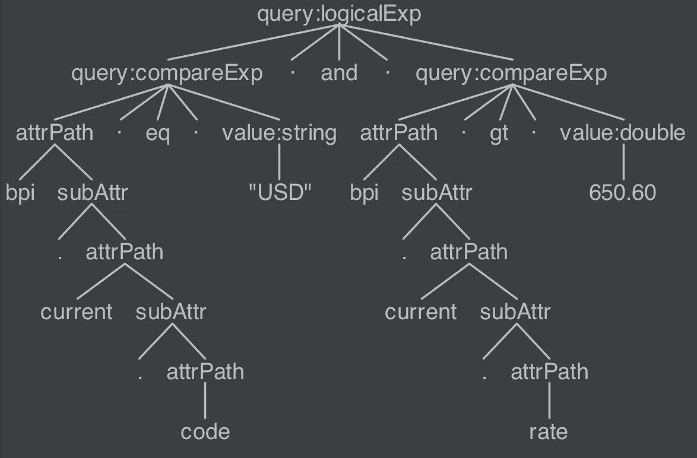

# 用 Antlr 查询 JSON 的自定义语法

> 原文：<https://medium.com/oracledevs/custom-grammar-to-query-json-with-antlr-28d4e684bad6?source=collection_archive---------0----------------------->


ntlr 是一个强大的工具，可以用来创建形式语言。对语言的形式化至关重要的是符号和规则，也称为语法。使用 [Antlr](http://www.antlr.org/) ，定义定制语法并生成相关的解析器和词法分析器是一个简单的过程。Antlr 的运行时支持给定字符流的标记化和这些标记的解析。它提供了遍历生成的解析树和应用定制逻辑的机制。让我们使用这个工具，创建一个定制的语法来查询 JSON。我们的最终目标是能够编写如下所示的查询:

```
bpi.current.code **eq** "USD" **and** bpi.current.rate **gt** 650.60
```

为了创造一种新的语法，必须定义语法的规则。让我们通过创建一个名为“JsonQuery.g4”的文件来实现这一点。然后，我们可以开始编写允许我们查询 JSON 的语法规则。以下是片段:

```
**grammar** JsonQuery;

query
   : SP? '(' query ')'                              #parenExp
   | query SP LOGICAL_OPERATOR SP query             #logicalExp
   | attrPath SP 'pr'                               #presentExp
   | attrPath SP op=( 'eq' | 'ne' ) SP value        #compareExp

   ;

LOGICAL_OPERATOR
   : 'and' | 'or'
   ;

EQ : 'eq' ;
NE : 'ne' ;

attrPath
   : ATTRNAME subAttr?
   ;

subAttr
   : '.' attrPath
   ;

ATTRNAME
   : ALPHA ATTR_NAME_CHAR* ;

**fragment** ATTR_NAME_CHAR
   : '-' | '_' | ':' | DIGIT | ALPHA
   ;
```

你可以在这里浏览整套规则。

Antlr 要求我们在创建语法时遵循一定的惯例。首先，文件应该包含一个标题，标题名应该与保存语法的文件名相匹配。Antlr 识别两种类型的规则——解析器规则和词法分析器规则。解析器规则必须以小写字母开头，词法分析器规则必须以大写字母开头。在上面的代码片段中,“query”是一个解析器规则,“EQ”是一个词法分析器规则。像为“查询”解析器规则定义的规则替换可以使用“#”操作符来标记(例如:“#parenExp”)。当我们遍历解析树时，标记替代项将触发更精确的事件。正如我之前提到的，Antlr 非常通用，提供了大量的特性，从定义规则、生成解析器、词法分析器、监听器和访问者到非贪婪子规则，以及处理优先级和左递归的方法。

Antlr 还提供了 IDE 插件，可以用来创建和可视化语法。我们可以根据我们的语法快速测试样本表达式，并预览生成的解析树。下面是基于我们之前编写的 JSON 查询表达式生成的解析树的视图:



现在我们有了查询 JSON 的工作语法，让我们把注意力转向创建一个 Java 程序和实现一个查询引擎。该引擎将基于给定的查询表达式遍历生成的解析树，根据指定的 JSON 对象对其进行评估，并返回一个布尔值来指示查询是否匹配。让我们使用 gradle 来创建我们的项目。下面是启用 Antlr 插件及其依赖项的相关 gradle 构建文件:

```
plugins {
    id "antlr"
}

dependencies {
    antlr "org.antlr:antlr4:4.7"
}

generateGrammarSource {
    arguments += ["-visitor"]
}
```

注意，Antlr 可以配置为生成一个侦听器类或一个访问者类——两种解析树遍历机制。我们将使用访问者机制遍历解析树并评估查询表达式。Antlr 的 gradle 插件将根据我们的语法生成定义 lexer、parser 和 visitor 类的源代码。我们可以简单地扩展生成的抽象类，并实现相关的定制逻辑来计算 JSON 查询表达式。下面是 JsonQueryEvaluator 类的一个片段:

```
public class JsonQueryEvaluator
        extends JsonQueryBaseVisitor<Boolean> {

    @Override
    public Boolean visitParenExp(ParenExpContext ctx) {
        Boolean result = visit(ctx.filter());
        return ctx.NOT() != null ? !result : result;
    }

    @Override
    public Boolean visitLogicalExp(LogicalExpContext ctx) {
        Boolean leftExp = visit(ctx.filter(0));

        if (OR.equals(ctx.LOGICAL_OPERATOR().getText())) {
            // Short circuit "or"
            return leftExp;

        } else {
            return leftExp && visit(ctx.filter(1));
        }
    }
    ...
}
```

请注意，访问者方法名称是如何基于我们在语法中指定的标签生成的。这使我们能够针对给定的 JSON 对象评估解析器规则的各种备选方案。如果我们没有使用标签，我们将被迫使用许多 if-else 或 switch 语句来实现相同的功能。

现在我们有了一个定制的评估器，让我们创建查询引擎类。它的工作是将表达式流式传输到 lexer，标记该流，生成相应的解析树，然后遍历解析树，根据 JSON 对象计算表达式。下面是 JsonQueryEngine 类的一个片段:

```
public class JsonQueryEngine {

    public boolean execute(String expression, JsonObject item) {
        if (StringUtils.*isNotBlank*(expression)) {

            CharStream stream = CharStreams
                    .*fromString*(expression.trim());

            QueryLexer lexer = new QueryLexer(stream);
            CommonTokenStream tokens = new CommonTokenStream(lexer);
            QueryParser parser = new QueryParser(tokens);

            ParseTree parseTree = parser.query();
            JsonQueryEvaluator evaluator =
                    new JsonQueryEvaluator(item);

            return evaluator.visit(parseTree)

        } else {
            ...
        }
    }
    ...
}
```

就这样了，伙计们。我们现在有了一个定制的语法，可以用来在编写测试时断言 JSON 对象中的条件。当然，在优化语法和解析逻辑方面还有改进的空间。前往 [GitHub](https://github.com/udaychandra/antlr-json-query) 获取源代码并进行实验。编码快乐！