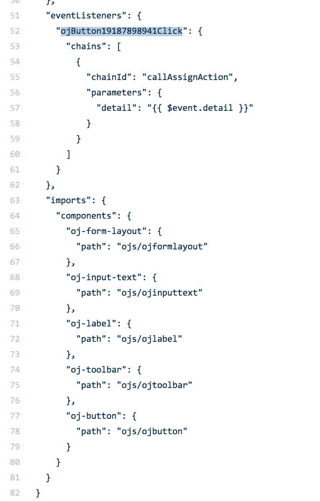

# Oracle Visual Builder 中的自定义 JavaScript 客户端代码

> 原文：<https://medium.com/oracledevs/custom-javascript-client-code-in-oracle-visual-builder-fc2450c507de?source=collection_archive---------1----------------------->

嘿，这是我的第一篇关于 VBCS 的帖子，你应该期待将来会有更多关于这个话题的帖子。Red Samurai 决定选择 VBCS 作为我们在云中的主要 JavaScript 开发 IDE。我们将使用它进行声明性 JS 开发，就像我们将 JDeveloper 用于 ADF 一样。

我在 VBCS 浏览定制 JS 客户端代码功能，觉得描述一下它是如何工作的是个好主意。Oracle 为同一主题提供了很好的资料，我建议浏览一下— [变量、模块和函数，天哪！Visual Builder 中的自定义客户端代码](https://blogs.oracle.com/vbcs/variables%2c-modules%2c-and-functions%2c-oh-my-custom-client-code-in-visual-builder)。

我创建了一个简单的 UI，有一个输入和一个输出字段。按钮调用自定义 JS 方法，其中来自输入字段的值将被处理并返回以显示在禁用字段中:

下面我将描述所有部分是如何连接在一起的。在 VBCS 的不同地区，ADF 开发的方式有很多相似之处——这有助于在 VBCS 重用 ADF 技能。

VBCS 允许在 3 个级别上定义变量:

1.  页面-页面范围
2.  流量—流量范围
3.  应用—应用范围

在我的例子中，我决定使用页面范围变量(在名为 *main-start* 的页面中定义)——第一个变量分配给输入字段，第二个变量分配给输出:

有一个属性检查器，它允许将表达式分配给 UI 字段。下面您可以看到分配给输入字段的第一个变量:

第二个变量被分配给输出字段:

按钮分配有动作链调用——在 VBCS 我们称之为动作链。在 ADF 中，我们调用 action listener 并在方法中编码 Java 逻辑，这里 action chain 提供了更大的灵活性，您将在下面的 action chain 实现中看到这一点:

VBCS 允许切换到代码视图，并检查用 JET 组件构建的 HTML 结构。当您想要自己调整生成的代码或将布局复制到外部 JET 项目时，这很有用:

每个 VBCS 页面都有一个 JS 标签。在那里我们可以找到 JS 文件，其中可以包含自定义代码。我已经创建了基本的自定义函数，只是为了测试:

VBCS JS 代码编辑器提供了广泛的自动建议功能，在开发过程中非常有帮助:

如果出现语法问题，将在审计窗口中报告错误:

动作链有单独的标签，我已经有一个了——从按钮调用(见上图):

动作链编辑器视图——除了图表，我们还有各种可用的组件。这看起来有点类似于 JDeveloper 中的 SOA/BPM 扩展，不是吗？在这个动作链中，首先我们调用自定义动作——自定义 JS 方法定义如上:

JS 调用的输入参数是从页面变量(输入组件)中分配的:

在下一步中，调用分配变量逻辑，这有助于将函数返回值分配给页面变量，该变量映射到输出 UI 字段:

函数返回值与页面变量的映射:

单击即可测试应用程序，我们的消息打印在日志中:

我已经导出了 VBCS 应用程序并上传到 GitHub [库](https://github.com/abaranovskis-redsamurai/customfunction)。从 VBCS 导出后，可以访问和检查生成的代码。以下是主页代码:

在 *main-start-page.json* 中我们可以看到元数据定义。例如，在那里我们可以找到按钮事件与动作链的映射:

VBCS 在我看来很有前途，我认为这可能是 JS 发展的未来。

*原载于 2018 年 6 月 18 日*[*andrejusb.blogspot.com*](https://andrejusb.blogspot.com/2018/06/custom-javascript-client-code-in-oracle.html)*。*