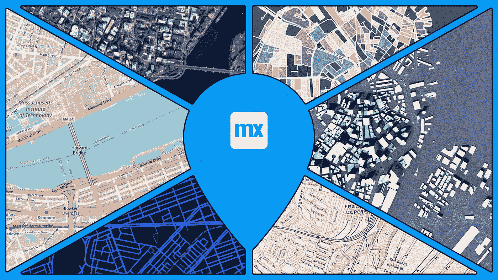
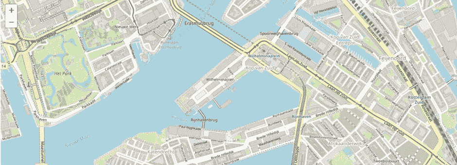
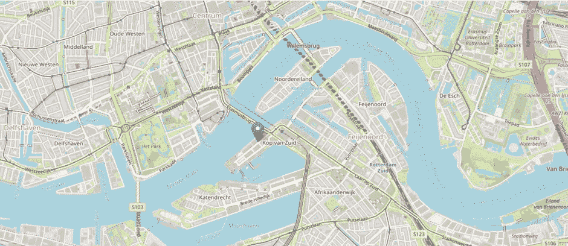
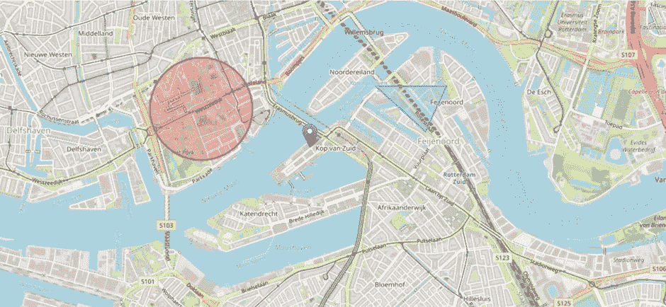
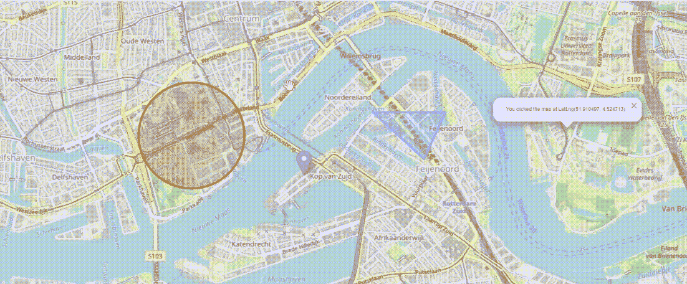
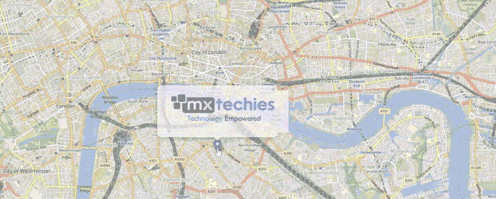
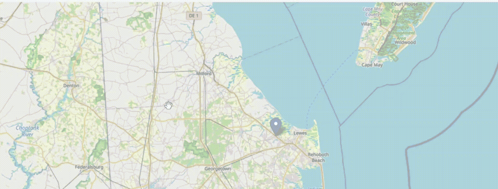

# 在 Mendix 中使用 fleed . js 自定义地图

> 原文：<https://medium.com/mendix/custom-maps-using-leaflet-js-in-mendix-f2e20bf2c824?source=collection_archive---------6----------------------->



Custom Maps using Leaflet.js in Mendix

## 在 Mendix 中定制地图有困难吗？您是否不确定如何在一个地图中管理大量自定义内容？想提高对 Mendix 地图定制的理解？这里有一些小树叶可以帮助我们的最好的适应。

在这篇博客中，我们将讨论集成地图的几种不同需求以及相应的解决方案。

让我先简要介绍一下[传单](https://leafletjs.com/)。js，然后再讨论需求。

[](https://leafletjs.com/) [## 传单-用于交互式地图的开源 JavaScript 库

### 传单是领先的移动友好的交互式地图的开源 JavaScript 库。仅重约 42 KB…

leafletjs.com](https://leafletjs.com/) 

> “传单是一个用于交互式地图的开源 JavaScript 库。它在所有流行的桌面和移动平台上都运行良好，并且可以通过各种插件进行增强。”

# 继续之前，先快速检查先决条件:

1)应该使用 Mendix 市场模块 [**HTML 和 Javascript 片段**](https://docs.mendix.com/appstore/widgets/html-javascript-snippet/) 。

2)必须通过包含此 **CSS 文件来更新**index.html**的**头**部分。**

```
**<link rel=”stylesheet” href=”https://unpkg.com/leaflet@1.8.0/dist/leaflet.css"****integrity=”sha512-hoalWLoI8r4UszCkZ5kL8vayOGVae1oxXe/2A4AO6J9+580uKHDO3JdHb7NzwwzK5xr/Fs0W40kiNHxM9vyTtQ==”****crossorigin=””/>**
```

# 让我们马上开始吧！

为了便于说明，让我们假设我们有一个客户，他从事的业务在全世界有许多分支机构。客户计划开设新的地点，并希望研究特定的活动以及在其所有地点发生的任何其他类型的活动。

必须首先设置地图的**缩放级别**，并将视图设置为我们首选的**地理坐标**:

```
**var map = L.map(‘map’).setView([51.505, -0.09], 13);**
```

为了便于说明，我们将地图视图设置为 Mendix 在鹿特丹的总部。



Mendix Headquarters — Rotterdam

搞定了！看起来很棒，对吧？！这是一个简单、实用的传单地图，带有 **OpenStreetMap** 。我们可以得到带有坐标和缩放级别的地图视图。

另外，它支持**所有鼠标功能**，包括**移动**和**缩放**。

下一个任务是在整个公司放置标记。

# 要在地图上添加标记，

```
**var marker = L.marker([51.5, -0.09]).addTo(map);**
```

这可以用各种位置的各种坐标多次添加。



Mendix Rotterdam with marker

传单支持的另一个很棒的特性是我们可以用一个个性化的图标替换标准的标记图标。然而，我们将在另一篇博客中深入讨论这个问题，因为这篇博客主要关注第一步定制。

我们现在有了一个不同的要求:地图必须在指定的坐标上显示带有圆或多边形的特定区域。

你认为添加带有坐标、背景颜色、不透明度和其他属性的形状很难吗？

知道只需要三到四行代码是什么感受？？就是这个！！

***圆圈:***

```
**var circle = L.circle([51.508, -0.11], {****color: ‘red’,****fillColor: ‘#f03’,****fillOpacity: 0.5,****radius: 500****}).addTo(map);**
```

***多边形*** *:*

```
**var polygon = L.polygon([****[51.509, -0.08],****[51.503, -0.06],****[51.51, -0.047]****]).addTo(map);**
```

地图现在看起来像这样:



Mendix Rotterdam with a marker, circle and polygon

现在我们收到客户一个有趣的请求！！他希望从他的地图中获得该位置的所有纬度和经度，而不是继续使用第三方地图提供商。他希望看到该功能添加到他的地图服务中。

我们现在有一个简单的函数来获取坐标:我们需要做的就是将它连接到我们的事件监听器。

```
**function onMapClick(e){****alert(“You clicked the map at “ + e.latlng);}****map.on(‘click’, onMapClick);**
```

结果，我们的坐标将出现在一条警告消息中，但是为了使界面更加用户友好，我们创建了一个弹出窗口，在用户单击的任何地方显示它们。

```
**var popup = L.popup();****function onMapClick(e) {****popup.setLatLng(e.latlng).setContent(“You clicked the map at “ + e.latlng.toString()).openOn(map);}****map.on(‘click’, onMapClick);**
```

结果是:



Popup to display co-ordinates

几秒钟内实现惊人的功能！

现在，我们的客户有最后一个要求:“我们有我们的每一个业务标记，每个标记的标签，甚至坐标检索功能。是否可以通过在标记器上叠加一个图像来显示每个公司的标志？”

是啊！！只需添加另一个带坐标的图层，就可以覆盖图像。

```
**var imageUrl = ‘https://maps.lib.utexas.edu/maps/historical/newark_nj_1922.jpg';****var errorOverlayUrl = ‘https://cdn-icons-png.flaticon.com/512/110/110686.png';****var altText = ‘Image of Newark, N.J. in 1922\. Source: The University of Texas at Austin, UT Libraries Map Collection.’;****var latLngBounds = L.latLngBounds([[40.799311, -74.118464], [40.68202047785919, -74.33]]);****var imageOverlay = L.imageOverlay(imageUrl, latLngBounds, {****opacity: 0.8,****errorOverlayUrl: errorOverlayUrl,****alt: altText,****interactive: true}).addTo(map);**
```

就像我们之前做的那样，通过将图像放在标记的点击位置，我们可以给出一个更加健壮的界面。



Image overlay on Marker

如果点击标记时弹出一个图像就太好了，对吧？我们有一个惊喜给我们的客户！！除了他们所要求的，我们可以为他们提供一个视频叠加的建议，并问，“这个怎么样？”对于视频叠加，需要几行代码。内容如下:

```
**var videoUrls = [****‘https://www.mapbox.com/bites/00188/patricia_nasa.webm',****‘https://www.mapbox.com/bites/00188/patricia_nasa.mp4'];****var errorOverlayUrl = ‘https://cdn-icons-png.flaticon.com/512/110/110686.png';****var latLngBounds = L.latLngBounds([[32, -130], [13, -100]]);****var videoOverlay = L.videoOverlay(videoUrls, latLngBounds, {****opacity: 0.8,****errorOverlayUrl: errorOverlayUrl,****interactive: true,****autoplay: true,****muted: true,****playsInline: true}).addTo(map);**
```

使用视频叠加的结果:



Video overlay on Marker

# 接下来

传单允许我们在 Mendix 中执行的其他功能将在下一个博客中发布。

其中一些功能是:

1)使用自定义标记更改地图的默认标记。

2)使用源和目的地坐标，列出道路路线和方向。

我希望你会发现这个博客很有用，并且喜欢用小册子在 Mendix 中做一些自定义地图！如果你有任何问题，请随时与我联系。

非常感谢您，祝您编码愉快！

# 阅读更多

 [## HTML/JavaScript 代码片段

### 描述 TML/JavaScript 代码片段小部件的配置和用法，该小部件可在 Mendix…

docs.mendix.com](https://docs.mendix.com/appstore/widgets/html-javascript-snippet/) [](https://leafletjs.com/reference.html) [## 文档-传单-交互式地图的 JavaScript 库

### 该参考反映了活页版本 1.9.2。如果您使用的是不同版本的活页，请检查该列表。用户界面层…

leafletjs.com](https://leafletjs.com/reference.html) [](https://leafletjs.com/examples/quick-start/) [## 快速入门指南-传单-用于交互式地图的 JavaScript 库

### ←教程本分步指南将帮助您快速了解传单基础知识，包括设置传单地图…

leafletjs.com](https://leafletjs.com/examples/quick-start/) 

*来自发布者-*

如果你喜欢这篇文章，你可以在我们的 [*中页*](https://medium.com/mendix) *找到更多喜欢的。对于精彩的视频和直播会话，您可以前往*[*MxLive*](https://www.mendix.com/live/)*或我们的社区*[*Youtube PAG*](https://www.youtube.com/c/MendixCommunity/community)*e .*

*希望入门的创客，可以注册一个* [*免费账号*](https://signup.mendix.com/link/signup/?source=direct) *，通过我们的* [*学苑*](https://academy.mendix.com/link/home) *即时获取学习。*

有兴趣更多地参与我们的社区吗？加入我们的 [*Slack 社区频道*](https://join.slack.com/t/mendixcommunity/shared_invite/zt-hwhwkcxu-~59ywyjqHlUHXmrw5heqpQ) *。*