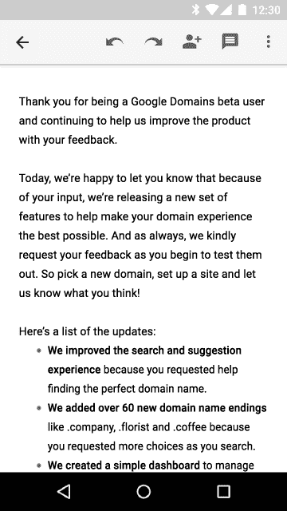

# 使用 ACTION_PROCESS_TEXT 创建自定义文本选择操作

> 原文：<https://medium.com/androiddevelopers/custom-text-selection-actions-with-action-process-text-191f792d2999?source=collection_archive---------1----------------------->

Android 6.0 Marshmallow 引入了一个新的[浮动文本选择工具栏](http://www.google.com/design/spec/patterns/selection.html#selection-text-selection)，它使标准的文本选择操作，如剪切、复制和粘贴，更接近你选择的文本。更好的是新的[*ACTION _ PROCESS _ TEXT*](http://developer.android.com/reference/android/content/Intent.html#ACTION_PROCESS_TEXT)，这使得**任何应用**都可以向文本选择工具栏添加自定义操作。



The text selection toolbar in Android 6.0

像[维基百科](https://play.google.com/store/apps/details?id=org.wikipedia)和[谷歌翻译](https://play.google.com/store/apps/details?id=com.google.android.apps.translate)这样的应用已经开始利用它来即时查找或翻译选定的文本。

你可能已经看过[文档](http://developer.android.com/about/versions/marshmallow/android-6.0-changes.html#behavior-text-selection)和一篇关于确保文本选择工具栏和选项出现在你的应用程序中的[博文](http://android-developers.blogspot.com/2015/10/in-app-translations-in-android.html)(简而言之:使用标准的*文本视图* / *编辑文本*，它们可以开箱即用，但是请注意，你的*编辑文本*需要有一个 *android:id* 设置，你需要调用[*get delegate()*](http://developer.android.com/reference/android/support/v7/app/AppCompatActivity.html#getDelegate())[*setHandleNativeActionModesEnabled(false)*](http://developer.android.com/reference/android/support/v7/app/AppCompatDelegate.html#setHandleNativeActionModesEnabled(boolean))如果您正在使用[*appcompactivity*](http://developer.android.com/reference/android/support/v7/app/AppCompatActivity.html)并且想要使用 API 23+设备上的原生浮动文本选择工具栏)。

但是找到关于**实现***ACTION _ PROCESS _ TEXT*和**添加自己的动作**的信息？这就是这篇文章将要讨论的内容。

# 跨应用程序通信->意图过滤器

正如您所料，在构建跨越应用边界的功能时，您的 Android 清单和附加到每个组件的[意图过滤器](http://developer.android.com/guide/components/intents-filters.html)充当其他应用可以查询的公共 API。

*ACTION_PROCESS_TEXT* 也不例外。您将向清单中的活动添加意图过滤器:

```
<activity
    android:name=".ProcessTextActivity"
    android:label="@string/process_text_action_name">
  <intent-filter>
    <action android:name="android.intent.action.PROCESS_TEXT" />
    <category android:name="android.intent.category.DEFAULT" />
    <data android:mimeType="text/plain" />
  </intent-filter>
</activity>
```

而且，如果你想要多种行动(你超水平发挥，你！)，你需要为每一个单独的活动。从 Android 6.0.1 开始，你会希望避免添加*Android:exported = " false "*——你的动作仍会出现在其他应用中，但它们会在点击它时立即获得一个 *SecurityException* (在 *ACTION_PROCESS_TEXT* 中实现过滤以匹配系统选择器行为的[功能请求](https://code.google.com/p/android/issues/detail?id=199161)已被标记为 *FutureRelease* 并在内部修复)。

请注意**你的活动的 *android:label* 将在文本选择工具栏**中显示为动作，因此请确保它很短，是一个动作动词，并且可以识别为你的应用程序的图标。例如，Google Translate 使用“翻译”，因为这是一个不太常见的操作(有多少人安装了多个翻译应用程序？)，而维基百科使用“搜索维基百科”，因为搜索可能是许多应用程序更常见的操作。

# 获取选定的文本

一旦您设置了意图过滤器，其他应用程序将能够通过选择文本并从文本选择工具栏中选择您的操作来启动您的活动。但是这并没有增加任何价值，除非你真的看了被选中的文本。

这就是[*EXTRA _ PROCESS _ TEXT*](http://developer.android.com/reference/android/content/Intent.html#EXTRA_PROCESS_TEXT)的用武之地:它是包含在 Intent 中的一个 [*CharSequence*](http://developer.android.com/reference/java/lang/CharSequence.html) 表示选择了什么文本。不要被欺骗了——即使你使用的是*文本/普通*意图过滤器，你也会得到完整的 *CharSequence* 以及包含的任何[*span able*](http://developer.android.com/reference/android/text/Spannable.html)，所以如果你在你的应用程序中直接使用 *CharSequence* 时注意到一些样式，不要惊讶(你总是可以调用 [*toString()*](http://developer.android.com/reference/java/lang/CharSequence.html#toString()) 来移除所有格式)。

因此，您的 *onCreate()* 方法可能类似于:

```
@Override
protected void onCreate(Bundle savedInstanceState) {
  super.onCreate(savedInstanceState);
  setContentView(R.layout.process_text_main);
  CharSequence text = getIntent()
      .getCharSequenceExtra(Intent.EXTRA_PROCESS_TEXT);
  // process the text
}
```

有一点需要注意的是，如果您使用的是*Android:launch mode = " single top "*，那么您还需要处理[*【onNewIntent()*](http://developer.android.com/reference/android/app/Activity.html#onNewIntent(android.content.Intent))中的文本——一种常见的做法是让 *onCreate()* 和 *onNewIntent()* 调用您创建的单个 *handleIntent()* 方法。

如果你使用 *ACTION_PROCESS_TEXT* 作为进入你的应用程序的入口，这就是你所需要的一切:之后你要做什么取决于你自己。

# 返回结果

还有一个额外的包含在*ACTION _ PROCESS _ TEXT**Intent*虽然:[*EXTRA _ PROCESS _ TEXT _ READONLY*](http://developer.android.com/reference/android/content/Intent.html#EXTRA_PROCESS_TEXT_READONLY)。这个*布尔值*额外表示您刚刚收到的选定文本是否可以被用户编辑(例如在 *EditText* 中的情况)。

您将使用如下代码检索额外的内容

```
boolean readonly = getIntent()
  .getBooleanExtra(Intent.EXTRA_PROCESS_TEXT_READONLY, false);
```

你可以以此为线索，提供将修改过的文本**返回给发送应用的能力，替换选中的文本**。这是因为您的活动实际上是从[*startActivityForResult()*](http://developer.android.com/reference/android/app/Activity.html#startActivityForResult(android.content.Intent,%20int))开始的—在活动结束之前的任何时候，您都可以通过调用 [*setResult()*](http://developer.android.com/reference/android/app/Activity.html#setResult(int,%20android.content.Intent)) 来[返回结果](http://developer.android.com/training/basics/intents/filters.html#ReturnResult):

```
Intent intent = new Intent();
intent.putExtra(Intent.EXTRA_PROCESS_TEXT, replacementText);
setResult(RESULT_OK, intent);
```

您可以想象一个“Replace”按钮会调用 *setResult()* 然后调用 [*finish()*](http://developer.android.com/reference/android/app/Activity.html#finish()) 返回到调用活动。

# 常见问题

在你开始写回复之前，这里有一些关于 *ACTION_PROCESS_TEXT:* 的常见问题

## 问:我可以用 *ACTION_PROCESS_TEXT* 触发服务吗？

答:不直接—系统仅查找包含正确意图过滤器的活动。这并不意味着您不能让您的活动使用主题 [*来推出服务。半透明. not title bar*](https://developer.android.com/reference/android/R.style.html#Theme_Translucent_NoTitleBar)甚至 [*主题。不显示*](https://developer.android.com/reference/android/R.style.html#Theme_NoDisplay) (只要你[立即完成活动](https://plus.google.com/105051985738280261832/posts/LjnRzJKWPGW))，但是确保你有一些用户可见的提示，表明他们的动作被接收到了——一个开始通知，一个[祝酒词](http://developer.android.com/reference/android/widget/Toast.html)等等。

## 问:我可以只对某些类型的文本触发它吗？

答:没有。每当有人选择文本时，您的选项就会出现。当然，用户很可能不会选择“翻译”选项，除非他们想翻译，等等。，但我会小心地编写防御性代码，因为你无法确定你将收到什么类型的文本上下文。

## 问:那么是不是每个 app 都要实现 *ACTION_PROCESS_TEXT* ？那岂不是疯了？

答:是的，那太疯狂了，不，不是每个应用都应该实现 *ACTION_PROCESS_TEXT* 。确保你执行的任何操作**都是通用的，并且对安装了你的应用的用户真正有用**。

# 了解更多信息

除了前面提到的[维基百科](https://play.google.com/store/apps/details?id=org.wikipedia)和[谷歌翻译](https://play.google.com/store/apps/details?id=com.google.android.apps.translate)已经包含了很好的真实世界的例子，你也可以查看安装在棉花糖模拟器上的 ApiDemos 应用程序或者[直接查看代码](https://android.googlesource.com/platform/development/+/master/samples/ApiDemos/src/com/example/android/apis/content/ProcessText.java)。

# BuildBetterApps

加入关于 [Google+帖子](https://plus.google.com/+AndroidDevelopers/posts/T4dgC9FRMNj)的讨论，关注 [Android 开发模式集合](https://plus.google.com/collection/sLR0p)了解更多！

