# 使用 RxJS 和 Angular 服务的自定义 TypeScript 装饰器

> 原文：<https://medium.com/capital-one-tech/custom-typescript-decorators-using-rxjs-and-angular-services-6ddd1079f683?source=collection_archive---------0----------------------->


如果你以前使用过 Angular，你可能会熟悉 TypeScript decorators，以及它们在框架中的用法。从`@Component`到`@Injectable`、`@Input`和`@Output`，装饰者是使 Angular 开发更容易的关键特征。在 Angular 框架之外，开发人员还创新了许多额外的装饰器，它们有很好的用例及实用性。`@AutoUnsubscribe`(通过[)ngx-auto-unsubscribe](https://github.com/NetanelBasal/ngx-auto-unsubscribe))、方法弃用装饰器和日志记录是非常有用的装饰器的几个例子，它们通过打包可以在整个应用程序中以实用的方式重用的逻辑，使我们的代码更加整洁。今天，我想介绍另一种方法，我们可以利用带有 RxJS 和 Angular 的`async`管道的装饰器来创建一个高度可重用的定制装饰器。

免责声明— ***目前，*** [***打字装璜***](https://www.typescriptlang.org/docs/handbook/decorators.html) ***正对其*** [***二次提案***](https://github.com/tc39/proposal-decorators) ***。装饰者仍然被认为是实验性的，需要开发者的选择。也就是说，请记住，ECMAScript 中还没有实现这种语言特性的规范，将来随时都有可能发生变化。就目前而言，“装修者冠军团推荐继续使用*** [***巴别《遗风》***](https://babeljs.io/docs/en/babel-plugin-proposal-decorators#legacy) ***装修者或*** [***打字本《实验》***](https://www.typescriptlang.org/docs/handbook/decorators.html) ***装修者。”——***[***TC-39 建议***](https://github.com/tc39/proposal-decorators#faq)

也就是说，我想介绍并探索一种有趣的方式，在今天的应用程序中我们可以利用 decorators。让我们投入进去吧！

# 使用案例

许多公司喜欢用 A/B 测试来测试他们的用户界面，以获得最佳的用户体验。通常，这些测试需要一些用户上下文、API 调用和响应，以及对 DOM 的一些更新，以呈现适当的体验。

在我们的场景中，我们将假设任何给定用户的以下情况都是正确的:

*   用户有一个唯一的 ID
*   用户有偏好的语言
*   用户有资格使用特殊功能

第三方 A/B 库提供了一个需要用户上下文作为参数的函数，以便进行 HTTP 调用。这个调用决定了应该为用户返回什么样的体验，从而反映在页面上。更具体地说，这个函数可以接受一组参数(例如 ID、语言等的用户上下文)。)，将这些参数作为查询字符串参数构建到头中，然后进行 HTTP 调用，该调用作为承诺返回。一旦我们收到 API 响应，我们就可以将承诺转换为可观察的，然后订阅它来获取我们的数据并操纵 DOM 来显示特定的体验。

# 该设置

好吧！既然用例已经设置好了，让我们看看第三方库函数的伪代码。然后，让我们用一个 Angular 服务将它连接起来，用一些基本的模板在一个组件中使用库显示响应。

# 第三方库

下面将展示一个我们可以从第三方 A/B 测试库中获得的方法的基本示例:

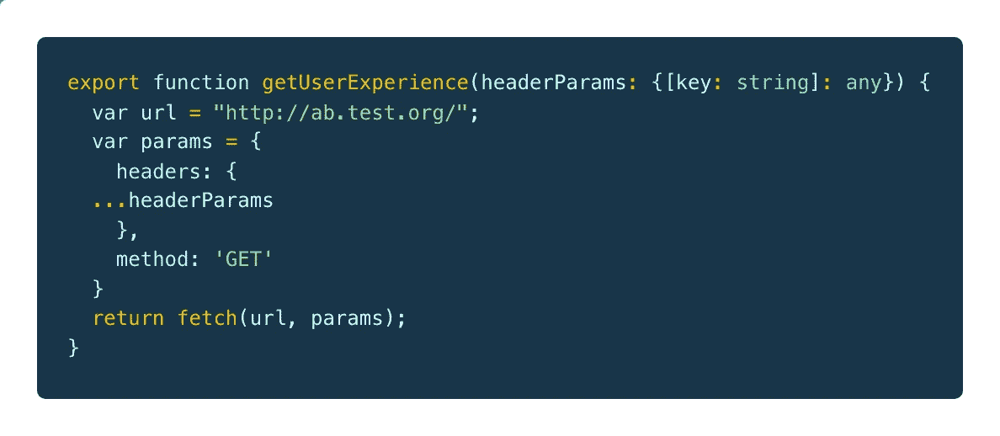

/ab-test-frameworks.ts

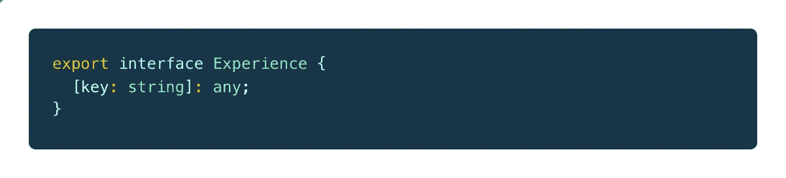

/models/experience.interface.ts

记住，以上是伪代码。这是为了演示第三方库的用法，该库进行 XHR 调用，并将请求作为承诺返回。我们假设这个库将总是返回一个 JSON 对象，该对象包含我们可以在代码中利用的数据。例如，我们可以接收:

```
{
  experience: “A”,
  . . .
}
```

# A/B 测试服务

既然我们已经了解了第三方库是如何工作的，那么让我们创建一个可以注入到任何组件中的服务。该服务将负责成为使用 A/B 功能的单点。稍后我将解释为什么为第三方 A/B 库函数的消费创建包装器服务有一些额外的好处(提示:我们可以在我们的自定义装饰器中使用它)。

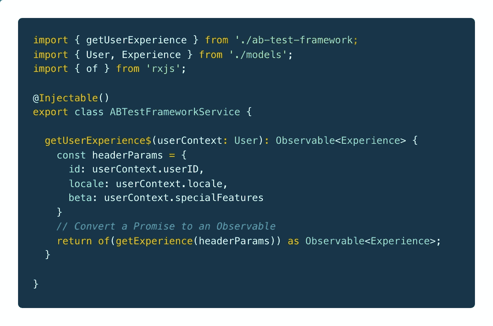

/ab-test.service.ts

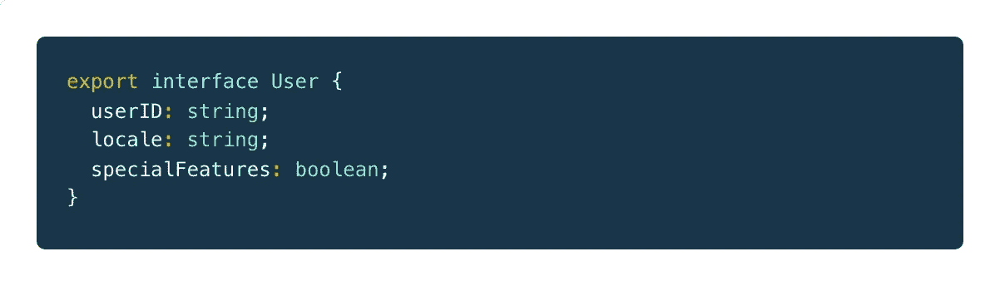

/models/user.interface.ts

在我们的服务中，我们简单地导入由第三方库提供的函数，并在我们的服务类中创建一个方法，该方法将承诺包装在 RxJS 提供的名为`of`的方法中。因为我们知道承诺将有一个类型为`Experience`的响应，所以我们可以将方法的返回类型定义为`Observable<Experience>`。

酷！让我们在组件中使用我们的新服务。

# 创建演示组件

现在，让我们用模板和依赖注入`ABTestFrameworkService`来定义我们的基本 A/B 测试组件。

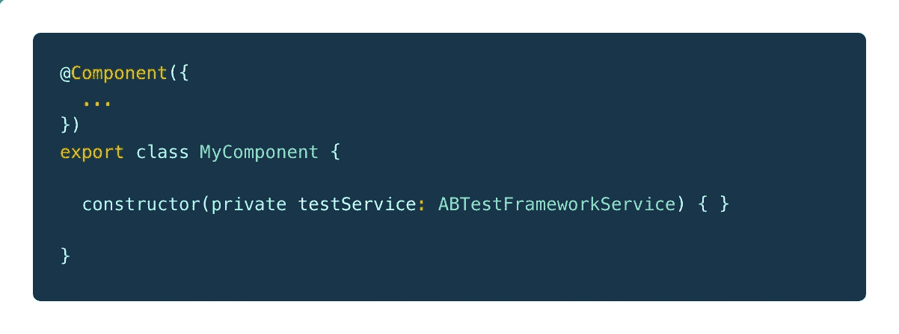

/my-component.component.ts (v1.0.0)

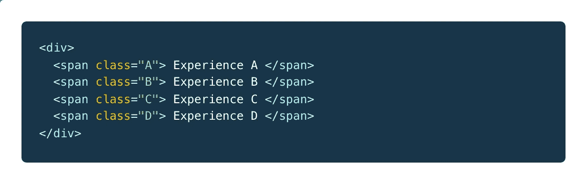

/my-component.component.html (v1.0.0)

此时，我们可以轻松地使用一些定义的用户上下文来调用服务，以获取从第三方库返回的 JSON 有效负载，并在我们的 DOM 中呈现它。

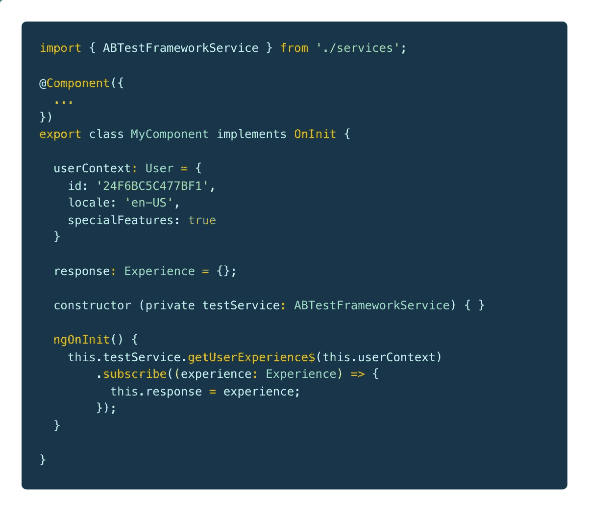

/my-component.component.ts (v1.1.0)

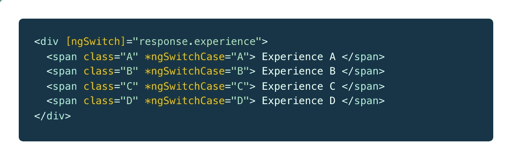

/my-component.component.html (v.1.1.0)

既然我们订阅了一个可观察对象，我们需要确保在组件被销毁时处理我们的订阅。退订有很多不同的方法(即`Subsink`、`@AutoUnsubscribe`等)。)，不过现在还是简单一点吧。

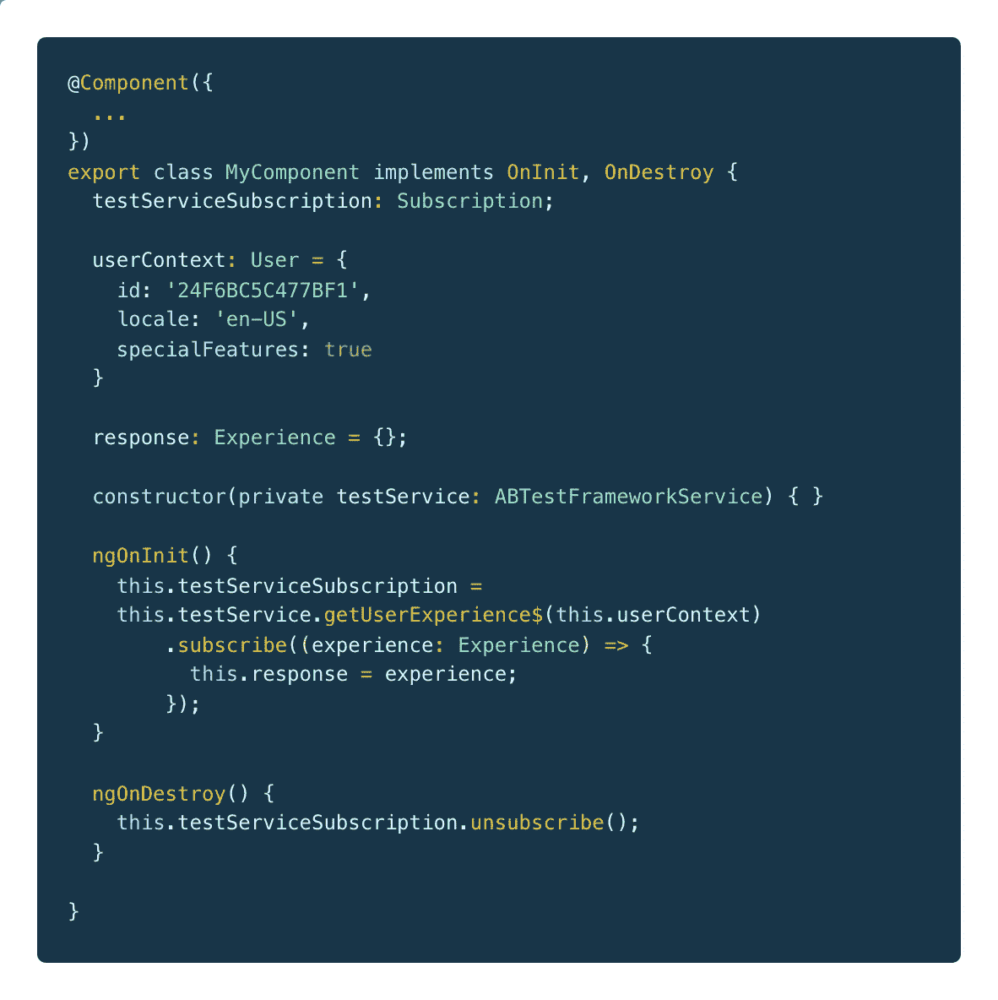

/my-component.component.ts (v1.1.1)

到目前为止，一切都像往常一样。取消订阅的方法是完全有效的，但是如果我们想以一种更有角度、更符合人体工程学的方式来做呢？

可能想到的一个功能是 Angular 的`async`管道。当组件被初始化和销毁时，这个管道分别自动处理订阅和垃圾清理。利用`async`管道的一种方法是将`getUserExperience$()`分配给一个公共类成员。这将返回一个我们经验数据的可观察值给这个类成员，然后我们可以`async`在模板中传输它。这还不错，但是这需要我们在组件的构造函数中依赖注入服务，然后连接模板和组件之间的所有东西。这种方法没有错，但是我认为我们可以更进一步，将这种功能打包到一个装饰器中。

# 装修工

如果你正在阅读这篇文章，你可能已经知道什么是室内设计师了，但是让我们快速地回忆一下:

> 装饰器是一种特殊的声明，可以附加到类声明、方法、访问器、属性或参数上— [**打字稿郎**](https://www.typescriptlang.org/docs/handbook/decorators.html#decorators)

使用 TypeScript 装饰器有一些主要的好处，所以让我们强调几个:

*   **decorator 允许我们提取一个逻辑块，然后可以很容易地在整个应用程序中重用——**这通常被称为面向方面编程(AOP)，它通常在不修改代码本身的情况下向现有代码添加额外的行为。换句话说，你正在编写你的代码(不要太元)。
*   **装饰者可以修改类、方法、成员、访问器和属性**——在整个 Angular 框架中，使用了各种各样的装饰者，例如`@NgModule`、`@Component`、`@Injectable`、`@Input`、`@Output`等。这些装饰器处理添加类元数据和操作类方法/成员的繁重工作，以及其他我们必须手动完成的事情。
*   **decorator 工厂在定义时被调用—** 如果一个给定的 TypeScript 声明有多个 Decorator，那么每个 Decorator 的表达式从上到下被求值，表达式的结果作为函数从下到上被调用。另外，decorators 是在 TypeScript 声明的运行时调用的。这可能是对外部异步事件的一个限制，我将在后面的章节中介绍。

简而言之(我将在这里对你做一些解释)，把装饰者看作是一种编程你的代码以一种特定的、可重复的方式运行的方式。没错，*我们正在编写我们的代码*。

很酷的东西！既然我们知道可以通过修饰一个 TypeScript 声明来扩展一段代码的行为，那么让我们将它与我们的`ABTestFrameworkService`结合使用来设置一个基本的自定义属性修饰器，它将一些值绑定到我将在组件中使用的类成员。

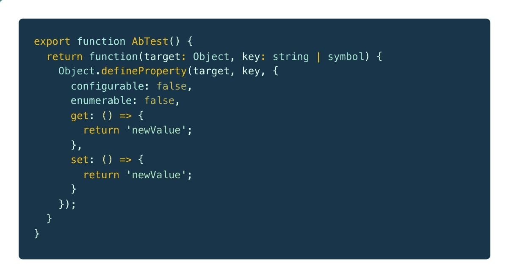

/ab-test.decorator.ts (v1.0.0)

就这么简单！我们只是调用一个返回函数表达式的工厂函数。这获取了对它所修饰的对象的引用(在我们的例子中，它是一个类成员)，我们用“newValue”替换了目标的值。这很有用，因为现在我们可以将`ABTestFrameworkService.getUserExperience$()`绑定到任何类属性。但是首先，我们需要在装饰工厂中获取对我们服务的引用。我们如何做到这一点？

为此，我们需要在消费服务的特性模块中公开 Angular 的注入器。我们可以通过定义一个`static`类成员来获取服务的引用，并通过模块的`constructor`将注入器的引用设置为服务的引用。

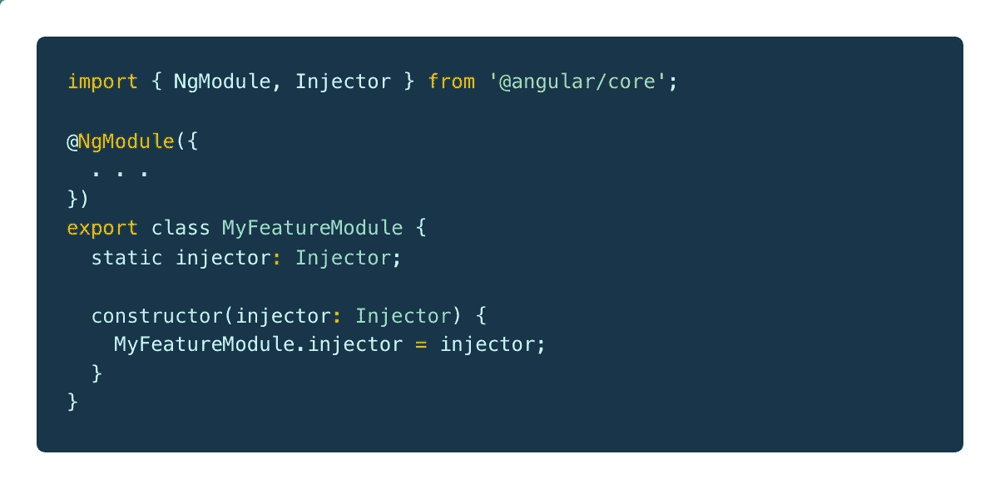

/my-feature.module.ts

从这里，我们可以将我们的特性模块导入到我们的装饰器中，并使用`injector.get()`获取对我们服务的引用。在我们有了对服务的安全引用之后，我们可以绑定返回 AB 测试数据的可观察对象的方法。

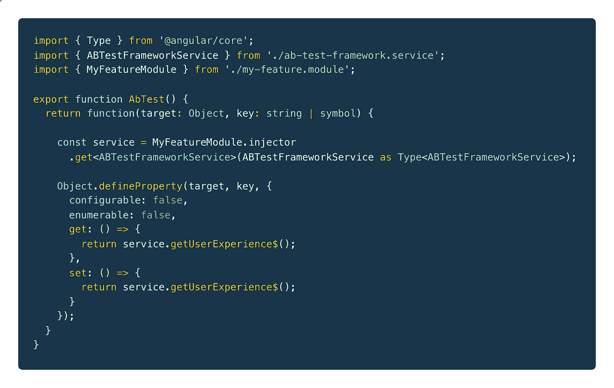

/ab-test.decorator.ts (v1.1.0)

完美！我们已经成功地将可观察的经验数据绑定到我们的类成员。你可能想知道顶部的`Type`导入。不要太担心。这是 Angular 的`injector.get()`的一个助手，用于准确返回在注入器中注册的服务的正确引用。我们遗漏了最后一件事:通过我们的装饰器向服务方法提供用户上下文。让我们现在做那件事。


/ab-test.decorator.ts (v1.1.1)

现在我们已经定义了我们的装饰器，让我们去重构我们的组件来使用它而不是我们的服务。

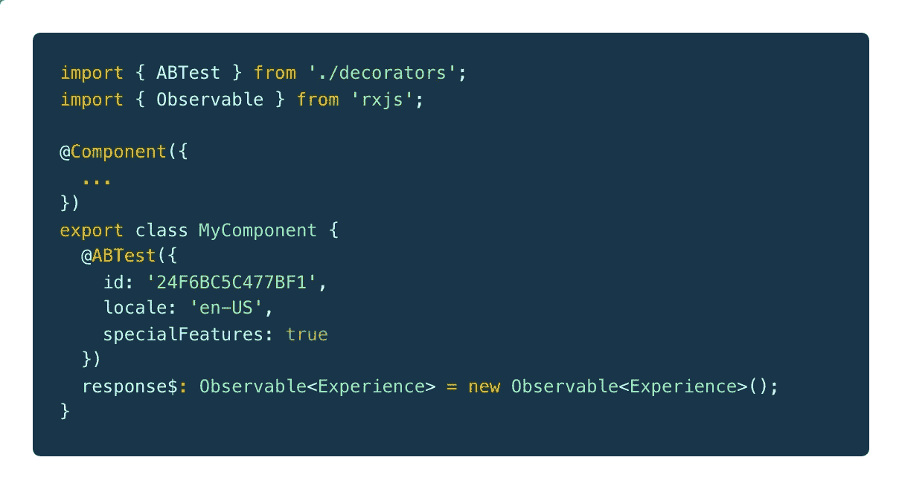

/my-component.component.ts (v2.0.0)

嘣！我们只是消除了许多通常必须设置的样板文件(见我们组件的 1.1.1 版)。我们可以移除`ngOnInit`和`ngOnDestroy`生命周期挂钩以及所有相应的代码*，只保留*来处理订阅和退订。现在，我们可以简单地在模板中异步管道`response$`。您可能已经注意到，我们使用这个装饰器的方式似乎类似于`@Component`装饰器的用法。让我们更新我们的 HTML 模板。

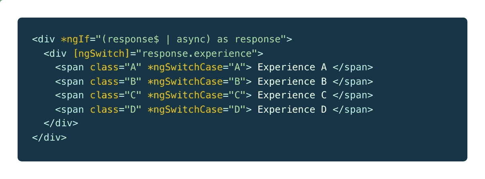

/my-component.component.html (v2.0.0)

# 对定制装饰者的一个警告

在我们的用例中，可能会有这样一个场景，我们需要在类初始化后确定一些额外的用户上下文。因为 decorators 是在类初始化期间的运行时执行的。没有机会解决任何异步事件(例如，解决 API 调用、等待用户交互等。)在装饰工厂被评估和解决之前。对于这个用例，我们可以注入服务，解决任何异步调用，然后用那个附加的上下文调用我们的服务调用。它可能看起来像这样。

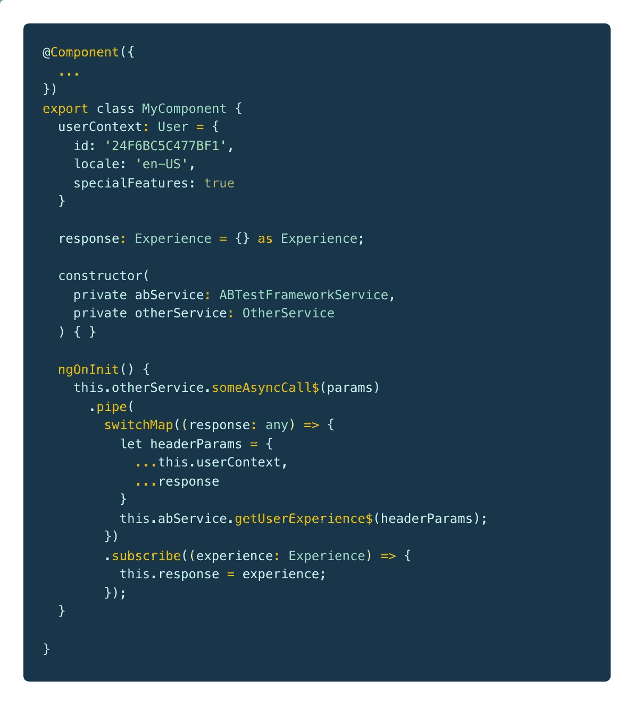

/my-component.component.ts (resolve async)

虽然我们不能使用我们的装饰器，但是我们的服务足够灵活，可以适应这种类型的 A/B 测试场景。不幸的是，我们失去了`async`管道的奢侈，所以我们必须用这种方法负责任地处理我们的订阅。

# 总结

TypeScript decorators 是一种非常强大的方法，它以一种干净、实用的方式封装和应用可重复的逻辑，而不会弄乱我们日常的代码。在我们的具体用例中，我们从 Angular 的`async`管道中获益，除了未解决的外部异步事件之外，它可以消除包含订阅策略的其他库依赖的需要。我想鼓励每个人给 TypeScript decorators 一个机会，并探索可以在整个应用程序中使用的其他用例。干杯！

另外，如果你想知道我在本文中使用了什么 VS 代码主题，请查看 [Cobalt2](https://github.com/wesbos/cobalt2-vscode) 。对眼睛真的很棒！

披露声明:2019 首创一。观点是作者个人的观点。除非本帖中另有说明，否则 Capital One 不隶属于所提及的任何公司，也不被这些公司认可。使用或展示的所有商标和其他知识产权是其各自所有者的财产。