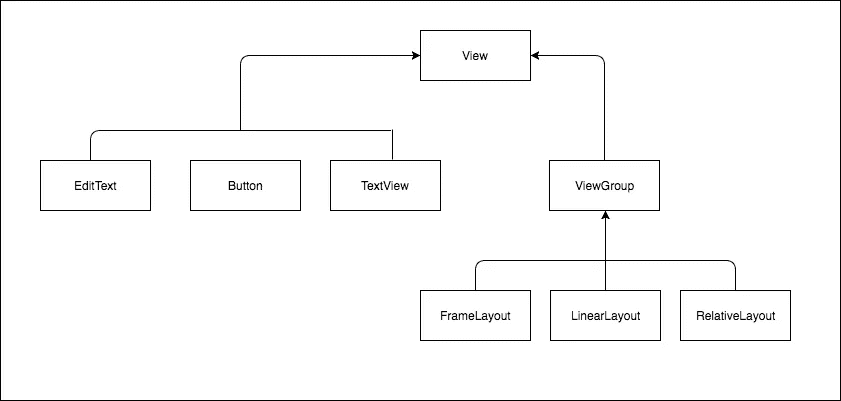

# Android 上的 Custom Views — 第 1 部分

> 原文：<https://medium.com/google-developer-experts/custom-views-no-android-parte-1-c3a55117ef1b?source=collection_archive---------2----------------------->

开发 Android 应用程序只是开发一个客户端,以便用户可以访问我们在移动设备上提供的特定服务。因此,开发具有简单、直观的图形界面并为最终用户带来快乐的应用程序必须始终是我们所有工作的目标。

作为开发人员,我们在构建具有出色 UI 的应用程序时所做的大部分工作都是以结构化的方式将不同的**Views(T2)组合在一起,以便对用户有意义并允许他们实现预期的目标。**

# Views 是什么?

> (View)This class 表示用户界面组件的基本构建块。视图占用屏幕上的矩形区域,并负责绘图和事件处理。— [Android 官方文档](https://developer.android.com/reference/android/view/View.html)

根据上面的定义,视图是 Android 中所有图形界面组件的基础,负责在屏幕上绘制组件并监听事件。

Android 框架有一个视图库,我们可以将其分为两组,即 **Widgets** 和**ViewGroups。(T8 )**



小部件(T10)都是诸如 EditText,TextView,Checkbox 等组件,它们直接从 View 类扩展,并有其特定用途的实现。

ViewGroups 也直接从 View 类扩展,但与 widget 最大的区别在于 ViewGroups 充当 *容器,并且可以包含其他 View 或 ViewGroups。
如上图所示,ViewGroups 是 Android 中不同布局的类的超类。*

***PS*** *:我们将在这个 s*是*rie 的更高级的帖子中更详细地讨论 Views。(T23)*

# **Custom Views。什么是**?(T27)

因为每个应用程序都是不同的,有时框架不提供任何必要的组件来帮助我们提供个性化体验,因此需要进一步开发自定义视图来解决这个问题。

有两种方法可以开发***自定义视图***,其中第一种方法是创建类**View** 的直接子类,并处理所有复杂问题,例如计算它们的测量值,组件的定位,如何,何时以及绘制什么等等。

第二种也是最简单的方法是通过扩展其初始功能来实现我们预期的目标,或者扩展视图组以将组件以特定方式分组来扩展框架中的特定 Widget。

## 为什么要给我这么多工作?

正如我上面提到的,创建自定义视图相对复杂,并且考虑到框架已经附带了多个视图,有一些优点可以证明浪费时间和做这项工作是合理的:

*   **可重用性** 创建自定义视图允许我们在应用程序的不同部分重用代码,同时创建一个自定义视图,用于用户界面的不同部分。
*   **封装** 创建自定义视图允许我们封装其内部功能。
    通常,如果我们有一个特定的图形界面(布局)来表示像电影这样的对象,我们需要单独设置和设置每个属性,并将所有这些功能暴露给提供电影信息的类。
    使用自定义视图,我们可以将所有这些操作封装在视图中,而使用它的所有其他应用组件只需要知道要向自定义视图分配哪些信息,而自定义视图将知道如何正确地格式化和呈现这些信息。
*   **性能** 在开发非常复杂的图形用户界面时,最常见的场景之一是需要将组件放入其他组件中,以便它们得到适当的组织。
    这个过程通常在 layout.xml 文件中完成,当我们将 Views 放在其他 Views 中时,由于将要创建的深层次结构,我们可能会遇到很大的性能问题。(**我将更详细地解释当视图和创建它时会发生什么,直到它出现在屏幕上**
    通过自定义视图,我们可以使这些层次结构变得不那么深入,并使用一些技术显着提高性能,我将在下一篇文章中解释。

# 标籤: Custom TextView

因为我无法在不编写一些代码的情况下完成帖子,所以让我们看看自定义 TextView 的代码,我称之为 RedTextView,它只是确保文本颜色始终为红色。

进入我们的第一个超级酷定制视图的细节 2 要考虑的主要方面是:

1.  我们的类扩展了框架中可用的 AppCompatTextView。由于面向对象编程中的继承概念,我们的类继承了超类的属性和行为(方法)。
2.  上面的例子有两个构造函数:

*   第一个仅接收 **context**的构造函数,用于我们想要从 java 代码动态实例化视图的情况。

```
RedTextView redTextView = **new** RedTextView(**context**);
redTextView.setText(**"Super cool red Text"**);
```

*   第二个构造函数收到一个**context** 和一个**AttributeSet**,用于从布局文件中生成 View 的**inflate**。

```
<**com.app.blog.customview.RedTextView
    android:id="@+id/red_textview"
    android:layout_width="match_parent"
    android:layout_height="wrap_content"** />
```

非常快速和简单,每当我们想要一个文本总是红色的 TextView,我们可以随时使用我们的自定义视图 RedTextView。

因为我们才刚刚开始,我相信今天就足够了,我们将回到下一步,在那里我们将创建更复杂的自定义视图,并详细介绍上述两个构建器之间的差异。

> 如果你很高兴能了解更多关于自定义视图的信息,并且喜欢这篇文章的第一篇,请点击下面的 ***推荐*** 并与你可能感兴趣的朋友分享!

谢谢!

直到下一次。

=)