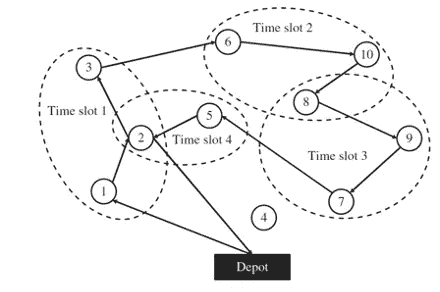
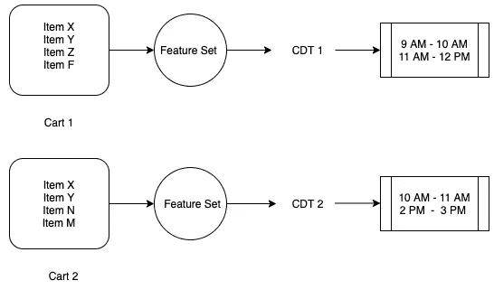
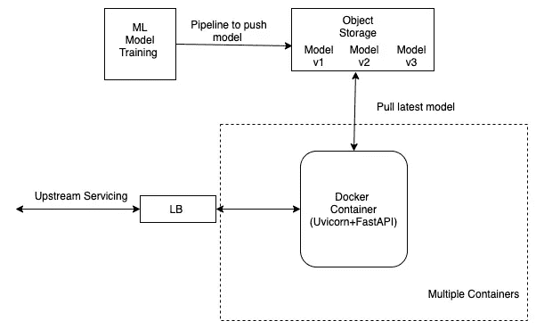
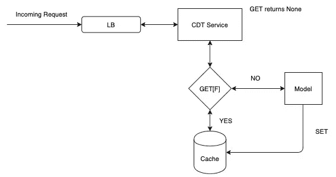

# 基于机器学习的客户交付时间预测

> 原文：<https://medium.com/walmartglobaltech/customer-delivery-time-cdt-prediction-using-machine-learning-aae9c33cc07e?source=collection_archive---------0----------------------->

> ***尼提什戈普，阿比吉特法塔克***


电子商务极大地影响了我们购买产品和服务的方式。这可以归因于各种因素，例如——在期望的时间窗口(*如*上午 10:00–10:30)方便地送货上门，只需点击几下鼠标即可浏览和搜索庞大的产品目录、折扣和销售信息、*等*。在这篇文章中，我们给出了交付流程的概述，以及我们如何使用机器学习来更好地估计客户交付时间(CDT)。CDT 影响我们的员工需要执行的最终交付计划，并与客户体验和我们的业务紧密相关。

最后一英里递送是典型供应链中的最后一步，其中包装(订单、包裹、*等。*)从商店、仓库或任何设施运送到所需的客户地址。对于零售商来说，最后一英里配送系统非常复杂，因为我们需要为分散在提供送货上门服务的地区的不同客户提供服务。此外，我们需要能够在指定的时间段内完成各种订单。

这对业务也很重要，因为如果最后一英里的交付执行不理想，很可能会导致重大损失。系统的物理约束部分利用不足或过载(*例如*接受新订单，因为运输车辆几乎满载而不适合运输车辆，或者保守地保留空间和时间容量，导致运输车辆未被充分利用)是导致最后一英里物流损失的两个简单场景。这可能会导致产品价格或客户配送费用的增加。这种客户体验可能不利于收入和客户保持率。此外，我们还希望捕捉路线可能受到 COVID 等场景影响的趋势，这对于运营至关重要。

为了避免这些问题，许多送货运营商都有一个最后一英里优化系统，该系统可以解决带时间窗的约束车辆路线问题(CVRP-TW)，这是运筹学和计算机科学领域的一个研究热点。这是一个 NP 难的组合优化问题，这意味着找到它的精确解至少与不确定的多项式时间问题一样困难。下面是该问题的示意图



Source:

有多种方法可以求解接近最优的 CVRP-TW。然而，所有这些方法都需要某种距离/时间矩阵，该矩阵可以给出问题中指定的每个点(起点)到每个其他点(目的地)之间的总预计交付时间。假设有 100 个来自商店的订单，距离/时间矩阵的大小是 101 * 101。如果我们假设道路网络是对称的，这是一个简化的假设，那么我们可以将它缩小到一半，从而得到一个三角形矩阵。给定该距离矩阵以及其他输入数据，优化算法试图最大化目标函数，该目标函数可以简单到仅最小化总驾驶时间或距离，或者高度复杂到结合商业度量的其他方面，如空位可用性、空位承诺、客户满意度、*等。*遵守约束的同时。在工业环境中，为了确保平稳运行，我们需要考虑许多约束和缓冲。优化算法试图迭代地优化 CVRP-TW 问题的解决方案，并以称为交付计划的人类可读格式输出该解决方案。交付计划包含许多细节，便于运营主管和交付助理以最佳方式连续执行当天的履行流程。

现在我们已经了解了基本原理，我们讨论一个重要的方面，我们称之为客户交付时间(CDT)，它与用于创建距离/时间矩阵的总交付时间相关联。

**什么是客户交付时间(CDT)？**

它可以定义为送货助理将订单交付给客户所需的时间，不考虑驾驶时间或计划休息时间。简单地说，对于一个订单交货，我们可以定义总交货时间(TDT)是驾驶时间(DT)和客户交货时间(CDT)以及任何休息时间(BT)的总和。

*TDT = DT + CDT + BT*

由于 CDT 是 TDT 的重要组成部分，TDT 是优化算法的输入，因此最终的解决方案和交付计划在很大程度上依赖于它。我们需要考虑 CDT，以确保顺利运营、良好的客户满意度和准时交付，尤其是对于包含易腐物品的杂货订单。例如，送货助理可能不容易在客户位置附近找到停车位——在拥挤的城市地区没有街道停车位，无法找到客户的房子(房子可能被遮挡)，*等*。在其他情况下，客户可能订购了大量商品，需要配送员分多个步骤完成订单。低估 CDT 可能会给配送员带来压力，因为他们完成订单和后续订单的时间较少。过高估计 CDT 将导致工作时间的低效使用和不良时段指标，即我们可能能够交付额外订单。典型的 GPS 和导航系统/服务不提供这种信息。在这种情况下，我们讨论如何使用机器学习(尽可能准确地)预测 CDT。

**假设:**

假设 CDT 取决于一些变量:

*   **地点:**地址，地址类型(公寓，房子，公寓)
*   **订单相关:**订单大小(有多大和多重)、交货时间(晚上、早上、下午)
*   **外部:**天气、当天的活动、新客户(寻找地址可能会更困难)

```
CDT = g(X)        ... hypothesis that CDT depends on variables X
```

为了检验这个假设，我们收集了一年多的历史数据。

```
X = [ address, address_type, order_size, delivery_time_of_day, weather, events, new_customer ]
```

我们转换这些输入特征集以供我们的机器学习算法使用。例如，我们解析地址以确定客户所在的楼层(例如，1 楼对 5 楼，这将极大地影响 CDT，尤其是如果员工必须多次从车辆到客户)。假设我们得到的转换后

```
X_transformed = f(X)        ... f represents various transformations
```

请注意，我们还知道历史上每个已完成订单在 CDT 上实际花费了多少时间，这是目标变量。

```
y = CDT                     ... to be predicted
```

因此，我们可以使用监督学习来学习我们的特征(X_transformed)与目标(y)之间的关系。注意，这是一个回归问题，因为我们需要预测 CDT 的估计值。我们基于不同的算法训练各种模型，如线性回归、随机森林、最近邻、神经网络、*等。*同时执行超参数调谐，以获得最佳精度性能，不会欠拟合或过拟合*。*在决定部署哪个模型时，我们还考虑了预测的延迟，这将在下一部分讨论。我们选择 L2 损失函数作为我们的目标，并报告各种误差指标，如 RMSE，梅，MAPE。选择 L2 是因为我们可以容忍接近实际值的+/-误差，但是我们不能容忍大的误差，因为它具有现实生活的含义

```
# Notice y = CDT is y_actual
# y0 = CDT predicted by our modelimport numpy as np
N = len(y)  # number of samples being evaluatedMAE =  (1/N) * np.sum(np.abs(y - y0))
RMSE = (1/N) * np.sum(np.square(y - y0))
MAPE = (1/N) * np.mean(np.abs((y - y0) / (y + 1e-6))) * 100
```

由于模型的预测会影响我们的供应链能力(尤其是时间限制)，我们需要非常频繁地访问这个预测管道，因为它将在客户订单级别被调用。此外，我们需要它是可靠的(没有停机时间)和可伸缩的(能够处理高请求吞吐量)。如前所述，这与我们客户的插槽可见性有关(如果我们没有容量，我们就无法完成更多订单)。下面显示了为什么会有多个调用的一个这样的例子。



CDT determination

在上面的场景中，一位顾客正在购买添加到购物车中的商品 X、Y、Z、F。基于 CDT 模型所需的输入，我们获得了预测 CDT1，并显示了时隙可用性。如果出于某种原因，客户决定改变主意，删除 Z、F 项，并添加 N 和 M 项，这将改变 CDT，因为我们在这里可以看到，模型预测的更新 CDT 值(采用新的输入集)是 CDT2。CDT1 > CDT 2 或 CDT 1 < CDT 2\. In the next section, we devote our attention to understanding how the system is made scalable and robust.

**实现**的原因有很多

我们使用 Docker 来封装系统中的各个部分。我们包装了执行输入数据收集、特征化、调用模型所需的所有依赖项，并将其作为独立的服务运行。这样做是为了确保预测服务是可移植的。此外，它还提供了云不可知的优势。我们使用 Python 创建 API 和框架来服务预测管道。为了满足高请求吞吐率，我们利用异步 web 框架 FastAPI。然后，我们将这个 FastAPI 应用程序部署在一个生产就绪的 Uvicorn 服务器上，该服务器也是 ASGI ( *异步服务器网关接口)*。产生了多个 Uvicorn workers，由于其*异步*特性，我们看到性能的提升是显著的，尤其是在高吞吐量的情况下。FastAPI+uvicon 是使用 Python 最快的框架之一，其性能非常接近基于 NodeJS 的服务。[这里的](https://www.techempower.com/benchmarks/#section=test&runid=a979de55-980d-4721-a46f-77298b3f3923&hw=ph&test=fortune&l=z8kflr-v&a=2)是 python 中服务应用程序的各种选项的比较。

我们从对象存储中加载预编译的模型，并在运行时将其加载到内存中，这是一次性的设置成本。我们的容器化 docker 服务负责模型版本控制，因此我们总是使用最新的模型进行预测。这使得服务在具有高性能和可伸缩性的同时，减少了对外部因素和依赖性的依赖。下图说明了流程



Architecture of CDT service

**缓存和多线程**

我们的服务实时做出预测，我们可能需要通过多个上游服务来使用它。这意味着，每次发送请求时，我们都要运行模型，即使是针对同一组输入要素。为了避免这种情况，我们实现了分布式缓存机制。这可以节省再次运行模型的时间，因为 API 调用被简化为缓存检索操作。



Caching Mechanism

缓存故障被视为未命中，在这种情况下，我们运行该模型。我们在单独的线程上运行缓存操作，以减少延迟并获得快速响应时间。使用 python 的本地线程的示例代码看起来设置了缓存键和值，如下所示

```
import threadingthread = threading.Thread(target=_setcache, args=(cdtrequest,feature,cdtvalue))
```

这大大缩短了响应时间，并使服务更具弹性。

**结论**

为了降低运输成本，提高物流和运营效率，需要进行路线规划。ASDA 每年的在线交付订单约为 2000 万至 2500 万份，除了有效规划路线(即席制定最后一英里规划)之外，正确估计 CDT 还可以将订单数量增加约 15-20%。这为我们每年节省了 400 万到 500 万美元的成本和额外收入。

**参考文献:**

 [## 16.2.线程—高级线程接口— Python 2.7.18 文档

### 源代码:Lib/threading.py 这个模块在较低级别的基础上构建了较高级别的线程接口…

docs.python.org](https://docs.python.org/2/library/threading.html) 

[https://wiki.openstack.org/wiki/Swift](https://wiki.openstack.org/wiki/Swift)