# EWM 交付层面的客户领域增强

> 原文：<https://medium.com/walmartglobaltech/customer-field-enhancement-at-delivery-level-in-ewm-6d439dd9f4a9?source=collection_archive---------2----------------------->

在这篇博文中，我们将提供一个指南来创建一个定制字段，并将其添加到外向交货订单中。

# 问题陈述:

我们有一个业务需求，我们必须在交付级别存储一些客户信息，以便在仓库流程中进一步使用，如入库、提货等。此外，我们需要为用户提供一种方式来编辑交付级别的定制信息。

我们知道，可以通过增强相关的 EEW 结构来为交货/库存添加自定义字段。

*   但是我们如何将字段添加到表单视图中呢？
*   如何在表单视图中编辑自定义字段？
*   我们如何将值填充到自定义字段？

我们已经搜索了博客来指导我们的探索，以满足我们的要求，但我们没有找到任何博客。我们在 EWM 系统中做了一些反复的分析和调试，然后找到了方法。

这是我们如何实现的

# 解决办法

*   将自定义字段添加到相关 EEW 结构中

在 EEW 结构/SCDL/INCL_EEW_DR_ITEM_STR 中添加与 ODR 文档相关的字段(数据从 ECC 系统流出)。

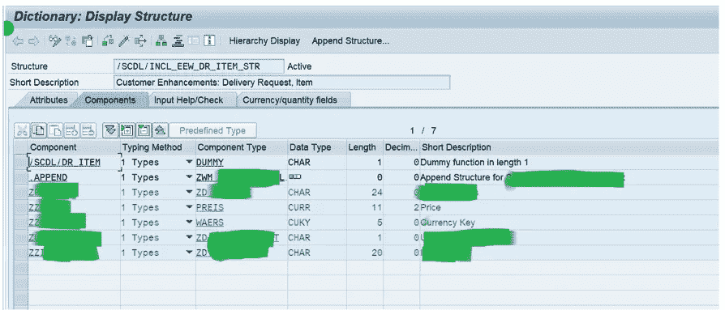

在 EEW 结构/SCDL/INCL_EEW_DLV_ITEM_STR 中添加与 ODO 文档相关的字段(数据从 ECC 系统流出，字段值可在 EWM 系统中编辑)。

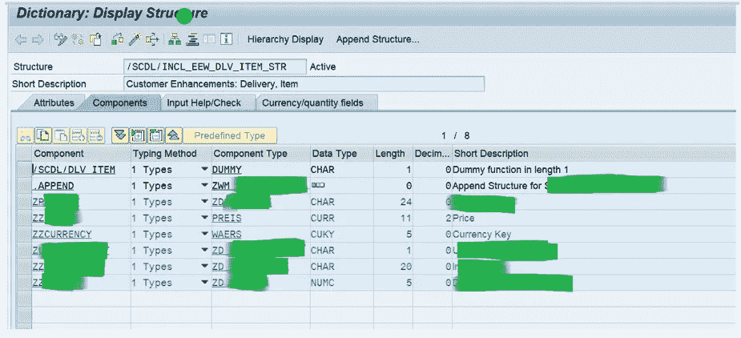

一旦 EEW 结构附加了自定义字段，就可以在 ALV 列表视图中以不可编辑的形式查看这些字段，请参考下面的屏幕截图。

若要使其在窗体视图中可用，请按照下列步骤操作:

1.  自定义-在表单视图中添加自定义字段

扩展仓库管理->跨流程设置->发货-仓库请求

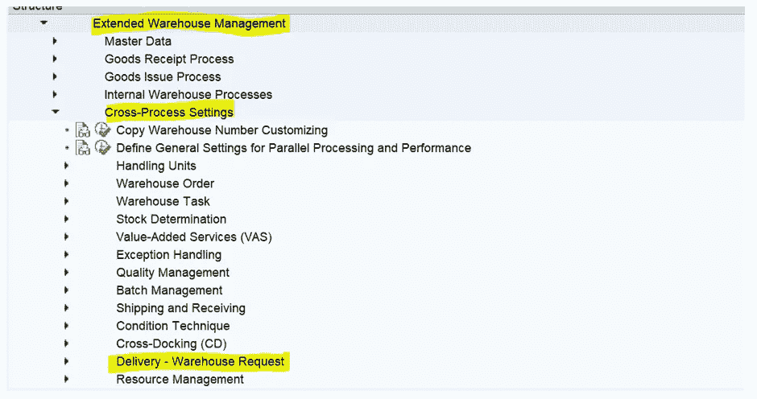

交货-仓库请求->交货-仓库请求的扩展->定义逻辑字段名称

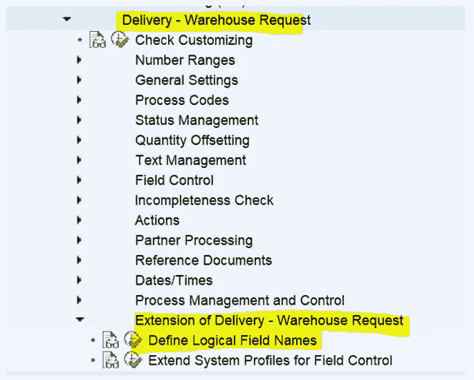

选择交货的 EEW 结构

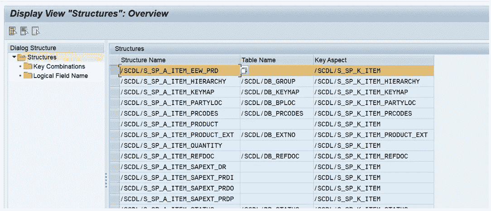

选择逻辑字段名，输入新添加的逻辑字段名的自定义字段名。

因为我们在项目级别添加字段，所以 Soc 级别选择为 2 个项目。

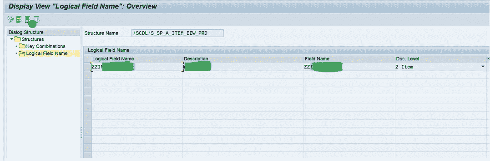

交货-仓库请求->交货-仓库请求的扩展->扩展用于字段控制的系统配置文件。

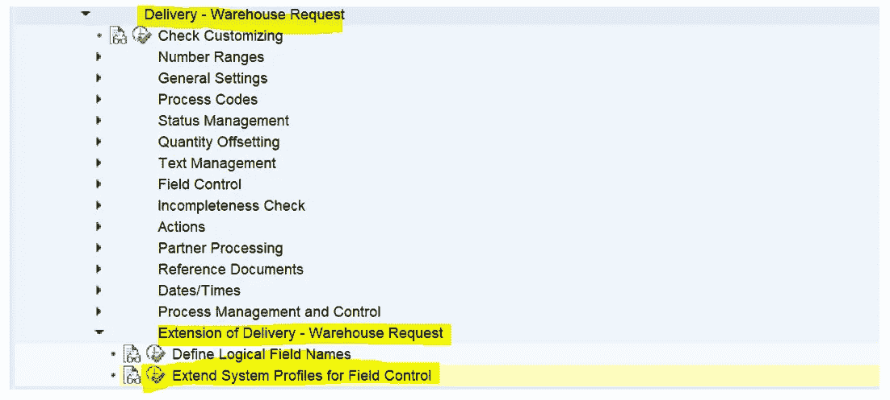

选择 ODO 项目系统配置文件/SCDL/DLV

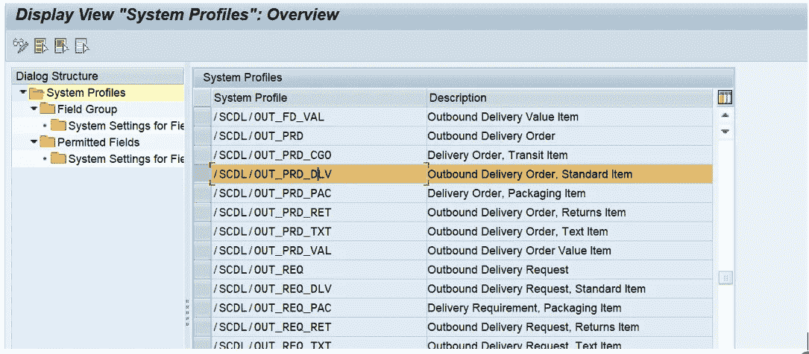

添加具有 EEW 结构的允许字段

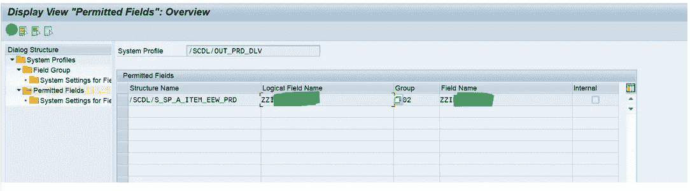

选择相关状态，使该字段不可编辑。

在这种情况下，一旦文档的状态设置为“已完成”,字段将不可编辑。

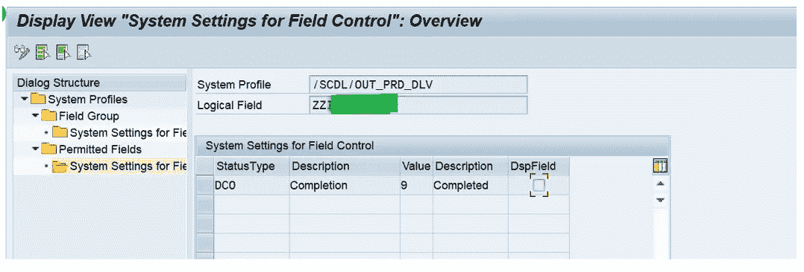

1.  技术细节-

*   创建客户定义的功能组

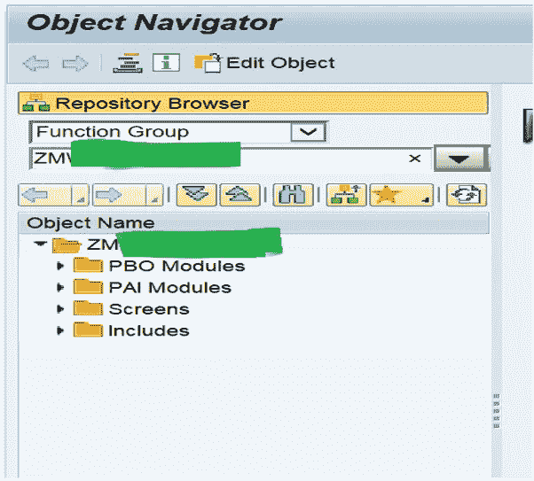

*   在功能组中，创建一个 PBO 和一个 PAI 模块以增强物料数据。

PBO 模块应该调用以下方法之一:

/SCWM/CL _ DLV _ 巴蒂 _MGMT=>PBO_ITEM

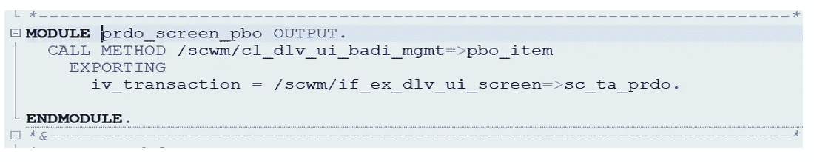

PAI 模块应该调用以下方法之一:

/SCWM/CL _ DLV _ 巴蒂 _MGMT=>PAI_ITEM

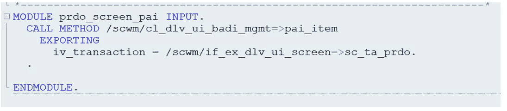

请注意，在导出时应提及正在进行更改的交易。

由于这些更改与出站项目相关，交易被称为 SC_TA_PRDO。

对于入境，应该是 SC_TA_PRDI。

其他交易参考接口/SCWM/IF_EX_DLV_UI_SCREEN。

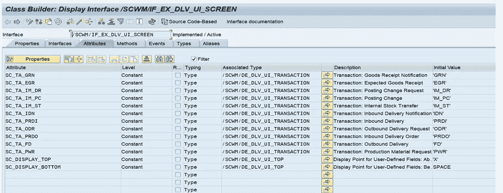

*   在功能组中创建子屏幕。项目数据的屏幕不得超过 128 列和 8 行。在流逻辑中，调用相应的 PBO 或 PAI 模块

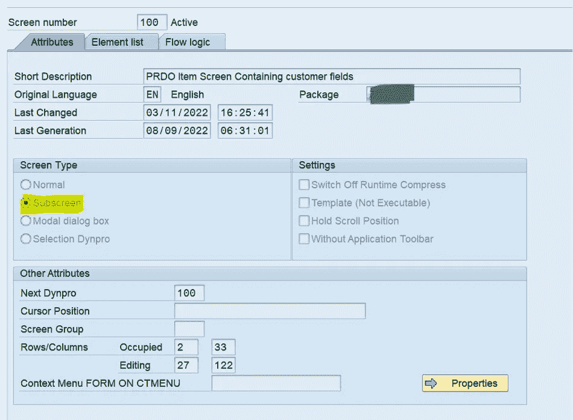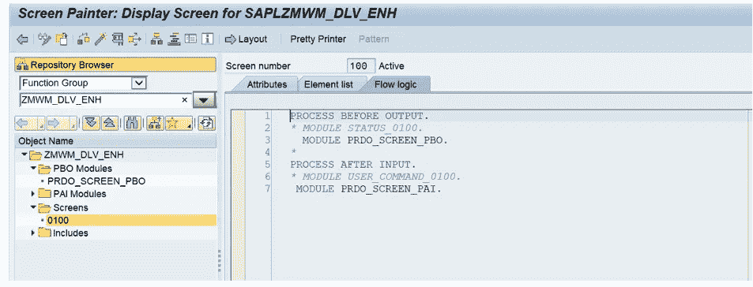

将 EEW 结构自定义字段添加到屏幕。

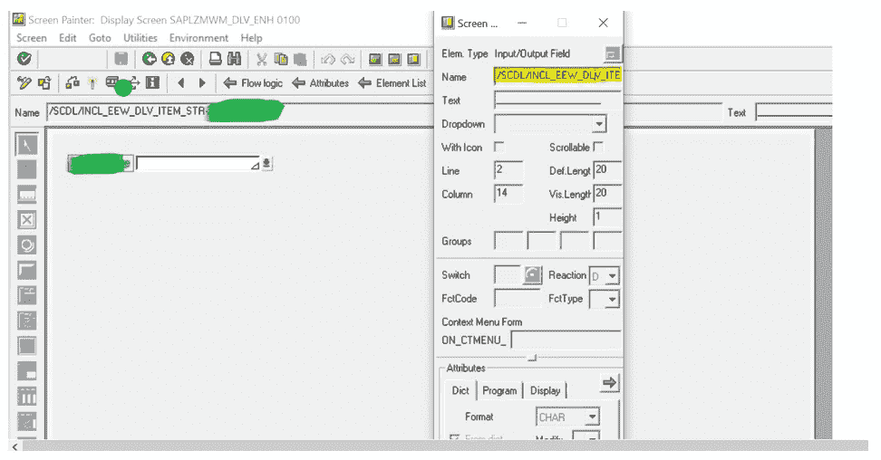

*   现在实现巴蒂来增强屏幕

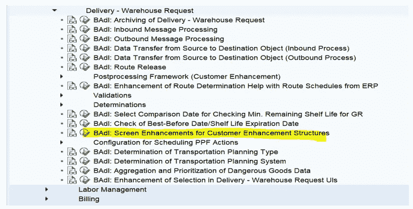

根据需求实施巴蒂，在这种情况下，将使用物料扩展。

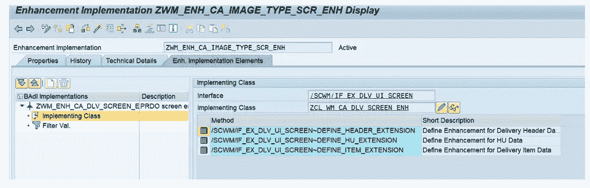

调用上一步中在函数组下创建的屏幕。

Repid 是函数组

Dynnr 是创建的屏幕号。

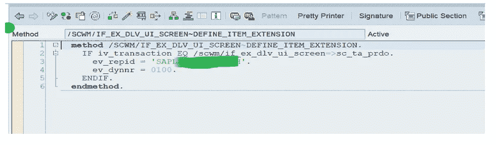

**结果:**

新添加的字段显示在出站项目的表单视图中。

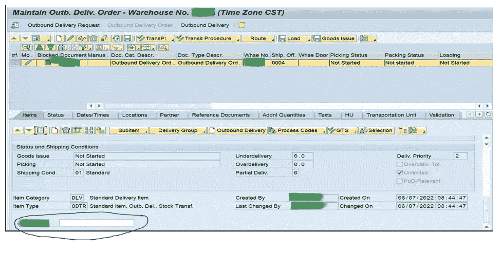

# 结论

使用上述步骤，我们能够在出站交付项目级别添加可编辑的自定义字段。可以遵循类似的步骤来在标题/项目级别增强入站/出站交付/交付请求。

如果您对这个过程有任何建设性的反馈或进一步的问题，请随时在这个博客上发表评论。我会关注这个博客，并且非常乐意帮助你。